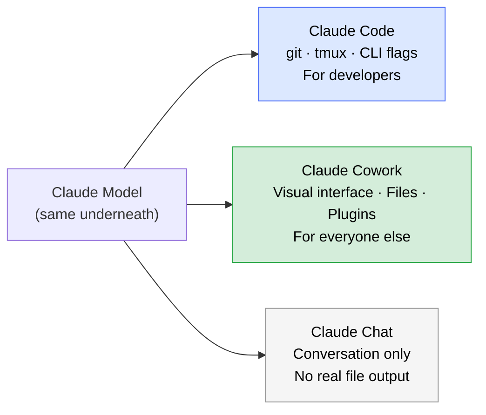
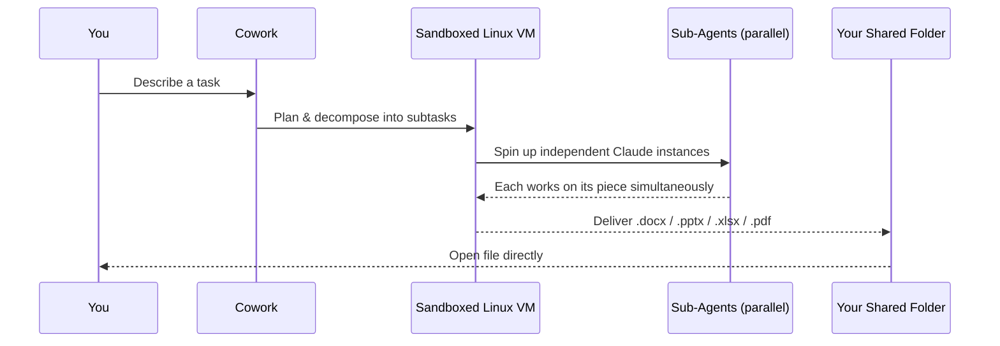
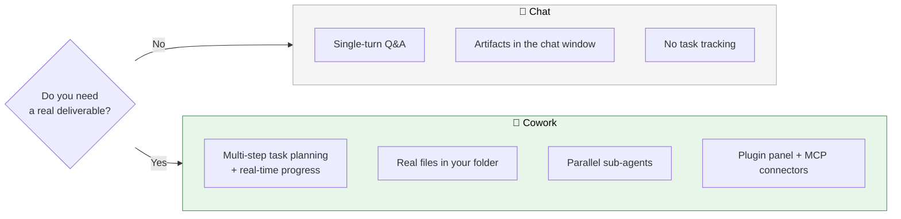
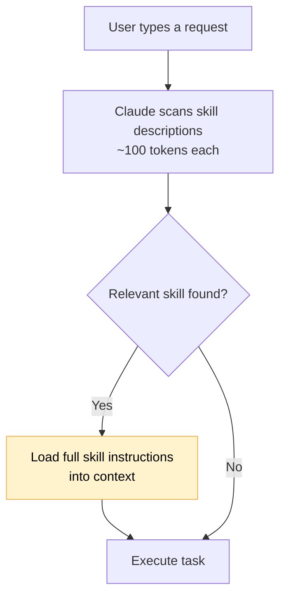
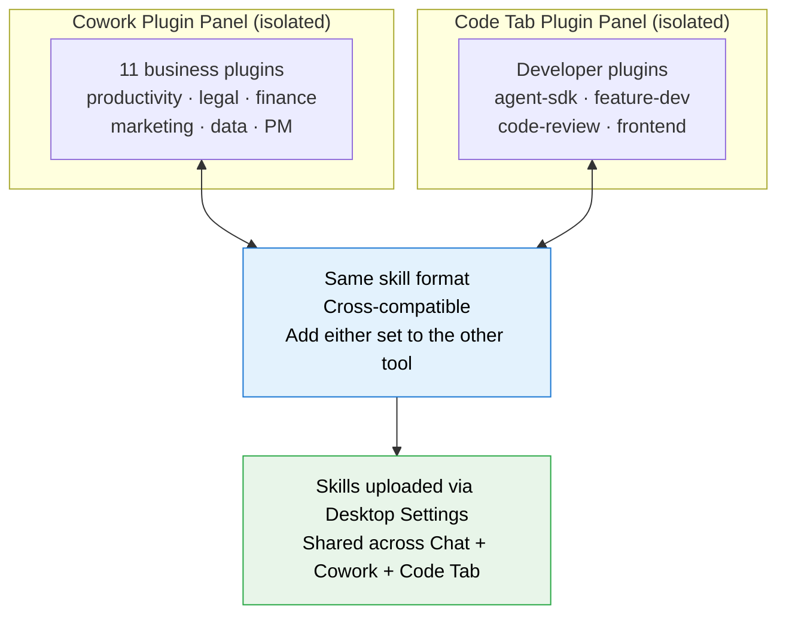
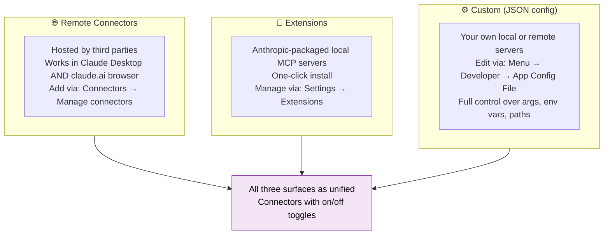
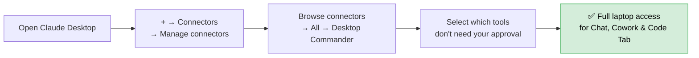
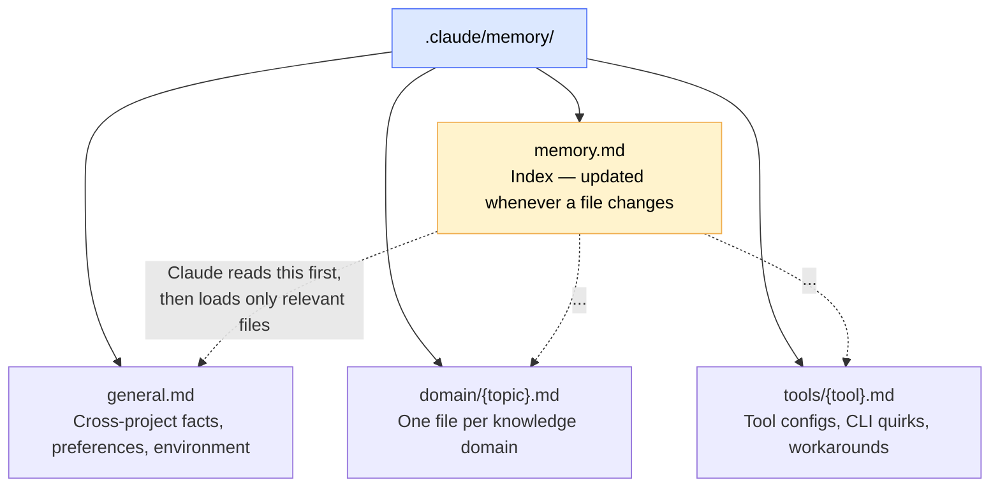
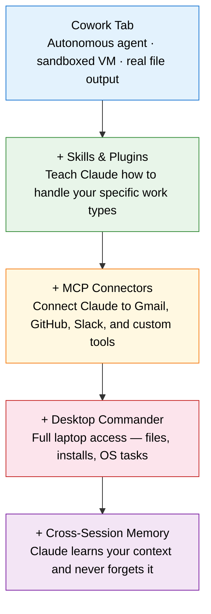

# Claude Cowork: A Visual Guide for PMs

*Based on Paweł Huryn's article — [@PawelHuryn](https://x.com/PawelHuryn/status/2025470280945041547)*

---

## The Big Picture

Everyone's talking about Claude Code. But unless you live in the terminal, **Claude Cowork** is probably the more practical tool for your day-to-day work. It runs on all platforms (Pro, Max, Team, Enterprise) and uses the exact same model as Claude Code — the difference is purely in how you interact with it.

Claude Code requires git worktrees, tmux, and CLI flags. Cowork gives you a visual interface to that same power. Think of them as two doors into the same room.



---

## What Cowork Actually Is

Cowork is not a reskinned chat window. When you open the Cowork tab in Claude Desktop, you are handing Claude access to a **sandboxed Linux VM** running on your machine. Inside that VM, Claude can write code, run scripts, and produce real, editable files — not chat artifacts.

You describe the task. Cowork plans it, breaks it into parallel sub-agents, executes the work, and delivers clickable output files directly to a folder you grant access to.



The sandbox boundary is important: Cowork cannot touch your OS or any files outside the folder you shared. Inside that folder, however, it has full read, write, and delete access — so choose carefully what you expose.

---

## Chat vs. Cowork: Knowing When to Use Which

The simplest mental model: **Chat is for conversations, Cowork is for workflows.** The distinction matters when you're deciding which tab to open.



---

## Skills and Plugins: Teaching Claude New Tricks

Plugins are arguably the most underappreciated part of Cowork. When Anthropic unveiled AI tools for legal and financial research in early 2026, legacy software stocks dropped $285 billion in a single day — investors saw agents moving into the application layer. The plugin sidebar in Cowork is exactly that layer.

### How Skills Work

A **skill** is a reusable instruction manual that tells Claude how to handle a specific, repeatable task. Say "create a Word doc" and the `docx` skill loads automatically. You can also trigger any skill manually by typing `/` in Cowork for autocomplete.

Claude doesn't load all skills at once. It reads a ~100-token description of each skill to decide relevance, then fetches full instructions only when needed — keeping your context window lean.



### The Plugin Ecosystem

Cowork ships with **11 built-in plugins** from Anthropic's knowledge-work repo covering productivity, product management, legal, finance, marketing, and data. Each plugin bundles a set of skills with slash commands. Code Tab has its own separate defaults focused on developer workflows.

Crucially, the two plugin panels are **isolated** — installing a plugin in Cowork doesn't make it available in Code Tab, and vice versa. But the skill format is fully cross-compatible: you can load Code's developer plugins into Cowork, or Cowork's business plugins into Code.



**Where to find more skills and plugins:**

| Source | What's there |
|---|---|
| `github.com/anthropics/skills` | Official doc skills: docx, xlsx, pptx, pdf + creative & enterprise examples |
| `github.com/anthropics/knowledge-work-plugins` | Cowork's 11 default business-role plugins |
| `claudemarketplaces.com` | A marketplace of marketplaces |
| `github.com/travisvn/awesome-claude-skills` | Community-curated, battle-tested skills |
| `github.com/sickn33/antigravity-awesome-skills` | 868+ agentic skills, role-based bundles |
| `skills.sh` | PM frameworks, PRD generators, launch playbooks |

---

## MCPs: Connecting Cowork to the Outside World

Skills teach Claude *how* to work. **MCPs (Model Context Protocol)** teach it *where* to reach. Each MCP server exposes a set of callable tools — a Gmail MCP might give Claude `search_emails`, `send_email`, and `read_email`. The GitHub MCP gives it `create_pull_request` and `list_issues`. You compose the toolset you need.

There are three ways to connect MCP servers to Claude Desktop (Chat, Cowork, and Code Tab all share the same config):



### Fine-grained Permissions

For every connector, each individual tool can be set to **Allow** (auto-run), **Ask** (confirm first), or **Block** (never run). For example: allow Claude to search your emails, but block it from sending them. Configure this at Settings → Connectors.

### A Note on Scope

Adding an MCP server through Claude Desktop's config makes it available in Chat, Cowork, and Code Tab — but **not** in the Code CLI. The CLI is a separate environment with its own config.

> **Windows gotcha:** If you installed Claude Desktop via the Microsoft Store (MSIX), the "Edit Config" button may open the wrong file. The app reads from the MSIX virtualized path, not `%APPDATA%\Claude\`. See GitHub issue #26073 if your MCP servers silently fail to load.

**Where to find MCP servers:**

| Source | What's there |
|---|---|
| `github.com/modelcontextprotocol/servers` | Official servers: filesystem, GitHub, Google Drive, Slack |
| `modelcontextprotocol.io/examples` | Reference implementations |
| `github.com/punkpeye/awesome-mcp-servers` | Community-curated, hundreds by category |
| `mcp.so` | Registry with search and install instructions |

---

## Scheduled Tasks: Useful but Not Yet Reliable

Cowork has a scheduled tasks feature, but in practice it's unreliable. It's worth knowing it exists. For serious automation pipelines, use **n8n** or build an MCP-based approach instead.

---

## Desktop Commander: The 1-Minute Power-Up

Once you've set up Cowork, the single highest-ROI move is installing **Desktop Commander**. It takes under a minute and gives Chat, Cowork, and Code Tab the ability to do virtually anything on your machine — including installing new MCP servers or reorganizing files.



**Two tips once it's installed:**
- Disable the Claude Chrome extension when not in use — otherwise Claude sometimes defaults to browser-based actions even when a local MCP would be faster.
- Review which individual tools you want to auto-approve vs. confirm. You can always watch what's happening and disable the connector temporarily.

---

## Cross-Session Memory: Making Claude Remember You

By default, every Cowork session starts blank. With Desktop Commander already installed, you can give Cowork persistent memory in one more step: paste a memory instruction into **Settings → Cowork → Global Instructions**.

The simplest version:

```
## Memory Management
When you discover something valuable for future sessions — architectural decisions,
bug fixes, gotchas, environment quirks — immediately append it to {your_folder}/memory.md.
Don't wait to be asked. Don't wait for session end.
Keep entries short: date, what, why.
Read this file at the start of every session.
```

This costs nearly zero tokens and survives crashes, context compaction, and new sessions.

### Scaling Up: Structured Memory

As your memory file grows, a single flat file becomes unwieldy. The structured approach splits memory into topic files so Claude loads only what's relevant:



**The five memory rules:**
1. Write new knowledge to the right file immediately — not at session end
2. Keep `memory.md` as a one-line-per-entry index
3. Format every entry as: *date · what · why*
4. At session start, read the index; load topic files only when relevant
5. Periodically ask Claude to "reorganize memory" — it will deduplicate, merge, and resync the index

---

## Putting It All Together

Cowork's value compounds as you layer each piece on top of the last:



Start with the base and add one layer at a time. Each one is independently useful, and together they turn Cowork into a genuinely autonomous work partner.

---

*Written by Paweł Huryn · [The Product Compass Newsletter](https://productcompass.pm)*
