# The File System Is the New Database: Building a Personal OS for AI Agents

> *Based on Muratcan Koylan's architecture for context engineering with AI assistants*

---

## The Problem: Context, Not Prompts

Every AI conversation begins with the same ritual — re-explaining who you are, pasting your style guide, re-describing your goals. Forty minutes in, the model drifts and starts writing like a press release. The real bottleneck isn't prompt quality; it's **context continuity**.

Language models have a finite context window with an uneven attention distribution — a U-shaped curve where the beginning and end of a context receive more focus than the middle. Dumping everything into a system prompt doesn't just waste tokens; it actively degrades performance by forcing the model to compete for attention across irrelevant information.

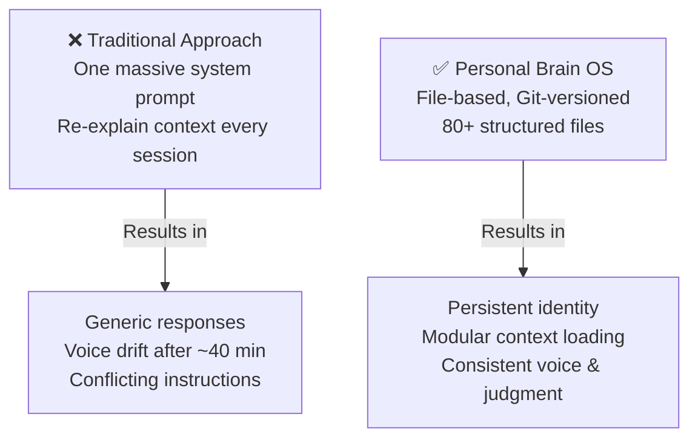

The solution is **context engineering** — not crafting better questions, but designing the information architecture that surrounds those questions. One massive prompt becomes 11 isolated modules. Context is assembled just-in-time, not dumped upfront.

---

## Architecture Overview

The Personal Brain OS lives in a single Git repository. No database, no API keys, no build step. Three file formats, each chosen for a specific reason, serve as the foundation:

| Format | Purpose | Why |
|--------|---------|-----|
| **JSONL** | Logs & events | Append-only, stream-readable, self-contained lines |
| **YAML** | Configuration | Hierarchical, human-readable, comment-supporting |
| **Markdown** | Narrative & guides | Native to LLMs, renders everywhere, clean Git diffs |

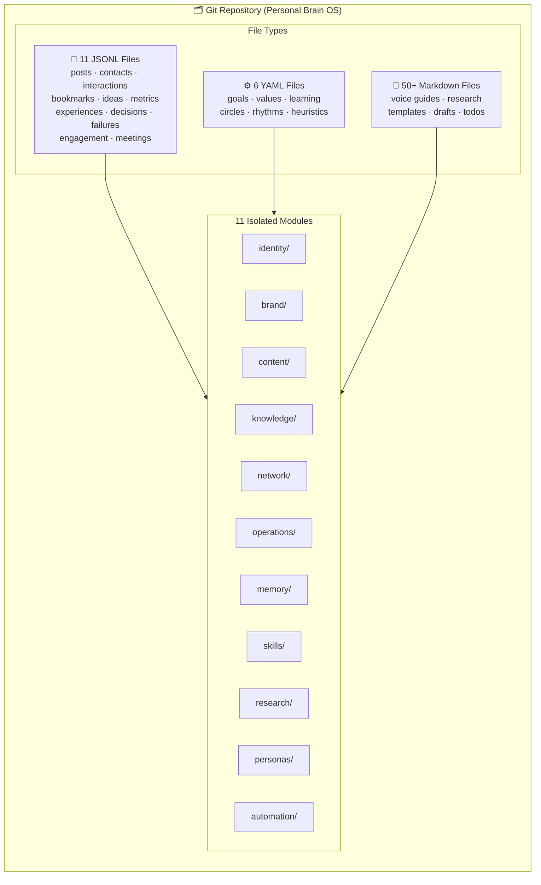

---

## Progressive Disclosure: The Core Pattern

Rather than loading everything at once, the system uses **three levels of progressive disclosure** — a funnel that narrows context to exactly what the current task requires.

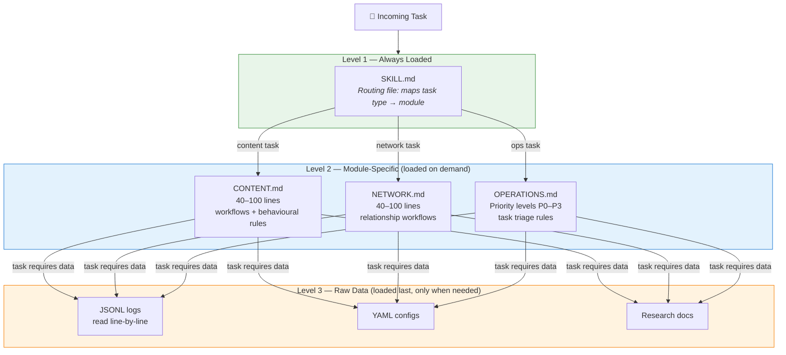

Maximum two hops from any routing decision to any piece of data. The model sees exactly what it needs and nothing more.

---

## The Agent Instruction Hierarchy

Three scoped layers of instructions prevent the "conflicting rules" problem that plagues large AI projects. When rules are scoped to their domain, they can't contradict each other — and updating one module can't cause regression in another.

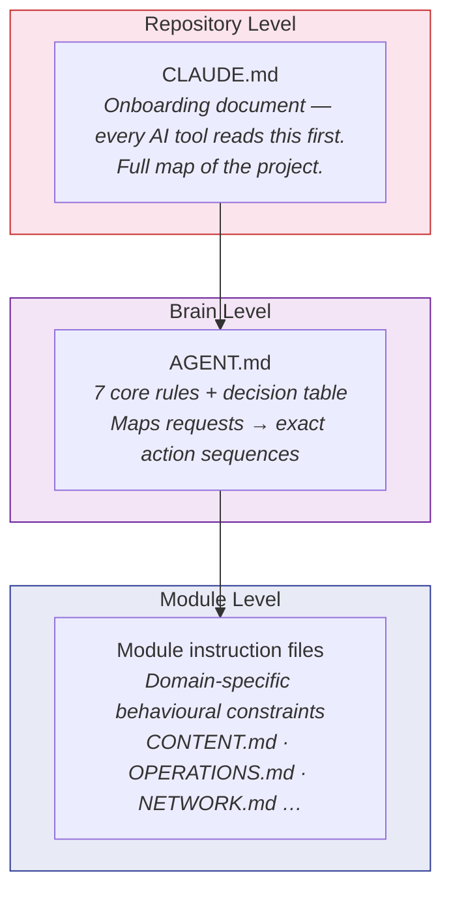

**Example — Decision table in AGENT.md:**  
*"User says 'send email to Z'"* → Step 1: look up contact in HubSpot → Step 2: verify email → Step 3: send via Gmail.  
The agent follows a codified, non-ambiguous sequence — not an implied one.

---

## The File System as Memory

### Episodic Memory: Storing Judgment, Not Just Facts

Most second-brain systems store facts. This one stores **judgment** — the reasoning behind decisions, what went wrong and why, and what mattered emotionally.

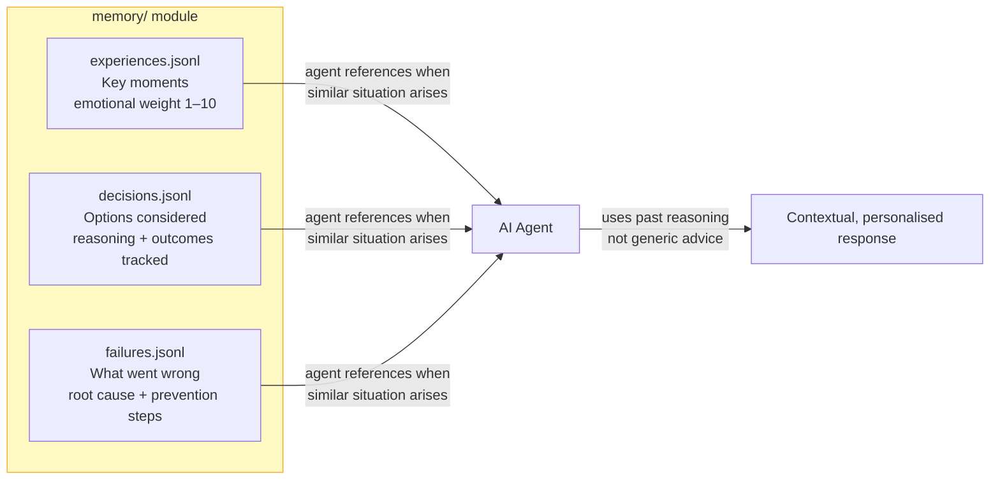

> *"Facts tell the agent what happened. Episodic memory tells the agent what mattered, what I'd do differently, and how I think about tradeoffs."*

### Cross-Module References: Flat-File Relational Model

Modules are isolated for **loading** but connected for **reasoning**. A `contact_id` in `interactions.jsonl` points to `contacts.jsonl`. A `pillar` in `ideas.jsonl` maps to content pillars in `brand.md`.

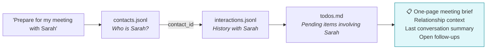

---

## The Skill System: Teaching AI How to Do Your Work

Files store knowledge. Skills encode **process**. Built following the Anthropic Agent Skills standard, each skill is a structured instruction set with quality gates baked in.

### Two Types of Skills

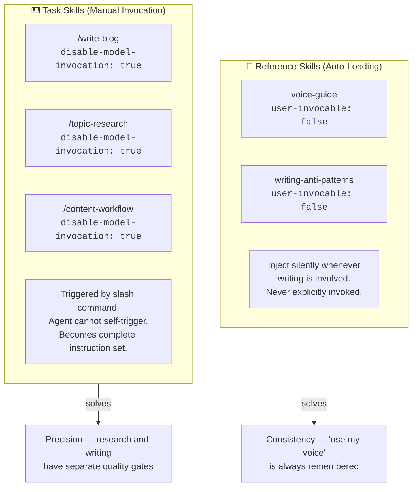

### What Happens When You Type `/write-blog`

A single slash command triggers a full context assembly pipeline:

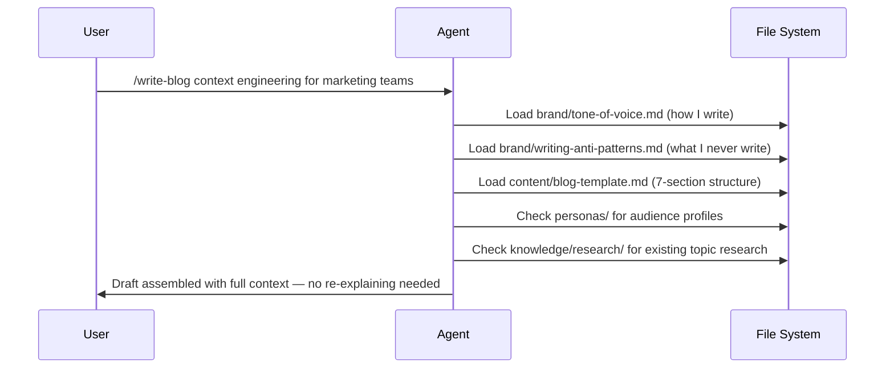

### The Voice System

Voice is encoded as structured, measurable data — not vague adjectives like "professional but approachable."

```mermaid
radar
    title Voice Profile (1–10 scale)
    "Formal/Casual (6)" : 6
    "Serious/Playful (4)" : 4
    "Technical/Simple (7)" : 7
    "Reserved/Expressive (6)" : 6
    "Humble/Confident (7)" : 7
```

Alongside the numeric profile: 50+ banned words across three tiers, banned openings, structural traps to avoid (forced rule of three, excessive hedging, copula overuse), and a hard limit of one em-dash per paragraph.

Every content template includes voice checkpoints every 500 words and a **4-pass editing process**: structure edit → voice edit (banned words scan) → evidence edit → read-aloud test. Quality gates are part of the skill — not added manually after the fact.

---

## The Operating System in Daily Practice

### The Content Pipeline

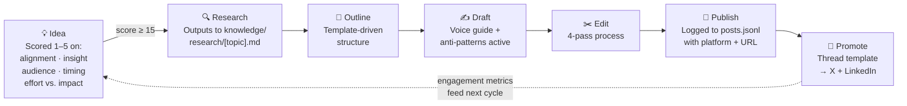

**Batch rhythm:** Sundays, 3–4 hours → 3–4 posts drafted and outlined.

### The Personal CRM

Contacts are organised into four maintenance circles:

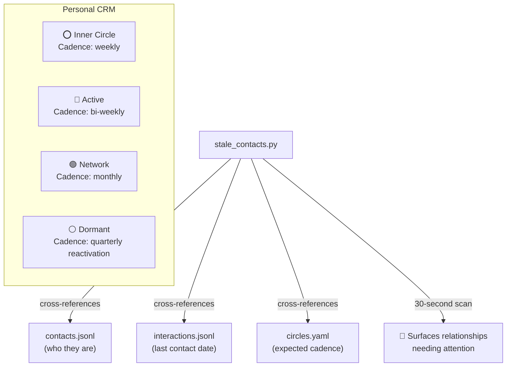

Each contact record includes `can_help_with` and `you_can_help_with` fields — enabling automatic introduction matching and mutual-value surfacing.

### The Weekly Review Automation Chain

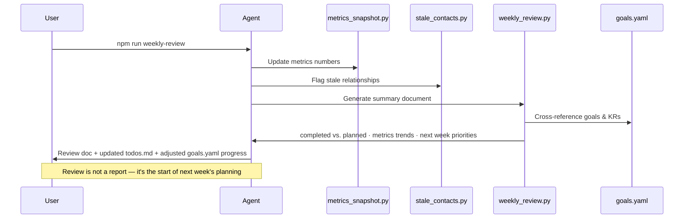

**The feedback loop this creates:**

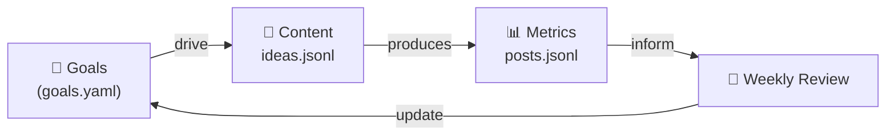

---

## Lessons Learned the Hard Way

### 1. Over-engineered schemas degrade agent behaviour
Initial schemas had 15+ fields per entry — most were empty. Agents struggle with sparse data; they try to fill missing fields or comment on their absence. Cutting to 8–10 essential fields with optional fields added only when data actually exists led to markedly better agent behaviour.

### 2. Voice guide length vs. attention curve
A 1,200-line tone-of-voice file caused the agent to drift by paragraph four — the middle of the file fell into the attention dead zone. Restructuring to front-load the most distinctive patterns (signature phrases, banned words, opening rules) in the first 100 lines fixed the drift.

### 3. Module boundaries are loading decisions
Keeping identity and brand in one module forced the agent to load a full bio just to check the banned-words list. Splitting them cut token usage for voice-only tasks by 40%. Every module boundary is a loading decision — wrong boundaries mean loading too much or too little.

### 4. Append-only is non-negotiable
Three months of post engagement data was lost when an agent rewrote `posts.jsonl` instead of appending to it. JSONL's append-only pattern is a safety mechanism, not a convention. Agents can add data — they cannot destroy it. Deletions are handled by setting `"status": "archived"` to preserve full history for pattern analysis.

---

## The Principle: Context Engineering

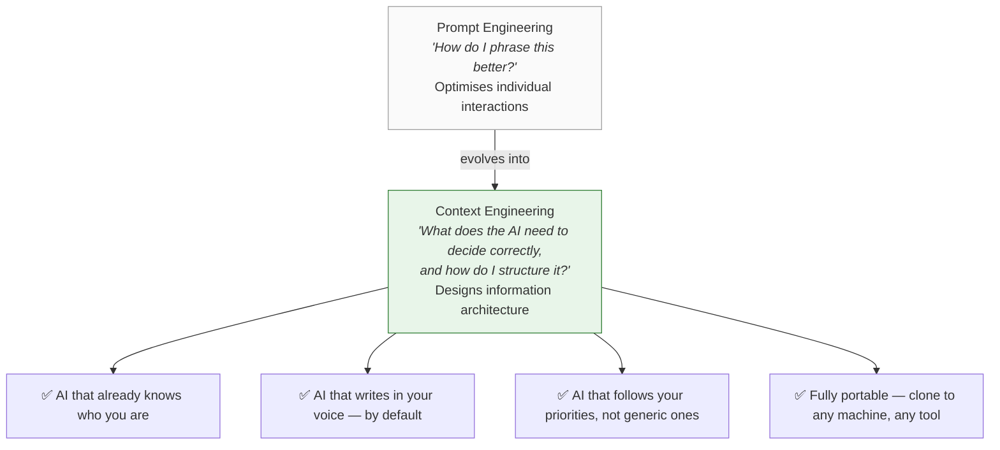

The difference between writing a good email and building a good filing system: one helps you once, the other helps you every time. The entire system lives in a Git repository — zero dependencies, full portability, every decision versioned and traceable, nothing ever truly lost.

---

*Framework: [Agent Skills for Context Engineering](https://github.com/muratcankoylan/Agent-Skills-for-Context-Engineering)*  
*Author: Muratcan Koylan — Context Engineer at Sully.ai*
