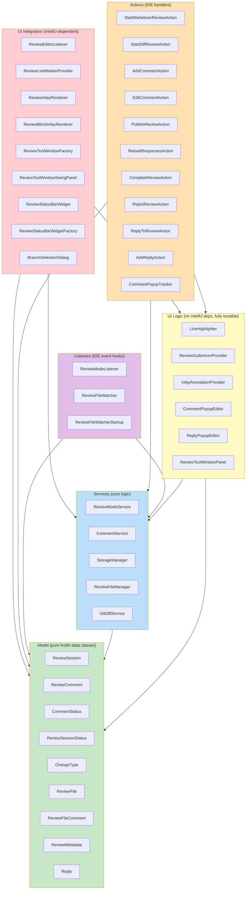
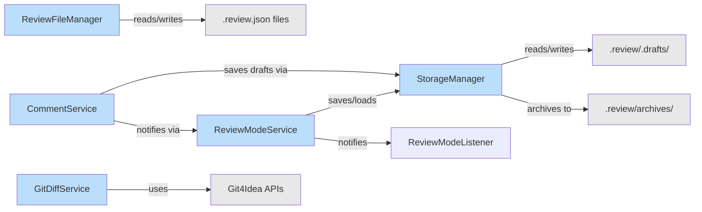

# Architecture

The plugin is organized into 5 layers with strict dependency rules: upper layers depend on lower layers, never the reverse.

---

## Layer Diagram



---

## Class Inventory

### Model Layer (9 files, ~177 lines)

| Class | File | Lines | Summary |
|-------|------|-------|---------|
| `ReviewSession` (sealed) | `model/ReviewSession.kt` | 84 | Base class: session lifecycle, comment management |
| `ReviewComment` | `model/ReviewComment.kt` | 20 | Single comment with status, response, and draft reply tracking |
| `CommentStatus` | `model/CommentStatus.kt` | 9 | Enum: DRAFT, PENDING, RESOLVED, SKIPPED, REJECTED |
| `ReviewSessionStatus` | `model/ReviewSessionStatus.kt` | 9 | Enum: ACTIVE, SUSPENDED, PUBLISHED, COMPLETED, REJECTED |
| `ChangeType` | `model/ChangeType.kt` | 7 | Enum: ADDED, MODIFIED, DELETED |
| `ReviewFile` | `model/ReviewFile.kt` | 23 | JSON DTO for published review files |
| `ReviewFileComment` | `model/ReviewFileComment.kt` | 17 | JSON DTO for comments in review files |
| `ReviewMetadata` | `model/ReviewMetadata.kt` | 15 | JSON DTO for review metadata |
| `Reply` | `model/Reply.kt` | 10 | JSON DTO for comment thread replies |

### Services Layer (5 files, ~688 lines)

| Class | File | Lines | Summary |
|-------|------|-------|---------|
| `ReviewModeService` | `services/ReviewModeService.kt` | 152 | Session lifecycle, listener management, session queries |
| `CommentService` | `services/CommentService.kt` | 85 | Comment CRUD, response application, reply drafts, status management |
| `StorageManager` | `services/StorageManager.kt` | 230 | Draft persistence (incl. draftReply), archival, .gitignore management |
| `ReviewFileManager` | `services/ReviewFileManager.kt` | 128 | Publish JSON, load responses, append replies, publish reply round, CLI command generation |
| `GitDiffService` | `services/GitDiffService.kt` | 93 | Git operations via Git4Idea: branches, diffs, file content |

### Actions Layer (11 files, ~748 lines)

| Class | File | Lines | Summary |
|-------|------|-------|---------|
| `StartMarkdownReviewAction` | `actions/StartMarkdownReviewAction.kt` | 47 | Context menu to start markdown review |
| `StartDiffReviewAction` | `actions/StartDiffReviewAction.kt` | 59 | VCS menu with branch picker for diff review |
| `AddCommentAction` | `actions/AddCommentAction.kt` | 108 | Popup editor to add inline comments |
| `EditCommentAction` | `actions/EditCommentAction.kt` | 105 | Popup editor to modify/delete existing comments |
| `PublishReviewAction` | `actions/PublishReviewAction.kt` | 86 | Serialize to .review.json or publish replies, copy CLI command |
| `ReloadResponsesAction` | `actions/ReloadResponsesAction.kt` | 40 | Reload Claude responses from disk |
| `CompleteReviewAction` | `actions/CompleteReviewAction.kt` | 54 | Archive and complete review |
| `RejectReviewAction` | `actions/RejectReviewAction.kt` | 52 | Archive and reject review |
| `ReplyToReviewAction` | `actions/ReplyToReviewAction.kt` | 48 | Enter reply mode (PUBLISHED → ACTIVE) |
| `AddReplyAction` | `actions/AddReplyAction.kt` | 106 | Popup to add reply to resolved comment |
| `CommentPopupTracker` | `actions/CommentPopupTracker.kt` | 26 | Singleton: ensures one popup at a time |

### Listeners Layer (3 files, ~124 lines)

| Class | File | Lines | Summary |
|-------|------|-------|---------|
| `ReviewModeListener` | `listeners/ReviewModeListener.kt` | 10 | Interface: 4 callbacks with default no-ops |
| `ReviewFileWatcher` | `listeners/ReviewFileWatcher.kt` | 74 | Detects external .review.json changes |
| `ReviewFileWatcherStartup` | `listeners/ReviewFileWatcherStartup.kt` | 40 | Restore sessions on IDE startup |

### UI Logic Layer (6 files, ~841 lines) -- No IntelliJ dependencies

| Class | File | Lines | Testable | Summary |
|-------|------|-------|----------|---------|
| `LineHighlighter` | `ui/LineHighlighter.kt` | 105 | Yes | Line background colors by comment status |
| `ReviewGutterIconProvider` | `ui/ReviewGutterIconProvider.kt` | 153 | Yes | Gutter icon selection and tooltip generation |
| `InlayAnnotationProvider` | `ui/InlayAnnotationProvider.kt` | 125 | Yes | Inline and block annotation computation |
| `CommentPopupEditor` | `ui/CommentPopupEditor.kt` | 141 | Yes | Comment validation, save/update/delete logic |
| `ReplyPopupEditor` | `ui/ReplyPopupEditor.kt` | 56 | Yes | Reply validation, Claude response preview, save reply |
| `ReviewToolWindowPanel` | `ui/ReviewToolWindowPanel.kt` | 261 | Yes | Tool window state management and actions |

### UI Integration Layer (8 files, ~769 lines) -- IntelliJ-dependent

| Class | File | Lines | Testable | Summary |
|-------|------|-------|----------|---------|
| `ReviewEditorListener` | `ui/ReviewEditorListener.kt` | 156 | No | Applies highlights and inlays to editors |
| `ReviewLineMarkerProvider` | `ui/ReviewLineMarkerProvider.kt` | 98 | No | Gutter icon line markers |
| `ReviewInlayRenderer` | `ui/ReviewInlayRenderer.kt` | 37 | No | After-line-end text renderer |
| `ReviewBlockInlayRenderer` | `ui/ReviewBlockInlayRenderer.kt` | 125 | No | Block inlay below commented lines |
| `ReviewToolWindowFactory` | `ui/ReviewToolWindowFactory.kt` | 30 | No | IDE tool window factory |
| `ReviewToolWindowSwingPanel` | `ui/ReviewToolWindowSwingPanel.kt` | 253 | No | Swing panel for tool window |
| `ReviewStatusBarWidget` | `ui/ReviewStatusBarWidget.kt` | 54 | Partial | Status bar "Review Mode: Active" |
| `ReviewStatusBarWidgetFactory` | `ui/ReviewStatusBarWidgetFactory.kt` | 16 | No | Widget factory |
| `BranchSelectionDialog` | `ui/BranchSelectionDialog.kt` | 83 | No | Branch picker dialog |

All file paths are relative to `src/main/kotlin/com/uber/jetbrains/reviewplugin/`.

---

## Service Interaction Diagram



### Key Interactions

- **ReviewModeService** owns session lifecycle; delegates persistence to StorageManager
- **CommentService** mutates comments and triggers draft saves + listener notifications through ReviewModeService
- **ReviewFileManager** is a singleton object (no state) that publishes/loads `.review.json` files
- **StorageManager** handles all disk I/O for drafts and archives
- **GitDiffService** wraps Git4Idea; used only by `StartDiffReviewAction` and `BranchSelectionDialog`

---

## Logic vs Platform Split

Each visual feature has a **logic class** (pure Kotlin, testable) paired with an **integration class** (IntelliJ-dependent, excluded from coverage).

| Feature | Logic Class | Integration Class |
|---------|-------------|-------------------|
| Line highlighting | `LineHighlighter` | `ReviewEditorListener` |
| Gutter icons | `ReviewGutterIconProvider` | `ReviewLineMarkerProvider` |
| Inline annotations | `InlayAnnotationProvider` | `ReviewInlayRenderer`, `ReviewBlockInlayRenderer` |
| Comment popup | `CommentPopupEditor` | `AddCommentAction`, `EditCommentAction` |
| Reply popup | `ReplyPopupEditor` | `AddReplyAction` |
| Tool window | `ReviewToolWindowPanel` | `ReviewToolWindowSwingPanel`, `ReviewToolWindowFactory` |
| Status bar | `ReviewStatusBarWidget.formatStatusText()` | `ReviewStatusBarWidget` (install/dispose) |

---

## File System Layout (Runtime)

```
<project-root>/
└── .review/                              # Auto-gitignored
    ├── docs--example.review.json         # Active review (published)
    ├── diff-main--feature.review.json    # Active diff review
    ├── .drafts/                          # Auto-saved session drafts
    │   └── session-<uuid>.json           # Survives IDE restart
    └── archives/                         # Completed/rejected reviews
        └── docs--example-ab12c.review.json
```

- `.review/` directory is created on first review and added to `.gitignore`
- Draft files use atomic writes (temp file + move)
- Archive files get a 5-character random suffix for collision avoidance
- The deterministic name (without suffix) is freed for reuse after archival
