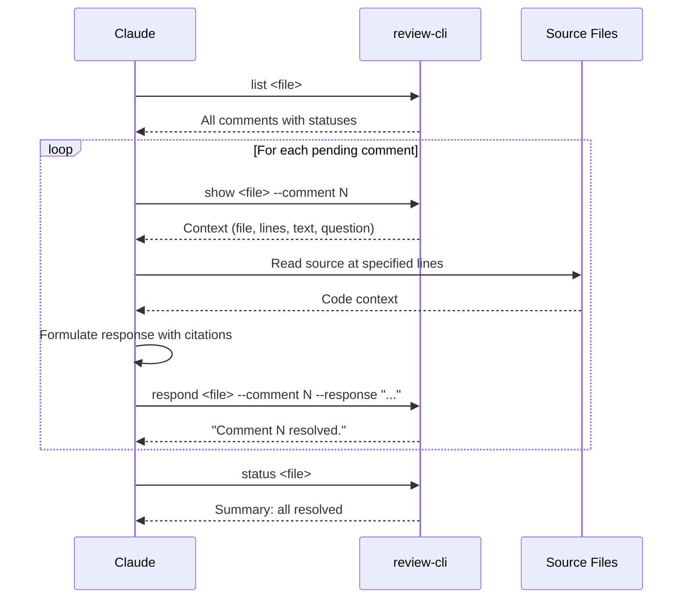

# CLI Reference

The `review-cli` is a standalone command-line tool that reads and writes `.review.json` files. It serves as the bridge between the IDE plugin and Claude -- neither the plugin nor Claude call each other directly.

**Source**: `review-cli/src/main/kotlin/com/uber/reviewcli/`

---

## Build & Run

```bash
# Build
./gradlew :review-cli:build -Dgradle.user.home=/tmp/gradle-review-plugin-home

# Run
./gradlew :review-cli:run --args="<command> <file> [flags]" -Dgradle.user.home=/tmp/gradle-review-plugin-home
```

---

## Commands

### `list` -- Display all comments

```bash
review-cli list <file.review.json>
```

Shows each comment with index, status, file path, line range, and a truncated preview (80 chars max).

**Example output**:
```
[1] pending  | docs/README.md:10-15
    How does this work?
[2] resolved | docs/README.md:20-25
    Caching concern

Summary: 2 total | 1 pending | 1 resolved
```

### `show` -- Full detail for a single comment

```bash
review-cli show <file.review.json> --comment N
```

Displays file path, line range, status, selected text, user comment, Claude response (or "(none)"), and all replies.

**Example output**:
```
Comment 1
File:    docs/README.md
Lines:   10-15
Status:  pending

Context:
  selected text from the document

User Comment:
  How does this work?

Claude Response:
  (none)

Replies: 0
```

### `respond` -- Write Claude's response

```bash
review-cli respond <file.review.json> --comment N --response "..."
```

Sets `claudeResponse` and changes status to `"resolved"`. Persists immediately.

**Example**:
```bash
review-cli respond .review/docs--example.review.json \
  --comment 1 \
  --response "Implemented in FeatureManager.java:156-234. The caching uses..."
```

Output: `Comment 1 resolved.`

### `reply` -- Append a reply

```bash
review-cli reply <file.review.json> --comment N --text "..."
```

Appends a `Reply` to the comment's `replies` array and resets status to `"pending"` (triggers re-processing by Claude).

**Example**:
```bash
review-cli reply .review/docs--example.review.json \
  --comment 2 \
  --text "But what about performance implications?"
```

Output: `Reply added to comment 2.`

### `status` -- Review summary

```bash
review-cli status <file.review.json>
```

**Example output (Markdown)**:
```
Review: docs--example.review.json
Type:   MARKDOWN
Source: docs/example.md

Total: 2 | Pending: 1 | Resolved: 1 | Skipped: 0
```

**Example output (Git Diff)**:
```
Review: diff-main--feature-auth.review.json
Type:   GIT_DIFF
Diff:   main -> feature-auth

Total: 5 | Pending: 2 | Resolved: 3 | Skipped: 0
```

---

## Flag Parsing

- Format: `--key value`
- Order doesn't matter
- Multiline values supported with `\n` in the string

```bash
review-cli respond file.json --comment 1 --response "Line 1\nLine 2\nLine 3"
```

**Source**: `ReviewCli.kt` (`parseFlags` function)

---

## JSON Schema

The CLI reads and writes the same `.review.json` format as the plugin.

```json
{
    "sessionId": "uuid-string",
    "type": "MARKDOWN",
    "metadata": {
        "author": "user.name",
        "publishedAt": "2026-02-20T10:00:00Z",
        "sourceFile": "docs/README.md"
    },
    "comments": [
        {
            "index": 1,
            "filePath": "docs/README.md",
            "startLine": 10,
            "endLine": 15,
            "selectedText": "the text being commented",
            "userComment": "user's question",
            "status": "pending",
            "claudeResponse": null,
            "changeType": null,
            "replies": []
        }
    ]
}
```

For Git diff reviews, `metadata` includes `baseBranch`, `compareBranch`, `baseCommit`, `compareCommit`, and `filesChanged` instead of `sourceFile`.

See [DATA_MODEL.md](DATA_MODEL.md) for the full schema with all fields.

**CLI DTOs**: `review-cli/.../ReviewFileSchema.kt` -- independent copy of the same schema with `ignoreUnknownKeys = true` for forward compatibility.

---

## `/review-respond` Skill

**File**: `.claude/commands/review-respond.md`

A Claude Code slash command that teaches Claude how to process pending review comments.

### Invocation

```
claude "/review-respond .review/docs--example.review.json"
```

The plugin copies this command to clipboard on Publish. The user pastes it into their terminal.

### Workflow



### Response Guidelines (from the skill)

1. **Cite sources**: File paths with line numbers (e.g., `FeatureManager.java:156-234`)
2. **Be specific**: Reference actual code, not general concepts
3. **Use diagrams**: Include Mermaid diagrams for flows/architecture when helpful
4. **Stay concise**: 2-5 paragraphs per response
5. **Ask clarifying questions**: If unclear, ask rather than skip

---

## Multi-Round Flow

When a user replies to Claude's response:

1. Reply appended to `replies[]` in the JSON file
2. Comment status reset to `"pending"`
3. User re-invokes `/review-respond`
4. Claude sees only pending comments (including the one with the reply)
5. Claude reads the reply context and formulates a follow-up response
6. Comment status set back to `"resolved"`

This enables unlimited back-and-forth per comment within a single review.

---

## Exit Codes

| Code | Meaning |
|------|---------|
| `0` | Success |
| `1` | Error (invalid file, missing flag, comment not found) |
