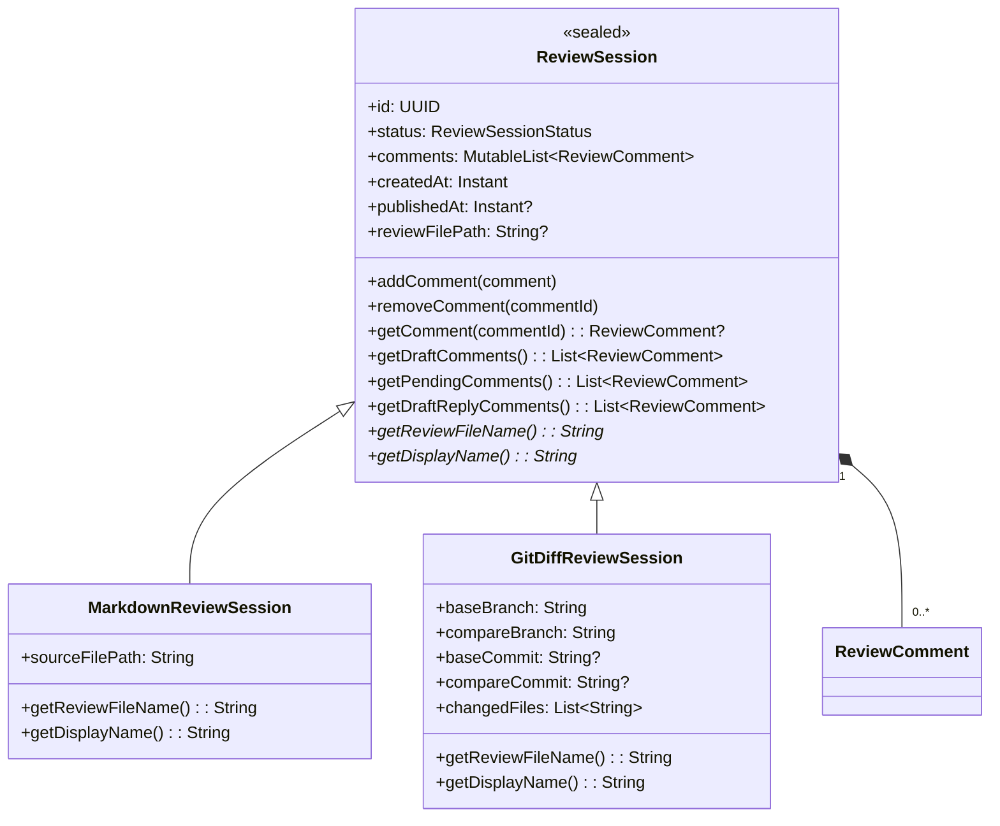
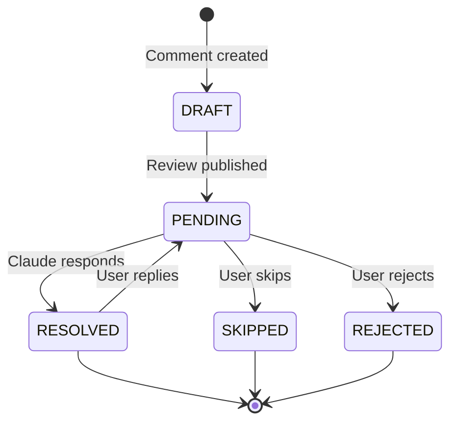
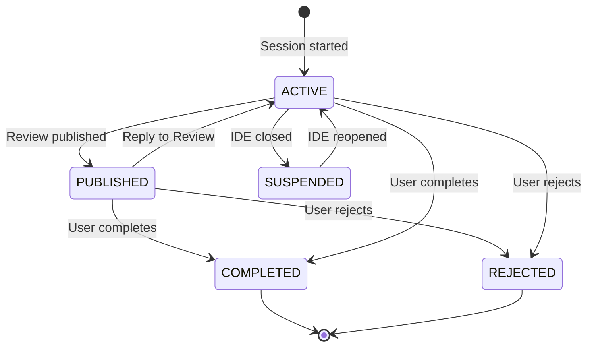
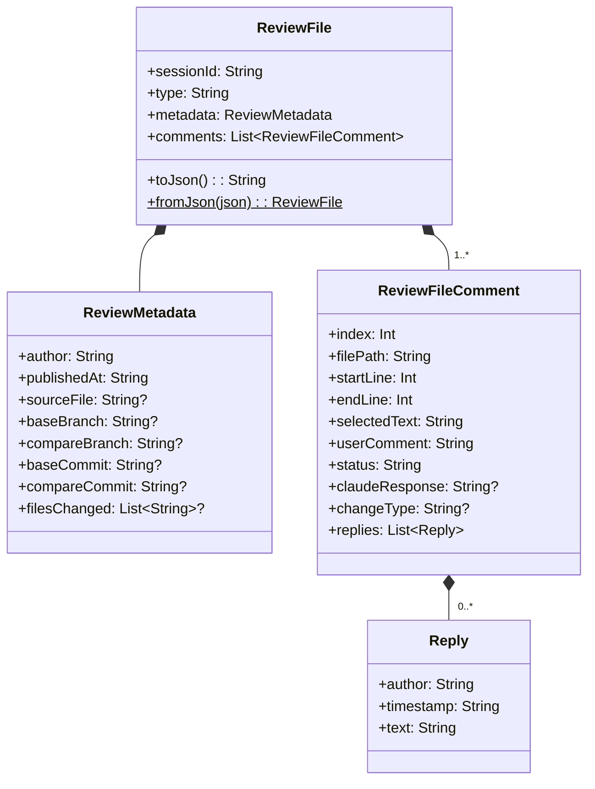

# Data Model

All model classes live in `src/main/kotlin/com/uber/jetbrains/reviewplugin/model/` with zero IntelliJ Platform dependencies.

---

## ReviewSession Hierarchy



**Source**: `ReviewSession.kt:1-84`

---

## ReviewComment

| Field | Type | Default | Mutable | Purpose |
|-------|------|---------|---------|---------|
| `id` | `UUID` | `randomUUID()` | No | Unique identifier |
| `filePath` | `String` | -- | No | Relative path to commented file |
| `startLine` | `Int` | -- | No | First line of range (1-based) |
| `endLine` | `Int` | -- | No | Last line of range (1-based) |
| `selectedText` | `String` | -- | No | Text snippet from editor |
| `commentText` | `String` | -- | No | User's comment |
| `authorId` | `String` | -- | No | Username |
| `createdAt` | `Instant` | `now()` | No | Creation timestamp |
| `status` | `CommentStatus` | `DRAFT` | Yes | Lifecycle status |
| `claudeResponse` | `String?` | `null` | Yes | Claude's response |
| `resolvedAt` | `Instant?` | `null` | Yes | Resolution timestamp |
| `changeType` | `ChangeType?` | `null` | No | Diff change type (diff reviews only) |
| `draftReply` | `String?` | `null` | Yes | User's draft reply text (in-memory, saved in drafts) |

**Source**: `ReviewComment.kt:1-20`

---

## State Machines

### CommentStatus



Values: `DRAFT`, `PENDING`, `RESOLVED`, `SKIPPED`, `REJECTED`

**Source**: `CommentStatus.kt:1-9`

### ReviewSessionStatus



Values: `ACTIVE`, `SUSPENDED`, `PUBLISHED`, `COMPLETED`, `REJECTED`

**Source**: `ReviewSessionStatus.kt:1-9`

### ChangeType

Used only in diff reviews to indicate the type of change for a commented line.

Values: `ADDED`, `MODIFIED`, `DELETED`

**Source**: `ChangeType.kt:1-7`

---

## JSON Interchange Format (`.review.json`)

The plugin and CLI communicate through `.review.json` files using `kotlinx-serialization-json`.

### Configuration

```
prettyPrint = true
encodeDefaults = true
ignoreUnknownKeys = true  (CLI only, for forward compatibility)
```

### Schema



### Example `.review.json`

```json
{
    "sessionId": "a1b2c3d4-e5f6-7890-abcd-ef1234567890",
    "type": "MARKDOWN",
    "metadata": {
        "author": "vinay.yerra",
        "publishedAt": "2026-02-20T10:00:00Z",
        "sourceFile": "docs/uscorer/ARCHITECTURE_OVERVIEW.md"
    },
    "comments": [
        {
            "index": 1,
            "filePath": "docs/uscorer/ARCHITECTURE_OVERVIEW.md",
            "startLine": 10,
            "endLine": 15,
            "selectedText": "Checkpoint expressions form a DAG...",
            "userComment": "How does cycle detection work?",
            "status": "pending",
            "claudeResponse": null,
            "changeType": null,
            "replies": []
        }
    ]
}
```

**Plugin DTOs**: `ReviewFile.kt`, `ReviewFileComment.kt`, `ReviewMetadata.kt`, `Reply.kt`
**CLI DTOs**: `review-cli/.../ReviewFileSchema.kt` (identical structure, independent package)

---

## Draft Serialization

Sessions are auto-saved to `.review/.drafts/session-<uuid>.json` via `StorageManager` using internal DTOs:

- `DraftSessionDto` -- session fields + type discriminator (`"MARKDOWN"` or `"GIT_DIFF"`)
- `DraftCommentDto` -- all comment fields serialized as strings

Draft saves use atomic writes (temp file + move) to prevent corruption. Drafts survive IDE restarts and are restored by `ReviewFileWatcherStartup`.

**Source**: `StorageManager.kt:1-230`

---

## Review File Naming Convention

Deterministic names derived from source, ensuring uniqueness and reuse after archival.

| Source | Review File Name |
|--------|-----------------|
| `docs/uscorer/ARCHITECTURE_OVERVIEW.md` | `docs--uscorer--ARCHITECTURE_OVERVIEW.review.json` |
| `README.md` | `README.review.json` |
| Diff: `main` -> `feature-auth` | `diff-main--feature-auth.review.json` |

**Algorithms**:
- Markdown: strip extension, replace `/` with `--`, append `.review.json`
- Diff: replace `/` with `-` in branch names, format as `diff-{base}--{compare}.review.json`

**On archive**: 5-character random alphanumeric suffix appended before `.review.json`
- Example: `docs--uscorer--ARCHITECTURE_OVERVIEW-a3k9m.review.json`

**Source**: `ReviewSession.kt:40-50` (Markdown), `ReviewSession.kt:70-76` (Diff)
