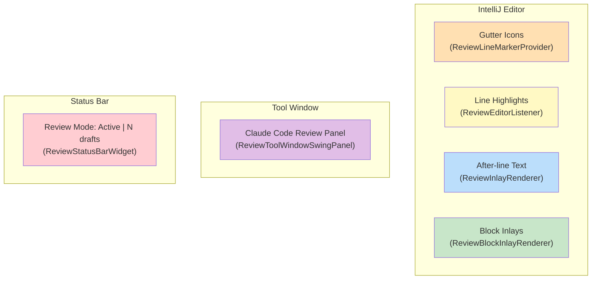

# IntelliJ Platform Integration

How the plugin hooks into the IntelliJ Platform: configuration, extension points, APIs used, and visual components.

---

## Plugin Configuration

**File**: `src/main/resources/META-INF/plugin.xml`

| Property | Value |
|----------|-------|
| Plugin ID | `com.uber.jetbrains.reviewplugin` |
| Name | Claude Code Review |
| Target IDE | IntelliJ IDEA 2025.2+ (build 252+) |
| JDK | 21 (Temurin) |

### Dependencies

| Dependency | Purpose |
|------------|---------|
| `com.intellij.modules.platform` | Core IntelliJ Platform APIs |
| `Git4Idea` | Git operations, branch listing, diff viewer |
| `org.intellij.plugins.markdown` | Markdown file detection and editing support |

---

## Extension Points

Extensions registered in `plugin.xml` that wire the plugin into the IDE.

| Extension Point | Class | Purpose |
|----------------|-------|---------|
| `codeInsight.lineMarkerProvider` | `ReviewLineMarkerProvider` | Gutter icons for commented lines |
| `editorFactoryListener` | `ReviewEditorListener` | Apply highlights and inlays when editors open |
| `toolWindow` ("Claude Code Review") | `ReviewToolWindowFactory` | Side panel for managing review sessions |
| `statusBarWidgetFactory` | `ReviewStatusBarWidgetFactory` | Status bar showing review state |
| `notificationGroup` ("ReviewPlugin") | -- | Notification balloons for review events |
| `postStartupActivity` | `ReviewFileWatcherStartup` | Restore sessions and register file watcher on IDE start |

### Services (Project-Level)

| Service | Class | Purpose |
|---------|-------|---------|
| `projectService` | `StorageManager` | Draft persistence and archival |
| `projectService` | `ReviewModeService` | Session lifecycle management |
| `projectService` | `CommentService` | Comment CRUD operations |

---

## Actions

| Action ID | Class | Menu Groups | Shortcut |
|-----------|-------|-------------|----------|
| `ReviewPlugin.StartMarkdownReview` | `StartMarkdownReviewAction` | EditorPopupMenu, ProjectViewPopupMenu | Ctrl+Shift+R |
| `ReviewPlugin.AddComment` | `AddCommentAction` | EditorPopupMenu | Ctrl+Shift+C |
| `ReviewPlugin.EditComment` | `EditCommentAction` | -- (invoked from gutter) | -- |
| `ReviewPlugin.PublishReview` | `PublishReviewAction` | EditorPopupMenu | Ctrl+Shift+P |
| `ReviewPlugin.ReloadResponses` | `ReloadResponsesAction` | EditorPopupMenu | Ctrl+Shift+L |
| `ReviewPlugin.StartDiffReview` | `StartDiffReviewAction` | VcsGlobalGroup | Ctrl+Shift+D |
| `ReviewPlugin.CompleteReview` | `CompleteReviewAction` | EditorPopupMenu | -- |
| `ReviewPlugin.RejectReview` | `RejectReviewAction` | EditorPopupMenu | -- |
| `ReviewPlugin.ReplyToReview` | `ReplyToReviewAction` | -- | Ctrl+Shift+Y |
| `ReviewPlugin.AddReply` | `AddReplyAction` | -- (invoked from gutter) | -- |

---

## IntelliJ APIs by Category

### Editor APIs

| API | Used By | Purpose |
|-----|---------|---------|
| `EditorFactory` / `EditorFactoryListener` | `ReviewEditorListener` | Hook into editor open/close lifecycle |
| `MarkupModel` / `RangeHighlighter` | `ReviewEditorListener` | Apply background color to commented lines |
| `TextAttributes` / `HighlighterLayer` | `ReviewEditorListener` | Define highlight colors and stacking order |
| `InlayModel` / `Inlay` | `ReviewEditorListener` | Add block inlays below commented lines |
| `EditorCustomElementRenderer` | `ReviewInlayRenderer`, `ReviewBlockInlayRenderer` | Custom rendering for inline/block annotations |

### Gutter APIs

| API | Used By | Purpose |
|-----|---------|---------|
| `LineMarkerProvider` | `ReviewLineMarkerProvider` | Register gutter icons per line |
| `LineMarkerInfo` | `ReviewLineMarkerProvider` | Icon + tooltip + click handler per line |
| `GutterIconRenderer` | `ReviewLineMarkerProvider` | Click dispatch to Add/Edit actions |

### Action APIs

| API | Used By | Purpose |
|-----|---------|---------|
| `AnAction` | All 10 actions | IDE action framework |
| `ActionManager` | `ReviewLineMarkerProvider` | Dispatch gutter clicks to actions |
| `DataKey` | `EditCommentAction`, `AddReplyAction` | Pass comment ID from gutter to action |
| `JBPopupFactory` | `AddCommentAction`, `EditCommentAction`, `AddReplyAction` | Comment/reply popup windows |

### VFS / File System APIs

| API | Used By | Purpose |
|-----|---------|---------|
| `BulkFileListener` | `ReviewFileWatcher` | Detect file changes to `.review.json` |
| `VFileContentChangeEvent` | `ReviewFileWatcher` | Filter for content changes vs renames |
| `VirtualFileManager` | `ReviewFileWatcherStartup` | Subscribe to VFS events |
| `LocalFileSystem` | `ReviewToolWindowSwingPanel` | Navigate to file from tool window |

### UI APIs

| API | Used By | Purpose |
|-----|---------|---------|
| `ToolWindowFactory` | `ReviewToolWindowFactory` | Create side panel |
| `StatusBarWidget` / `StatusBarWidgetFactory` | `ReviewStatusBarWidget(Factory)` | Status bar indicator |
| `DialogWrapper` | `BranchSelectionDialog` | Modal dialog for branch selection |
| `Messages` | Multiple actions | Info/error/confirmation dialogs |
| `NotificationGroupManager` | Actions, `ReviewFileWatcher` | Balloon notifications |
| `CopyPasteManager` | `PublishReviewAction` | Copy CLI command to clipboard |

### Git4Idea APIs

| API | Used By | Purpose |
|-----|---------|---------|
| `GitRepositoryManager` | `GitDiffService` | Access Git repositories |
| `Git` / `GitCommand` | `GitDiffService` | Run git commands (diff, show) |
| `GitLineHandler` | `GitDiffService` | Build git command lines |

### Diff APIs

| API | Used By | Purpose |
|-----|---------|---------|
| `DiffManager` | `GitDiffService` | Open diff viewer |
| `DiffContentFactory` | `GitDiffService` | Create diff content from strings |
| `SimpleDiffRequest` / `Chain` | `GitDiffService` | Single/multi-file diff requests |

### Lifecycle APIs

| API | Used By | Purpose |
|-----|---------|---------|
| `ProjectActivity` | `ReviewFileWatcherStartup` | Post-startup initialization |
| `DaemonCodeAnalyzer` | Actions | Force gutter icon refresh |
| `ApplicationManager` | `BranchSelectionDialog` | Thread pool + EDT dispatch |
| `OpenFileDescriptor` | `ReviewToolWindowSwingPanel` | Navigate to file:line |

---

## Visual Overlay Components

---

## Color Scheme

### Line Highlight Colors

| Status | Hex | Usage |
|--------|-----|-------|
| DRAFT | `#FFF9C4` (light yellow) | Background of commented lines before publish |
| PENDING | `#BBDEFB` (light blue) | Background of lines awaiting Claude response |
| RESOLVED | `#C8E6C9` (light green) | Background of lines with Claude response |

**Source**: `ui/LineHighlighter.kt`

### Annotation Text Colors

| Status | Hex | Usage |
|--------|-----|-------|
| DRAFT | `#9E9D24` (dark olive) | After-line annotation text |
| PENDING | `#1565C0` (dark blue) | After-line annotation text |
| RESOLVED | `#2E7D32` (dark green) | After-line annotation text |

**Source**: `ui/InlayAnnotationProvider.kt`

### Block Inlay Colors

| Element | Hex | Usage |
|---------|-----|-------|
| Response text | `#424242` (dark gray) | Claude's response in block inlay |
| Left border | Status-dependent | Left edge of block inlay |

**Source**: `ui/ReviewBlockInlayRenderer.kt`

### Gutter Icons

| Icon | File | Usage |
|------|------|-------|
| `addComment.svg` | "+" icon | Lines without comments (click to add) |
| `commentExists.svg` | Draft marker | Lines with draft comments |
| `commentPending.svg` | Pending marker | Lines awaiting Claude response |
| `commentResolved.svg` | Resolved marker | Lines with Claude response |
| `reviewMode.svg` | Badge icon | Review mode indicator |

**Source**: `src/main/resources/icons/`
