# Review Flow

End-to-end lifecycle of a review session, from starting a review to archiving it.

---

## High-Level Flow

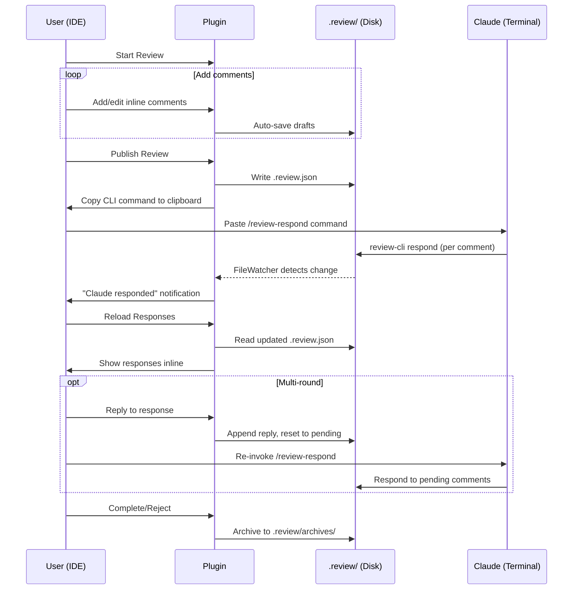

---

## Phase 1: Start Review

Two entry points, both resulting in an active `ReviewSession`.

### Markdown Review

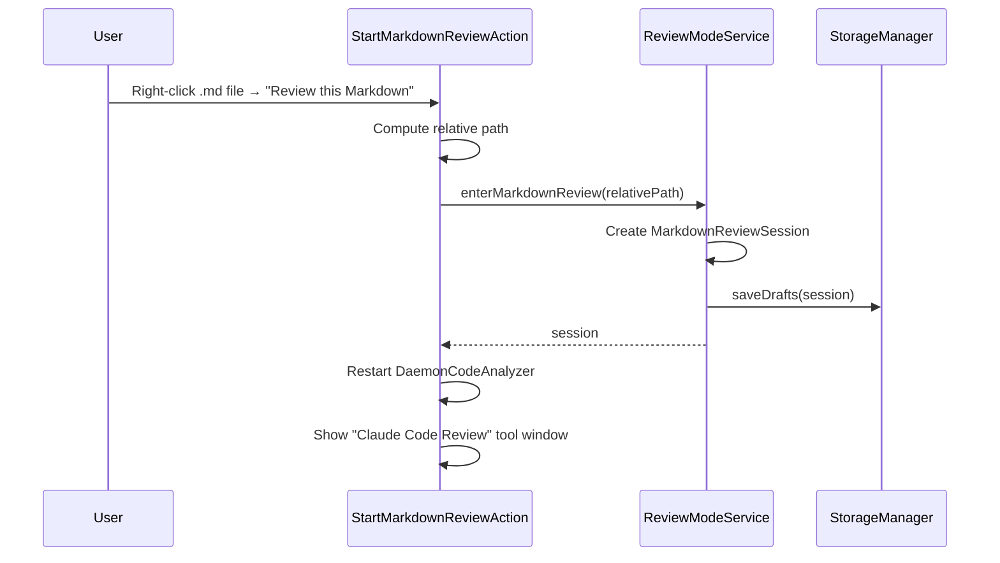

**Trigger**: Right-click `.md` file → "Review this Markdown" (Ctrl+Shift+R)
**Source**: `actions/StartMarkdownReviewAction.kt:1-47`

### Diff Review

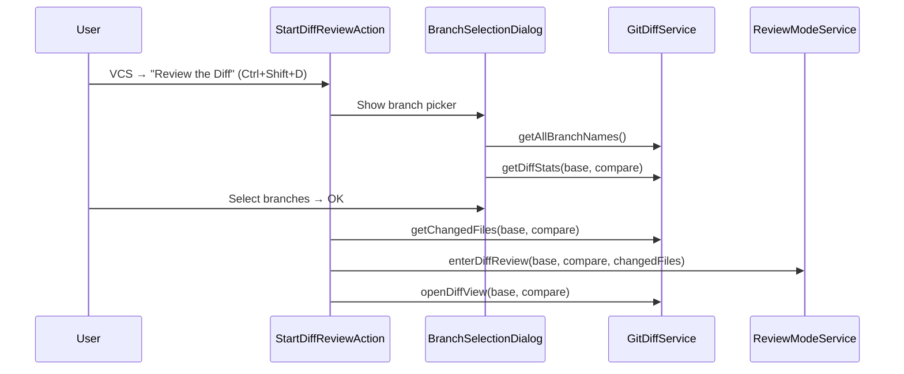

**Trigger**: VCS menu → "Review the Diff" (Ctrl+Shift+D)
**Source**: `actions/StartDiffReviewAction.kt:1-59`

---

## Phase 2: Add/Edit Comments

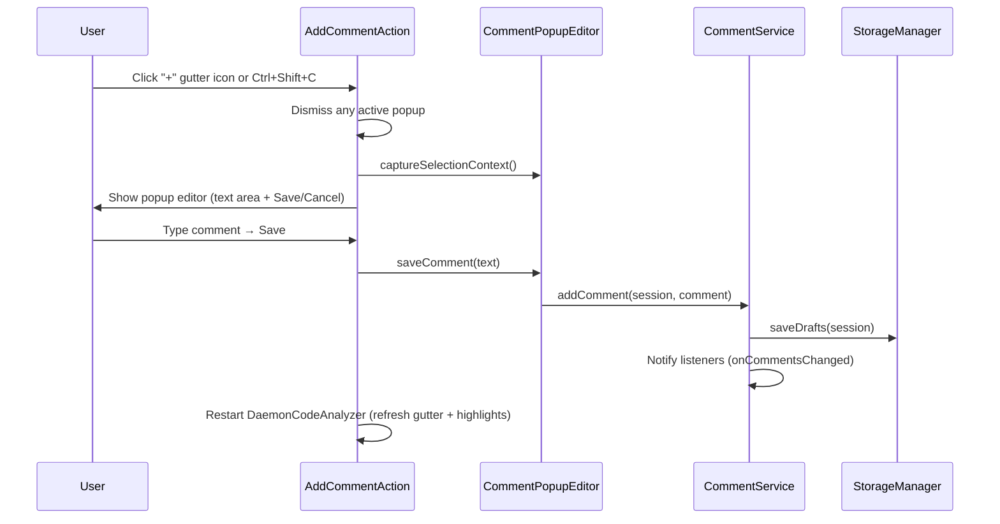

**Editing**: Same flow but through `EditCommentAction`, which pre-fills existing text and offers a Delete button.

**Popup management**: `CommentPopupTracker` ensures only one add/edit popup is active at a time.

**Source**: `actions/AddCommentAction.kt:1-108`, `actions/EditCommentAction.kt:1-105`, `ui/CommentPopupEditor.kt:1-141`

---

## Phase 3: Publish

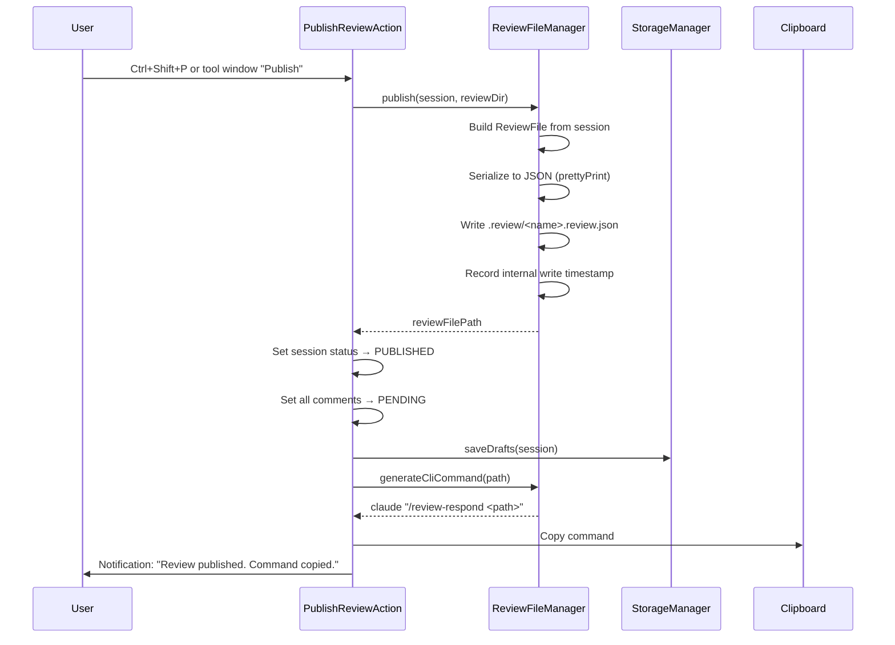

**Output**: `.review/<name>.review.json` file on disk, CLI command in clipboard.

**Source**: `actions/PublishReviewAction.kt:1-57`, `services/ReviewFileManager.kt:1-102`

---

## Phase 4: Claude Responds

This phase happens entirely in the terminal. The user pastes the clipboard command:

```
claude "/review-respond .review/docs--example.review.json"
```

Claude uses the `/review-respond` skill which calls `review-cli`:

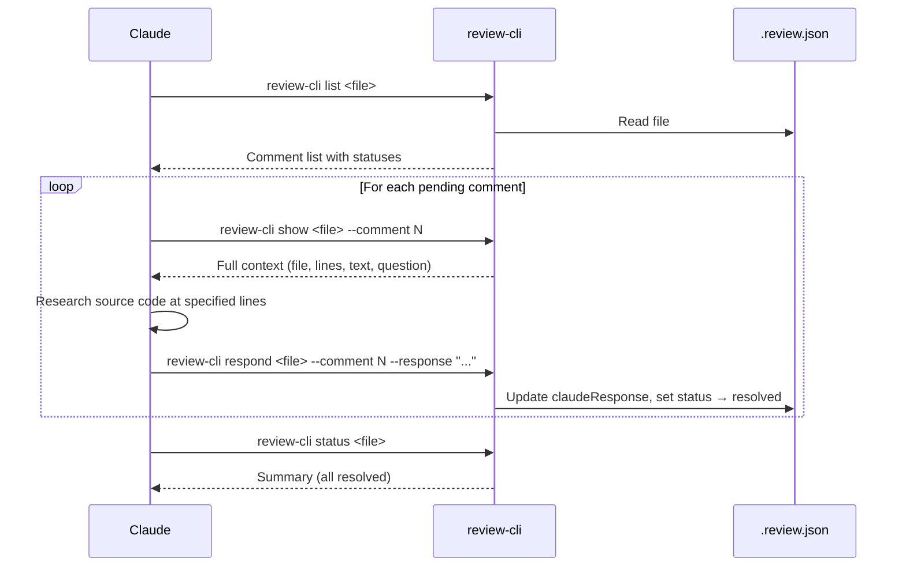

**Source**: `.claude/commands/review-respond.md`, `review-cli/.../ReviewCli.kt:1-191`

See [CLI.md](CLI.md) for full command reference.

---

## Phase 5: Reload Responses

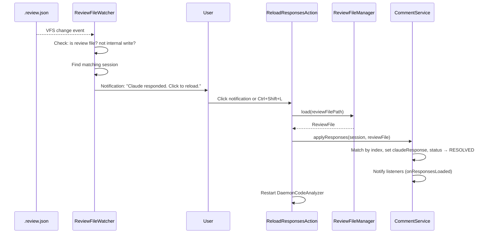

**Internal write filtering**: `ReviewFileManager.isInternalWrite()` uses a 2-second timestamp window so the FileWatcher ignores the plugin's own writes.

**Source**: `actions/ReloadResponsesAction.kt:1-40`, `listeners/ReviewFileWatcher.kt:1-74`

---

## Phase 6: Reply (Multi-Round)

Users can reply to Claude's responses from within the IDE, creating a back-and-forth conversation per comment.

### Enter Reply Mode

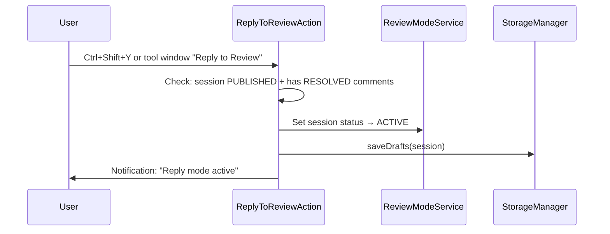

**Source**: `actions/ReplyToReviewAction.kt:1-48`

### Add Replies

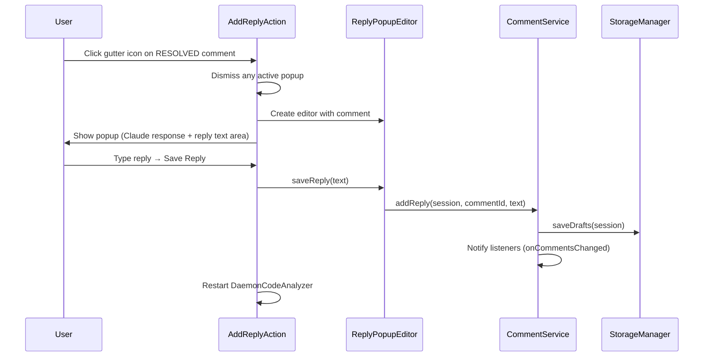

**Source**: `actions/AddReplyAction.kt:1-106`, `ui/ReplyPopupEditor.kt:1-56`

### Publish Replies

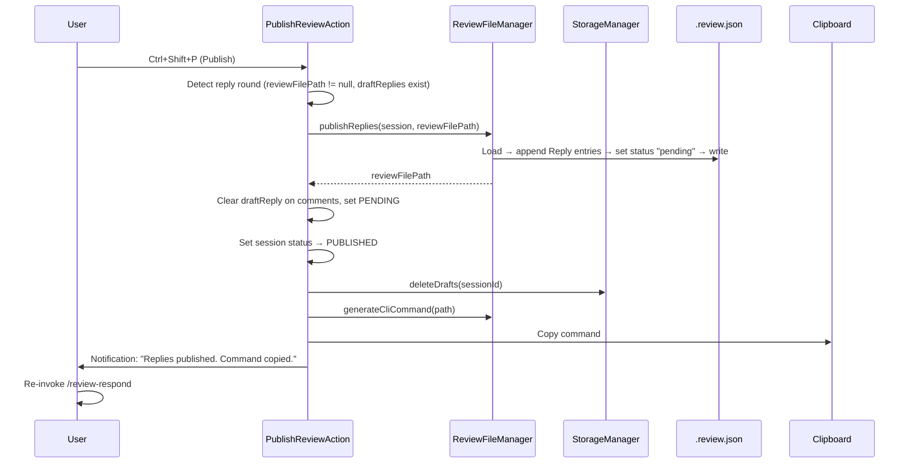

**Key detail**: `publishReplies()` appends to the `replies` array in the existing `.review.json` file (not a new file) and resets comment status to `pending`. When Claude re-runs `/review-respond`, it sees only pending comments and responds to the follow-ups.

**Source**: `actions/PublishReviewAction.kt:1-86`, `services/ReviewFileManager.kt:56-82`

---

## Phase 7: Complete/Reject

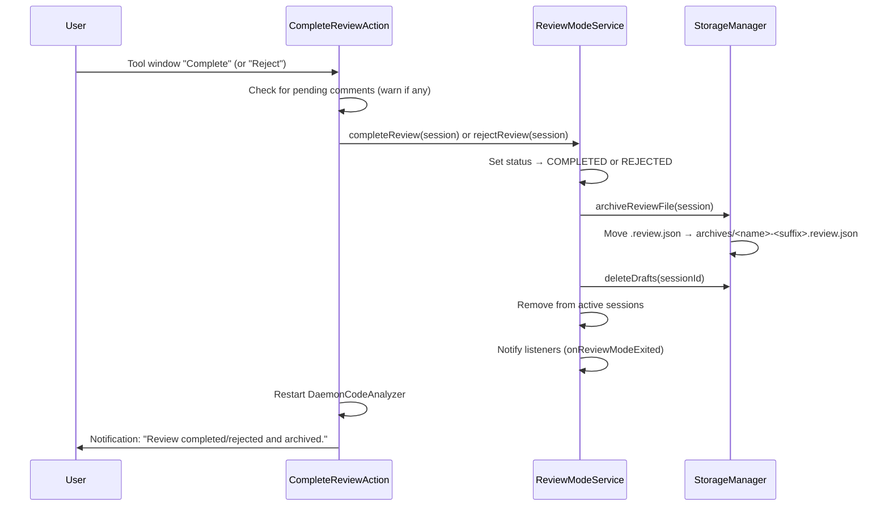

**Archive naming**: The deterministic name gets a 5-character random suffix, freeing the original name for reuse.

**Source**: `actions/CompleteReviewAction.kt:1-54`, `actions/RejectReviewAction.kt:1-52`, `services/StorageManager.kt` (archiveReviewFile)

---

## Session Persistence

Sessions survive IDE restarts through draft auto-saving and startup restoration.

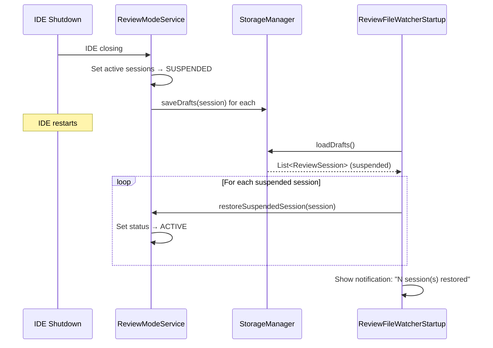

**Source**: `listeners/ReviewFileWatcherStartup.kt:1-40`
