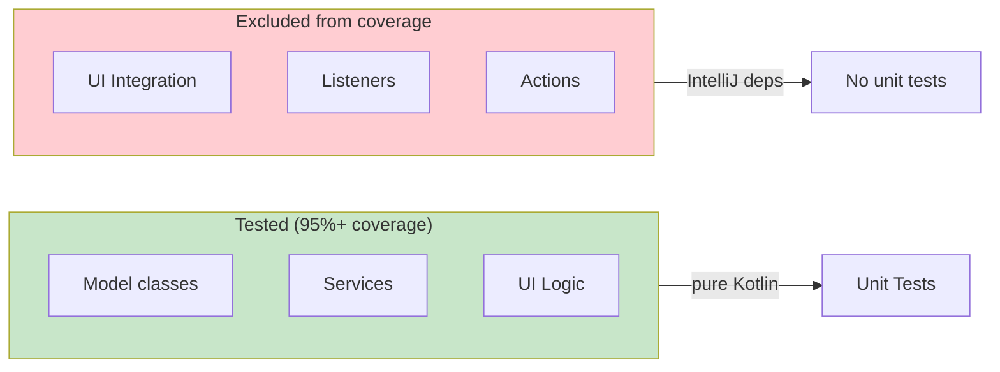

# Testing

Testing philosophy, test inventory, coverage configuration, and common testing patterns.

---

## Philosophy: Logic vs Platform Split

The codebase separates **testable logic** (pure Kotlin, no IntelliJ APIs) from **platform wiring** (IntelliJ-dependent adapters). Only logic classes are unit-tested; platform classes are excluded from coverage.



---

## Test Inventory

16 test files, 485 `@Test` methods total.

| Test File | Package | Tests | What It Covers |
|-----------|---------|-------|----------------|
| `ReviewSessionTest` | model | 21 | Session file naming, JSON round-trip, comment CRUD, display names, draft reply filtering |
| `ReviewModeServiceTest` | services | 38 | Enter/exit reviews, session lifecycle, listener notifications, persistence |
| `CommentServiceTest` | services | 32 | Add/update/delete comments, apply responses, set status, add reply, draft persistence |
| `StorageManagerTest` | services | 29 | Save/load markdown & diff sessions, comment serialization incl. draftReply, archival |
| `ReviewFileManagerTest` | services | 28 | Publish JSON, load/append replies, publish reply round, CLI command generation |
| `GitDiffServiceTest` | services | 10 | Branch operations, diff stats, file content retrieval |
| `StartMarkdownReviewActionTest` | actions | 4 | Action visibility, relative path computation |
| `ReviewFileWatcherTest` | listeners | 13 | File change detection, session matching, response reload |
| `ReviewModeListenerTest` | listeners | 2 | Default method implementations |
| `CommentPopupEditorTest` | ui | 57 | Validation, save/update/delete, context capture, preview truncation |
| `ReplyPopupEditorTest` | ui | 18 | Validation, Claude response preview, save reply, draft persistence |
| `LineHighlighterTest` | ui | 24 | Highlight computation by status, color mapping, file filtering |
| `InlayAnnotationProviderTest` | ui | 43 | Annotation text, truncation, grouping, status filtering |
| `ReviewGutterIconProviderTest` | ui | 39 | Icon selection, tooltip building, highlight colors |
| `ReviewToolWindowPanelTest` | ui | 106 | State transitions, publish/complete/reject, reply, row formatting |
| `ReviewStatusBarWidgetTest` | ui | 5 | Status text formatting |

All test files are in `src/test/kotlin/com/uber/jetbrains/reviewplugin/`.

---

## Dual Constructor Pattern

Services use two constructors to enable testing without the IntelliJ Platform:

```
SERVICE CLASS
├── constructor(project: Project)       ← Runtime: resolves deps via project.getService()
└── internal constructor(dep1, dep2)    ← Testing: direct injection, no IDE needed
```

**Example** -- `ReviewModeService`:
```
RUNTIME:
  ReviewModeService(project)
    → storageManager = project.getService(StorageManager::class.java)

TESTING:
  ReviewModeService(storageManager)
    → storageManager passed directly
```

This pattern is used by `ReviewModeService`, `CommentService`, `StorageManager`, and UI logic classes like `ReviewToolWindowPanel`.

**Source**: `services/ReviewModeService.kt`, `services/CommentService.kt`, `services/StorageManager.kt`

---

## Coverage Configuration

### JaCoCo Setup

- **Minimum coverage**: 95% instruction coverage
- **Custom Gradle task**: `unitTest` -- bypasses IntelliJ Platform instrumentation
- **Reports**: HTML + XML to `build/reports/jacoco/jacocoUnitTestReport/`

### Platform-Dependent Excludes

Classes excluded from coverage via `platformDependentExcludes` in `build.gradle.kts`:

| Pattern | Class | Reason |
|---------|-------|--------|
| `ReviewEditorListener*` | Editor highlight/inlay wiring | Requires `Editor`, `MarkupModel` |
| `ReviewLineMarkerProvider*` | Gutter icon registration | Requires `PsiElement`, `LineMarkerInfo` |
| `ReviewInlayRenderer*` | After-line text rendering | Requires `Inlay`, `Graphics` |
| `ReviewBlockInlayRenderer*` | Block inlay rendering | Requires `Inlay`, `Graphics` |
| `ReviewToolWindowFactory*` | Tool window creation | Requires `ToolWindow`, `Project` |
| `ReviewToolWindowSwingPanel*` | Swing panel rendering | Requires `Project`, Swing components |
| `ReviewStatusBarWidget*` | Status bar | Requires `StatusBar` |
| `BranchSelectionDialog*` | Branch picker | Requires `DialogWrapper`, `Project` |
| `ReviewFileWatcher*` | VFS listener | Requires `VirtualFile`, `MessageBus` |
| `ReviewFileWatcherStartup*` | Startup hook | Requires `ProjectActivity` |
| `GitDiffService*` | Git operations | Requires Git4Idea APIs |
| `AddReplyAction*` | Reply popup action | Requires `Editor`, `JBPopupFactory` |
| `ReplyToReviewAction*` | Enter reply mode | Requires `Project`, `NotificationGroupManager` |

**Rule**: When adding a new class that depends on IntelliJ Platform APIs, add it to `platformDependentExcludes`.

**Source**: `build.gradle.kts` (`platformDependentExcludes` list)

---

## Testing Patterns

### Temp Directories

All file-based tests use JUnit `@Rule TemporaryFolder` for isolated I/O:

```
SETUP:
  tempDir = TemporaryFolder.newFolder()
  storageManager = StorageManager(tempDir.toPath())

TEARDOWN:
  Automatic cleanup by JUnit
```

### Mock Listeners

Tests verify observer notifications by implementing `ReviewModeListener`:

```
SETUP:
  mockListener = object : ReviewModeListener {
      var enteredCount = 0
      var exitedCount = 0
      override fun onReviewModeEntered(session) { enteredCount++ }
      override fun onReviewModeExited(session) { exitedCount++ }
  }
  reviewModeService.addListener(mockListener)

ASSERT:
  assertEquals(1, mockListener.enteredCount)
```

### Helper Factories

Tests create sessions and comments via helper methods:

```
HELPERS:
  createMarkdownSession(filePath) → MarkdownReviewSession with defaults
  createDiffSession(base, compare) → GitDiffReviewSession with defaults
  createComment(filePath, startLine, text) → ReviewComment with defaults
```

### JSON Round-Trip Testing

Model tests verify serialization/deserialization fidelity:

```
TEST:
  original = ReviewFile(sessionId, type, metadata, comments)
  json = original.toJson()
  deserialized = ReviewFile.fromJson(json)
  assertEquals(original, deserialized)
```

### Response Application Testing

Since `CommentService` has no single-comment `applyResponse`, tests use bulk `applyResponses` or direct mutation:

```
SETUP:
  comment.status = CommentStatus.RESOLVED
  comment.claudeResponse = "response text"

OR:
  reviewFile = ReviewFile(comments = listOf(
      ReviewFileComment(index = 1, ..., claudeResponse = "response", status = "resolved")
  ))
  commentService.applyResponses(session, reviewFile)
```

---

## Running Tests

```bash
# Run all unit tests
./gradlew unitTest -Dgradle.user.home=/tmp/gradle-review-plugin-home

# Run with coverage verification (95% minimum)
./gradlew jacocoUnitTestCoverageVerification -Dgradle.user.home=/tmp/gradle-review-plugin-home

# Generate coverage report
./gradlew jacocoUnitTestReport -Dgradle.user.home=/tmp/gradle-review-plugin-home
# → build/reports/jacoco/jacocoUnitTestReport/html/index.html

# Run CLI tests
./gradlew :review-cli:test -Dgradle.user.home=/tmp/gradle-review-plugin-home
```
