# [HLD] Claude Code Review - JetBrains Plugin

**Status**: Draft
**Created**: 2026-02-14
**Updated**: 2026-02-16
**Owner**: Vinay Yerra
**PRD**: [`projects/review-plugin/PRD.md`](PRD.md)
**Implementation**: [`projects/review-plugin/IMPLEMENTATION.md`](IMPLEMENTATION.md)

---

## 1. Overview

A JetBrains IDE plugin that overlays inline commenting on existing editors (Markdown source editor and Git4Idea diff viewer), publishes all comments to a structured `.review/*.review.json` file, and reloads Claude's responses back into the IDE. The plugin never calls Claude directly -- it generates a JSON file that Claude processes via a standalone CLI tool (`review-cli`) invoked from the terminal.

### Scope

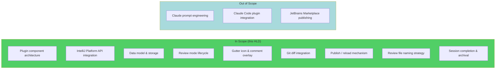

---

## 2. Architecture

### 2.1 Component Diagram

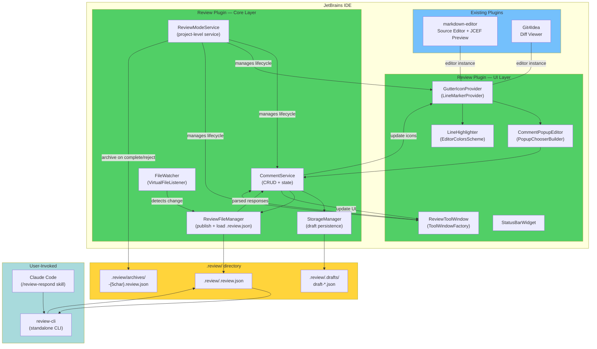

### 2.2 Component Responsibilities

| Component | Responsibility | IntelliJ API |
|-----------|---------------|--------------|
| **ReviewModeService** | Manages active review sessions per project. Tracks which files are in review mode. Provides `enterReviewMode()` / `exitReview()` / `completeReview()` / `rejectReview()` | `@Service(Service.Level.PROJECT)` |
| **CommentService** | CRUD for comments. Maintains in-memory comment list per file. Notifies listeners on changes | `@Service(Service.Level.PROJECT)` |
| **StorageManager** | Persists draft comments as JSON to `.review/.drafts/`. Restores drafts on IDE restart. Archives completed/rejected reviews to `.review/archives/` | File I/O on `ApplicationManager.getApplication().executeOnPooledThread()` |
| **ReviewFileManager** | Publishes structured `.review.json` from in-memory session. Loads and deserializes `.review.json` for response reload | Pure logic + file I/O, `kotlinx.serialization` |
| **FileWatcher** | Watches `.review/` directory for external modifications (Claude/review-cli writing responses) | `VirtualFileManager.addVirtualFileListener()` |
| **GutterIconProvider** | Renders "+" and chat icons in the editor gutter for files in review mode | `LineMarkerProvider` |
| **CommentPopupEditor** | Inline dialog for adding/editing comment text | `JBPopupFactory.createComponentPopupBuilder()` |
| **LineHighlighter** | Applies background color to commented lines | `MarkupModel.addRangeHighlighter()` |
| **ReviewToolWindow** | Side panel listing all draft/published comments with actions | `ToolWindowFactory` |
| **StatusBarWidget** | Shows "Review Mode: Active | N drafts" in the status bar | `StatusBarWidgetFactory` |

---

## 3. Review Mode Lifecycle

### 3.1 State Machine

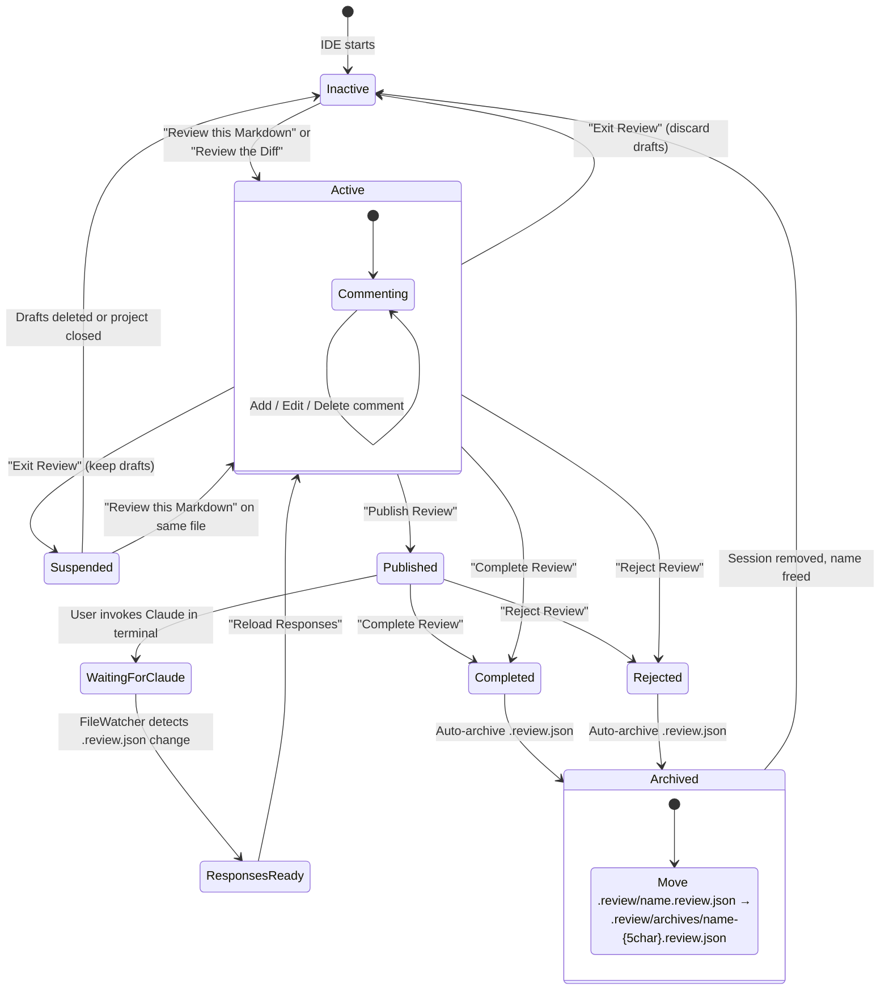

### 3.2 Terminal States: Complete & Reject

When a review is **completed** or **rejected**, the following happens:

1. Session status set to `COMPLETED` or `REJECTED`
2. If a published `.review.json` exists, it is moved to `.review/archives/` with a 5-character `[a-z0-9]` random suffix appended: `name-{5char}.review.json`
3. Draft files in `.review/.drafts/` are deleted
4. Session is removed from `activeReviews`
5. The deterministic review file name is freed — a new session can be created for the same file or branch diff

```
FUNCTION completeReview(session: ReviewSession):
    session.status = COMPLETED
    archiveReviewFile(session)
    cleanupSession(session)

FUNCTION rejectReview(session: ReviewSession):
    session.status = REJECTED
    archiveReviewFile(session)
    cleanupSession(session)

FUNCTION archiveReviewFile(session: ReviewSession):
    IF session.reviewFilePath != null:
        suffix = randomString(5, "a-z0-9")  // e.g., "a3k9m"
        archiveName = session.getReviewFileName()
            .replace(".review.json", "-${suffix}.review.json")
        move(session.reviewFilePath → ".review/archives/${archiveName}")

FUNCTION cleanupSession(session: ReviewSession):
    storageManager.deleteDrafts(session.id)
    activeReviews.remove(sessionKey)
    notifyReviewExited(session)
```

### 3.3 ReviewModeService API

```
SERVICE ReviewModeService (project-scoped):

  // State
  activeReviews: Map<String, ReviewSession>

  // Lifecycle
  enterMarkdownReview(file: VirtualFile) → MarkdownReviewSession
  enterDiffReview(baseBranch, compareBranch) → GitDiffReviewSession
  exitReview(session, keepDrafts: Boolean)
  completeReview(session: ReviewSession)
  rejectReview(session: ReviewSession)

  // Queries
  isInReviewMode(file: VirtualFile) → Boolean
  getActiveSession(file: VirtualFile) → ReviewSession?
  getAllActiveSessions() → List<ReviewSession>

  // Events
  addListener(ReviewModeListener)
    → onReviewModeEntered(session)
    → onReviewModeExited(session)
    → onCommentsChanged(session)
    → onResponsesLoaded(session)
```

### 3.4 ReviewSession Model

```
ReviewSession (sealed class):
  id:             UUID
  status:         ReviewSessionStatus   // ACTIVE | SUSPENDED | PUBLISHED | COMPLETED | REJECTED
  comments:       MutableList<ReviewComment>
  createdAt:      Instant
  publishedAt:    Instant?
  reviewFilePath: String?               // path to .review.json after publish
  getReviewFileName(): String           // abstract — subclass provides naming
  getDisplayName(): String              // abstract — for UI display

MarkdownReviewSession extends ReviewSession:
  sourceFile:     VirtualFile

GitDiffReviewSession extends ReviewSession:
  baseBranch:     String
  compareBranch:  String
  baseCommit:     String?
  compareCommit:  String?
  changedFiles:   List<String>
```

---

## 4. Data Model

### 4.1 ReviewComment

```
ReviewComment:
  id:             UUID
  filePath:       String               // relative path to source file
  startLine:      Int                  // 1-based
  endLine:        Int                  // 1-based (same as startLine for single-line)
  selectedText:   String               // captured context
  commentText:    String               // user's review comment
  authorId:       String               // e.g., "vinay.yerra"
  createdAt:      Instant
  status:         DRAFT | PENDING | RESOLVED | SKIPPED | REJECTED

  // Claude response (populated after reload)
  claudeResponse: String?
  resolvedAt:     Instant?

  // Position tracking
  rangeMarker:    RangeMarker?         // auto-adjusts on document edits

  // Diff-specific (null for Markdown reviews)
  changeType:     ADDED | MODIFIED | DELETED | null
```

### 4.2 Entity Relationships

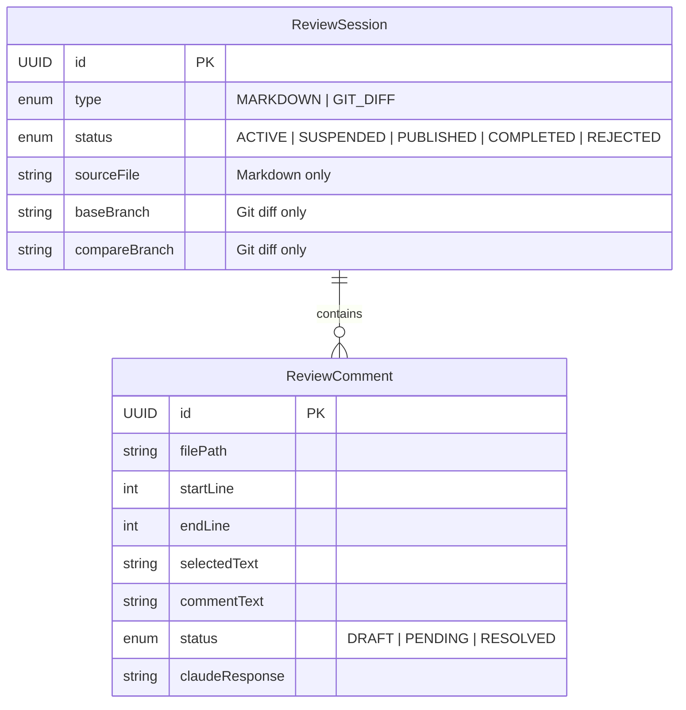

---

## 5. Review File Naming Strategy

### 5.1 The Duplicate Name Problem

Multiple files with the same name can exist in different directories:

```
docs/uscorer/ARCHITECTURE_OVERVIEW.md
docs/feature-manager/ARCHITECTURE_OVERVIEW.md
```

Using just the file stem (`ARCHITECTURE_OVERVIEW.review.json`) would cause collisions.

### 5.2 Naming Rules

The review file name is derived deterministically from the source, ensuring uniqueness and allowing re-creation after archival.

**Markdown reviews** — use the relative path from project root, replacing `/` with `--`, dropping the file extension:

| Source File | Review File Name |
|-------------|-----------------|
| `docs/uscorer/ARCHITECTURE_OVERVIEW.md` | `docs--uscorer--ARCHITECTURE_OVERVIEW.review.json` |
| `docs/feature-manager/ARCHITECTURE_OVERVIEW.md` | `docs--feature-manager--ARCHITECTURE_OVERVIEW.review.json` |
| `README.md` | `README.review.json` |
| `src/main/design.md` | `src--main--design.review.json` |

**Git diff reviews** — use branch names with `/` replaced by `-`:

| Base Branch | Compare Branch | Review File Name |
|-------------|---------------|-----------------|
| `main` | `feature-auth` | `diff-main--feature-auth.review.json` |
| `main` | `feature/user-auth` | `diff-main--feature-user-auth.review.json` |

### 5.3 Naming Pseudocode

```
FUNCTION getReviewFileName(session: ReviewSession) → String:
    WHEN session:
        is MarkdownReviewSession →
            relativePath = projectRoot.relativize(session.sourceFile.path)
            stem = relativePath.dropExtension()    // "docs/uscorer/ARCHITECTURE_OVERVIEW"
            RETURN stem.replace("/", "--") + ".review.json"
            // → "docs--uscorer--ARCHITECTURE_OVERVIEW.review.json"

        is GitDiffReviewSession →
            base = session.baseBranch.replace("/", "-")
            compare = session.compareBranch.replace("/", "-")
            RETURN "diff-${base}--${compare}.review.json"
            // → "diff-main--feature-auth.review.json"
```

### 5.4 Name Reuse After Archival

The review file name is **deterministic** — the same source always produces the same name. When a session is completed or rejected:

1. The `.review.json` file is moved to `.review/archives/` with a random suffix
2. The deterministic name is freed
3. A new review on the same file produces the same name again

```
Active:    .review/docs--uscorer--ARCHITECTURE_OVERVIEW.review.json
Archived:  .review/archives/docs--uscorer--ARCHITECTURE_OVERVIEW-a3k9m.review.json
New:       .review/docs--uscorer--ARCHITECTURE_OVERVIEW.review.json  ← same name reused
```

---

## 6. Storage Strategy

### 6.1 Three-Tier Storage

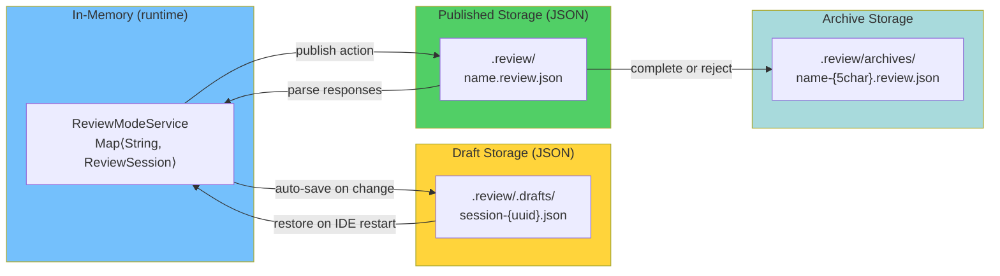

**Draft format (JSON)** -- used for internal persistence only:

```json
{
  "sessionId": "uuid",
  "type": "MARKDOWN",
  "sourceFile": "docs/uscorer/ARCHITECTURE_OVERVIEW.md",
  "comments": [
    {
      "id": "uuid",
      "startLine": 42,
      "endLine": 45,
      "selectedText": "The proposed feature store...",
      "commentText": "How does this integrate with Feature Manager?",
      "status": "DRAFT",
      "createdAt": "2026-02-12T15:28:12Z"
    }
  ]
}
```

**Published format (JSON)** -- the `.review.json` schema is the sole communication format between the plugin and `review-cli`. See Section 8.3 for the full schema.

### 6.2 File Layout

```
<project-root>/
└── .review/
    ├── .drafts/                                                    # Draft persistence (gitignored)
    │   └── session-{uuid}.json
    ├── docs--uscorer--ARCHITECTURE_OVERVIEW.review.json            # Active Markdown review
    ├── diff-main--feature-auth.review.json                        # Active diff review
    └── archives/                                                   # Completed/rejected reviews
        ├── docs--uscorer--ARCHITECTURE_OVERVIEW-a3k9m.review.json # Archived (completed)
        └── diff-main--feature-auth-7xp2q.review.json             # Archived (rejected)
```

### 6.3 .gitignore Auto-Management

On first use, the plugin appends `.review/` to the project's `.gitignore` if not already present. This is done once via `WriteAction.run()` on the VFS.

---

## 7. Gutter Icon & Comment Overlay

### 7.1 How the Overlay Works

The plugin registers a `LineMarkerProvider` that runs **only when review mode is active** for the current file. This avoids any performance impact on normal editing.

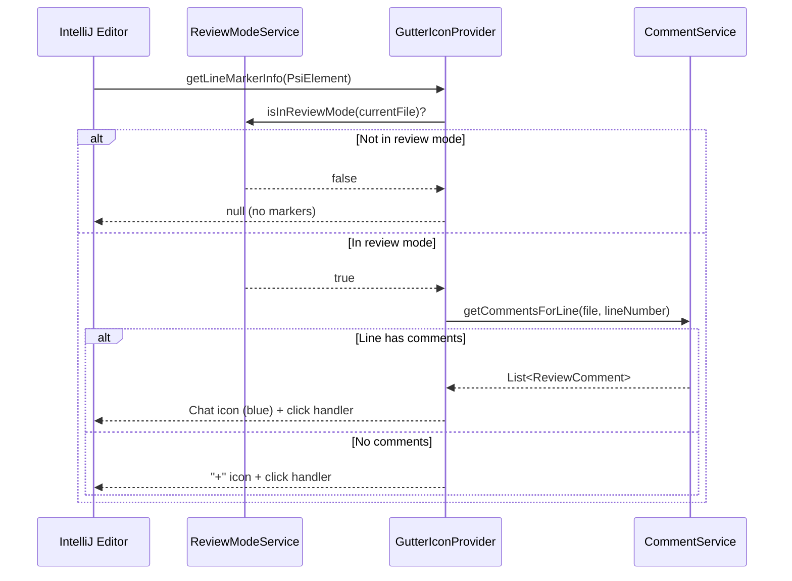

### 7.2 Gutter Icon Behavior

| Icon | Condition | Click Action |
|------|-----------|-------------|
| Blue "+" | Line has no comment, review mode active | Open `CommentPopupEditor` |
| Blue chat bubble | Line has draft comment(s) | Open comment popup with edit/delete |
| Yellow clock | Line has pending comment(s) (published, awaiting Claude) | Open comment popup (read-only until response) |
| Green check | Line has resolved comment(s) (Claude responded) | Open comment popup showing response with reply option |

### 7.3 LineMarkerProvider Registration

```xml
<!-- plugin.xml -->
<extensions defaultExtensionNs="com.intellij">
    <codeInsight.lineMarkerProvider
        language=""
        implementationClass="com.uber.jetbrains.reviewplugin.ui.ReviewGutterIconProvider"/>
</extensions>
```

Setting `language=""` makes it apply to **all file types** -- the provider itself checks `ReviewModeService.isInReviewMode()` and returns `null` for non-reviewed files.

### 7.4 Comment Popup

The popup is built with `JBPopupFactory` and contains:

```
+------------------------------------------+
|  Comment on lines 42-45                  |
+------------------------------------------+
|  ┌──────────────────────────────────┐    |
|  │ How does this integrate with     │    |
|  │ Feature Manager?                 │    |
|  │                                  │    |
|  └──────────────────────────────────┘    |
|                                          |
|  Context: "The proposed feature store…"  |
|                                          |
|  [Cancel]                     [Save]     |
+------------------------------------------+
```

- Text area supports basic Markdown
- Context is auto-captured from the editor selection or the full line text
- On save, `CommentService.addComment()` is called, which triggers `StorageManager.saveDrafts()` and `GutterIconProvider` refresh

---

## 8. Git Diff Review Integration

### 8.1 Diff Review Flow

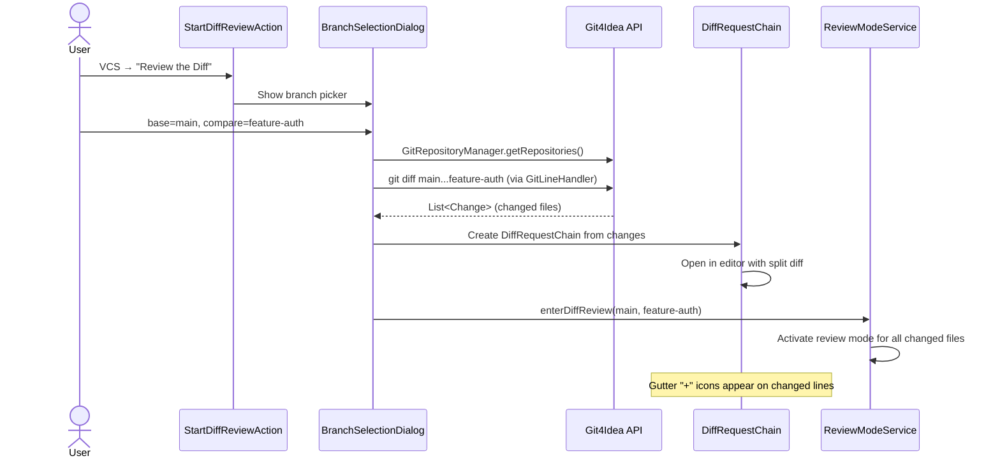

### 8.2 Key Git4Idea APIs Used

| API | Purpose |
|-----|---------|
| `GitRepositoryManager` | Get repository instance for the project |
| `GitBranchUtil` | List local and remote branches for the branch picker |
| `GitLineHandler("diff", "--stat")` | Get file-level change stats (+X -Y) |
| `ChangeListManager` | Get uncommitted changes to include in the diff |
| `DiffContentFactory.create(project, content)` | Create diff content for IntelliJ's diff viewer |
| `DiffManager.showDiff(project, requestChain)` | Open the diff viewer with the comment overlay active |

### 8.3 Diff Scope

The diff is computed as the **full branch divergence plus working tree changes**:

```
FUNCTION computeDiffScope(baseBranch, compareBranch):
    // Step 1: Committed changes since fork point
    committedDiff = git diff baseBranch...compareBranch

    // Step 2: Uncommitted changes (staged + unstaged)
    workingTreeDiff = git diff HEAD

    // Step 3: Merge into a single change list
    RETURN merge(committedDiff, workingTreeDiff)
```

### 8.4 Comment Anchoring in Diffs

Comments in diff mode are anchored to the **new-version line number** (right side of the split view). The comment stores:

- `filePath`: relative path to the changed file
- `startLine` / `endLine`: line numbers in the new (right-side) version
- `changeType`: `ADDED`, `MODIFIED`, or `DELETED`
- `selectedText`: the changed code snippet

When publishing, the exporter groups comments by file.

---

## 9. Publish & Reload Mechanism

### 9.1 Publish Flow

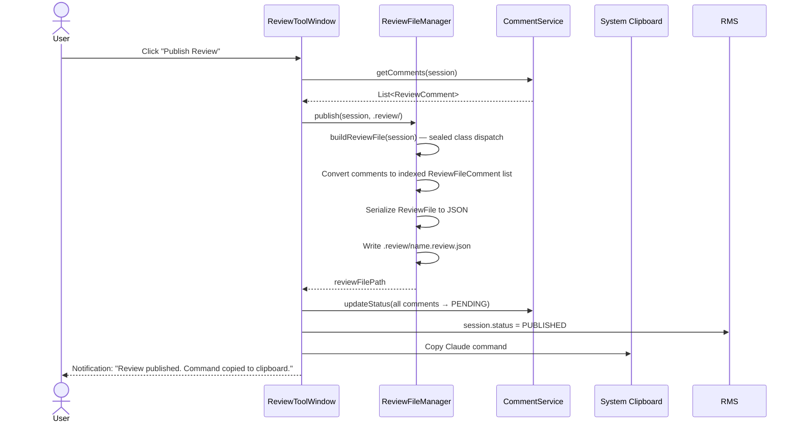

**Clipboard command format:**
- `claude "/review-respond .review/docs--uscorer--ARCHITECTURE_OVERVIEW.review.json"`

### 9.2 Reload Flow

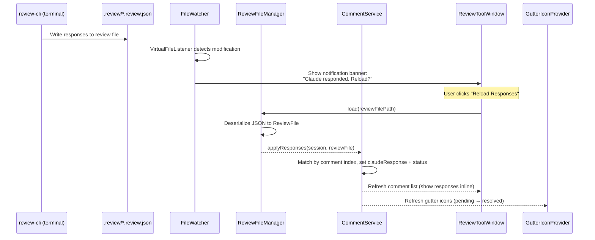

### 9.3 Review File JSON Schema

The `.review.json` file is the sole communication format between the plugin and `review-cli`.

```json
{
  "sessionId": "uuid",
  "type": "MARKDOWN",
  "metadata": {
    "author": "vinay.yerra",
    "publishedAt": "2026-02-12T15:30:00Z",
    "sourceFile": "docs/uscorer/ARCHITECTURE_OVERVIEW.md",
    "baseBranch": null,
    "compareBranch": null,
    "baseCommit": null,
    "compareCommit": null,
    "filesChanged": null
  },
  "comments": [
    {
      "index": 1,
      "filePath": "docs/uscorer/ARCHITECTURE_OVERVIEW.md",
      "startLine": 42,
      "endLine": 45,
      "selectedText": "The proposed feature store architecture...",
      "userComment": "How does this integrate with Feature Manager?",
      "status": "pending",
      "claudeResponse": null,
      "changeType": null,
      "replies": []
    }
  ]
}
```

**Status values**: `"draft"`, `"pending"`, `"resolved"`, `"skipped"`, `"rejected"`

**Type-specific metadata**: `sourceFile` is set for `MARKDOWN` reviews; `baseBranch`/`compareBranch`/`baseCommit`/`compareCommit`/`filesChanged` are set for `GIT_DIFF` reviews. Unused fields are `null`.

---

## 10. review-cli — Standalone CLI Tool

A lightweight CLI (Kotlin script or Go binary) that Claude invokes to interact with `.review.json` files comment-by-comment.

### 10.1 Commands

```
review-cli list <file.review.json>                                # List all comments with status
review-cli show <file.review.json> --comment <N>                  # Show full detail for comment N
review-cli respond <file.review.json> --comment <N> --response "..." # Write response for comment N
review-cli reply <file.review.json> --comment <N> --text "..."    # Append user reply to comment N
review-cli status <file.review.json>                              # Summary: N pending, M resolved
```

### 10.2 Claude Code Skill — /review-respond

A Claude Code skill (`.claude/commands/review-respond.md`) that teaches Claude how to use `review-cli`:

```markdown
Process a review file by responding to all pending comments.

## Instructions

1. Run `review-cli list $ARGUMENTS` to see all pending comments
2. For each pending comment:
   a. Run `review-cli show $ARGUMENTS --comment N` to get full context
   b. Read the source file at the specified lines
   c. Research related systems and documentation
   d. Run `review-cli respond $ARGUMENTS --comment N --response "your detailed response"`
3. After all comments are processed, run `review-cli status $ARGUMENTS` to confirm

## Guidelines

- For each response, cite source files with line numbers
- Include Mermaid diagrams when explaining flows
- Keep responses concise but complete
- If a comment is unclear, respond with a clarifying question rather than skipping
```

**Usage**: `/review-respond .review/docs--uscorer--ARCHITECTURE_OVERVIEW.review.json`

---

## 11. Comment Thread Support

Back-and-forth conversation threads are handled via the `replies` array in the JSON schema:

```json
{
  "index": 1,
  "userComment": "How does this integrate with Feature Manager?",
  "status": "resolved",
  "claudeResponse": "Based on Feature Manager architecture...",
  "replies": [
    {
      "author": "vinay.yerra",
      "timestamp": "2026-02-12T16:05:00Z",
      "text": "What about the caching layer?"
    },
    {
      "author": "claude",
      "timestamp": "2026-02-12T16:06:30Z",
      "text": "The caching layer uses..."
    }
  ]
}
```

**Implementation**: When the user replies via the Review Tool Window, the plugin:
1. Calls `ReviewFileManager.appendReply()` to append the reply to the `.review.json` file and reset the comment status to `PENDING`
2. User re-invokes Claude via `/review-respond`, which processes only pending comments
3. Claude responds via `review-cli respond`, appending to the thread

---

## 12. Actions & Menu Registration

### 12.1 Action Registry

```xml
<!-- plugin.xml -->
<actions>
    <!-- Markdown review -->
    <action id="ReviewPlugin.StartMarkdownReview"
            class="com.uber.jetbrains.reviewplugin.actions.StartMarkdownReviewAction"
            text="Review this Markdown"
            description="Start inline review of this Markdown file">
        <add-to-group group-id="EditorPopupMenu" anchor="last"/>
        <add-to-group group-id="ProjectViewPopupMenu" anchor="last"/>
        <keyboard-shortcut keymap="$default" first-keystroke="ctrl shift R"/>
    </action>

    <!-- Diff review -->
    <action id="ReviewPlugin.StartDiffReview"
            class="com.uber.jetbrains.reviewplugin.actions.StartDiffReviewAction"
            text="Review the Diff"
            description="Review branch changes with inline comments">
        <add-to-group group-id="VcsGroups" anchor="last"/>
        <keyboard-shortcut keymap="$default" first-keystroke="ctrl shift D"/>
    </action>

    <!-- Publish -->
    <action id="ReviewPlugin.PublishReview"
            class="com.uber.jetbrains.reviewplugin.actions.PublishReviewAction"
            text="Publish Review"
            description="Publish all comments to .review/ file">
        <keyboard-shortcut keymap="$default" first-keystroke="ctrl shift P"/>
    </action>

    <!-- Reload -->
    <action id="ReviewPlugin.ReloadResponses"
            class="com.uber.jetbrains.reviewplugin.actions.ReloadResponsesAction"
            text="Reload Responses"
            description="Reload Claude responses from .review/ file">
        <keyboard-shortcut keymap="$default" first-keystroke="ctrl shift L"/>
    </action>

    <!-- Complete Review -->
    <action id="ReviewPlugin.CompleteReview"
            class="com.uber.jetbrains.reviewplugin.actions.CompleteReviewAction"
            text="Complete Review"
            description="Mark review as complete and archive the review file">
    </action>

    <!-- Reject Review -->
    <action id="ReviewPlugin.RejectReview"
            class="com.uber.jetbrains.reviewplugin.actions.RejectReviewAction"
            text="Reject Review"
            description="Reject review and archive the review file">
    </action>
</actions>
```

### 12.2 Action Visibility Logic

| Action | Visible When | Enabled When |
|--------|-------------|-------------|
| **Review this Markdown** | Right-click on a `.md` file | File is NOT in review mode |
| **Review the Diff** | VCS menu, project has Git repo | No diff review currently active |
| **Add Comment** | In review mode | Cursor is in an editor |
| **Publish Review** | In review mode | At least 1 draft comment exists |
| **Reload Responses** | Review file exists | `.review.json` file has been modified since last load |
| **Complete Review** | In review mode | Session is ACTIVE or PUBLISHED |
| **Reject Review** | In review mode | Session is ACTIVE or PUBLISHED |

---

## 13. Tool Window Design

### 13.1 Layout

```
+-------------------------------------------------------+
|  Claude Code Review                            [x]     |
+-------------------------------------------------------+
|  [Markdown: ARCHITECTURE_OVERVIEW.md]   [Publish ▶]   |
+-------------------------------------------------------+
|                                                        |
|  --- Draft Comments (3) ---                            |
|                                                        |
|  📝 Line 42-45  "How does this integrate with..."      |
|     [Edit] [Delete] [Jump]                             |
|                                                        |
|  📝 Line 78-82  "Caching strategy doesn't account..."  |
|     [Edit] [Delete] [Jump]                             |
|                                                        |
|  📝 Line 120-125  "Consider circuit breaker..."        |
|     [Edit] [Delete] [Jump]                             |
|                                                        |
|  --- Published (1 review) ---                          |
|                                                        |
|  📄 2026-02-12 · 5 comments · 3 resolved               |
|     [Reload Responses]                                 |
|                                                        |
+-------------------------------------------------------+
|  [Complete ✓] [Reject ✗]          Sort: [Line# ▼]     |
+-------------------------------------------------------+
|  Review Mode: Active | 3 drafts                        |
+-------------------------------------------------------+
```

### 13.2 After Claude Responds

```
+-------------------------------------------------------+
|  Claude Code Review                            [x]     |
+-------------------------------------------------------+
|                                                        |
|  --- Comment 1 (Line 42-45) ---              [Jump]    |
|                                                        |
|  👤 vinay.yerra:                                       |
|  How does this integrate with Feature Manager?          |
|                                                        |
|  🤖 Claude:                                 ✅ Resolved |
|  Based on Feature Manager architecture                  |
|  (docs/feature-manager/ARCHITECTURE_02.md:156-234)...   |
|                                                        |
|  [Reply]                                               |
|                                                        |
|  --- Comment 2 (Line 78-82) ---              [Jump]    |
|                                                        |
|  👤 vinay.yerra:                                       |
|  Caching strategy doesn't account for TTL variations    |
|                                                        |
|  🤖 Claude:                                 🔄 Pending  |
|                                                        |
+-------------------------------------------------------+
|  [Complete ✓] [Reject ✗]                               |
+-------------------------------------------------------+
```

---

## 14. Technology Decisions

| Decision | Choice | Rationale |
|----------|--------|-----------|
| **Language** | Kotlin | Official JetBrains language for plugins. Less boilerplate, null safety, coroutines for async I/O |
| **Build system** | Gradle + `org.jetbrains.intellij.platform` plugin v2 | Standard for IntelliJ plugins. Separate from Bazel monorepo |
| **IntelliJ Platform SDK** | 2025.2+ | Matches currently installed IDE versions |
| **Session type hierarchy** | Sealed class (`ReviewSession` → `MarkdownReviewSession`, `GitDiffReviewSession`) | No nullable fields for "the other mode". Exhaustive `when` matching at compile time |
| **Draft storage** | JSON via `kotlinx.serialization` | Fast, type-safe, no extra dependencies |
| **Published storage** | Structured JSON (`.review.json`) | Strict schema, no regex parsing. Both plugin and CLI serialize/deserialize cleanly. Machine-friendly for atomic updates |
| **Claude interaction** | Standalone CLI (`review-cli`) + Claude Code skill (`/review-respond`) | CLI enables comment-by-comment processing with atomic JSON updates. Skill teaches Claude the CLI commands. Decoupled from plugin |
| **Review file naming** | Relative path with `--` separator | Deterministic, handles duplicate filenames from different directories, name reusable after archival |
| **Async I/O** | `ApplicationManager.executeOnPooledThread()` | Standard IntelliJ pattern for background work. No UI freezing |
| **File watching** | `VirtualFileManager.addVirtualFileListener()` | Built-in IntelliJ VFS — detects external changes (review-cli writing) |
| **Response matching** | By comment `index` field in JSON | Exact match — no ambiguity. Plugin assigns index on publish, CLI uses same index |

---

## 15. Project Structure

```
claude-code-review-plugin/
├── build.gradle.kts
├── settings.gradle.kts
├── gradle.properties
├── review-cli/                              # Standalone CLI tool
│   ├── build.gradle.kts                     # (or go.mod if Go)
│   └── src/main/kotlin/ReviewCli.kt
├── .claude/commands/
│   └── review-respond.md                    # Claude Code skill
└── src/
    ├── main/
    │   ├── kotlin/com/uber/jetbrains/reviewplugin/
    │   │   ├── services/
    │   │   │   ├── ReviewModeService.kt       # Review lifecycle management
    │   │   │   ├── CommentService.kt          # Comment CRUD + events
    │   │   │   ├── StorageManager.kt          # Draft JSON persistence + archival
    │   │   │   └── ReviewFileManager.kt       # Publish + load .review.json
    │   │   ├── ui/
    │   │   │   ├── ReviewGutterIconProvider.kt # LineMarkerProvider
    │   │   │   ├── CommentPopupEditor.kt      # Comment dialog
    │   │   │   ├── LineHighlighter.kt         # Background highlight
    │   │   │   ├── ReviewToolWindowFactory.kt # Side panel factory
    │   │   │   ├── ReviewToolWindowPanel.kt   # Panel content
    │   │   │   ├── BranchSelectionDialog.kt   # Diff review branch picker
    │   │   │   └── ReviewStatusBarWidgetFactory.kt # Status bar indicator
    │   │   ├── actions/
    │   │   │   ├── StartMarkdownReviewAction.kt
    │   │   │   ├── StartDiffReviewAction.kt
    │   │   │   ├── AddCommentAction.kt
    │   │   │   ├── PublishReviewAction.kt
    │   │   │   ├── ReloadResponsesAction.kt
    │   │   │   ├── CompleteReviewAction.kt     # Archive + complete
    │   │   │   └── RejectReviewAction.kt      # Archive + reject
    │   │   ├── model/
    │   │   │   ├── ReviewSessionStatus.kt     # ACTIVE | SUSPENDED | PUBLISHED | COMPLETED | REJECTED
    │   │   │   ├── CommentStatus.kt
    │   │   │   ├── ChangeType.kt
    │   │   │   ├── ReviewComment.kt
    │   │   │   ├── ReviewSession.kt           # sealed class (base)
    │   │   │   ├── MarkdownReviewSession.kt   # markdown-specific
    │   │   │   └── GitDiffReviewSession.kt    # diff-specific
    │   │   └── listeners/
    │   │       └── ReviewFileWatcher.kt       # VirtualFileListener
    │   └── resources/
    │       ├── META-INF/
    │       │   └── plugin.xml
    │       └── icons/
    │           ├── addComment.svg
    │           ├── commentExists.svg
    │           ├── commentResolved.svg
    │           └── reviewMode.svg
    └── test/
        └── kotlin/com/uber/jetbrains/reviewplugin/
            ├── services/
            │   ├── StorageManagerTest.kt
            │   └── ReviewFileManagerTest.kt
            └── model/
                └── ReviewCommentTest.kt
```

---

## 16. Build Sequence (Phased Implementation)

```mermaid
gantt
    title Implementation Phases
    dateFormat X
    axisFormat %s

    section Phase 1: Foundation
    Plugin scaffold + plugin.xml           :p1a, 0, 1
    Data models (sealed ReviewSession)     :p1b, 0, 1
    StorageManager (JSON draft persistence):p1c, 1, 2
    Unit tests for storage + models        :p1d, 1, 2

    section Phase 2: Markdown Review
    StartMarkdownReviewAction              :p2a, 2, 3
    ReviewModeService                      :p2b, 2, 3
    GutterIconProvider                     :p2c, 3, 4
    CommentPopupEditor                     :p2d, 3, 4
    LineHighlighter                        :p2e, 3, 4
    ReviewToolWindow                       :p2f, 4, 5
    ReviewFileManager (publish JSON)       :p2g, 5, 6

    section Phase 3: Claude Integration
    review-cli (standalone CLI)            :p3a, 6, 7
    /review-respond Claude skill           :p3b, 6, 7
    FileWatcher                            :p3c, 6, 7
    Reload Responses action                :p3d, 7, 8
    Response display in ToolWindow         :p3e, 7, 8
    Gutter icon status updates             :p3f, 7, 8

    section Phase 4: Git Diff Review
    BranchSelectionDialog                  :p4a, 8, 9
    Git4Idea API integration               :p4b, 8, 9
    Diff view with comment overlay         :p4c, 9, 10
    Diff-specific naming                   :p4d, 9, 10

    section Phase 5: Lifecycle Completion
    CompleteReviewAction                   :p5a, 10, 11
    RejectReviewAction                     :p5b, 10, 11
    Archive mechanism in StorageManager    :p5c, 10, 11
    Tool window complete/reject buttons    :p5d, 10, 11
```

### Phase Dependencies

| Phase | Depends On | Deliverable |
|-------|-----------|-------------|
| **Phase 1** | None | Plugin loads, models + storage work, unit tests pass |
| **Phase 2** | Phase 1 | Can review Markdown files, add comments, publish to `.review.json` |
| **Phase 3** | Phase 2 | Full bidirectional loop: publish → Claude uses review-cli → reload responses |
| **Phase 4** | Phase 1, Phase 3 | Can review git diffs with the same publish/reload flow |
| **Phase 5** | Phase 2 | Complete/reject sessions, archive review files, reuse names for new sessions |

**Phase 2 + 3 is the MVP** -- after Phase 3, the Markdown review workflow is fully usable.

---

## 17. Risk Analysis

| Risk | Impact | Mitigation |
|------|--------|-----------|
| `LineMarkerProvider` performance on large files | UI lag when editing | Check `ReviewModeService.isInReviewMode()` first -- return `null` immediately for non-reviewed files. Cache comment positions |
| Git4Idea API changes between IDE versions | Diff review breaks on upgrade | Pin to stable API classes (`DiffContentFactory`, `SimpleDiffRequest`). Avoid internal/experimental APIs |
| Draft comment positions drift after file edit | Comments point to wrong lines | Use `RangeMarker` API which auto-adjusts positions as the document is edited. Persist adjusted positions on save |
| Review file name collision | Two different files produce same review name | Relative path naming with `--` separator guarantees uniqueness within a project |
| Archive directory grows unbounded | Disk usage | Future: add periodic cleanup or configurable retention. Not a concern for initial release |
| Multiple review sessions on same file | State conflicts | `ReviewModeService` enforces one active session per file. New session requires completing/rejecting the existing one |

---

## 18. Summary

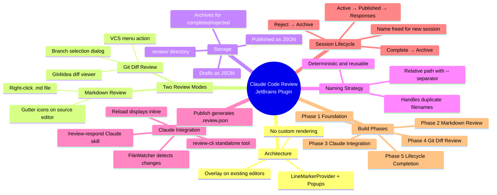

**Key design principles:**
1. **Overlay, not replace** -- the plugin adds a comment layer on top of existing editors, not a custom UI
2. **JSON-based integration** -- Claude communication is through a structured `.review.json` file via `review-cli`, no direct API calls
3. **Opt-in only** -- review mode is explicitly activated, no interference with normal editing
4. **Draft persistence** -- comments survive IDE restarts via JSON serialization to `.review/.drafts/`
5. **Deterministic naming** -- review file names are derived from source path/branches, ensuring uniqueness and reusability after archival
6. **Clean lifecycle** -- sessions can be completed or rejected, archiving the review file and freeing the name for new reviews
7. **Phase 2 + 3 is the MVP** -- Markdown review with publish/reload is the minimum viable product
