# Claude Code Review Plugin - Implementation Design

**Package**: `com.uber.jetbrains.reviewplugin`
**Language**: Kotlin
**Build**: Gradle + `org.jetbrains.intellij.platform` plugin v2
**Target**: IntelliJ Platform 2025.2+

---

## 1. Project Structure

```
claude-code-review-plugin/
├── build.gradle.kts
├── settings.gradle.kts
├── gradle.properties
└── src/
    ├── main/
    │   ├── kotlin/com/uber/jetbrains/reviewplugin/
    │   │   ├── model/
    │   │   │   ├── ReviewSessionStatus.kt
    │   │   │   ├── CommentStatus.kt
    │   │   │   ├── ChangeType.kt
    │   │   │   ├── ReviewComment.kt
    │   │   │   ├── ReviewSession.kt              # sealed class (base)
    │   │   │   ├── MarkdownReviewSession.kt      # markdown-specific
    │   │   │   └── GitDiffReviewSession.kt       # diff-specific
    │   │   ├── services/
    │   │   │   ├── ReviewModeService.kt
    │   │   │   ├── CommentService.kt
    │   │   │   ├── StorageManager.kt
    │   │   │   └── ReviewFileManager.kt         # publish/reload .review.json
    │   │   ├── ui/
    │   │   │   ├── ReviewGutterIconProvider.kt
    │   │   │   ├── CommentPopupEditor.kt
    │   │   │   ├── LineHighlighter.kt
    │   │   │   ├── ReviewToolWindowFactory.kt
    │   │   │   ├── ReviewToolWindowPanel.kt
    │   │   │   ├── BranchSelectionDialog.kt
    │   │   │   └── ReviewStatusBarWidgetFactory.kt
    │   │   ├── actions/
    │   │   │   ├── StartMarkdownReviewAction.kt
    │   │   │   ├── StartDiffReviewAction.kt
    │   │   │   ├── AddCommentAction.kt
    │   │   │   ├── PublishReviewAction.kt
    │   │   │   ├── ReloadResponsesAction.kt
    │   │   │   ├── CompleteReviewAction.kt
    │   │   │   └── RejectReviewAction.kt
    │   │   └── listeners/
    │   │       └── ReviewFileWatcher.kt
    │   └── resources/
    │       ├── META-INF/
    │       │   └── plugin.xml
    │       └── icons/
    │           ├── addComment.svg
    │           ├── commentExists.svg
    │           ├── commentResolved.svg
    │           └── reviewMode.svg
    └── test/
        └── kotlin/com/uber/jetbrains/reviewplugin/
            ├── services/
            │   ├── StorageManagerTest.kt
            │   └── ReviewFileManagerTest.kt
            └── model/
                └── ReviewCommentTest.kt
```

---

## 2. Class Glossary

### Model Layer

| Class | Intention |
|-------|-----------|
| `ReviewSession` | Sealed base class representing a review session. Holds session ID, status, comment list, and timestamps. Subclasses carry mode-specific data. Exhaustive `when` matching ensures all review types are handled at compile time |
| `MarkdownReviewSession` | A review session targeting a single Markdown file. Owns `sourceFile: VirtualFile`. Derives review file name from relative path (e.g., `docs--uscorer--ARCHITECTURE_OVERVIEW.review.json`) |
| `GitDiffReviewSession` | A review session targeting a branch diff. Owns `baseBranch`, `compareBranch`, optional commit SHAs, and list of changed files. Derives review file name from branches (e.g., `diff-main--feature-auth.review.json`) |
| `ReviewComment` | A single review comment anchored to a line range in a file. Tracks comment text, selected context, status (draft/pending/resolved), Claude's response, and a `RangeMarker` for auto-adjusting positions on document edits |
| `ReviewSessionStatus` | Enum: `ACTIVE`, `SUSPENDED`, `PUBLISHED`, `COMPLETED`, `REJECTED`. Drives the session lifecycle state machine |
| `CommentStatus` | Enum: `DRAFT`, `PENDING`, `RESOLVED`, `SKIPPED`, `REJECTED`. Tracks per-comment resolution state |
| `ChangeType` | Enum: `ADDED`, `MODIFIED`, `DELETED`. Used only in diff reviews to indicate the kind of change a comment refers to |

### Service Layer

| Class | Intention |
|-------|-----------|
| `ReviewModeService` | Project-scoped singleton that manages the review session lifecycle. Entry point for entering, exiting, completing, and rejecting reviews. Enforces one-session-per-file constraint. Maintains `activeReviews` map and notifies `ReviewModeListener` subscribers on state changes |
| `CommentService` | Project-scoped singleton for comment CRUD. Adds, updates, deletes comments within a session. Applies Claude's responses from a loaded `ReviewFile` by matching on comment index. Triggers draft persistence and UI refresh on every mutation |
| `StorageManager` | Project-scoped singleton for file I/O. Persists draft sessions as JSON to `.review/.drafts/`, restores them on IDE restart, archives completed/rejected review files to `.review/archives/` with a random suffix, and manages the `.review/` directory structure including `.gitignore` auto-management |
| `ReviewFileManager` | Stateless utility for the `.review.json` publish/load contract. Serializes a session's comments into the structured JSON format for CLI consumption, deserializes Claude's responses back, and handles reply appending. This is the sole bridge between the plugin and `review-cli` |

### UI Layer

| Class | Intention |
|-------|-----------|
| `ReviewGutterIconProvider` | `LineMarkerProvider` that renders gutter icons ("+" for uncommented lines, chat/clock/check for commented lines) only when review mode is active. Fast-path returns `null` for non-reviewed files to avoid performance impact |
| `CommentPopupEditor` | Popup dialog for creating and editing comments. Shows a text area, selected context preview, and Save/Cancel/Delete buttons. Built with `JBPopupFactory` |
| `LineHighlighter` | Applies colored background highlighting to commented lines using `MarkupModel.addRangeHighlighter()`. Color varies by status: yellow for draft, blue for pending, green for resolved |
| `ReviewToolWindowFactory` | `ToolWindowFactory` that creates the "Claude Code Review" side panel. Delegates content rendering to `ReviewToolWindowPanel` |
| `ReviewToolWindowPanel` | Main panel content for the tool window. Lists draft/published comments, provides Publish/Reload/Complete/Reject buttons, shows Claude's responses inline with reply capability, and supports jump-to-comment navigation |
| `BranchSelectionDialog` | `DialogWrapper` for selecting base and compare branches when starting a diff review. Uses `GitBranchUtil` to list branches and shows changed file count |
| `ReviewStatusBarWidgetFactory` | Factory for the status bar widget. Creates `ReviewStatusBarWidget` instances |
| `ReviewStatusBarWidget` | Status bar indicator showing "Review Mode: Active | N drafts" when a review session is active |

### Actions Layer

| Class | Intention |
|-------|-----------|
| `StartMarkdownReviewAction` | Context menu action ("Review this Markdown") on `.md` files. Calls `ReviewModeService.enterMarkdownReview()`. Visible only for `.md` files not already in review mode |
| `StartDiffReviewAction` | VCS menu action ("Review the Diff"). Opens `BranchSelectionDialog`, then calls `ReviewModeService.enterDiffReview()`. Visible only when project has a Git repository |
| `AddCommentAction` | Editor context menu action to add a comment at the current cursor/selection. Opens `CommentPopupEditor` |
| `PublishReviewAction` | Serializes all draft comments to `.review.json` via `ReviewFileManager.publish()` and copies the Claude command to clipboard. Enabled only when draft comments exist |
| `ReloadResponsesAction` | Reloads Claude's responses from the `.review.json` file via `ReviewFileManager.load()` and applies them to the session. Enabled when the file has been modified since last load |
| `CompleteReviewAction` | Marks the session as `COMPLETED`, archives the review file, and cleans up. Enabled when session is `ACTIVE` or `PUBLISHED` |
| `RejectReviewAction` | Marks the session as `REJECTED`, archives the review file, and cleans up. Same lifecycle as Complete but indicates the review was discarded |

### Listeners Layer

| Class | Intention |
|-------|-----------|
| `ReviewFileWatcher` | `VirtualFileListener` that watches `.review/` for external modifications (Claude/review-cli writing responses). Ignores draft file changes and the plugin's own saves. Triggers a notification balloon when a response is detected |
| `ReviewFileWatcherStartup` | `PostStartupActivity` that registers `ReviewFileWatcher` on project open and restores any suspended draft sessions from `.review/.drafts/` |

### Data Transfer Objects

| Class | Intention |
|-------|-----------|
| `ReviewFile` | Serialization model for the `.review.json` file. Contains session ID, type, metadata, and indexed comment list. The sole communication contract between plugin and `review-cli` |
| `ReviewFileComment` | Single comment entry within `ReviewFile`. Carries index, file path, line range, user comment, Claude's response, status, and reply thread |
| `ReviewMetadata` | Metadata block within `ReviewFile`. Contains author, timestamp, and type-specific fields (source file for Markdown, branches/commits for diff) |

---

## 3. Class Diagrams

### 3.1 Model Layer

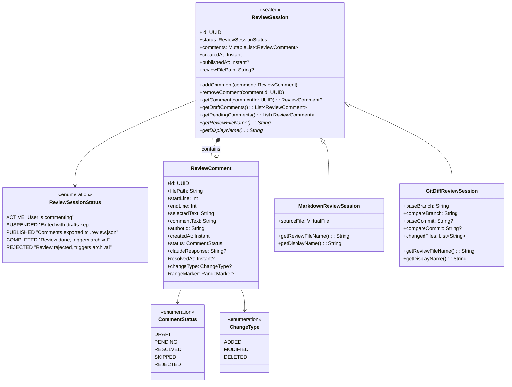

**Key design points:**

- `ReviewSession` is a **sealed class** — exhaustive `when` matching in Kotlin ensures all branches are handled at compile time. No `ReviewType` enum needed; the type hierarchy replaces it
- `MarkdownReviewSession` owns `sourceFile: VirtualFile` (non-nullable, always required)
- `GitDiffReviewSession` owns `baseBranch`, `compareBranch` (non-nullable), plus optional `baseCommit`/`compareCommit` and `changedFiles`
- No nullable fields for "the other mode" — each subclass only carries its own data
- `getReviewFileName()` is abstract — each subclass provides its own naming logic:
  - `MarkdownReviewSession` → `"ARCHITECTURE_OVERVIEW.review.json"` (derived from source file name)
  - `GitDiffReviewSession` → `"diff-main-feature-auth-20260212.review.json"` (derived from branches + timestamp)
- `getDisplayName()` is abstract — used by `ReviewToolWindowPanel` and `ReviewStatusBarWidget`:
  - `MarkdownReviewSession` → `"Markdown: ARCHITECTURE_OVERVIEW.md"`
  - `GitDiffReviewSession` → `"Diff: main → feature-auth"`
- Adding a new review type (e.g., `PRReviewSession`) requires adding a new subclass — the compiler flags every `when` that needs updating

### 3.2 Service Layer

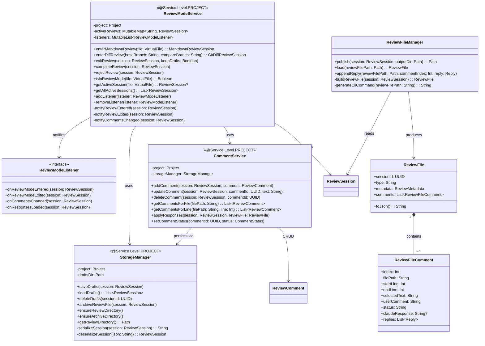

### 3.3 UI Layer

> **Note**: The plugin overlays on two **existing** editor surfaces provided by bundled plugins:
> - **Markdown editor** (source view) — from `org.intellij.plugins.markdown`
> - **Diff viewer** (split-pane) — from `Git4Idea` via `DiffManager.showDiff()`
>
> The classes below are **our custom UI components** that add review functionality on top of those editors. We do not reimplement any editor or diff viewer — we attach gutter icons, highlights, and popups to the existing editor instances.

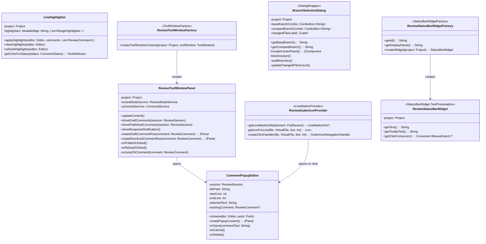

### 3.4 Actions Layer

```mermaid
classDiagram
    direction TB

    class StartMarkdownReviewAction {
        <<AnAction>>
        +actionPerformed(e: AnActionEvent)
        +update(e: AnActionEvent)
        -isMarkdownFile(file: VirtualFile): Boolean
    }

    class StartDiffReviewAction {
        <<AnAction>>
        +actionPerformed(e: AnActionEvent)
        +update(e: AnActionEvent)
        -hasGitRepository(project: Project): Boolean
    }

    class AddCommentAction {
        <<AnAction>>
        +actionPerformed(e: AnActionEvent)
        +update(e: AnActionEvent)
    }

    class PublishReviewAction {
        <<AnAction>>
        +actionPerformed(e: AnActionEvent)
        +update(e: AnActionEvent)
        -hasDraftComments(project: Project): Boolean
    }

    class ReloadResponsesAction {
        <<AnAction>>
        +actionPerformed(e: AnActionEvent)
        +update(e: AnActionEvent)
        -hasPublishedReview(project: Project): Boolean
    }

    class CompleteReviewAction {
        <<AnAction>>
        +actionPerformed(e: AnActionEvent)
        +update(e: AnActionEvent)
        -isActiveOrPublished(project: Project): Boolean
    }

    class RejectReviewAction {
        <<AnAction>>
        +actionPerformed(e: AnActionEvent)
        +update(e: AnActionEvent)
        -isActiveOrPublished(project: Project): Boolean
    }

    StartMarkdownReviewAction --> ReviewModeService : calls enterMarkdownReview
    StartDiffReviewAction --> BranchSelectionDialog : opens
    StartDiffReviewAction --> ReviewModeService : calls enterDiffReview
    AddCommentAction --> CommentPopupEditor : opens
    PublishReviewAction --> ReviewFileManager : calls publish
    ReloadResponsesAction --> ReviewFileManager : calls load
    CompleteReviewAction --> ReviewModeService : calls completeReview
    RejectReviewAction --> ReviewModeService : calls rejectReview
```

### 3.5 Listeners Layer

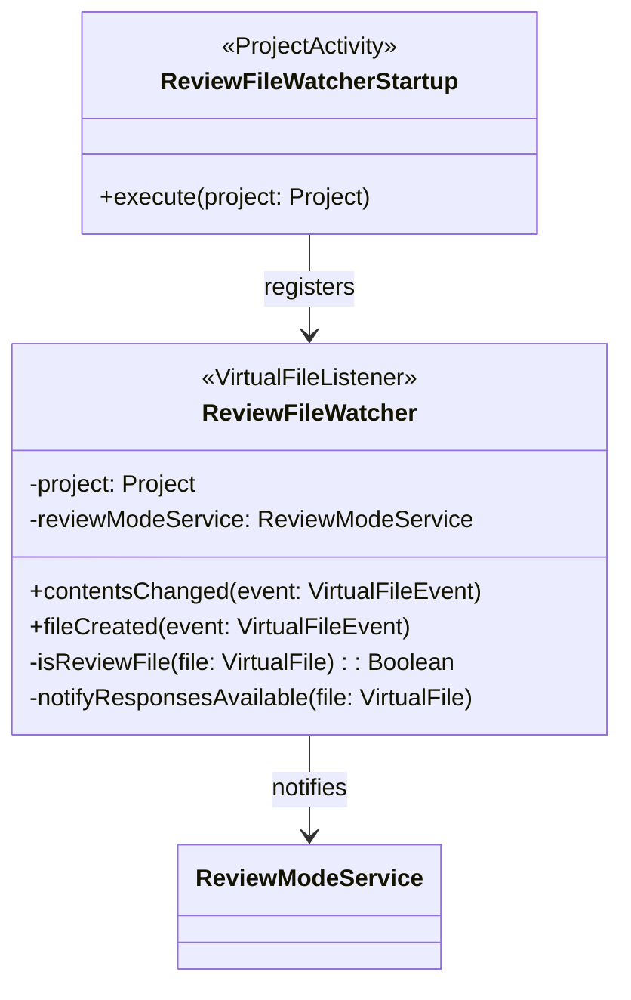

### 3.6 Full System Class Diagram

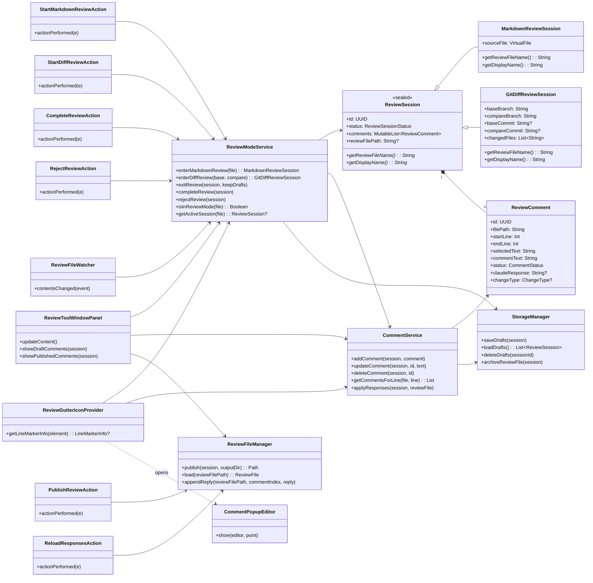

---

## 4. Sequence Diagrams

### 4.1 Start Markdown Review

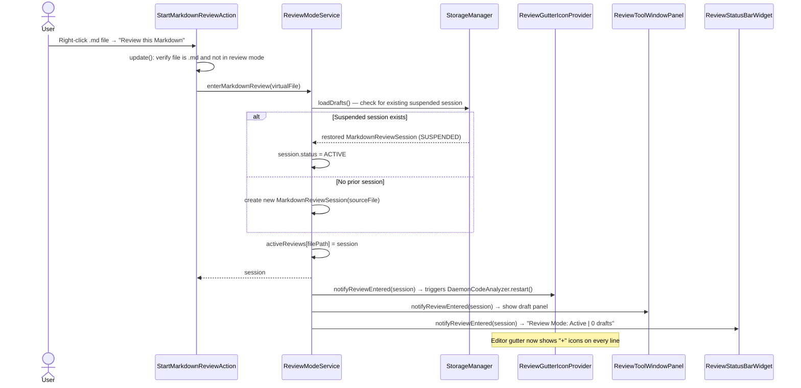

### 4.2 Add Comment

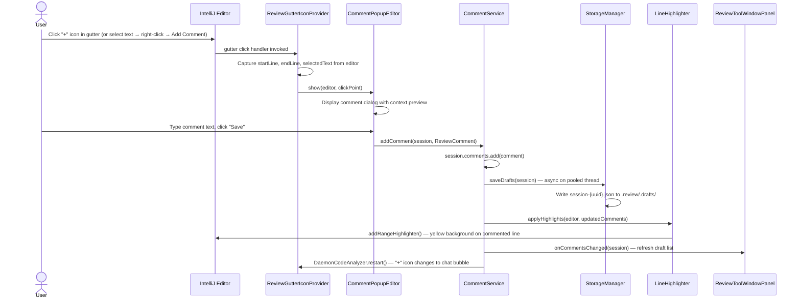

### 4.3 Publish Review

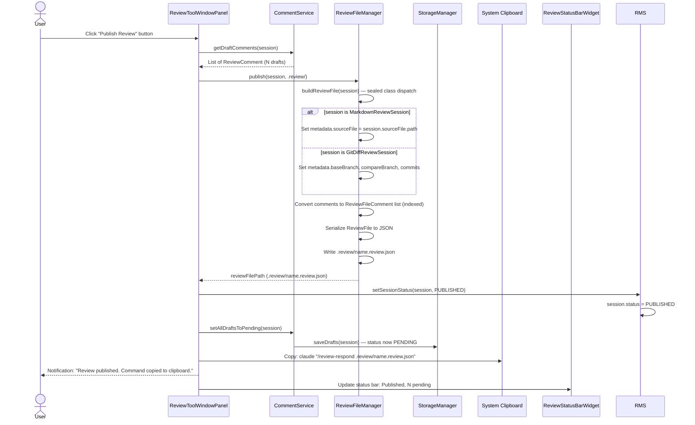

### 4.4 Claude Processes via CLI and User Reloads Responses

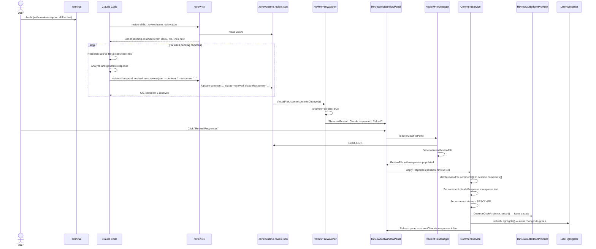

### 4.5 Start Git Diff Review

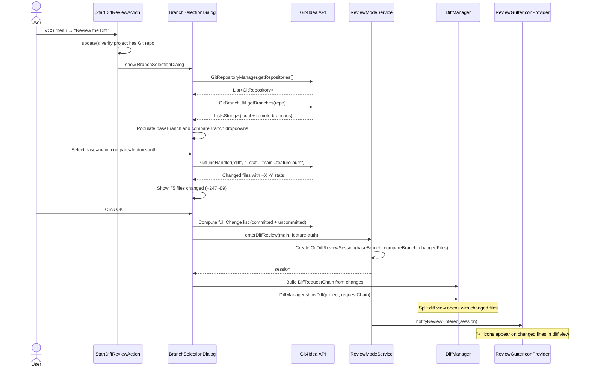

### 4.6 Comment Thread (Reply Flow)

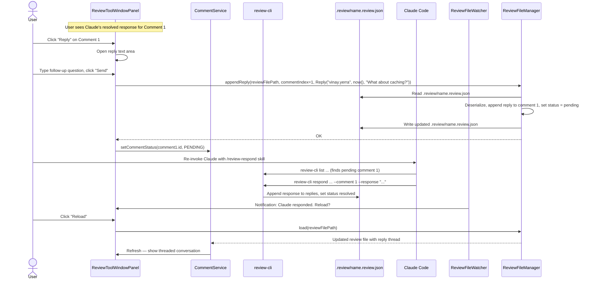

### 4.7 Exit Review (with Draft Persistence)

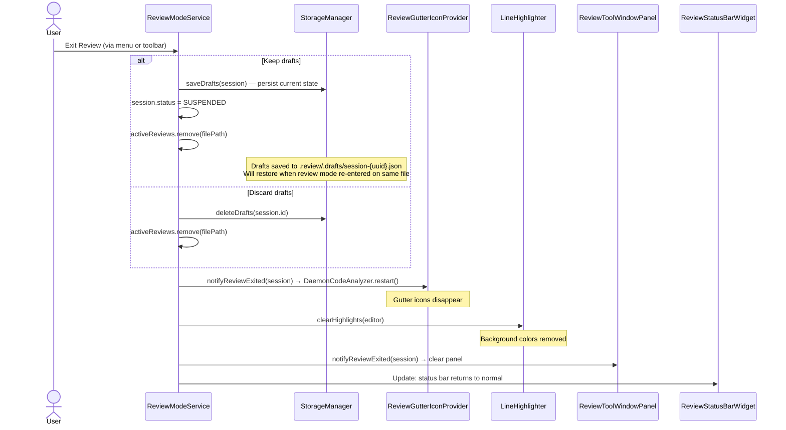

### 4.8 Complete / Reject Review (Archival)

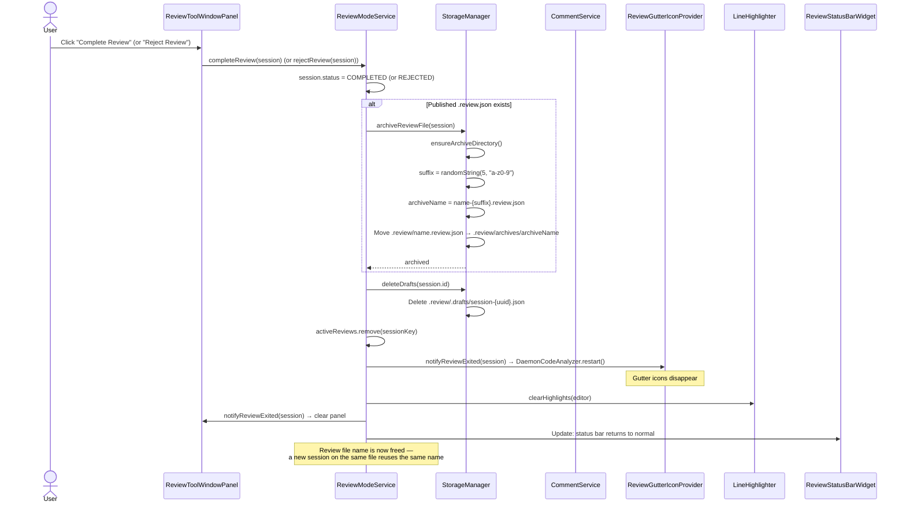

### 4.9 IDE Restart / Draft Restore

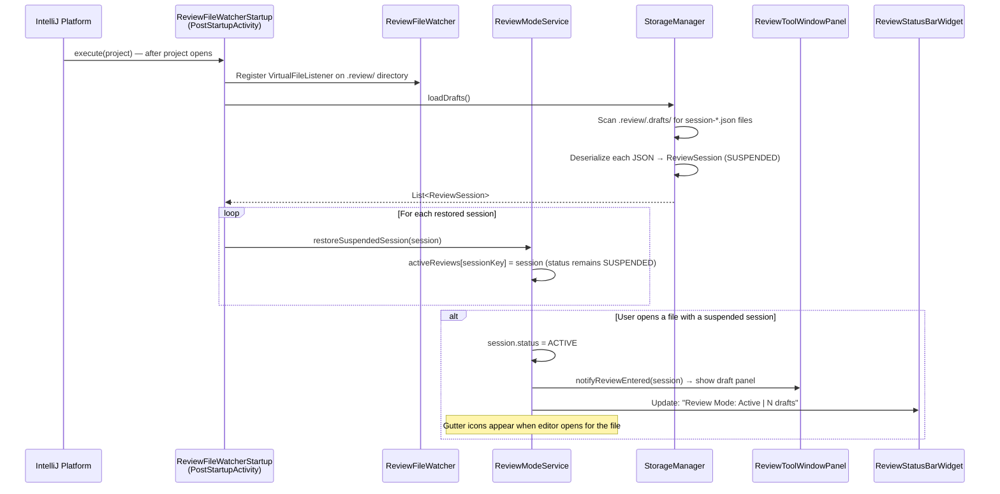

---

## 5. Plugin Descriptor (plugin.xml)

```xml
<idea-plugin>
    <id>com.uber.jetbrains.reviewplugin</id>
    <name>Claude Code Review</name>
    <vendor>Vinay Yerra</vendor>
    <description>Inline review comments with Claude Code integration</description>

    <!-- Dependencies -->
    <depends>com.intellij.modules.platform</depends>
    <depends>Git4Idea</depends>
    <depends>org.intellij.plugins.markdown</depends>

    <extensions defaultExtensionNs="com.intellij">
        <!-- Project-level Services -->
        <projectService
            serviceImplementation="com.uber.jetbrains.reviewplugin.services.ReviewModeService"/>
        <projectService
            serviceImplementation="com.uber.jetbrains.reviewplugin.services.CommentService"/>
        <projectService
            serviceImplementation="com.uber.jetbrains.reviewplugin.services.StorageManager"/>

        <!-- Gutter Icons -->
        <codeInsight.lineMarkerProvider language=""
            implementationClass="com.uber.jetbrains.reviewplugin.ui.ReviewGutterIconProvider"/>

        <!-- Tool Window -->
        <toolWindow id="Claude Code Review" anchor="right" secondary="true"
            factoryClass="com.uber.jetbrains.reviewplugin.ui.ReviewToolWindowFactory"/>

        <!-- Status Bar -->
        <statusBarWidgetFactory id="ReviewModeStatus"
            implementation="com.uber.jetbrains.reviewplugin.ui.ReviewStatusBarWidgetFactory"/>

        <!-- File Watcher Startup -->
        <postStartupActivity
            implementation="com.uber.jetbrains.reviewplugin.listeners.ReviewFileWatcherStartup"/>

        <!-- Notification Group -->
        <notificationGroup id="ReviewPlugin"
            displayType="BALLOON"/>
    </extensions>

    <actions>
        <!-- Markdown Review -->
        <action id="ReviewPlugin.StartMarkdownReview"
                class="com.uber.jetbrains.reviewplugin.actions.StartMarkdownReviewAction"
                text="Review this Markdown"
                description="Start inline review of this Markdown file">
            <add-to-group group-id="EditorPopupMenu" anchor="last"/>
            <add-to-group group-id="ProjectViewPopupMenu" anchor="last"/>
            <keyboard-shortcut keymap="$default" first-keystroke="ctrl shift R"/>
        </action>

        <!-- Diff Review -->
        <action id="ReviewPlugin.StartDiffReview"
                class="com.uber.jetbrains.reviewplugin.actions.StartDiffReviewAction"
                text="Review the Diff"
                description="Review branch changes with inline comments">
            <add-to-group group-id="VcsGroups" anchor="last"/>
            <keyboard-shortcut keymap="$default" first-keystroke="ctrl shift D"/>
        </action>

        <!-- Add Comment -->
        <action id="ReviewPlugin.AddComment"
                class="com.uber.jetbrains.reviewplugin.actions.AddCommentAction"
                text="Add Review Comment"
                description="Add a review comment at the current line">
            <add-to-group group-id="EditorPopupMenu" anchor="last"/>
            <keyboard-shortcut keymap="$default" first-keystroke="ctrl shift C"/>
        </action>

        <!-- Publish -->
        <action id="ReviewPlugin.PublishReview"
                class="com.uber.jetbrains.reviewplugin.actions.PublishReviewAction"
                text="Publish Review"
                description="Publish all comments to .review/ file">
            <keyboard-shortcut keymap="$default" first-keystroke="ctrl shift P"/>
        </action>

        <!-- Reload -->
        <action id="ReviewPlugin.ReloadResponses"
                class="com.uber.jetbrains.reviewplugin.actions.ReloadResponsesAction"
                text="Reload Responses"
                description="Reload Claude responses from .review/ file">
            <keyboard-shortcut keymap="$default" first-keystroke="ctrl shift L"/>
        </action>

        <!-- Complete Review -->
        <action id="ReviewPlugin.CompleteReview"
                class="com.uber.jetbrains.reviewplugin.actions.CompleteReviewAction"
                text="Complete Review"
                description="Mark review as complete and archive the review file">
        </action>

        <!-- Reject Review -->
        <action id="ReviewPlugin.RejectReview"
                class="com.uber.jetbrains.reviewplugin.actions.RejectReviewAction"
                text="Reject Review"
                description="Reject review and archive the review file">
        </action>
    </actions>
</idea-plugin>
```

---

## 6. Key Implementation Details

### 6.1 ReviewGutterIconProvider — Conditional Activation

The `LineMarkerProvider` must be fast. It runs on every editor repaint for every file.

```
CLASS ReviewGutterIconProvider : LineMarkerProvider

  FUNCTION getLineMarkerInfo(element: PsiElement) → LineMarkerInfo?:
      // Fast path: only process first element per line (leaf at column 0)
      IF element is not first leaf on its line:
          RETURN null

      file = element.containingFile.virtualFile
      project = element.project
      reviewModeService = project.service<ReviewModeService>()

      // Fast path: skip non-reviewed files
      IF NOT reviewModeService.isInReviewMode(file):
          RETURN null

      line = document.getLineNumber(element.textOffset) + 1  // 1-based
      commentService = project.service<CommentService>()
      comments = commentService.getCommentsForLine(file.path, line)

      IF comments.isNotEmpty():
          icon = SELECT based on comments[0].status:
              DRAFT    → Icons.COMMENT_EXISTS  (blue chat bubble)
              PENDING  → Icons.COMMENT_PENDING (yellow clock)
              RESOLVED → Icons.COMMENT_RESOLVED (green check)
          RETURN LineMarkerInfo(element, icon, tooltip, clickHandler)
      ELSE:
          RETURN LineMarkerInfo(element, Icons.ADD_COMMENT, "Add comment", addClickHandler)
```

### 6.2 StorageManager — Draft Serialization

```
CLASS StorageManager(@Service Level.PROJECT)

  FUNCTION saveDrafts(session: ReviewSession):
      // Run on pooled thread to avoid blocking EDT
      ApplicationManager.getApplication().executeOnPooledThread {
          ensureReviewDirectory()
          path = draftsDir / "session-${session.id}.json"

          dto = WHEN session:
              is MarkdownReviewSession → MarkdownSessionDto(
                  sessionId = session.id,
                  type = "MARKDOWN",
                  sourceFile = session.sourceFile.path,
                  comments = session.comments.map { it.toDto() }
              )
              is GitDiffReviewSession → GitDiffSessionDto(
                  sessionId = session.id,
                  type = "GIT_DIFF",
                  baseBranch = session.baseBranch,
                  compareBranch = session.compareBranch,
                  baseCommit = session.baseCommit,
                  compareCommit = session.compareCommit,
                  changedFiles = session.changedFiles,
                  comments = session.comments.map { it.toDto() }
              )

          json = Json.encodeToString(dto)
          path.writeText(json)
      }

  FUNCTION loadDrafts() → List<ReviewSession>:
      IF NOT draftsDir.exists():
          RETURN emptyList()

      RETURN draftsDir.listFiles("session-*.json")
          .map { file →
              json = Json.parseToJsonElement(file.readText())
              type = json["type"]
              WHEN type:
                  "MARKDOWN"  → Json.decodeFromString<MarkdownSessionDto>(file.readText())
                                    .toMarkdownReviewSession(project)
                  "GIT_DIFF"  → Json.decodeFromString<GitDiffSessionDto>(file.readText())
                                    .toGitDiffReviewSession(project)
          }

  FUNCTION archiveReviewFile(session: ReviewSession):
      IF session.reviewFilePath == null: RETURN

      ensureArchiveDirectory()
      suffix = randomString(5, "a-z0-9")  // e.g., "a3k9m"
      archiveName = session.getReviewFileName()
          .replace(".review.json", "-${suffix}.review.json")
      archivePath = reviewDir / "archives" / archiveName
      move(session.reviewFilePath → archivePath)

  FUNCTION ensureReviewDirectory():
      reviewDir = project.basePath / ".review"
      IF NOT reviewDir.exists(): reviewDir.mkdirs()
      draftsDir = reviewDir / ".drafts"
      IF NOT draftsDir.exists(): draftsDir.mkdirs()

      // Auto-manage .gitignore on first use
      gitignore = project.basePath / ".gitignore"
      IF gitignore.exists() AND NOT gitignore.readText().contains(".review/"):
          WriteAction.run { gitignore.appendText("\n.review/\n") }

  FUNCTION ensureArchiveDirectory():
      archiveDir = reviewDir / "archives"
      IF NOT archiveDir.exists(): archiveDir.mkdirs()
```

### 6.3 Review File JSON Schema

The `.review.json` file is the sole communication format between the plugin and the CLI.

```json
{
  "sessionId": "uuid",
  "type": "MARKDOWN",
  "metadata": {
    "author": "vinay.yerra",
    "publishedAt": "2026-02-12T15:30:00Z",
    "sourceFile": "docs/uscorer/ARCHITECTURE_OVERVIEW.md",
    "baseBranch": null,
    "compareBranch": null,
    "baseCommit": null,
    "compareCommit": null,
    "filesChanged": null
  },
  "comments": [
    {
      "index": 1,
      "filePath": "docs/uscorer/ARCHITECTURE_OVERVIEW.md",
      "startLine": 42,
      "endLine": 45,
      "selectedText": "The proposed feature store architecture...",
      "userComment": "How does this integrate with Feature Manager?",
      "status": "pending",
      "claudeResponse": null,
      "changeType": null,
      "replies": []
    },
    {
      "index": 2,
      "filePath": "docs/uscorer/ARCHITECTURE_OVERVIEW.md",
      "startLine": 78,
      "endLine": 82,
      "selectedText": "All features are cached with a uniform TTL...",
      "userComment": "Caching strategy doesn't account for TTL variations.",
      "status": "resolved",
      "claudeResponse": "Based on Feature Manager architecture...",
      "changeType": null,
      "replies": [
        {
          "author": "vinay.yerra",
          "timestamp": "2026-02-12T16:05:00Z",
          "text": "What about the caching layer?"
        },
        {
          "author": "claude",
          "timestamp": "2026-02-12T16:06:30Z",
          "text": "The caching layer uses..."
        }
      ]
    }
  ]
}
```

**Status values**: `"draft"`, `"pending"`, `"resolved"`, `"skipped"`, `"rejected"`

**Type-specific metadata**: `sourceFile` is set for `MARKDOWN` reviews; `baseBranch`/`compareBranch`/`baseCommit`/`compareCommit`/`filesChanged` are set for `GIT_DIFF` reviews. Unused fields are `null`.

### 6.4 ReviewFileManager — Publish and Load

```
CLASS ReviewFileManager

  FUNCTION publish(session: ReviewSession, outputDir: Path) → Path:
      reviewFile = buildReviewFile(session)
      fileName = session.getReviewFileName()  // e.g., "ARCHITECTURE_OVERVIEW.review.json"
      path = outputDir / fileName
      path.writeText(reviewFile.toJson())
      RETURN path

  FUNCTION load(reviewFilePath: Path) → ReviewFile:
      json = reviewFilePath.readText()
      RETURN Json.decodeFromString<ReviewFile>(json)

  FUNCTION buildReviewFile(session: ReviewSession) → ReviewFile:
      metadata = WHEN session:
          is MarkdownReviewSession → ReviewMetadata(
              author = systemUser,
              publishedAt = Instant.now(),
              sourceFile = session.sourceFile.path
          )
          is GitDiffReviewSession → ReviewMetadata(
              author = systemUser,
              publishedAt = Instant.now(),
              baseBranch = session.baseBranch,
              compareBranch = session.compareBranch,
              baseCommit = session.baseCommit,
              compareCommit = session.compareCommit,
              filesChanged = session.changedFiles
          )

      comments = session.comments.mapIndexed { i, comment →
          ReviewFileComment(
              index = i + 1,
              filePath = comment.filePath,
              startLine = comment.startLine,
              endLine = comment.endLine,
              selectedText = comment.selectedText,
              userComment = comment.commentText,
              status = "pending",
              claudeResponse = null,
              changeType = comment.changeType?.name,
              replies = emptyList()
          )
      }

      RETURN ReviewFile(session.id, session.type, metadata, comments)

  FUNCTION appendReply(reviewFilePath: Path, commentIndex: Int, reply: Reply):
      reviewFile = load(reviewFilePath)
      comment = reviewFile.comments.find { it.index == commentIndex }
      comment.replies.add(reply)
      comment.status = "pending"
      reviewFilePath.writeText(Json.encodeToString(reviewFile))
```

### 6.5 review-cli — Standalone CLI Tool

A lightweight CLI (Kotlin script or Go binary) that Claude invokes to interact with `.review.json` files comment-by-comment.

**Commands:**

```
review-cli list <file.review.json>                              # List all comments with status
review-cli show <file.review.json> --comment <N>                # Show full detail for comment N
review-cli respond <file.review.json> --comment <N> --response "..." # Write response for comment N
review-cli reply <file.review.json> --comment <N> --text "..."  # Append user reply to comment N
review-cli status <file.review.json>                            # Summary: N pending, M resolved
```

**Pseudocode:**

```
PROGRAM review-cli

  FUNCTION main(args):
      command = args[0]
      filePath = args[1]

      reviewFile = Json.decodeFromString<ReviewFile>(readFile(filePath))

      WHEN command:
          "list" →
              FOR comment in reviewFile.comments:
                  PRINT "[${comment.index}] ${comment.status} | ${comment.filePath}:${comment.startLine}-${comment.endLine}"
                  PRINT "    ${comment.userComment.take(80)}"

          "show" →
              index = parseArg("--comment")
              comment = reviewFile.comments.find { it.index == index }
              PRINT "File: ${comment.filePath}"
              PRINT "Lines: ${comment.startLine}-${comment.endLine}"
              PRINT "Context:\n${comment.selectedText}"
              PRINT "Comment: ${comment.userComment}"
              IF comment.claudeResponse != null:
                  PRINT "Response: ${comment.claudeResponse}"
              FOR reply in comment.replies:
                  PRINT "[${reply.author}] ${reply.text}"

          "respond" →
              index = parseArg("--comment")
              response = parseArg("--response")
              comment = reviewFile.comments.find { it.index == index }
              comment.claudeResponse = response
              comment.status = "resolved"
              writeFile(filePath, Json.encodeToString(reviewFile))
              PRINT "Comment $index resolved."

          "reply" →
              index = parseArg("--comment")
              text = parseArg("--text")
              comment = reviewFile.comments.find { it.index == index }
              comment.replies.add(Reply(author="user", timestamp=now(), text=text))
              comment.status = "pending"
              writeFile(filePath, Json.encodeToString(reviewFile))
              PRINT "Reply added to comment $index."

          "status" →
              pending = reviewFile.comments.count { it.status == "pending" }
              resolved = reviewFile.comments.count { it.status == "resolved" }
              PRINT "Total: ${reviewFile.comments.size} | Pending: $pending | Resolved: $resolved"
```

### 6.6 Claude Code Skill — /review-respond

A Claude Code skill (`.claude/commands/review-respond.md`) that teaches Claude how to use `review-cli`.

**Skill file**: `.claude/commands/review-respond.md`

```markdown
Process a review file by responding to all pending comments.

## Instructions

1. Run `review-cli list $ARGUMENTS` to see all pending comments
2. For each pending comment:
   a. Run `review-cli show $ARGUMENTS --comment N` to get full context
   b. Read the source file at the specified lines
   c. Research related systems and documentation
   d. Run `review-cli respond $ARGUMENTS --comment N --response "your detailed response"`
3. After all comments are processed, run `review-cli status $ARGUMENTS` to confirm

## Guidelines

- For each response, cite source files with line numbers
- Include Mermaid diagrams when explaining flows
- Keep responses concise but complete
- If a comment is unclear, respond with a clarifying question rather than skipping
```

**Usage**: User invokes `/review-respond .review/ARCHITECTURE_OVERVIEW.review.json` in Claude Code. Claude reads the skill instructions and uses `review-cli` commands to process each comment.

### 6.7 ReviewFileWatcher — External Change Detection

```
CLASS ReviewFileWatcher : VirtualFileListener

  FUNCTION contentsChanged(event: VirtualFileEvent):
      file = event.file
      IF NOT isReviewFile(file): RETURN

      // Check if change was external (not from our plugin)
      IF event.isFromSave: RETURN  // our own save, ignore

      // Notify on EDT
      ApplicationManager.getApplication().invokeLater {
          reviewModeService = project.service<ReviewModeService>()

          // Find session that matches this review file
          session = reviewModeService.getAllActiveSessions()
              .find { it.reviewFilePath == file.path }

          IF session != null:
              // Show notification balloon
              NotificationGroupManager.getInstance()
                  .getNotificationGroup("ReviewPlugin")
                  .createNotification(
                      "Claude responded to ${session.getPendingComments().size} comments. Reload?",
                      NotificationType.INFORMATION
                  )
                  .addAction(ReloadResponsesAction())
                  .notify(project)
      }

  FUNCTION isReviewFile(file: VirtualFile) → Boolean:
      RETURN file.path.contains("/.review/")
          AND file.name.endsWith(".review.json")
          AND NOT file.path.contains("/.drafts/")
```

---

## 7. Build Configuration

### build.gradle.kts

```kotlin
plugins {
    id("java")
    id("org.jetbrains.kotlin.jvm") version "2.0.21"
    id("org.jetbrains.kotlin.plugin.serialization") version "2.0.21"
    id("org.jetbrains.intellij.platform") version "2.2.1"
}

group = "com.uber.jetbrains.reviewplugin"
version = "1.0.0"

repositories {
    mavenCentral()
    intellijPlatform {
        defaultRepositories()
    }
}

dependencies {
    intellijPlatform {
        intellijIdeaCommunity("2025.2")
        bundledPlugin("Git4Idea")
        bundledPlugin("org.intellij.plugins.markdown")
        instrumentationTools()
    }

    implementation("org.jetbrains.kotlinx:kotlinx-serialization-json:1.7.3")

    testImplementation("junit:junit:4.13.2")
    testImplementation(kotlin("test"))
}

intellijPlatform {
    pluginConfiguration {
        id = "com.uber.jetbrains.reviewplugin"
        name = "Claude Code Review"
        version = project.version.toString()
        ideaVersion {
            sinceBuild = "252"
        }
    }
}

kotlin {
    jvmToolchain(21)
}
```

---

## 8. Phase Implementation Order

```mermaid
flowchart TD
    subgraph Phase1["Phase 1: Foundation"]
        M1["model/ReviewSession.kt (sealed)"]
        M2["model/MarkdownReviewSession.kt"]
        M3["model/GitDiffReviewSession.kt"]
        M4["model/ReviewComment.kt"]
        M5["model/CommentStatus.kt + enums"]
        S1["services/StorageManager.kt"]
        T1["test/StorageManagerTest.kt"]
        T2["test/ReviewCommentTest.kt"]
        PX["plugin.xml scaffold"]
    end

    subgraph Phase2["Phase 2: Markdown Review"]
        S2["services/ReviewModeService.kt"]
        S3["services/CommentService.kt"]
        U1["ui/ReviewGutterIconProvider.kt"]
        U2["ui/CommentPopupEditor.kt"]
        U3["ui/LineHighlighter.kt"]
        U4["ui/ReviewToolWindowFactory.kt"]
        U5["ui/ReviewToolWindowPanel.kt"]
        U6["ui/ReviewStatusBarWidgetFactory.kt"]
        A1["actions/StartMarkdownReviewAction.kt"]
        A2["actions/AddCommentAction.kt"]
        S4["services/ReviewFileManager.kt"]
        A3["actions/PublishReviewAction.kt"]
        T3["test/ReviewFileManagerTest.kt"]
    end

    subgraph Phase3["Phase 3: Claude Integration"]
        CLI["review-cli (standalone)"]
        SKILL[".claude/commands/review-respond.md"]
        L1["listeners/ReviewFileWatcher.kt"]
        A4["actions/ReloadResponsesAction.kt"]
    end

    subgraph Phase4["Phase 4: Git Diff Review"]
        A5["actions/StartDiffReviewAction.kt"]
        U7["ui/BranchSelectionDialog.kt"]
    end

    Phase1 --> Phase2
    Phase2 --> Phase3
    Phase1 --> Phase4
    Phase3 --> Phase4

    style Phase1 fill:#74c0fc
    style Phase2 fill:#51cf66
    style Phase3 fill:#ffd43b
    style Phase4 fill:#ff6b6b
```

| Phase | Files | Deliverable |
|-------|-------|-------------|
| **Phase 1** | 8 files (5 model + 1 service + 2 tests + plugin.xml) | Plugin loads, sealed class hierarchy serializes, draft storage works |
| **Phase 2** | 12 files (2 services + 6 UI + 2 actions + 1 service + 1 test) | Add comments on .md files, publish to `.review.json` |
| **Phase 3** | 4 files (1 CLI tool + 1 Claude skill + 1 listener + 1 action) | Full bidirectional loop: publish JSON, Claude uses `review-cli`, reload responses |
| **Phase 4** | 2 files (1 action + 1 UI dialog) | Git diff review with branch selection |

**Total: 26 plugin source files + review-cli + Claude skill + plugin.xml + build config**

---

## 9. Key Design Decisions

| Decision | Choice | Rationale |
|----------|--------|-----------|
| **Review file format** | JSON (`.review.json`) | Strict schema with definitive field boundaries. No regex parsing. Both plugin and CLI serialize/deserialize cleanly. Machine-friendly for atomic updates |
| **Claude interaction** | Standalone CLI (`review-cli`) + Claude Code skill (`/review-respond`) | CLI enables comment-by-comment processing with atomic JSON updates. Skill teaches Claude the CLI commands. Decoupled from plugin internals |
| **Session type hierarchy** | Sealed class (`ReviewSession` → `MarkdownReviewSession`, `GitDiffReviewSession`) | No nullable fields for "the other mode". Exhaustive `when` matching catches missing branches at compile time. Extensible for future review types |
| **Comment position tracking** | `RangeMarker` API | Auto-adjusts line positions when user edits file during review |
| **One session per file** | Enforced by `ReviewModeService` | Prevents state conflicts from concurrent reviews |
| **Gutter icon activation** | Check `isInReviewMode()` first | Zero performance impact on non-reviewed files |
| **Draft auto-save** | On every comment change, async | No data loss on crash or IDE restart |
| **Response matching** | By comment `index` field in JSON | Exact match — no ambiguity. Plugin assigns index on publish, CLI uses same index |
| **File watcher** | `VirtualFileListener` on `.review/` dir | Detects CLI/Claude writes to `.review.json` without polling |
