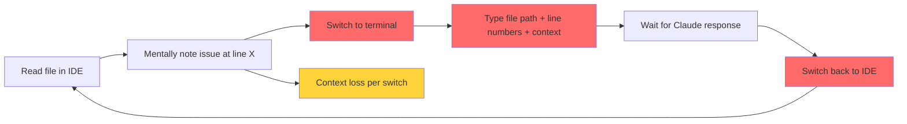
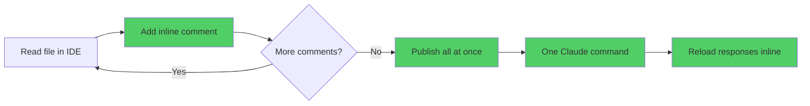
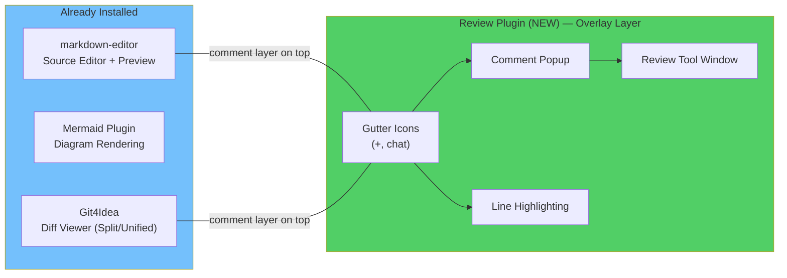
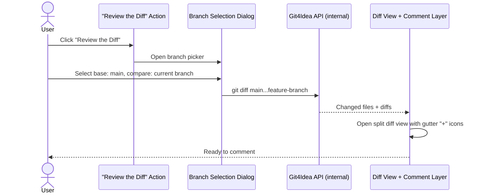
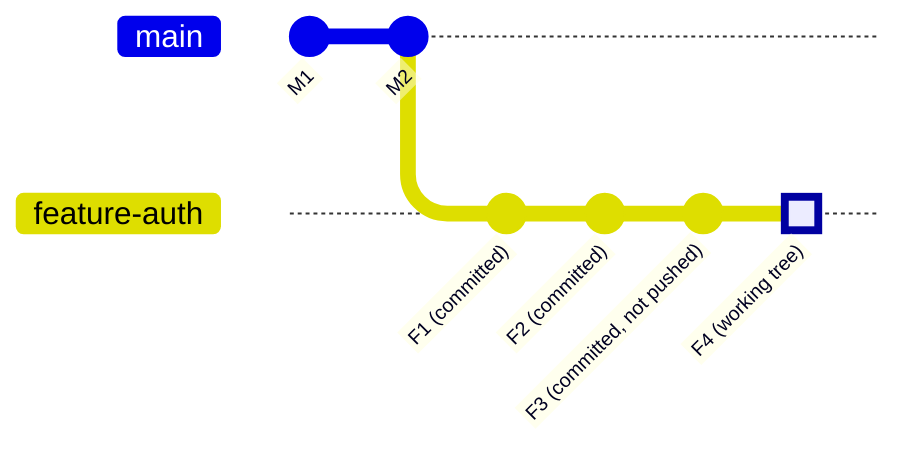
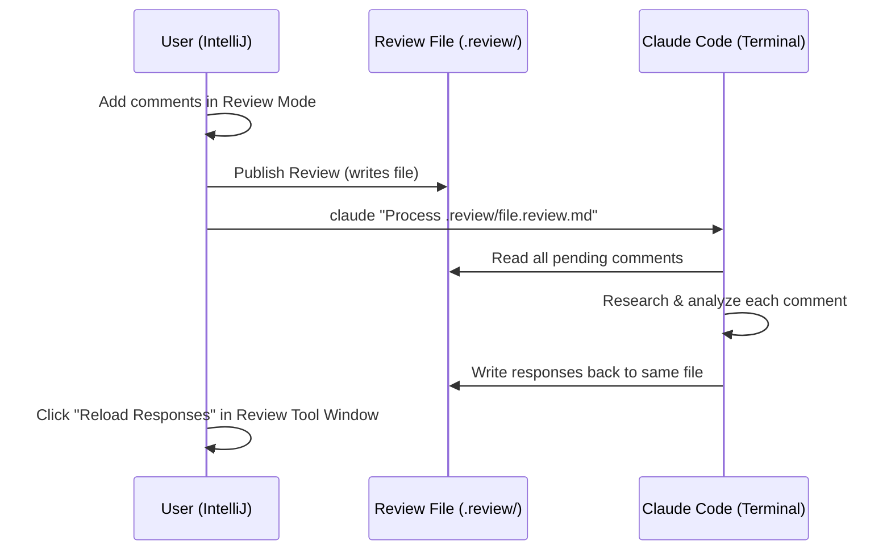
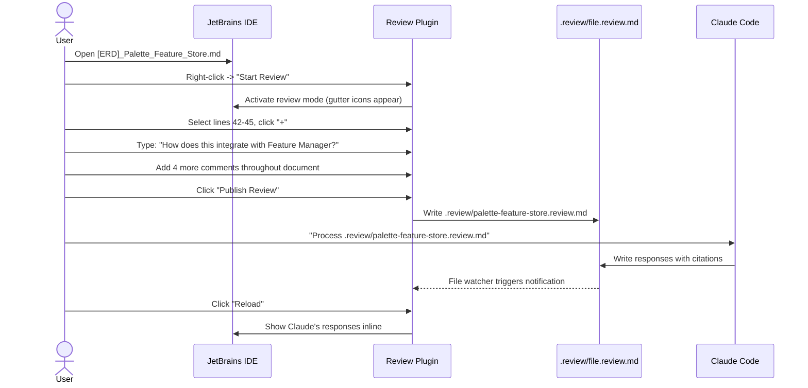
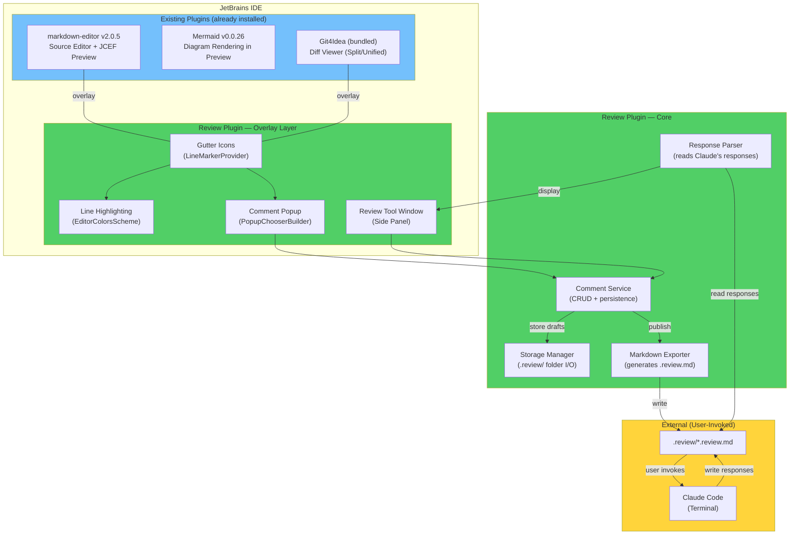

# [PRD] Claude Code Review - JetBrains Plugin for AI-Assisted Document & Code Review

**Status**: Draft
**Created**: 2026-02-13
**Owner**: Vinay Yerra

---

## Executive Summary

Build a JetBrains IDE plugin that provides a **Git-review-like experience** for reviewing Markdown documents and Git diffs with bidirectional Claude Code integration. The plugin adds inline commenting capabilities (gutter icons, comment popups, visual markers) to both Markdown files and Git diff views, publishes all comments to a single structured `.review/*.review.md` file, and enables Claude Code to process all comments in one batch and write responses back to the same file. The user never context-switches to the terminal per-comment — they review inline, publish once, invoke Claude once, and reload responses inline.

---

## Problem Statement

### Why This Matters

Engineers who use Claude Code for document and code reviews lose significant time to context-switching. Each comment requires: switching to the terminal, typing the file path, line numbers, and context, reading the response, switching back to the IDE, finding the next issue, and repeating. For a 20-comment review, this means 20+ terminal round-trips and 20-60 minutes of fragmented work.

### Current State



**Pain points:**
- ~2 minutes per comment (switching + typing + waiting)
- Context loss on every switch
- No way to batch multiple comments
- No persistent record of review conversations
- Manual tracking of line numbers and code snippets

### Desired State



**Result:** 20 comments reviewed in one batch, 85-90% time reduction.

---

## Intention

**Eliminate the context-switching tax on AI-assisted reviews.**

The core intention is to make reviewing documents and code with Claude Code feel like a native IDE experience — similar to GitHub PR reviews — where the user stays in their editor the entire time. Comments are collected visually, published in bulk, processed by Claude in a single pass, and responses appear inline without ever leaving the IDE.

This creates a **bidirectional review loop** through a single file, turning Claude Code from a "one question at a time" tool into a batch review partner.

---

## Goals

| # | Goal |
|---|------|
| G1 | Overlay inline commenting on the existing `markdown-editor` plugin's source editor (opt-in "Review this Markdown" action) |
| G2 | Overlay inline commenting on IntelliJ's built-in `Git4Idea` diff viewer (separate "Review the Diff" action) |
| G3 | Publish all comments to a single structured `.review/*.review.md` file |
| G4 | Enable Claude Code to process the review file and write responses back to it |
| G5 | Display Claude's responses inline in the IDE after reload |
| G6 | Provide Git-review-style UX: draft comments, publish, respond cycle |
| G7 | Work across all JetBrains IDEs (IntelliJ, PyCharm, WebStorm, GoLand, etc.) |

---

## Existing Plugin Dependencies

The review plugin does **NOT** implement its own Markdown rendering, Mermaid rendering, or diff viewer. It layers commenting capabilities on top of existing, already-installed plugins.

### Currently Installed (Both IntelliJ IDEA 2025.2 and PyCharm 2025.2)

| Plugin | ID | Version | Role |
|--------|----|---------|------|
| **Markdown Editor** | `markdown-editor` | `2.0.5` | Provides Markdown source editor + rendered preview pane (JCEF). The review plugin adds gutter icons and comment popups to this editor. |
| **Mermaid** | `Mermaid` | `0.0.26+IJ.252` | Renders Mermaid diagrams inside the Markdown preview. No direct interaction — review comments target the Mermaid source lines in the editor, not the rendered diagram. |
| **Git4Idea** | `Git4Idea` | Bundled | Provides IntelliJ's built-in diff viewer (split view, unified view, change markers). The review plugin adds a comment layer on top of this existing diff UI. |
| **Claude Code** | `claude-code-jetbrains-plugin` | `0.1.14-beta` | Already installed. User invokes Claude via terminal; plugin generates the review file Claude processes. |

### Integration Principle



The review plugin uses `LineMarkerProvider` (for gutter icons), `EditorColorsScheme` (for line highlighting), and `PopupChooserBuilder` (for comment dialogs) — all standard IntelliJ Platform APIs that work on any editor, including the `markdown-editor` source view and the `Git4Idea` diff view.

---

## Functional Requirements

### FR1: Markdown Review Mode — "Review this Markdown"

The plugin adds a comment layer on top of the existing `markdown-editor` plugin's source editor. It does NOT replace the editor, preview, or Mermaid rendering — it adds gutter icons and comment popups to the same editor the user already sees.

**Two Separate Menu Entry Points (not combined):**

| Menu Option | Where It Appears | What It Does |
|-------------|-----------------|--------------|
| **"Review this Markdown"** | Right-click context menu on any `.md` file (editor tab OR project tree) | Enters Markdown review mode for that file |
| **"Review the Diff"** | VCS menu, OR right-click a branch in the Git tool window | Enters Diff review mode (see FR2) |

These are independent actions. One does not imply the other.

**Activation & Deactivation:**

Review mode is **opt-in only**. Opening a Markdown file does NOT activate review mode. The user must explicitly choose to enter it.

| Action | How | Result |
|--------|-----|--------|
| **Enter review mode** | Right-click `.md` file -> **"Review this Markdown"** | Gutter icons appear, commenting enabled, Review Tool Window opens |
| **Exit review mode (keep drafts)** | Click "Exit Review" in the Review Tool Window, OR right-click -> "Stop Review" | Gutter icons disappear, draft comments are preserved for later |
| **Exit review mode (discard)** | Click "Exit Review" -> confirm "Discard N draft comments?" | Gutter icons disappear, draft comments deleted |
| **Publish and exit** | Click "Publish Review" | Comments written to `.review/*.review.md`, review mode deactivated |

The user can enter and exit review mode freely without being forced to publish or comment. Drafts persist across sessions (stored in `.review/.drafts/`) so the user can resume later.

**Status Bar:** When review mode is active, the status bar shows: `Review Mode: Active | 3 drafts`. When inactive, nothing is shown.

**Comment Interaction (only available in review mode):**

| Method | How |
|--------|-----|
| Gutter click | Click "+" icon in gutter -> opens comment dialog |
| Text selection | Select text -> right-click -> "Add Review Comment" |

**Comment Dialog Fields:**

| Field | Description |
|-------|-------------|
| Comment text | Multiline, supports basic Markdown |
| Auto-captured | Line numbers, selected text, timestamp |

**Visual Indicators (only visible in review mode):**

| Marker | Meaning |
|--------|---------|
| Blue "+" | Empty line, click to add comment |
| Blue chat icon | Line has a comment |

Comments are drafts until published. Light background highlighting marks commented lines. Hover shows comment preview. All visual indicators disappear when review mode is exited.

**Mermaid Diagram Commenting:** Mermaid diagrams are rendered by the `Mermaid` plugin in the preview pane. The review plugin comments on the **source Mermaid syntax lines** in the editor (e.g., line 45: `` ```mermaid ``), not on the rendered diagram. The comment context captures the Mermaid source so Claude can understand the diagram being discussed.

---

### FR2: Git Diff Review Mode — "Review the Diff"

The plugin adds a comment layer on top of IntelliJ's **built-in diff viewer** (provided by `Git4Idea`). It does NOT create a custom diff renderer — it uses the same split/unified diff view the user already knows, with GitHub-style comment icons added to the gutter.

**Activation (separate from Markdown review):**

| Action | Where |
|--------|-------|
| **VCS menu -> "Review the Diff"** | Top menu bar, under VCS/Git |
| **Right-click project root -> "Review the Diff"** | Project tree context menu |

The user does NOT need to manually open IntelliJ's Git log, find branches, or navigate the Git tool window. The plugin handles everything internally:

1. User clicks **"Review the Diff"**
2. Plugin opens the **Branch Selection Dialog** (see below)
3. User picks base and compare branches
4. Plugin internally runs `git diff <base>...<compare>` via the `Git4Idea` API
5. Plugin opens a **diff view with the comment layer already active** — file list on the left, split diff on the right, gutter "+" icons ready
6. User starts commenting immediately



**Deactivation:** Same as Markdown review — "Exit Review" button in the Review Tool Window, with option to keep or discard drafts.

**Branch Selection Dialog:**
- Base branch dropdown (e.g., `main`, `develop`)
- Compare branch dropdown (defaults to current branch, can select any local/remote branch)
- Shows number of changed files and total +/- stats
- Click "Start Review" to open the diff view

**Diff Scope — Full Branch Divergence:**

The diff includes **all changes** on the current branch since it forked from the base branch — not just staged or unstaged working tree changes.



| What's included in the diff | Git equivalent |
|-----------------------------|---------------|
| All commits on the branch since fork point | `git diff main...HEAD` |
| Plus any staged changes | `git diff --cached` |
| Plus any unstaged working tree changes | `git diff` |
| **Combined** | `git diff main` (compares current working tree to base) |

**This means:** If you fork from `main`, make 5 commits (some pushed, some not), and have uncommitted changes — the diff shows **everything** compared to `main`. This matches what a GitHub PR would show, plus your local uncommitted work.

**What's NOT shown:** Changes on `main` that happened after the fork point. The diff is one-directional: "what did my branch change relative to where it started?"

**Diff View (overlay on Git4Idea's built-in diff viewer):**
- Uses IntelliJ's existing `SimpleDiffRequest` / `DiffContentFactory` APIs
- Split view: base branch version (left) vs current branch + working tree (right)
- Plugin adds: gutter "+" icons on changed lines only (via `LineMarkerProvider`)
- Comments capture: file path, base branch, line number in new version, changed code snippet, change type (+, ~, -)

**File Navigation:**
- File list with `+X -Y` change stats per file
- Comment count per file
- Checkmark when file is reviewed

---

### FR3: Review Tool Window (Side Panel)

A shared side panel for both review modes.

**Sections:**

| Section | Content |
|---------|---------|
| Draft Comments | Unpublished comments with line number, type, preview. Actions: Edit, Delete, Jump to location |
| Published Reviews | Previously published review files |
| Status Bar | Comment count, review mode indicator |

**Sorting:** By line number (default) or timestamp.

**Publish Button:** Prominent "Publish Review" button that generates the `.review/*.review.md` file. On publish, the plugin copies the Claude command to the clipboard (e.g., `claude "Process .review/ARCHITECTURE_OVERVIEW.review.md"`) so the user can paste it directly into the terminal.

---

### FR4: Storage Format (Structured Markdown)

All reviews are stored as structured Markdown files in a `.review/` directory at the project root.

**File naming:**
- Markdown review: `.review/<markdown-file-name>.review.md` (e.g., `.review/ARCHITECTURE_OVERVIEW.review.md`)
- Diff review: `.review/<compare-branch-name>.review.md` (e.g., `.review/feature-user-auth.review.md`)

**Why Markdown:**
- Human-readable (can be edited manually)
- Claude-friendly (easy to parse and write)
- Version-controllable (git diffs show changes)
- Bidirectional (user writes comments, Claude writes responses in the same file)

**How Claude Knows Which Files to Read:**

The review file is **self-contained** — its header tells Claude exactly which source file(s) to read and where. Claude does not need any context beyond the `.review.md` file itself.

**Format A: Markdown Review Header**

```markdown
# Review: [ERD] Palette Feature Store

**Review Type**: Markdown
**Source File**: `reviews/palette-feature-store/[ERD]_Enabling_Palette_as_a_Feature_Store.md`
**Status**: Published
**Author**: vinay.yerra
**Published**: 2026-02-12T15:30:00Z
**Total Comments**: 5
```

Claude reads the `Source File` path and opens that file. Each comment then specifies exact line numbers within that file.

**Format B: Git Diff Review Header**

```markdown
# Review: Git Diff (main → feature-user-auth)

**Review Type**: Git Diff
**Base Branch**: main
**Compare Branch**: feature-user-auth
**Base Commit**: a1b2c3d
**Compare Commit**: e4f5g6h
**Author**: vinay.yerra
**Published**: 2026-02-12T16:00:00Z
**Total Comments**: 8
**Files Changed**: 5 (+247 -89)
```

Claude uses the branch/commit info to run `git diff main...feature-user-auth` or `git show` to see the actual changes. Each comment then specifies the **file path** and **line number in the new version**.

**Per-Comment Structure (both formats):**

Each comment includes enough context for Claude to answer without guessing:

```markdown
## Comment 1

**File**: `src/auth/UserAuthService.java`     ← which file (diff reviews; omitted for single-file Markdown reviews)
**Lines**: 127-133                             ← where in the file
**Author**: vinay.yerra
**Timestamp**: 2026-02-12T15:58:30Z

### User Comment
Why are we using SHA-256 instead of bcrypt for password hashing?

### Context (Selected Text)                    ← the actual text/code at those lines
` `` `
private String hashPassword(String password) {
    MessageDigest md = MessageDigest.getInstance("SHA-256");
    byte[] hash = md.digest(password.getBytes());
    return Base64.getEncoder().encodeToString(hash);
}
` `` `

### Claude Response
<!-- Claude writes response here -->

**Status**: 🔄 Pending
```

**What Claude gets from the review file (no guessing needed):**

| Field | What it tells Claude | Example |
|-------|---------------------|---------|
| `Source File` (header) | The document being reviewed | `reviews/.../[ERD]_Palette.md` |
| `Base Branch` / `Compare Branch` (header) | Which branches to diff | `main` → `feature-auth` |
| `File` (per comment) | Which file the comment is on | `src/auth/UserAuthService.java` |
| `Lines` (per comment) | Exact line numbers to read | `127-133` |
| `Context` (per comment) | The selected text/code snippet | Actual code or doc text |

Claude reads the header to understand the scope, then for each pending comment reads the source file at the specified lines (or uses the embedded context) to formulate a response.

**Status Indicators:**
- `🔄 Pending` - User comment, awaiting Claude response
- `✅ Resolved by Claude` - Claude provided response
- `⏭️ Skipped` - User marked as not needing response
- `❌ Rejected` - User disagreed with Claude's response

---

### FR5: Claude Code Integration (Bidirectional)

The plugin does NOT call Claude directly. Instead, it generates a structured file that the user passes to Claude via terminal.

**Workflow:**



**Claude processes each comment by:**
1. Reading the review file header to identify the source file(s) or branch diff
2. For each pending comment: opening the file at the specified lines (or using the embedded `Context` snippet)
3. Researching related systems if needed (using docs/)
4. Writing response with citations in the `### Claude Response` section
5. Updating status from `🔄 Pending` to `✅ Resolved by Claude`

Claude needs **only the `.review.md` file** to start — it contains all file paths, line numbers, and context snippets.

---

### FR6: Response Display & Comment Threads

After Claude processes the review file, the user clicks **"Reload Responses"** in the Review Tool Window (or re-enters review mode on the file).

- Claude's responses appear inline under each comment in the Review Tool Window
- Gutter icons update from pending to resolved
- **Comment threads**: The user can reply to Claude's response directly in the Review Tool Window. Replies are appended to the same comment section in the `.review.md` file and processed by Claude on the next invocation — creating a back-and-forth conversation thread per comment.

---

## Non-Functional Requirements

### NFR1: Performance

| Metric | Target |
|--------|--------|
| Publish review (20 comments) | < 1 second |
| Reload responses after Claude processes | < 2 seconds |
| Plugin memory footprint | < 50 MB |
| No UI freezing | File I/O and parsing on background threads |

### NFR2: Compatibility

- JetBrains IDE version: 2025.2+ (tested on IntelliJ IDEA 2025.2, PyCharm 2025.2)
- OS: macOS, Linux, Windows
- Java: 17+
- **Required plugins** (must be installed — plugin declares `<depends>` in `plugin.xml`):
  - `Git4Idea` — bundled with IntelliJ/PyCharm, provides diff viewer
  - `markdown-editor` v2.0.5+ — Markdown source editor + preview (user-installed)
  - `Mermaid` v0.0.26+ — Mermaid diagram rendering in preview (user-installed)
- The review plugin does NOT bundle or replace any of these — it layers on top

### NFR3: Data Safety

- `.review/` folder is gitignored (plugin auto-adds to `.gitignore` on first use)
- Does not modify source files — only creates/modifies files in `.review/`
- No data sent to external services (Claude invocation is manual and local)

---

## Use Cases

### UC1: Review a Design Document (ERD/RFC) with Claude

**Actor:** Engineer
**Precondition:** ERD document open in IntelliJ, Claude Code available in terminal



**Outcome:** 5 comments reviewed in one batch instead of 5 separate terminal sessions.

---

### UC2: Review a Feature Branch's Code Changes

**Actor:** Engineer
**Precondition:** Feature branch with code changes, IntelliJ with Git integration

1. VCS menu -> "Review Branch Changes"
2. Select base: `main`, compare: `feature-user-auth`
3. Plugin shows 5 changed files with +247 -89 stats
4. Engineer opens first file in diff view
5. Spots password hashing issue on line 127 -> clicks "+" -> types: "Why SHA-256 instead of bcrypt?"
6. Reviews remaining files, adds 7 more comments on security, validation, and best practices
7. Clicks "Publish Diff Review"
8. Runs: `claude "Process .review/diff-main-feature-user-auth-20260212.review.md"`
9. Claude analyzes code changes, writes responses with code suggestions
10. Reload in IntelliJ -> sees all 8 responses inline with the diff

**Outcome:** Pre-PR code review with AI assistance, catching issues before the PR is even created.

---

### UC3: Incremental Review (Add More Comments After Claude Responds)

**Actor:** Engineer
**Scenario:** Claude's response to Comment 1 raises a follow-up question

1. User reviews Claude's response to Comment 1 (status: `Resolved by Claude`)
2. Claude's answer mentions a dependency the user wasn't aware of
3. User starts a new review on the same document
4. Adds 2 follow-up comments referencing Claude's earlier response
5. Publishes a new review (or appends to existing file)
6. Invokes Claude again -> gets responses to follow-up questions
7. This creates a threaded conversation about the document

**Outcome:** Multi-round review conversations without losing context.

---

### UC4: Resume an Interrupted Review

**Actor:** Engineer
**Scenario:** User started adding comments but got pulled into a meeting

1. User has 7 draft comments (not yet published) on a Markdown file
2. User exits review mode ("Exit Review" -> keep drafts) and goes to meeting
3. Later, user reopens IntelliJ -> opens the same file
4. File opens normally (no review mode) — user reads and edits as usual
5. User right-clicks -> **"Review this Markdown"** to re-enter review mode
6. All 7 draft comments are restored with their original positions
7. User adds 3 more comments -> publishes all 10

**Outcome:** Draft comments persist across IDE sessions. No lost work.

---

### UC5: Review Architecture Documentation Before a Design Review Meeting

**Actor:** Tech Lead
**Scenario:** Tech lead needs to prepare feedback on an architecture doc before a team meeting

1. Opens `docs/uscorer/ARCHITECTURE_OVERVIEW.md`
2. Starts review mode
3. Reads through, adding questions about unclear integration points, suggestions for missing diagrams, and issues with outdated sections
4. Publishes review with 12 comments
5. Invokes Claude: "Process this review. For each question, reference the actual code in `/Users/vinay.yerra/Uber/fievel/risk/uscorer/`"
6. Claude responds with code-backed answers and citations
7. Tech lead now has a structured review document to bring to the meeting
8. Can share the `.review/*.review.md` file with the team

**Outcome:** Meeting prep reduced from 1+ hours of manual research to ~10 minutes.

---

### UC6: Self-Review Before Submitting a PR

**Actor:** Engineer
**Scenario:** Engineer wants Claude to review their own code changes before creating a PR

1. Finishes implementing a feature on branch `feature-auth-refactor`
2. VCS -> "Review Branch Changes" against `main`
3. Reviews their own changes, adding comments like:
   - "Is this the right pattern for error handling here?"
   - "Could this cause a race condition?"
   - "Should I add more test coverage for this path?"
4. Publishes diff review
5. Invokes Claude -> gets feedback on their own code
6. Fixes issues Claude identifies before the PR even exists
7. Fewer review rounds with teammates

**Outcome:** Higher-quality PRs, fewer review cycles.

---

### UC7: Review a Long Document Section by Section

**Actor:** Engineer
**Scenario:** 500-line document is too long to review in one sitting

1. User opens the document, starts review
2. Reviews the first 3 sections (lines 1-150), adds 6 comments
3. Publishes partial review -> invokes Claude -> gets responses
4. Next day, opens the same document
5. Starts a new review for sections 4-8 (lines 151-350), adds 8 comments
6. Publishes and invokes Claude
7. Both review files exist in `.review/` as a history of the review process

**Outcome:** Large documents can be reviewed incrementally without pressure to finish in one session.

---

### UC8: Review Inline Code Examples in Documentation

**Actor:** Engineer
**Scenario:** Documentation contains pseudocode or configuration examples that need validation

1. Opens an architecture doc with YAML config examples and pseudocode
2. Starts review
3. Selects a YAML config block -> adds comment: "Is this config schema still valid? Check against `base.yaml`"
4. Selects a pseudocode block -> adds comment: "Does the actual implementation in `CheckpointEvaluatorImpl.java` match this flow?"
5. Publishes and invokes Claude
6. Claude cross-references the documentation against actual code and responds with discrepancies

**Outcome:** Documentation accuracy verified against real code through structured review.

---

## Configuration & Settings

### Plugin Settings Page

```
+-------------------------------------------------------+
|  Claude Code Review Settings                          |
+-------------------------------------------------------+
|                                                       |
|  --- Review Storage ---                               |
|  Location:      [.review/ (project root)]             |
|  Git behavior:  .gitignored (auto-added)              |
|                                                       |
|  --- Keyboard Shortcuts ---                           |
|  Start Review:    [Ctrl+Shift+R]  [Change]            |
|  Add Comment:     [Ctrl+Shift+C]  [Change]            |
|  Publish Review:  [Ctrl+Shift+P]  [Change]            |
|  Reload Responses:[Ctrl+Shift+L]  [Change]            |
|                                                       |
+-------------------------------------------------------+
```

---

## Architecture Overview

### Integration Architecture



### Key Components

| Component | Responsibility |
|-----------|---------------|
| **CommentService** | CRUD operations for comments, manages draft state |
| **StorageManager** | Persists draft comments to `.review/` folder as JSON |
| **MarkdownExporter** | Generates structured `.review.md` files from comments |
| **ClaudeResponseParser** | Parses Claude's responses from the review file |
| **GutterIconProvider** | Renders comment markers in editor and diff gutters |
| **CommentPopupEditor** | Inline dialog for adding/editing comments |
| **ReviewToolWindow** | Side panel showing all comments and responses |

---

## Build Sequence

### Step 1: Foundation

- Plugin project setup (Gradle + IntelliJ Platform SDK)
- Comment data models and storage layer

### Step 2: Markdown Review Mode

- "Review this Markdown" action with gutter icons and comment popups
- Review Tool Window (side panel)
- Publish to `.review/<markdown-name>.review.md`

### Step 3: Claude Integration + Response Display

- Claude response parser (reads structured Markdown)
- "Reload Responses" action in Review Tool Window
- Response display inline under each comment
- Gutter icon status updates (pending -> resolved)

### Step 4: Git Diff Review Mode

- "Review the Diff" action with branch selection dialog
- Git4Idea API integration to compute diff and open diff view
- Comment support on changed lines in diff view
- Publish to `.review/<branch-name>.review.md`