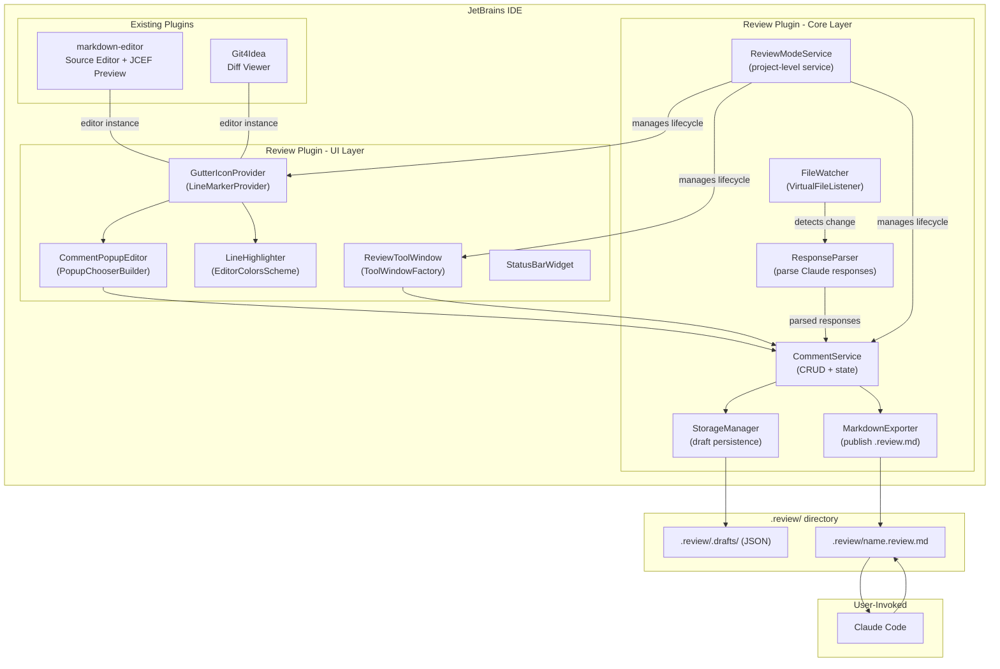
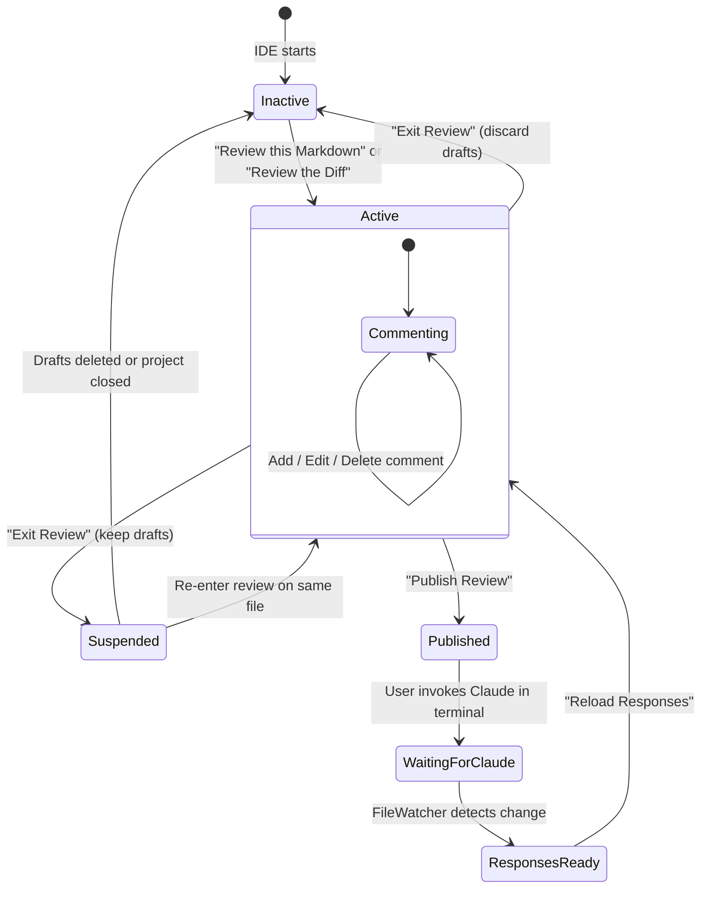
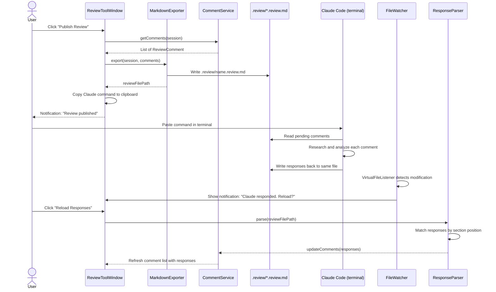
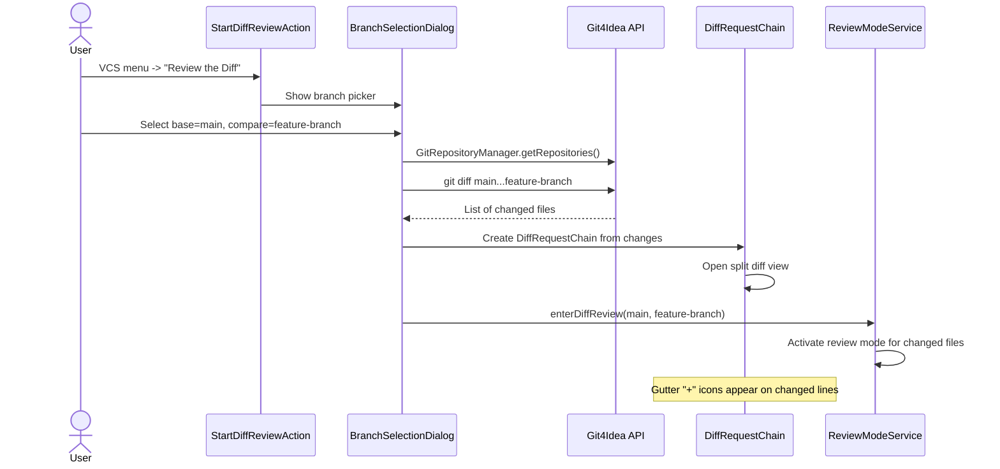
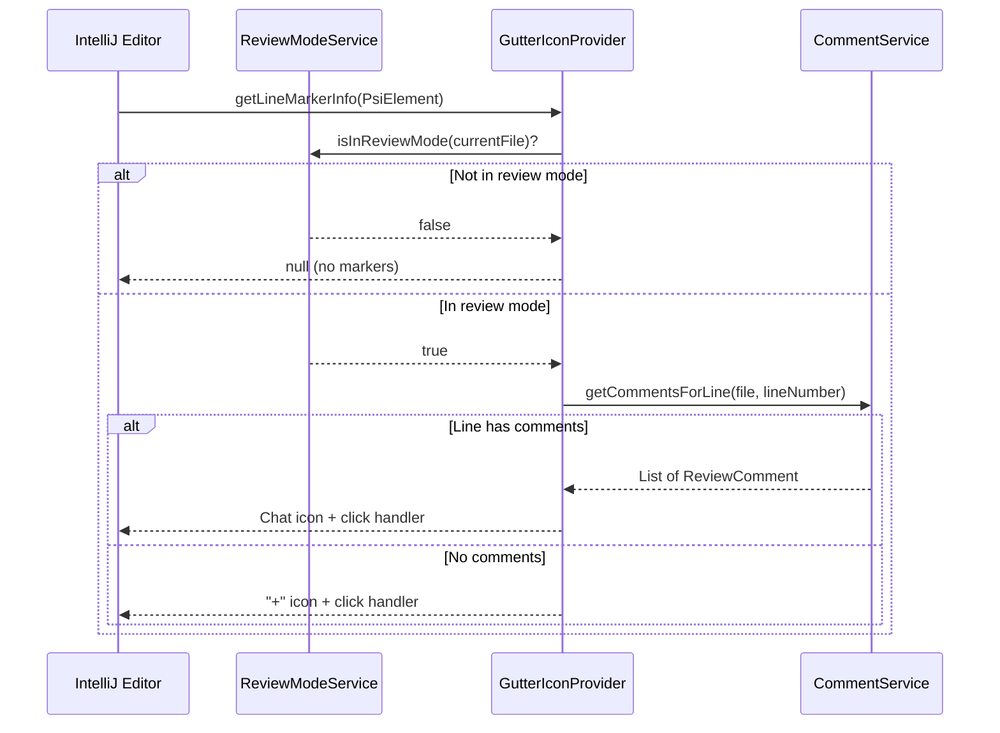

# Claude Code Review JetBrains Plugin - ERD

# Metadata

**Authors:** vinay.yerra@uber.com

**ERD uPlan URL:** [To be created]

**Project Summary:** A JetBrains IDE plugin that provides inline commenting on Markdown files and Git diffs with bidirectional Claude Code integration through structured `.review/*.review.md` files, eliminating context-switching overhead during AI-assisted reviews.

**Date started:** 2026-02-14

# Value Proposition

Engineers using Claude Code for document and code reviews lose significant time to context-switching. Each review comment requires switching to the terminal, manually typing file paths, line numbers, and context, reading the response, then switching back to the IDE to find the next issue. For a typical 20-comment review, this translates to 20+ terminal round-trips and 20-60 minutes of fragmented, inefficient work.

This plugin eliminates the context-switching tax by providing a native IDE review experience -- similar to GitHub PR reviews -- where comments are collected visually, published in bulk, processed by Claude in a single pass, and responses appear inline without ever leaving the IDE.

**Key Benefits:**

1. **85-90% reduction in review time** -- from 20-60 minutes (manual per-comment terminal workflow) to 2-5 minutes (batch publish, single Claude invocation, inline reload)
2. **Zero context-switching** -- all commenting, publishing, and response viewing happens within the IDE
3. **Persistent review records** -- structured `.review/*.review.md` files serve as durable, human-readable review artifacts
4. **Two review modes** -- supports both Markdown document review (ERDs, RFCs, architecture docs) and Git diff review (pre-PR code review)
5. **Bidirectional Claude integration** -- single file serves as the communication channel for both user comments and Claude responses

---

# Current Challenges to Achieving Value Proposition

The current review workflow with Claude Code is serial and manual. An engineer reads a document or diff in the IDE, mentally notes an issue at a specific line, switches to the terminal, types the file path, line numbers, and surrounding context as a natural language prompt, waits for Claude's response, then switches back to the IDE to continue reading. This cycle repeats for every comment, with approximately 2 minutes of overhead per comment due to context-switching and manual input.

There is no mechanism to batch multiple review comments into a single Claude interaction. Each question requires a separate terminal invocation with full context re-specification. Comments are not persisted -- if the engineer closes the terminal or IDE, all review context is lost. There is also no visual indication of which lines have been reviewed or commented on, making it easy to lose track of progress in large documents.

No previous tooling exists to solve this specific problem. Existing JetBrains plugins provide code review functionality for GitHub/GitLab PRs but do not support local AI-assisted review workflows. Claude Code's JetBrains plugin (`claude-code-jetbrains-plugin`) provides terminal integration but no inline commenting or batch review capabilities.

---

# Non-Goals

- **Claude prompt engineering** -- the plugin generates structured files for Claude to process; optimizing Claude's response quality is out of scope
- **Claude Code plugin integration** -- the plugin operates independently; it does not extend or modify the existing `claude-code-jetbrains-plugin`
- **JetBrains Marketplace publishing** -- initial distribution is local/team-internal only
- **Custom Markdown or diff rendering** -- the plugin overlays on existing editors (`markdown-editor`, `Git4Idea`), it does not replace them
- **Real-time Claude API calls** -- all Claude communication is file-based and user-initiated via terminal; no direct API calls from the plugin

---

# Proposal (High Level)

Build a JetBrains IDE plugin that adds an overlay commenting layer on top of existing editors (Markdown source editor and Git4Idea diff viewer). The plugin provides two independent review modes:

1. **Markdown Review** -- right-click any `.md` file to enter review mode, add inline comments via gutter icons and popups, publish all comments to a single `.review/<name>.review.md` file
2. **Git Diff Review** -- select base and compare branches via a branch picker dialog, open the diff view with comment overlay on changed lines, publish to a `.review/<branch>.review.md` file

The review file format is structured Markdown designed for bidirectional communication: the plugin writes user comments with file paths, line numbers, and context snippets; Claude reads the file, writes responses in designated sections, and updates status indicators. The user then reloads responses in the IDE via a file watcher notification.


The plugin never calls Claude directly. All communication flows through the `.review.md` file, keeping the plugin simple, offline-capable, and decoupled from Claude's API.

## Affected Parties

| Party | Impact |
|-------|--------|
| **Plugin users (engineers)** | Primary users. Must install the plugin and have `markdown-editor` and `Git4Idea` plugins available |
| **Claude Code** | No changes required. Claude processes `.review.md` files as standard Markdown input |
| **IntelliJ Platform** | No changes required. Plugin uses stable, public APIs (`LineMarkerProvider`, `VirtualFileListener`, `DiffContentFactory`) |

No breaking changes to any existing system. The plugin is additive and self-contained.

## Engineering Risk

**Risk Level:** Medium

**Mitigation:**

1. **IntelliJ API stability** -- Pin to stable, public API classes (e.g., `DiffContentFactory`, `LineMarkerProvider`). Avoid internal/experimental APIs that may change between IDE versions. Target IntelliJ Platform 2025.2+
2. **Comment position drift after file edits** -- Use IntelliJ's `RangeMarker` API, which automatically adjusts line positions as the document is edited. Persist adjusted positions on draft save
3. **Response parsing robustness** -- The `ResponseParser` uses lenient matching since the plugin controls the published format. Falls back to displaying raw file content if structured parsing fails
4. **Performance on large files** -- `LineMarkerProvider` checks `ReviewModeService.isInReviewMode()` first and returns `null` immediately for non-reviewed files. Comment positions are cached in memory
5. **Phased delivery** -- Plugin is built in 4 phases (Foundation, Markdown Review, Claude Integration, Git Diff Review). Phase 2+3 delivers a usable MVP before diff review support

---

# Design

## APIs and Data

### Review File Format

The plugin publishes comments to a structured Markdown file that serves as the bidirectional communication channel between the user and Claude. Two formats exist:

**Markdown Review Header:**

```markdown
# Review: [Document Title]

**Review Type**: Markdown
**Source File**: `path/to/source/document.md`
**Status**: Published
**Author**: vinay.yerra
**Published**: 2026-02-12T15:30:00Z
**Total Comments**: 5
```

**Git Diff Review Header:**

```markdown
# Review: Git Diff (main -> feature-branch)

**Review Type**: Git Diff
**Base Branch**: main
**Compare Branch**: feature-branch
**Base Commit**: a1b2c3d
**Compare Commit**: e4f5g6h
**Author**: vinay.yerra
**Published**: 2026-02-12T16:00:00Z
**Total Comments**: 8
**Files Changed**: 5 (+247 -89)
```

**Per-Comment Structure (both formats):**

```markdown
## Comment N

**File**: `src/path/to/file.java`
**Lines**: 127-133
**Author**: vinay.yerra
**Timestamp**: 2026-02-12T15:58:30Z

### User Comment
[User's review question or feedback]

### Context (Selected Text)
[Captured source text at the specified lines]

### Claude Response
<!-- Claude writes response here -->

**Status**: Pending
```

Claude reads the header to determine scope, then processes each pending comment by reading the source at the specified lines and writing a response. Status transitions from `Pending` to `Resolved by Claude`, `Skipped`, or `Rejected`.

### Data Model

```
ReviewSession:
  id:             UUID
  type:           MARKDOWN | GIT_DIFF
  status:         ACTIVE | SUSPENDED | PUBLISHED
  sourceFile:     VirtualFile          // for Markdown review
  baseBranch:     String?              // for diff review
  compareBranch:  String?              // for diff review
  comments:       List<ReviewComment>
  createdAt:      Instant
  publishedAt:    Instant?

ReviewComment:
  id:             UUID
  filePath:       String               // relative path
  startLine:      Int                  // 1-based
  endLine:        Int                  // 1-based
  selectedText:   String               // captured context
  commentText:    String               // user's comment
  status:         DRAFT | PENDING | RESOLVED | SKIPPED | REJECTED
  claudeResponse: String?
  changeType:     ADDED | MODIFIED | DELETED | null  // diff-specific
```

### Storage Strategy

The plugin uses a two-tier storage approach:

| Tier | Format | Purpose | Location |
|------|--------|---------|----------|
| **In-Memory** | `Map<FilePath, ReviewSession>` | Runtime state, fast access | JVM heap |
| **Draft Storage** | JSON (`kotlinx.serialization`) | Persist drafts across IDE restarts | `.review/.drafts/session-{uuid}.json` |
| **Published Storage** | Structured Markdown | Bidirectional Claude communication | `.review/<name>.review.md` |

Draft JSON files are auto-saved on every comment change. On IDE restart, `StorageManager` restores drafts from `.review/.drafts/`. The `.review/` directory is auto-added to `.gitignore` on first use.

## Integration Design for Dependencies

### IntelliJ Platform APIs

The plugin integrates with three IntelliJ subsystems via stable, public APIs:

| Subsystem | API Used | Purpose |
|-----------|----------|---------|
| **Editor Gutter** | `LineMarkerProvider` | Render "+" and chat icons in the editor gutter. Registered with `language=""` to apply to all file types; provider returns `null` for non-reviewed files |
| **Popups** | `JBPopupFactory.createComponentPopupBuilder()` | Display comment editor dialog on gutter click |
| **File System** | `VirtualFileManager.addVirtualFileListener()` | Watch `.review/` directory for external modifications (Claude writing responses) |
| **Tool Windows** | `ToolWindowFactory` | Side panel listing all draft/published comments with actions |
| **Status Bar** | `StatusBarWidgetFactory` | Show "Review Mode: Active | N drafts" indicator |
| **Background I/O** | `ApplicationManager.executeOnPooledThread()` | All file I/O runs on pooled threads to prevent UI freezing |

**Failure handling:** If the `LineMarkerProvider` throws an exception, IntelliJ suppresses it and the gutter renders without markers -- editing continues unaffected. File watcher failures result in a missed notification; users can manually click "Reload Responses."

### Git4Idea Integration

For diff review mode, the plugin uses IntelliJ's bundled Git4Idea APIs:

| API | Purpose |
|-----|---------|
| `GitRepositoryManager` | Get repository instance for the project |
| `GitBranchUtil` | List local and remote branches for the branch picker dialog |
| `GitLineHandler("diff")` | Compute diff between branches |
| `DiffContentFactory.create()` | Create diff content for IntelliJ's diff viewer |
| `DiffManager.showDiff()` | Open the diff viewer with the comment overlay active |

The diff scope is the full branch divergence plus working tree changes (`git diff base...compare` + uncommitted changes), matching what a GitHub PR would show plus local uncommitted work. Comments anchor to new-version line numbers (right side of split view).

### Claude Code Integration

The integration is file-based and fully decoupled:

1. **Publish** -- `MarkdownExporter` writes `.review/<name>.review.md` with all comments
2. **Clipboard** -- Plugin copies the Claude command to clipboard (e.g., `claude "Process .review/ARCHITECTURE_OVERVIEW.review.md"`)
3. **User invokes Claude** -- manually in terminal (single command)
4. **Claude writes responses** -- directly to the same `.review.md` file
5. **FileWatcher detects change** -- shows notification banner: "Claude responded. Reload?"
6. **ResponseParser** -- matches responses to comments by section position (Comment 1, Comment 2, etc.)

Comment threads are supported via `### User Reply` / `### Claude Response 2` sections appended to the same comment block.

## Critical Design Issues

**Comment position drift.** When a user edits a file while review mode is active, comment line numbers may become stale. The plugin uses IntelliJ's `RangeMarker` API, which automatically tracks document changes and adjusts positions. Adjusted positions are persisted on draft save.

**Concurrent session conflicts.** `ReviewModeService` enforces one active review session per file. Starting a new session on a file that already has an active session requires the user to close the existing one first.

**Response parsing failure.** If Claude's output deviates from the expected structure (e.g., missing `### Claude Response` headers), the parser falls back to displaying the raw file content. The format is robust because the plugin controls the published template and uses simple section-position matching rather than complex AST parsing.

**IDE version compatibility.** The plugin declares `<depends>` on `com.intellij.modules.platform`, `Git4Idea`, and `org.intellij.plugins.markdown`. If any dependency is missing, IntelliJ disables the plugin at startup with a clear error message.

## Monitoring, Rollout

**Success Metrics:**

- Review time per document (target: reduced from 20-60 min to 2-5 min)
- Comments per review session (tracks adoption and usage depth)
- Publish-to-reload cycle time (measures end-to-end workflow efficiency)
- Plugin error rate (exceptions in `LineMarkerProvider`, `FileWatcher`, `ResponseParser`)

**Rollout Strategy:**

- **Phase 1: Foundation** -- Plugin scaffold, data models, draft persistence, unit tests
- **Phase 2: Markdown Review (MVP)** -- Gutter icons, comment popups, publish to `.review.md`
- **Phase 3: Claude Integration** -- Response parser, file watcher, reload action, response display
- **Phase 4: Git Diff Review** -- Branch selection dialog, Git4Idea integration, diff commenting

Phase 2+3 delivers a fully usable Markdown review workflow. Phase 4 adds diff review as an incremental capability.

**Rollback:**

- The plugin is installed locally and can be disabled or uninstalled from Settings > Plugins at any time
- No server-side state or external dependencies to roll back
- `.review/` directory can be safely deleted without affecting source files

---

# Privacy and Security Considerations

N/A -- The plugin operates entirely locally within the JetBrains IDE. It does not send data to external services, does not process personal data, and does not make network calls. Claude Code invocation is manual and handled by the user's existing Claude Code terminal setup. The `.review/` directory is gitignored by default.

---

# APPENDIX

## Assumptions

1. Engineers have the `markdown-editor` plugin and `Git4Idea` (bundled) available in their JetBrains IDE
2. Claude Code is installed and accessible via terminal
3. Claude can process structured Markdown files and write responses back to the same file
4. The IntelliJ Platform APIs used (`LineMarkerProvider`, `VirtualFileListener`, `DiffContentFactory`) remain stable across 2025.2+ versions
5. Review sessions are single-user (no concurrent multi-user review of the same file)

## Alternatives

**Option 1: Direct Claude API Integration**
- **Pro**: No terminal context-switch needed; fully integrated experience
- **Con**: Requires API key management, network dependency, adds complexity and security surface
- **Rejected**: File-based approach is simpler, works offline, and leverages existing Claude Code terminal setup without additional authentication or API management

**Option 2: Custom Diff Renderer**
- **Pro**: Full control over diff UI and comment placement
- **Con**: Significant engineering effort to match IntelliJ's diff viewer quality; maintenance burden across IDE versions
- **Rejected**: Overlaying on Git4Idea's existing diff viewer provides the same UX with minimal code and automatic compatibility with IDE updates

**Option 3: JSON-Based Review Format**
- **Pro**: Easier to parse programmatically; strict schema validation
- **Con**: Not human-readable; not Claude-friendly (Markdown is Claude's native format); harder to manually inspect or edit
- **Rejected**: Structured Markdown is both human-readable and machine-parseable, and Claude processes Markdown natively

## FAQ

**Q: Does the plugin modify source files?**
A: No. The plugin only creates and modifies files in the `.review/` directory. Source files, Markdown documents, and Git history are never modified.

**Q: Can multiple review sessions exist simultaneously?**
A: Each file can have one active review session. Multiple files can be reviewed independently. Draft comments persist across IDE restarts.

**Q: What happens if Claude's response format is unexpected?**
A: The `ResponseParser` uses lenient matching. If structured parsing fails, the plugin shows the raw file content in the tool window, allowing the user to read Claude's response directly.

**Q: Does the plugin work across all JetBrains IDEs?**
A: Yes. The plugin depends on `com.intellij.modules.platform` (all JetBrains IDEs), `Git4Idea` (bundled in all IDEs), and `org.intellij.plugins.markdown` (installable in all IDEs). It works in IntelliJ IDEA, PyCharm, WebStorm, GoLand, and others.

**Q: Why not use the Claude Code JetBrains plugin's existing terminal integration?**
A: The existing plugin provides a terminal pane for interacting with Claude one question at a time. This plugin adds a fundamentally different interaction pattern: batch commenting with visual overlay, publish-once workflow, and inline response display. The two plugins are complementary.

## A.1 Component Architecture Diagram



## A.2 Review Mode State Machine



## A.3 Publish and Reload Sequence Flow



## A.4 Git Diff Review Sequence Flow



## A.5 Gutter Icon Interaction Flow


