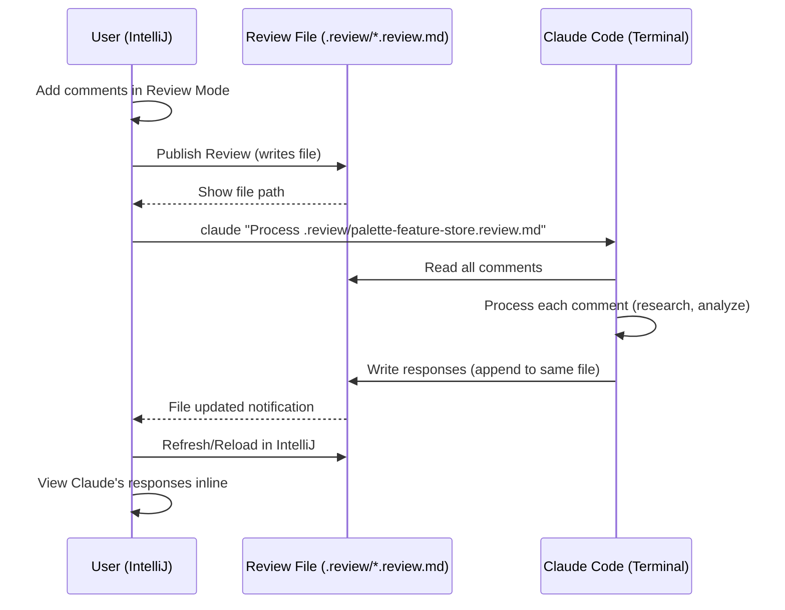

# IntelliJ Plugin Design: Universal Code Review Tool for Claude Code Integration

## Executive Summary

**Plugin Name**: Claude Code Review (working title)

**Purpose**: A Git-style review plugin for IntelliJ that eliminates context-switching overhead when collaborating with Claude Code. Supports two review modes:
1. **Markdown Review** - Review documentation files in-place
2. **Git Diff Review** - Review code changes between branches

**Key Innovation**: Bidirectional communication through a single `.review/*.review.md` file:
- User adds comments in IntelliJ → Publishes review
- Claude processes entire review in one command → Writes responses back to same file
- User reloads in IntelliJ → Sees all responses inline

**Time Savings**: 85-90% reduction in review time (from 20-60 min → 2-5 min per review)

**Tech Stack**: Gradle + IntelliJ Platform SDK + VCS/Git4Idea integration

---

## Context

**Problem**: Current review workflow requires:
1. Reading Markdown files in IntelliJ
2. Manually tracking comments/feedback locations (line numbers, content snippets)
3. Repeatedly switching to Claude Code terminal
4. Copy-pasting file paths, line numbers, and context each time for EACH comment
5. Loss of focus and time due to context switching

**Goal**: Create an IntelliJ plugin that provides a **Git-review-like experience** for:
1. **Markdown documents** - Review documentation inline
2. **Git diffs** - Review code changes against a branch

**Key Features**:
- Add/delete comments inline (like GitHub PR reviews)
- Publish all comments in one action
- Export to a single file that Claude can process
- Claude writes responses back to the same file
- Plugin can display Claude's responses

**Two Review Modes**:
- **Markdown Review**: In-place commenting on Markdown files
- **Git Diff Review**: Separate diff view with commenting on changed lines

**Current Review Structure** (from `reviews/` folder):
- Each review lives in `reviews/<project-name>/`
- Contains source documents (`[ERD]_*.md`, `*.docx`)
- Generates `UNDERSTANDING.md` with structured analysis
- Uses citations: `✅ From ERD (Lines X-Y)`, code references with `file:line`
- Heavy use of Mermaid diagrams and visual documentation

---

## Plugin Architecture

### Core Components

```
IntelliJ Plugin
├── 1. Markdown Annotation UI
│   ├── Gutter Icons (add comment markers)
│   ├── Inline Comment Editor (popup)
│   └── Comment Highlighting (visual indicators)
│
├── 2. Comment Storage Engine
│   ├── .review/ folder (hidden, per-project)
│   ├── JSON/YAML storage format
│   └── File path + line number + selection tracking
│
├── 3. Markdown Rendering
│   ├── Leverage existing Markdown plugin (if available)
│   └── OR custom renderer with comment overlays
│
└── 4. Claude Code Integration
    ├── Export to structured format
    ├── CLI command generation
    └── Batch comment processor
```

---

## Feature Specification (Git-Review Style)

### Phase 1: Review Mode UI

#### 1.1 Review Mode Activation
- **Trigger**: Right-click Markdown file → "Start Review" OR Toolbar button
- **Effect**:
  - Activates review mode for this file
  - Shows gutter add/delete icons
  - Opens Review Tool Window (side panel)
  - Status bar shows: "Review Mode: Active | 0 comments"

#### 1.2 Adding Comments (Git-style)
- **Method 1**: Click "+" icon in gutter → Opens comment dialog
- **Method 2**: Select text → Right-click → "Add Review Comment"
- **Comment Dialog**:
  - Type selection: Question | Issue | Suggestion | General
  - Comment text (multiline, supports basic Markdown)
  - Auto-captures: line numbers, selected text, timestamp
  - Buttons: Save, Cancel
- **Result**: Comment added to local list (NOT published yet)

#### 1.3 Visual Indicators (Before Publishing)
- **Gutter Icons**:
  - Blue "+" for empty lines (click to add comment)
  - Colored markers for lines with comments:
    - 🟡 Yellow question mark (?)
    - 🔴 Red exclamation (!)
    - 🟢 Green arrow (→)
    - 🔵 Blue comment (💬)
- **Highlighting**: Light background on commented lines
- **Hover**: Show comment preview on hover

#### 1.4 Review Tool Window (Side Panel)
- **Draft Comments Section**: All unpublished comments
  - Shows: Line number, type, preview of comment text
  - Actions: Edit, Delete, Jump to location
  - Sort by: Line number (default) or timestamp
- **Publish Button**: Big green "Publish Review" button
- **Status**: Shows count of draft comments

---

### Phase 2: Git Diff Review Mode

#### 2.1 Diff Review Activation
- **Trigger**: VCS menu → "Start Diff Review" OR Right-click branch → "Review Changes"
- **Branch Selection Dialog**:
  - Base branch: dropdown (e.g., `main`, `master`, `develop`)
  - Compare branch: dropdown or "Current branch"
  - Show: Number of changed files
- **Effect**:
  - Opens Diff Review Tool Window
  - Shows list of changed files with +/- stats
  - Opens first file in diff view automatically

#### 2.2 Diff View UI
- **Split View** (Similar to IntelliJ's built-in diff viewer):
  - Left: Base branch version
  - Right: Compare branch version
  - Middle: Line numbers + change markers (+/-)
  - Gutter: Add comment "+" icons on changed lines

#### 2.3 Adding Comments on Diff
- **On Changed Lines Only**: Can only comment on lines that were added/modified
- **Click "+" in gutter** → Opens comment dialog (same as Markdown review)
- **Comment captures**:
  - File path
  - Branch info (base vs compare)
  - Line number in **new version**
  - Changed code snippet
  - Type of change: added (+), modified (~), deleted (-)
- **Visual Marker**: Comment icon appears in gutter after adding

#### 2.4 Diff Review Tool Window
- **Files Tab**: List of changed files
  - Shows: File name, +X -Y changes, comment count
  - Click file → Opens in diff view
  - Checkmark when reviewed
- **Comments Tab**: All draft comments across all files
  - Group by file
  - Shows: File, line, type, preview
  - Actions: Edit, Delete, Jump to diff
- **Publish Button**: "Publish Diff Review"

#### 2.5 Publishing Diff Review
- Generates: `.review/diff-<base>-<compare>-<timestamp>.review.md`
- Example: `.review/diff-main-feature-branch-20260212.review.md`
- Format: Same structure as Markdown review, but includes git metadata

### Phase 3: Storage Format (Unified for Both Modes)

#### 2.1 File Structure
```
<project-root>/.review/
├── <document-name>.review.md            # Single review file per document
├── <document-name>.review.md            # (multiple documents = multiple files)
└── .reviewconfig                        # Plugin settings (optional)
```

**Example**: Reviewing `reviews/palette-feature-store/[ERD]_*.md` creates:
- `.review/palette-feature-store.review.md`

#### 3.2 Review File Format (Structured Markdown)

**Format A: Markdown Document Review**

**Why Markdown?**
- Human-readable (can edit manually if needed)
- Claude-friendly (easy to parse and write)
- Version-controllable (git diff shows changes)
- Can embed code blocks, formatting
- Bidirectional: User writes comments, Claude writes responses

**Format Structure**:
```markdown
# Review: [ERD] Palette Feature Store

**Source File**: `reviews/palette-feature-store/[ERD]_Enabling_Palette_as_a_Feature_Store_in_Mastermind.md`
**Status**: Published
**Author**: vinay.yerra
**Published**: 2026-02-12T15:30:00Z
**Total Comments**: 5

---

## Comment 1

**Lines**: 42-45
**Type**: Question
**Author**: vinay.yerra
**Timestamp**: 2026-02-12T15:28:12Z

### User Comment
How does this integrate with existing Feature Manager? Need to clarify the boundary between systems.

### Context (Selected Text)
```
The proposed feature store architecture enables Palette to serve as a
centralized feature computation and storage layer for Mastermind decisions.
```

### Claude Response
<!-- Claude writes response here after processing -->

> Based on Feature Manager architecture (docs/feature-manager/ARCHITECTURE_02.md:156-234):
>
> The integration boundary is as follows:
> 1. **Feature Manager** remains responsible for feature metadata and versioning
> 2. **Palette Feature Store** handles runtime feature computation and caching
> 3. The connection point is through the Feature Registry API
>
> See detailed flow diagram in UNDERSTANDING.md section 4.2.

**Status**: ✅ Resolved by Claude

---

## Comment 2

**Lines**: 78-82
**Type**: Issue
**Author**: vinay.yerra
**Timestamp**: 2026-02-12T15:29:45Z

### User Comment
The caching strategy doesn't account for TTL variations across different feature types. This could cause inconsistent behavior.

### Context (Selected Text)
```
All features are cached with a uniform TTL of 5 minutes to ensure
consistency across the platform.
```

### Claude Response
<!-- Claude writes response here -->

**Status**: 🔄 Pending

---

## Comment 3

**Lines**: 120-125
**Type**: Suggestion
**Author**: vinay.yerra
**Timestamp**: 2026-02-12T15:31:02Z

### User Comment
Consider adding circuit breaker pattern here to prevent cascade failures when Palette is down.

### Context (Selected Text)
```
When a feature computation fails, the system retries up to 3 times
before falling back to the default value.
```

### Claude Response
<!-- Claude writes response here -->

**Status**: 🔄 Pending

---

<!-- More comments follow same structure -->
```

---

**Format B: Git Diff Review**

```markdown
# Review: Git Diff (main → feature-user-auth)

**Review Type**: Git Diff
**Base Branch**: main
**Compare Branch**: feature-user-auth
**Base Commit**: a1b2c3d
**Compare Commit**: e4f5g6h
**Author**: vinay.yerra
**Published**: 2026-02-12T16:00:00Z
**Total Comments**: 8
**Files Changed**: 5 (+247 -89)

---

## File: src/auth/UserAuthService.java

**Changes**: +45 -12

### Comment 1

**Line**: 127 (new version)
**Change Type**: Added
**Author**: vinay.yerra
**Type**: Question
**Timestamp**: 2026-02-12T15:58:30Z

#### User Comment
Why are we using SHA-256 instead of bcrypt for password hashing? bcrypt is more secure for passwords.

#### Context (Changed Code)
```diff
+ import java.security.MessageDigest;
+
+ private String hashPassword(String password) {
+     MessageDigest md = MessageDigest.getInstance("SHA-256");
+     byte[] hash = md.digest(password.getBytes());
+     return Base64.getEncoder().encodeToString(hash);
+ }
```

#### Claude Response
<!-- Claude writes response here -->

**Status**: 🔄 Pending

---

### Comment 2

**Line**: 156 (new version)
**Change Type**: Modified
**Author**: vinay.yerra
**Type**: Issue
**Timestamp**: 2026-02-12T15:59:12Z

#### User Comment
This method is missing input validation. Need to check for null/empty email before processing.

#### Context (Changed Code)
```diff
- public User authenticate(String email, String password) {
+ public User authenticate(String email, String password) throws AuthException {
      User user = userRepository.findByEmail(email);
-     if (user != null && user.getPassword().equals(password)) {
+     if (user != null && verifyPassword(password, user.getPasswordHash())) {
          return user;
      }
-     return null;
+     throw new AuthException("Invalid credentials");
  }
```

#### Claude Response
<!-- Claude writes response here -->

**Status**: 🔄 Pending

---

## File: src/auth/AuthenticationFilter.java

**Changes**: +67 -23

### Comment 3

**Line**: 89 (new version)
**Change Type**: Added
**Author**: vinay.yerra
**Type**: Suggestion
**Timestamp**: 2026-02-12T16:00:45Z

#### User Comment
Consider adding rate limiting here to prevent brute force attacks.

#### Context (Changed Code)
```diff
+ public void doFilter(ServletRequest request, ServletResponse response, FilterChain chain) {
+     String authHeader = ((HttpServletRequest) request).getHeader("Authorization");
+     if (authHeader != null && authHeader.startsWith("Bearer ")) {
+         String token = authHeader.substring(7);
+         validateToken(token);
+     }
+     chain.doFilter(request, response);
+ }
```

#### Claude Response
<!-- Claude writes response here -->

**Status**: 🔄 Pending

---

<!-- More comments follow same structure -->
```

#### 3.3 Status Indicators
- `🔄 Pending` - User comment, awaiting Claude response
- `✅ Resolved by Claude` - Claude provided response
- `⏭️ Skipped` - User marked as not needing response
- `❌ Rejected` - User disagreed with Claude's response

#### 3.4 Claude's Response Template

When Claude processes a comment, it should:

1. **Read the comment context** (lines, selected text, question)
2. **Research** the source document and related systems
3. **Write response** following this template:

```markdown
### Claude Response

> [Detailed response with citations]
>
> **Referenced Systems**: docs/system-name/ARCHITECTURE*.md:lines
> **Code Locations**: path/to/file.java:lines
>
> [Explanation, diagrams if needed, direct answers]

**Status**: ✅ Resolved by Claude
```

**Response Guidelines for Claude**:
- Use existing citation format: `✅ From System Docs: path:lines`
- Include Mermaid diagrams when explaining flows
- Reference actual code locations with line numbers
- Keep responses concise but complete
- Update status from `🔄 Pending` to `✅ Resolved by Claude`

### Phase 4: Claude Code Integration (Bidirectional)

#### 4.1 Workflow: User → Claude → User (Both Review Types)



#### 4.2 Claude's Processing Instructions

**For Markdown Reviews**: `"Process .review/palette-feature-store.review.md"`

When Claude receives a Markdown review file, it should:

1. **Read the review file** - Parse all comments with "Pending" status
2. **For each comment**:
   - Read the original source document at specified lines
   - Research related systems (using existing docs/)
   - Generate detailed response with citations
   - Write response in the `### Claude Response` section
   - Update status from `🔄 Pending` to `✅ Resolved by Claude`
3. **Save the file** - All responses added to the same `.review/*.review.md` file

**Example Claude Command** (Markdown Review):
```bash
# User runs this ONCE after publishing review
claude "Read and process all comments in .review/palette-feature-store.review.md. For each comment, research the original document and related systems, then write your response directly in the file under 'Claude Response'. Update status to resolved when done."
```

---

**For Git Diff Reviews**: `"Process .review/diff-main-feature-branch-20260212.review.md"`

When Claude receives a Git diff review file, it should:

1. **Read the review file** - Parse all comments with "Pending" status
2. **For each comment**:
   - Check out the compare branch (or examine the diff)
   - Read the actual code at the specified file and line
   - Review the change in context (surrounding code, file structure)
   - Analyze for: security issues, best practices, performance, maintainability
   - Write detailed response with code suggestions if applicable
   - Update status from `🔄 Pending` to `✅ Resolved by Claude`
3. **Save the file** - All responses added to the same `.review/*.review.md` file

**Example Claude Command** (Git Diff Review):
```bash
# User runs this ONCE after publishing diff review
claude "Read and process all code review comments in .review/diff-main-feature-branch-20260212.review.md. For each comment, examine the actual code changes, analyze for issues (security, performance, best practices), and write your response with suggestions. Update status when done."
```

**Special Handling for Diff Reviews**:
- Claude should use `git show` or `git diff` to see the actual changes
- Include code suggestions in responses using diff format
- Reference related files if the change impacts other parts of the system
- Point out missing tests, documentation, or error handling

#### 4.3 Plugin Actions (For Both Review Types)

| Action | Trigger | Result | Applies To |
|--------|---------|--------|------------|
| **Start Markdown Review** | Right-click MD file → "Start Review" | Activates comment UI, shows gutter icons | Markdown |
| **Start Diff Review** | VCS → "Review Branch Changes" | Opens diff view with file list | Git Diff |
| **Add Comment** | Click "+" in gutter | Opens comment dialog, adds to pending | Both |
| **Delete Comment** | Click "×" on comment | Removes comment before publish | Both |
| **Publish Review** | Button in Review panel | Writes `.review/<name>.review.md` file | Both |
| **Reload Responses** | Button/Auto-refresh | Re-reads review file, shows Claude's responses | Both |
| **Mark Resolved** | User manually updates status | Changes status emoji in file | Both |
| **Navigate Files** | Click in file list (diff only) | Opens next changed file in diff view | Git Diff |

#### 4.4 Response Display in IntelliJ (Both Review Types)

After Claude writes responses, plugin displays them:
- **Inline in Review Panel**: Show Claude's response under each comment
- **Gutter Icon Update**: Change icon from 🔄 (pending) to ✅ (resolved)
- **Notification**: "Claude has responded to 5 comments in palette-feature-store.review.md"

### Phase 5: UI Rendering Strategies

#### 5.1 Markdown Review Rendering
- **Leverage IntelliJ's Editor**: Use standard editor with comment overlays
- **No custom rendering needed**: Just add gutter icons and highlighting
- **Optional**: If Markdown plugin installed, comments work with preview mode too

#### 5.2 Git Diff Review Rendering
- **Leverage IntelliJ's Diff Viewer**: Use built-in diff infrastructure
  - `DiffContentFactory` for creating diff content
  - `DiffRequest` for diff comparison
  - `LineMarkerProvider` for comment icons in diff gutter
- **No custom diff rendering needed**: IntelliJ already has excellent diff UI
- **Extension**: Add comment layer on top of existing diff view

**Key Advantage**: Both modes leverage existing IntelliJ infrastructure, minimal custom UI work.

---

## Implementation Phases (Incremental Approach)

To minimize risk and enable early testing, implement in phases:

### Phase 1: Foundation (Week 1)
- ✅ Set up Gradle project with IntelliJ Platform Plugin
- ✅ Create basic plugin structure (plugin.xml, actions)
- ✅ Implement comment data models
- ✅ Implement storage layer (CommentStorageManager)
- ✅ Write unit tests for storage
- **Deliverable**: Plugin loads in IntelliJ, can store/retrieve comments

### Phase 2: Markdown Review Mode (Week 2)
- ✅ Implement Markdown review activation
- ✅ Add gutter icon providers for comments
- ✅ Create comment popup editor
- ✅ Implement Review Tool Window (UI)
- ✅ Add publish functionality → generates `.review/*.review.md`
- **Deliverable**: Can review Markdown files, publish to file

### Phase 3: Claude Integration (Week 3)
- ✅ Implement Markdown exporter (structured format)
- ✅ Test Claude processing workflow (manual command)
- ✅ Implement Claude response parser
- ✅ Add file watcher for auto-reload
- ✅ Display Claude responses in UI
- **Deliverable**: Full Markdown review workflow with Claude responses

### Phase 4: Git Diff Review Mode (Week 4)
- ✅ Implement diff review action (VCS menu)
- ✅ Create branch selection dialog
- ✅ Integrate with Git4Idea for diff extraction
- ✅ Add comment support in diff view
- ✅ Extend exporter for diff format
- **Deliverable**: Can review git diffs, publish, get Claude feedback

### Phase 5: Polish & Testing (Week 5)
- ✅ Comprehensive manual testing with real reviews
- ✅ Performance optimization (large files/diffs)
- ✅ Add keyboard shortcuts
- ✅ Improve UI/UX based on feedback
- ✅ Write documentation (README, usage guide)
- **Deliverable**: Production-ready plugin

---

## Implementation Plan (Detailed)

### Critical Files to Create

1. **Plugin Descriptor** - `src/main/resources/META-INF/plugin.xml`
   - Define plugin metadata, actions, extensions
   - Register editors, tool windows, VCS integrations
   - Declare dependencies: VCS, Git integration

2. **Core Services**
   - `ReviewCommentService.java` - Comment CRUD operations (both types)
   - `CommentStorageManager.java` - File I/O for .review/ folder
   - `MarkdownExporter.java` - Generate .review.md files
   - `ClaudeResponseParser.java` - Parse Claude responses from file

3. **UI Components - Markdown Review**
   - `MarkdownReviewGutterIconProvider.java` - Gutter icons in Markdown editor
   - `CommentPopupEditor.java` - Inline comment dialog (shared)
   - `ReviewToolWindow.java` - Side panel for both review types
   - `CommentHighlighter.java` - Visual highlighting for commented lines

4. **UI Components - Git Diff Review**
   - `DiffReviewAction.java` - VCS menu action to start diff review
   - `DiffReviewDialog.java` - Branch selection dialog
   - `DiffViewWithComments.java` - Custom diff view with comment support
   - `DiffCommentGutterIconProvider.java` - Gutter icons in diff view

5. **Actions**
   - `StartMarkdownReviewAction.java` - Right-click MD → Start Review
   - `StartDiffReviewAction.java` - VCS → Review Branch Changes
   - `AddCommentAction.java` - Add comment (both modes)
   - `PublishReviewAction.java` - Publish all comments
   - `ReloadResponsesAction.java` - Reload after Claude processes

6. **Models**
   - `Comment.java` - Comment data class
   - `ReviewSession.java` - Review session (tracks state)
   - `DiffReviewContext.java` - Git-specific context (branches, commits)

7. **Build Configuration**
   - `build.gradle.kts` - Gradle plugin for IntelliJ Platform
   - Dependencies: IntelliJ Platform SDK, Git4Idea (VCS integration)

### Project Structure

```
intellij-code-review-plugin/
├── build.gradle.kts                    # Gradle build for IntelliJ plugin
├── settings.gradle.kts
├── gradle.properties
├── src/
│   ├── main/
│   │   ├── java/com/uber/risk/review/
│   │   │   ├── services/
│   │   │   │   ├── ReviewCommentService.java
│   │   │   │   ├── CommentStorageManager.java
│   │   │   │   ├── MarkdownExporter.java
│   │   │   │   └── ClaudeResponseParser.java
│   │   │   ├── ui/
│   │   │   │   ├── markdown/
│   │   │   │   │   ├── MarkdownReviewGutterIconProvider.java
│   │   │   │   │   └── MarkdownReviewMode.java
│   │   │   │   ├── diff/
│   │   │   │   │   ├── DiffReviewAction.java
│   │   │   │   │   ├── DiffReviewDialog.java
│   │   │   │   │   ├── DiffViewWithComments.java
│   │   │   │   │   └── DiffCommentGutterIconProvider.java
│   │   │   │   ├── shared/
│   │   │   │   │   ├── CommentPopupEditor.java
│   │   │   │   │   ├── ReviewToolWindow.java
│   │   │   │   │   └── CommentHighlighter.java
│   │   │   ├── actions/
│   │   │   │   ├── StartMarkdownReviewAction.java
│   │   │   │   ├── StartDiffReviewAction.java
│   │   │   │   ├── AddCommentAction.java
│   │   │   │   ├── PublishReviewAction.java
│   │   │   │   └── ReloadResponsesAction.java
│   │   │   └── models/
│   │   │       ├── Comment.java
│   │   │       ├── ReviewSession.java
│   │   │       ├── ReviewType.java (enum: MARKDOWN, GIT_DIFF)
│   │   │       └── DiffReviewContext.java
│   │   ├── kotlin/                     # (If using Kotlin instead)
│   │   └── resources/
│   │       ├── META-INF/
│   │       │   └── plugin.xml
│   │       └── icons/
│   │           ├── comment-question.svg
│   │           ├── comment-issue.svg
│   │           ├── comment-suggestion.svg
│   │           ├── comment-general.svg
│   │           ├── review-mode.svg
│   │           └── publish-review.svg
│   └── test/
│       └── java/com/uber/risk/review/
│           ├── services/
│           │   ├── CommentStorageManagerTest.java
│           │   └── MarkdownExporterTest.java
│           └── integration/
│               ├── MarkdownReviewIntegrationTest.java
│               └── DiffReviewIntegrationTest.java
└── README.md
```

### Build System Choice

**Gradle + IntelliJ Platform Plugin** (Recommended)
- Industry standard for IntelliJ plugin development
- Plugin: `org.jetbrains.intellij` - provides all necessary tooling
- Separate from existing Bazel monorepo (keeps concerns separate)
- Easy to test and publish

**Not Using Bazel** because:
- No existing Bazel rules for IntelliJ plugin development in the workspace
- Gradle is the standard for IntelliJ plugins
- Keeps plugin development isolated from main monorepo

---

## Technology Stack

| Component | Technology | Rationale |
|-----------|------------|-----------|
| **Build System** | Gradle 8.x + IntelliJ Platform Plugin | Standard for IntelliJ plugins |
| **Language** | Java 17+ (or Kotlin) | IntelliJ SDK compatibility |
| **Storage Format** | JSON (Gson or Jackson) | Simple, readable, extensible |
| **Markdown Parsing** | Existing IntelliJ Markdown Plugin API | Avoid reimplementation |
| **UI Framework** | IntelliJ Platform SDK (Swing) | Native integration |
| **Testing** | JUnit 5 + IntelliJ Platform Test Framework | Standard testing stack |

---

## User Workflow Example

### Current Workflow (Manual - Painful!)
1. Open `reviews/palette-feature-store/[ERD]_*.md` in IntelliJ
2. Read line 42-45, find issue
3. Switch to terminal
4. Type: `claude "In reviews/palette-feature-store/[ERD]_*.md lines 42-45, the section about 'The proposed feature store architecture' - how does this integrate with existing Feature Manager?"`
5. **Switch back to IntelliJ**, read next section
6. **Switch to terminal again**, type next question
7. **Repeat 10-20 times** for a single document review
8. **Time wasted**: ~2 min per comment = 20-40 min per document

### New Workflow - Markdown Review (Git-Review Style)
1. Open `reviews/palette-feature-store/[ERD]_*.md` in IntelliJ
2. Right-click → **"Start Markdown Review"**
3. Select lines 42-45 → Click "+" icon → Type: "How does this integrate with existing Feature Manager?"
4. Continue adding comments throughout document (visual markers show all comments)
5. Click **"Publish Review"** → Generates `.review/palette-feature-store.review.md`
6. **One-time switch to terminal**: `claude "Process .review/palette-feature-store.review.md"`
7. Claude reads ALL comments, writes responses back to the SAME file
8. Notification in IntelliJ → Click **"Reload Responses"** → See Claude's responses inline
9. **Time saved**: 90% reduction, from 20-40 min → 2-4 min

### New Workflow - Git Diff Review
1. VCS menu → **"Review Branch Changes"**
2. Select base branch (`main`) and compare branch (`feature-user-auth`)
3. Plugin opens diff view with list of changed files
4. Review first file → Click "+" on changed lines → Add comments
5. Navigate through files, adding comments on issues/questions
6. Click **"Publish Diff Review"** → Generates `.review/diff-main-feature-user-auth-20260212.review.md`
7. **One-time switch to terminal**: `claude "Process .review/diff-main-feature-user-auth-20260212.review.md"`
8. Claude analyzes code changes, writes responses (security, best practices, suggestions)
9. Notification → **"Reload Responses"** → See Claude's code review feedback inline
10. **Time saved**: From 30-60 min of manual context switching → 3-5 min

---

## Integration with Existing Review Process

### How It Fits
- **Input**: Markdown documents in `reviews/<project-name>/`
- **Output**: Structured comments in `.review/` folder
- **Export**: Markdown format matching existing `UNDERSTANDING.md` style
- **Claude Integration**: Batch-friendly format for terminal consumption

### Compatibility
- Does not modify existing review structure
- `.review/` folder can be gitignored (or committed for team reviews)
- Exports can be included in `UNDERSTANDING.md` as "Review Comments" section
- Follows existing citation pattern: file path + line numbers

---

## Next Steps for Implementation

1. **Setup Plugin Project**
   - Create new Gradle project with `org.jetbrains.intellij` plugin
   - Configure for IntelliJ 2024.x (or version user is running)

2. **Implement Storage Layer**
   - Comment model (POJO)
   - JSON serialization/deserialization
   - File system operations (.review/ folder management)

3. **Build UI Components**
   - Gutter icon provider (simplest visual indicator)
   - Comment popup editor
   - Tool window for comment list

4. **Add Actions**
   - Right-click context menu action
   - Export actions (Markdown, CLI, JSON)

5. **Testing**
   - Unit tests for storage layer
   - Integration tests for UI components
   - Manual testing with actual review documents

6. **Publish**
   - Package as plugin JAR
   - Install locally in IntelliJ
   - (Optional) Publish to JetBrains Marketplace

---

## Design Decisions Made

✅ **Storage Format**: Structured Markdown (`.review/*.review.md`)
- Human-readable, Claude-friendly, version-controllable
- Bidirectional: User writes comments, Claude writes responses in same file

✅ **Workflow**: Git-review style (Publish all at once)
- Enter Review Mode → Add/Delete Comments → Publish → Claude processes → View responses

✅ **Integration**: Single-file processing
- User runs one Claude command per review file
- Claude reads all comments, writes all responses to same file
- Plugin reloads to display responses

## Recommended Architectural Decisions

Based on the requirements and existing IntelliJ plugin best practices:

### 1. **Language Choice: Kotlin**
**Recommendation**: Use Kotlin
- ✅ Official JetBrains language for IntelliJ plugins
- ✅ Less boilerplate code (50% less code than Java)
- ✅ Null safety prevents common bugs
- ✅ Better IDE support in IntelliJ
- ✅ Modern coroutines for async operations (file watchers)
- ❌ Slightly larger plugin size

**Alternative**: Java would work but requires more code for same functionality.

### 2. **Markdown Plugin Dependency: Standalone**
**Recommendation**: Standalone (no dependency)
- ✅ Simpler installation - works out of the box
- ✅ No dependency conflicts
- ✅ Comment functionality doesn't need Markdown rendering
- ✅ Users can have Markdown plugin installed separately if they want preview
- ❌ Can't integrate with Markdown preview pane (minor loss)

### 3. **Auto-refresh Behavior: File Watcher with Notification**
**Recommendation**: File watcher + notification
- ✅ Detects when Claude modifies `.review/*.review.md`
- ✅ Shows notification: "Claude has responded to X comments. Reload?"
- ✅ User can click notification or "Reload" button
- ✅ Prevents accidental overwrites if user is editing
- ❌ Slightly more complex than manual reload only

**Implementation**: Use `VirtualFileListener` to watch `.review/` directory.

### 4. **Git Integration: Leverage Git4Idea**
**Recommendation**: Use IntelliJ's Git4Idea plugin API
- ✅ Already included with IntelliJ (no extra dependency)
- ✅ Provides diff APIs: `DiffContentFactory`, `DiffRequest`
- ✅ Handles all git operations (branch listing, diff extraction)
- ✅ Consistent with IntelliJ's native git UI

---

## Open Questions for User

1. **Plugin Name Preference**
   - Current: "Claude Code Review"
   - Alternatives: "Review Assistant", "Git Review for Claude", "IntelliJ Review Annotator"
   - **Your preference?**

2. **Review File Location**
   - Current: `.review/` folder (hidden, in project root)
   - Alternative: `reviews/.comments/` (visible, alongside existing reviews)
   - **Should `.review/` be gitignored or committed?** (Personal vs team reviews)

3. **Diff Review Scope**
   - Should diff review support **uncommitted changes** (local diff)?
   - Or only **branch comparisons** (committed code)?
   - **Recommendation**: Start with branch comparisons, add local diff later if needed.

---

## Verification Strategy

### Manual Testing - Markdown Review
1. Install plugin in IntelliJ
2. Open existing review document from `reviews/palette-feature-store/[ERD]_*.md`
3. Start Markdown Review mode
4. Add 5-10 comments with different categories (question, issue, suggestion)
5. Verify visual indicators (gutter icons, highlighting)
6. Publish review → verify `.review/palette-feature-store.review.md` created
7. Run Claude: `claude "Process .review/palette-feature-store.review.md"`
8. Verify Claude writes responses back to the same file
9. Reload responses in plugin → verify Claude's responses appear inline
10. Test across IntelliJ restarts (persistence)

### Manual Testing - Git Diff Review
1. Create feature branch with code changes
2. VCS → "Review Branch Changes"
3. Select base: `main`, compare: `feature-branch`
4. Verify diff view opens with changed files
5. Add comments on changed lines across multiple files
6. Verify comments only appear on modified lines (not base version)
7. Publish diff review → verify `.review/diff-main-feature-*.review.md` created
8. Run Claude command
9. Verify Claude analyzes code and writes suggestions
10. Reload and verify responses with code snippets

### Automated Testing
1. **Unit Tests**:
   - Comment CRUD operations
   - Markdown export generation (both formats)
   - Claude response parsing
   - File path resolution
2. **Storage Tests**:
   - Save/load comment data
   - Handle concurrent edits
   - File watcher for auto-reload
3. **Git Integration Tests**:
   - Diff extraction from branches
   - Line number mapping in diffs
   - Comment position tracking

### Integration Testing
1. Test with real review documents from `reviews/` folder
2. Test with real git branches from `/Users/vinay.yerra/Uber/fievel/`
3. Performance: Large Markdown (1000+ lines), large diffs (100+ files)
4. Verify no conflicts with IntelliJ Markdown plugin (if installed)
5. Verify no conflicts with IntelliJ Git integration

---

## Success Criteria

**Markdown Review**:
- [ ] Can add/delete comments on Markdown files with line tracking
- [ ] Publish generates `.review/*.review.md` file in correct format
- [ ] Claude can process file and write responses back
- [ ] Plugin reloads and displays Claude's responses inline
- [ ] Visual indicators (gutter icons, highlighting) work correctly

**Git Diff Review**:
- [ ] Can start diff review between two branches
- [ ] Diff view shows changed files with +/- stats
- [ ] Can add comments on changed lines only
- [ ] Publish generates diff review file with git metadata
- [ ] Claude can analyze code changes and provide feedback
- [ ] Responses include code suggestions in diff format

**General**:
- [ ] Comments persist across IntelliJ sessions
- [ ] Reduces time per review by >85%
- [ ] No modification to existing review workflow/structure
- [ ] Plugin installs and runs on IntelliJ 2024.x+
- [ ] File watcher auto-detects Claude's updates
- [ ] Both review modes can be used independently

---

## Plugin Distribution & Installation

### Local Development
1. Build plugin: `./gradlew buildPlugin`
2. Output: `build/distributions/claude-code-review-1.0.0.zip`
3. Install in IntelliJ: Settings → Plugins → ⚙️ → Install Plugin from Disk

### Team Distribution (Internal)
- Host plugin ZIP on internal server
- Share with team, manual installation
- Update via new ZIP versions

### Future: JetBrains Marketplace (Optional)
- Publish to [plugins.jetbrains.com](https://plugins.jetbrains.com)
- Automatic updates for users
- Requires plugin approval from JetBrains

**Recommendation for MVP**: Start with local development and team distribution.

---

## Next Steps to Begin Implementation

Once this plan is approved:

1. **Create New Repository**
   - Initialize: `intellij-code-review-plugin/` (separate from SystemUnderstanding)
   - Reason: Plugin development uses Gradle, existing repos use Bazel

2. **Set Up Project**
   ```bash
   gradle init --type kotlin-application
   # Add IntelliJ Platform Plugin dependency
   # Configure plugin.xml
   ```

3. **Phase 1 Development**
   - Implement data models (Comment, ReviewSession)
   - Build storage layer (CommentStorageManager)
   - Write initial tests

4. **Iterate Through Phases**
   - Phase 2: Markdown review
   - Phase 3: Claude integration
   - Phase 4: Git diff review
   - Phase 5: Polish

**Estimated Total Time**: 4-6 weeks for full implementation (both modes)

**Quick Win**: After Phase 3 (3 weeks), Markdown review mode is fully functional

---

## Summary

This plugin solves the context-switching problem by providing a **Git-review-like interface** for both documentation and code reviews, with **bidirectional Claude Code integration** through a single structured file format.

**Key Benefits**:
- ✅ 85-90% time reduction per review
- ✅ Single-file export (not 20+ terminal commands)
- ✅ Claude writes responses back to same file
- ✅ Supports both Markdown docs and Git diffs
- ✅ Leverages IntelliJ's existing infrastructure
- ✅ Minimal dependencies (Kotlin + IntelliJ Platform)

**Ready for implementation in a separate development session.**
