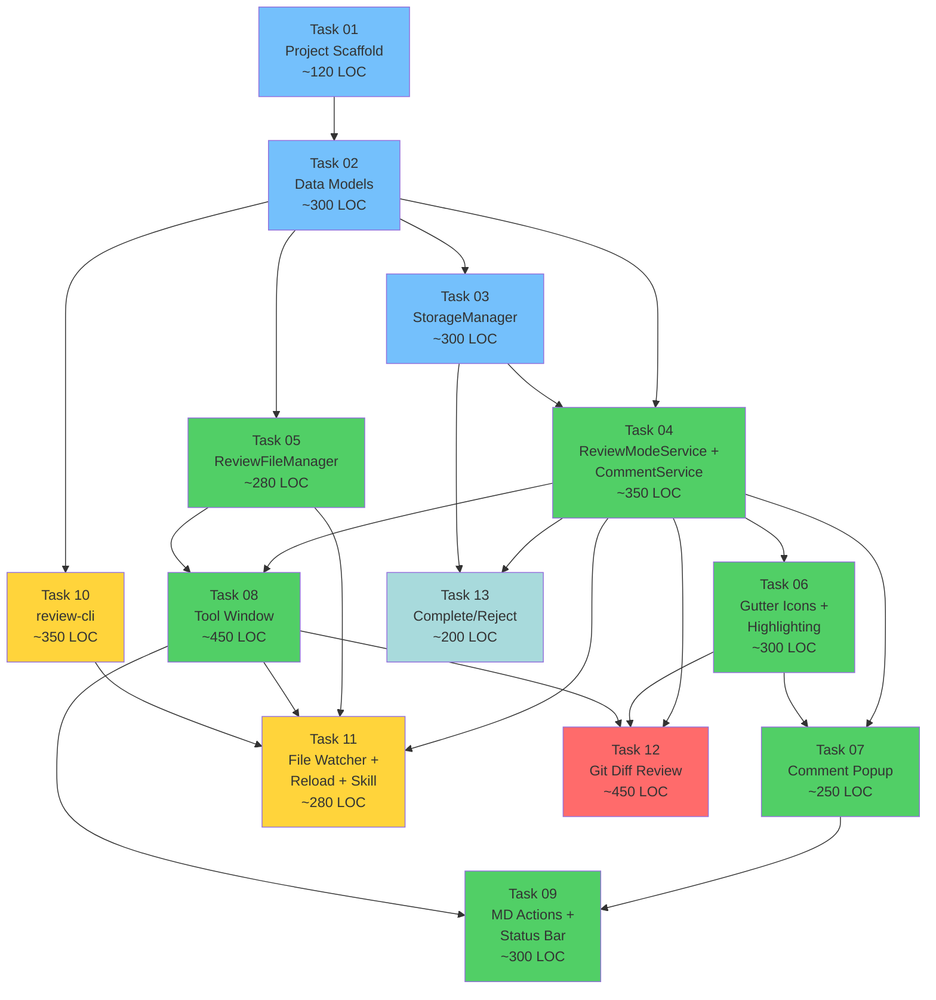

# Review Plugin — Task Breakdown

**Total Tasks**: 13
**Total Estimated LOC**: ~3,650
**MVP (Tasks 01-11)**: Full Markdown review workflow with Claude integration
**Full Feature Set (Tasks 01-13)**: Adds Git diff review + session lifecycle

---

## Dependency Graph

**Legend**: Blue = Phase 1 (Foundation), Green = Phase 2 (Markdown Review), Yellow = Phase 3 (Claude Integration), Red = Phase 4 (Git Diff), Gray = Phase 5 (Lifecycle)

---

## Task Summary

| # | Task | Phase | LOC | Dependencies | Deliverable |
|---|------|-------|-----|-------------|-------------|
| 01 | [Project Scaffold](tasks/TASK_01_project_scaffold.md) | 1 | ~120 | None | Plugin compiles and loads in IntelliJ sandbox |
| 02 | [Data Models](tasks/TASK_02_data_models.md) | 1 | ~300 | 01 | Sealed class hierarchy, enums, JSON DTOs with serialization tests |
| 03 | [StorageManager](tasks/TASK_03_storage_manager.md) | 1 | ~300 | 01, 02 | Draft persistence, archive, `.gitignore` management |
| 04 | [ReviewModeService + CommentService](tasks/TASK_04_review_mode_and_comment_services.md) | 2 | ~350 | 02, 03 | Session lifecycle, comment CRUD, listener pattern |
| 05 | [ReviewFileManager](tasks/TASK_05_review_file_manager.md) | 2 | ~280 | 02, 03 | Publish `.review.json`, load responses, append replies |
| 06 | [Gutter Icons + Highlighting](tasks/TASK_06_gutter_icons_and_highlighting.md) | 2 | ~300 | 04 | Visual overlay on editors: "+" icons, status icons, line colors |
| 07 | [Comment Popup Editor](tasks/TASK_07_comment_popup_editor.md) | 2 | ~250 | 04, 06 | Inline dialog for add/edit/delete comments |
| 08 | [Review Tool Window](tasks/TASK_08_review_tool_window.md) | 2 | ~450 | 04, 05 | Side panel: draft list, publish, response display, navigation |
| 09 | [MD Actions + Status Bar](tasks/TASK_09_markdown_review_actions.md) | 2 | ~300 | 04, 06, 07, 08 | "Review this Markdown", "Add Comment", "Publish", status bar |
| 10 | [review-cli](tasks/TASK_10_review_cli.md) | 3 | ~350 | 02 | Standalone CLI: list, show, respond, reply, status |
| 11 | [File Watcher + Reload + Skill](tasks/TASK_11_file_watcher_reload_claude_skill.md) | 3 | ~280 | 04, 05, 08, 10 | Detect responses, reload action, Claude skill, draft restore |
| 12 | [Git Diff Review](tasks/TASK_12_git_diff_review.md) | 4 | ~450 | 04, 05, 06, 07, 08, 09 | Branch picker, Git4Idea integration, diff commenting |
| 13 | [Complete/Reject](tasks/TASK_13_session_lifecycle_complete_reject.md) | 5 | ~200 | 04, 03, 08 | Terminal states, archive, name reuse |

---

## Milestones

### Milestone 1: Foundation (Tasks 01-03)
Plugin compiles, data models work, drafts can be saved/loaded. **~720 LOC**

### Milestone 2: Markdown Review MVP (Tasks 04-09)
Full Markdown review workflow: enter mode, add comments, see gutter icons, publish `.review.json`. **~1,930 LOC cumulative**

### Milestone 3: Bidirectional Claude Loop (Tasks 10-11)
Claude can process reviews via `review-cli` + `/review-respond` skill. File watcher detects responses. Reload displays them inline. **~2,560 LOC cumulative. This is the MVP.**

### Milestone 4: Git Diff Review (Task 12)
Branch selection, diff view with comment overlay, full publish/reload cycle for code changes. **~3,010 LOC cumulative**

### Milestone 5: Lifecycle Completion (Task 13)
Complete/reject sessions, archive review files, free names for reuse. **~3,210 LOC cumulative**

---

## Parallel Execution Opportunities

These tasks can be worked on simultaneously by different agents:

| Parallel Group | Tasks | Why |
|---------------|-------|-----|
| Foundation | 02 + 03 (after 01) | Models and storage are independent |
| Core services | 04 + 05 (after 02, 03) | ReviewModeService and ReviewFileManager don't depend on each other |
| UI components | 06 + 07 + 08 (after 04) | Gutter, popup, and tool window are independent UI surfaces |
| CLI + Watcher | 10 + 11 (10 after 02, 11 after 04+05+08) | CLI is fully standalone |
