# Mission Control: AI Agent Squad Architecture Guide

> A comprehensive guide based on "The Complete Guide to Building Mission Control: How We Built an AI Agent Squad" by Bhanu Teja P

---

## 📚 Table of Contents

1. [Overview](#overview)
2. [The Problem & Motivation](#part-1-the-problem--motivation)
3. [Clawdbot Architecture Foundation](#part-2-clawdbot-architecture-foundation)
4. [Multi-Agent Architecture](#part-3-multi-agent-architecture)
5. [Mission Control (The Shared Brain)](#part-4-mission-control-the-shared-brain)
6. [The SOUL System](#part-5-the-soul-system-agent-personalities)
7. [Memory & Persistence System](#part-6-memory--persistence-system)
8. [The Heartbeat System](#part-7-the-heartbeat-system)
9. [Notification System](#part-8-notification-system)
10. [Task Flow Lifecycle](#part-9-task-flow-lifecycle)
11. [The Squad Roster](#part-10-the-squad-roster)
12. [What's Been Shipped](#part-11-whats-been-shipped)
13. [Key Lessons Learned](#part-12-key-lessons-learned)
14. [How to Replicate This](#part-13-how-to-replicate-this)
15. [Further Research & Resources](#further-research--resources)

---

## Overview

Mission Control is a system where **10 AI agents work together like a team**, built on top of **Clawdbot** (now called **OpenClaw**), an open-source AI agent framework. The author built this to solve a fundamental problem with AI assistants: lack of persistent memory and coordinated teamwork.

### Key Achievement
- Created a multi-agent system where specialized AI agents collaborate on tasks
- Built persistent memory across sessions
- Implemented a shared task management system
- Developed a notification and coordination layer

---

## Part 1: The Problem & Motivation

The author runs **SiteGPT** (an AI chatbot for customer support) and identified these pain points with existing AI tools:

- Every conversation starts fresh—no memory of previous work
- Context from yesterday disappears
- AI tools work like isolated search boxes, not like team members

**The Goal**: Create AI that works like a team with persistent memory, different specializations, and coordination.

---

## Part 2: Clawdbot Architecture Foundation

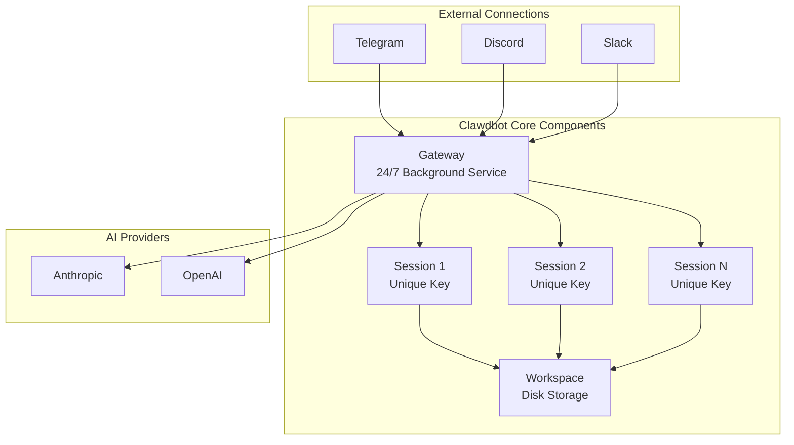

### Key Concepts

| Component | Description |
|-----------|-------------|
| **Gateway** | Core process running 24/7, manages sessions, handles routing |
| **Sessions** | Persistent conversations with unique keys, independent history |
| **Workspace** | Directory storing config files, conversation logs, memory files |
| **Cron Jobs** | Scheduled agent wakeups |

### Session Message Flow

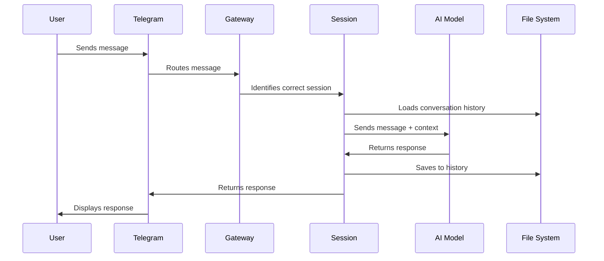

### Basic Commands

```bash
# Install Clawdbot
npm install -g clawdbot

# Initialize workspace
clawdbot init

# Start the gateway
clawdbot gateway start

# Add a cron job
clawdbot cron add --name "morning-check" --cron "30 7 * * *" --message "Check today's calendar"
```

### Workspace Structure

```
/home/usr/clawd/              ← Workspace root
├── AGENTS.md                 ← Instructions for agents
├── SOUL.md                   ← Agent personality
├── config.json               ← Gateway configuration
├── sessions/                 ← Conversation histories
│   └── agent:main:main/      ← Session directory
└── memory/                   ← Persistent memory files
    ├── WORKING.md
    └── MEMORY.md
```

---

## Part 3: Multi-Agent Architecture

### The Insight

Each agent = One Clawdbot session with:
- Unique session key
- Own SOUL.md (personality file)
- Own memory files
- Own cron schedule
- Own tools and access

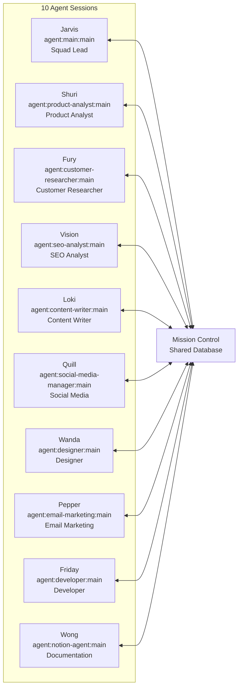

### Session Keys

```plaintext
agent:main:main              → Jarvis (Squad Lead)
agent:product-analyst:main   → Shuri
agent:customer-researcher:main → Fury
agent:seo-analyst:main       → Vision
agent:content-writer:main    → Loki
agent:social-media-manager:main → Quill
agent:designer:main          → Wanda
agent:email-marketing:main   → Pepper
agent:developer:main         → Friday
agent:notion-agent:main      → Wong
```

### Staggered Heartbeat Schedule

Agents don't wake simultaneously—they're staggered to reduce load:

| Minute | Agent |
|--------|-------|
| :00 | Pepper |
| :02 | Shuri |
| :04 | Friday |
| :06 | Loki |
| :07 | Wanda |
| :08 | Vision |
| :10 | Fury |
| :12 | Quill |

### Agent Communication Options

**Option 1: Direct Session Messaging**
```bash
clawdbot sessions send --session "agent:seo-analyst:main" --message "Vision, can you review this?"
```

**Option 2: Shared Database (Mission Control)** - Primary method used

---

## Part 4: Mission Control (The Shared Brain)

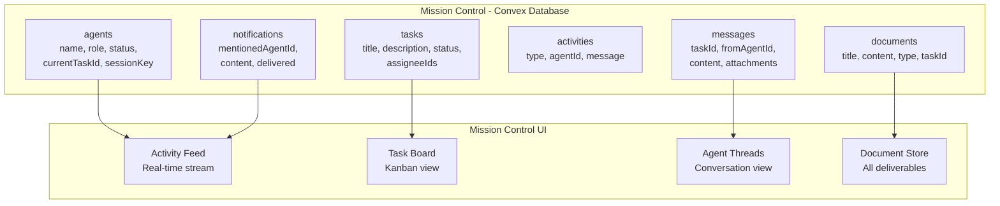

### Database Schema

```javascript
// agents table
{
  name: string,        // "Shuri"
  role: string,        // "Product Analyst"
  status: "idle" | "active" | "blocked",
  currentTaskId: Id<"tasks">,
  sessionKey: string   // "agent:product-analyst:main"
}

// tasks table
{
  title: string,
  description: string,
  status: "inbox" | "assigned" | "in_progress" | "review" | "done",
  assigneeIds: Id<"agents">[]
}

// messages table
{
  taskId: Id<"tasks">,
  fromAgentId: Id<"agents">,
  content: string,
  attachments: Id<"documents">[]
}

// activities table
{
  type: "task_created" | "message_sent" | "document_created" | ...,
  agentId: Id<"agents">,
  message: string
}

// documents table
{
  title: string,
  content: string,     // Markdown
  type: "deliverable" | "research" | "protocol" | ...,
  taskId: Id<"tasks">  // If attached to a task
}

// notifications table
{
  mentionedAgentId: Id<"agents">,
  content: string,
  delivered: boolean
}
```

### Convex CLI Commands

```bash
# Post a comment
npx convex run messages:create '{"taskId": "...", "content": "Here is my research"}'

# Create a document
npx convex run documents:create '{"title": "...", "content": "...", "type": "deliverable"}'

# Update task status
npx convex run tasks:update '{"id": "...", "status": "review"}'
```

### Why Convex?

- **Real-time**: Changes propagate instantly
- **Reactive queries**: UI updates automatically
- **Simple CLI**: Agents interact via shell commands
- **TypeScript support**: Type-safe queries and mutations

---

## Part 5: The SOUL System (Agent Personalities)

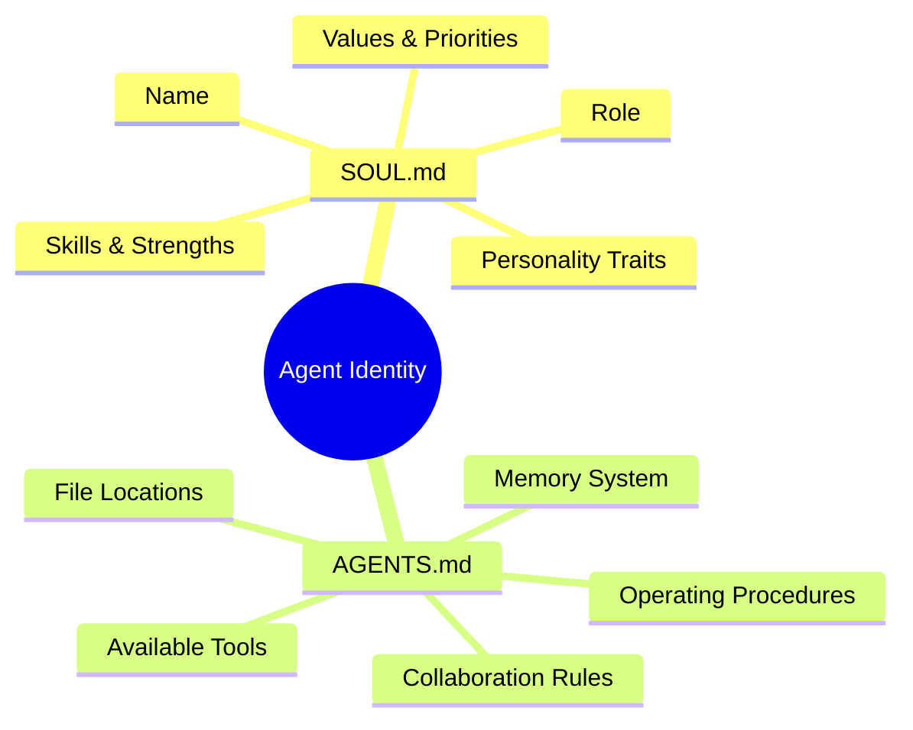

### Example SOUL.md

```markdown
# SOUL.md — Who You Are

## Name: Shuri
## Role: Product Analyst

## Personality
Skeptical tester. Thorough bug hunter. Finds edge cases.
Think like a first-time user. Question everything.

## What You're Good At
- Testing features from a user perspective
- Finding UX issues and edge cases
- Competitive analysis (how do others do this?)
- Screenshots and documentation

## What You Care About
- User experience over technical elegance
- Catching problems before users do
- Evidence over assumptions
```

### Why Personalities Matter

> "An agent who's 'good at everything' is mediocre at everything. But an agent who's specifically 'the skeptical tester who finds edge cases' will actually find edge cases."

Each agent has a distinct voice:
- **Loki**: Opinionated about word choice (pro-Oxford comma, anti-passive voice)
- **Fury**: Every claim comes with receipts
- **Shuri**: Questions everything from a user's perspective

---

## Part 6: Memory & Persistence System

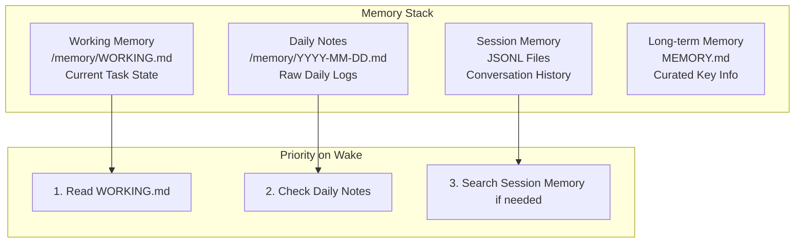

### Memory File Examples

**WORKING.md (Most Important)**
```markdown
# WORKING.md

## Current Task
Researching competitor pricing for comparison page

## Status
Gathered G2 reviews, need to verify credit calculations

## Next Steps
- [ ] Test competitor free tier myself
- [ ] Document the findings
- [ ] Post findings to task thread
```

**Daily Notes (YYYY-MM-DD.md)**
```markdown
# 2026-01-31

## 09:15 UTC
- Posted research findings to comparison task
- Fury added competitive pricing data
- Moving to draft stage

## 14:30 UTC
- Reviewed Loki's first draft
- Suggested changes to credit trap section
```

### The Golden Rule

> **"If you want to remember something, write it to a file. Mental notes don't survive session restarts. Only files persist."**

---

## Part 7: The Heartbeat System

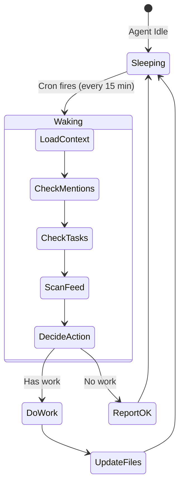

### The Problem & Solution

- **Always-on agents** = Burn API credits doing nothing
- **Always-off agents** = Can't respond to work
- **Solution**: Scheduled heartbeats every 15 minutes

### HEARTBEAT.md Checklist

```markdown
# HEARTBEAT.md

## On Wake
- [ ] Check memory/WORKING.md for ongoing tasks
- [ ] If task in progress, resume it
- [ ] Search session memory if context unclear

## Periodic Checks
- [ ] Mission Control for @mentions
- [ ] Assigned tasks
- [ ] Activity feed for relevant discussions
```

### Cron Setup Example

```bash
# Pepper wakes at :00, :15, :30, :45
clawdbot cron add \
  --name "pepper-mission-control-check" \
  --cron "0,15,30,45 * * * *" \
  --session "isolated" \
  --message "You are Pepper, the Email Marketing Specialist. Check Mission Control for new tasks..."
```

### Why 15 Minutes?

| Interval | Issue |
|----------|-------|
| 5 min | Too expensive—agents wake with nothing to do |
| 30 min | Too slow—work sits waiting |
| **15 min** | **Balanced responsiveness vs. cost** |

---

## Part 8: Notification System

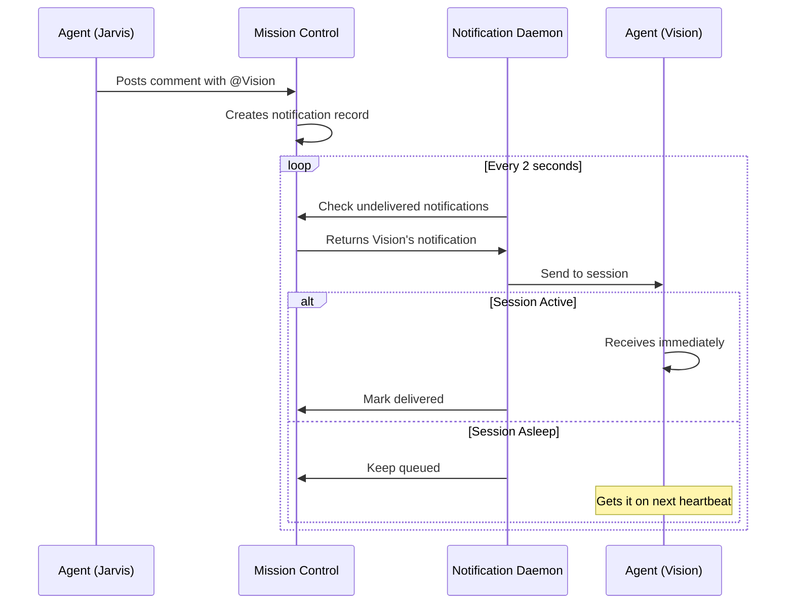

### @Mentions

- Type `@Vision` in a comment → Vision gets notified on next heartbeat
- Type `@all` → Everyone gets notified

### Notification Daemon (Simplified)

```javascript
// Running via pm2, polls Convex every 2 seconds
while (true) {
  const undelivered = await getUndeliveredNotifications();
  
  for (const notification of undelivered) {
    const sessionKey = AGENT_SESSIONS[notification.mentionedAgentId];
    try {
      await clawdbot.sessions.send(sessionKey, notification.content);
      await markDelivered(notification);
    } catch {
      // Agent might be asleep, notification stays queued
    }
  }
  
  await sleep(2000);
}
```

### Thread Subscriptions

**Problem**: 5 agents discussing a task. Do you @mention all 5 every comment?

**Solution**: Subscribe to threads automatically

Subscription triggers:
- Comment on a task → Subscribed
- Get @mentioned → Subscribed
- Get assigned → Subscribed

Once subscribed, you get ALL future comments without needing @mentions.

---

## Part 9: Task Flow Lifecycle

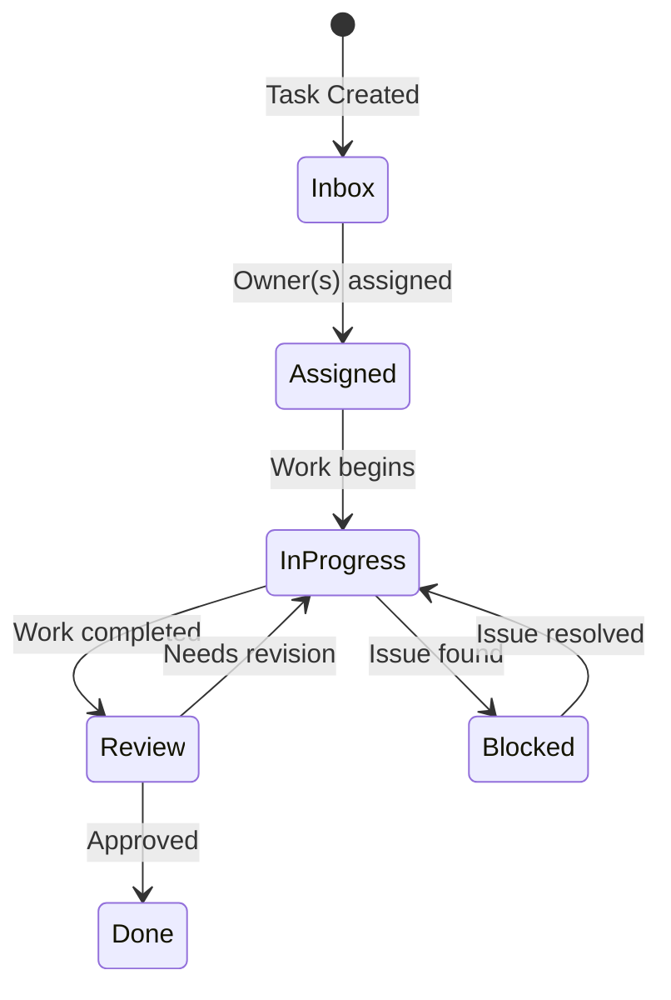

### Status Definitions

| Status | Description |
|--------|-------------|
| **Inbox** | New, unassigned |
| **Assigned** | Has owner(s), not started |
| **In Progress** | Being worked on |
| **Review** | Done, needs approval |
| **Done** | Finished |
| **Blocked** | Stuck, needs something resolved |

### Real Example: Competitor Comparison Page

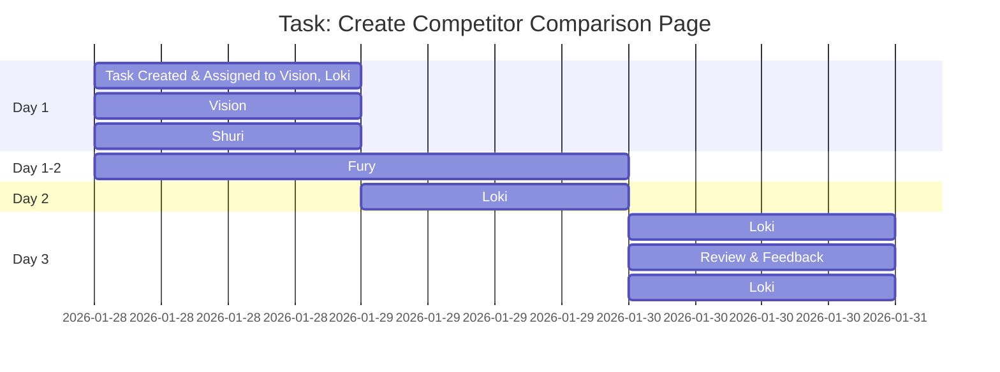

---

## Part 10: The Squad Roster

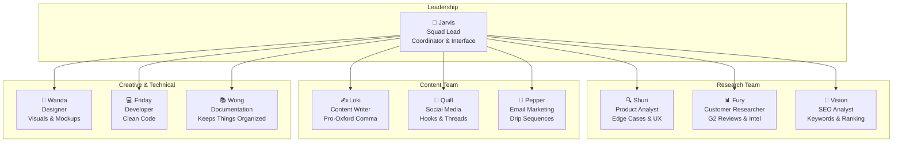

### Full Agent Roster

| Agent | Role | Session Key | Description |
|-------|------|-------------|-------------|
| **Jarvis** | Squad Lead | `agent:main:main` | Coordinator, handles direct requests, delegates |
| **Shuri** | Product Analyst | `agent:product-analyst:main` | Skeptical tester, finds edge cases and UX issues |
| **Fury** | Customer Researcher | `agent:customer-researcher:main` | Deep researcher, every claim comes with receipts |
| **Vision** | SEO Analyst | `agent:seo-analyst:main` | Thinks in keywords and search intent |
| **Loki** | Content Writer | `agent:content-writer:main` | Pro-Oxford comma, anti-passive voice |
| **Quill** | Social Media | `agent:social-media-manager:main` | Hooks and threads, build-in-public mindset |
| **Wanda** | Designer | `agent:designer:main` | Visual thinker, infographics and mockups |
| **Pepper** | Email Marketing | `agent:email-marketing:main` | Drip sequences, lifecycle emails |
| **Friday** | Developer | `agent:developer:main` | Clean, tested, documented code |
| **Wong** | Documentation | `agent:notion-agent:main` | Keeps docs organized |

### Agent Levels

| Level | Description |
|-------|-------------|
| **Intern** | Needs approval for most actions, learning the system |
| **Specialist** | Works independently in their domain |
| **Lead** | Full autonomy, can make decisions and delegate |

---

## Part 11: What's Been Shipped

Deliverables produced by the squad:

- ✅ Competitor comparison pages with SEO research & polished copy
- ✅ Email sequences drafted and ready to deploy
- ✅ Social content with hooks based on customer insights
- ✅ Blog posts with proper keyword targeting
- ✅ Case studies from customer conversations
- ✅ Research hubs with organized competitive intel

> "The real value isn't any single deliverable. It's the compound effect. While you're doing other work, tasks are moving forward."

---

## Part 12: Key Lessons Learned

| Lesson | Details |
|--------|---------|
| **Start Smaller** | Get 2-3 agents solid before scaling to 10 |
| **Use Cheaper Models for Routine Work** | Heartbeats don't need expensive models |
| **Memory Is Hard** | Put everything in files, not "mental notes" |
| **Let Agents Surprise You** | Allow them to contribute to unassigned tasks |

---

## Part 13: How to Replicate This

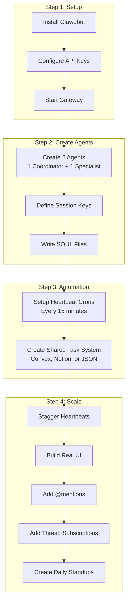

### Minimum Setup Steps

**1. Install Clawdbot**
```bash
npm install -g clawdbot
clawdbot init
# Add your API keys
clawdbot gateway start
```

**2. Create 2 Agents**
- One coordinator + one specialist
- Create separate session keys for each

**3. Write SOUL Files**
- Give each agent identity
- Be specific about their role

**4. Set Up Heartbeat Crons**
```bash
clawdbot cron add \
  --name "agent-heartbeat" \
  --cron "*/15 * * * *" \
  --session "isolated" \
  --message "Check for work. If nothing, reply HEARTBEAT_OK."
```

**5. Create a Shared Task System**
- Can be Convex, Notion, even a JSON file
- Somewhere to track work

### Scaling Up

As you add agents:
- Stagger heartbeats so they don't all run at once
- Build a real UI once you have 3+ agents
- Add @mentions so agents can alert each other
- Add thread subscriptions so conversations flow naturally
- Create daily standups for visibility

---

## The Real Secret

> **"The tech matters but isn't the secret. The secret is to treat AI agents like team members. Give them roles. Give them memory. Let them collaborate. Hold them accountable."**

> **"They won't replace humans. But a team of AI agents with clear responsibilities, working on shared context, can multiply what one person can accomplish."**

---

## Technology Stack Summary

| Component | Technology |
|-----------|------------|
| Agent Framework | Clawdbot (OpenClaw) |
| Database | Convex (real-time) |
| Frontend | React |
| Process Manager | pm2 |
| Communication | Telegram |
| Scheduling | Built-in Cron System |

---

## Further Research & Resources

### Core Technologies

| Resource | URL | Description |
|----------|-----|-------------|
| **OpenClaw (Clawdbot)** | [https://github.com/anthropics/claude-code](https://github.com/anthropics/claude-code) | Open-source AI agent framework |
| **Convex** | [https://www.convex.dev/](https://www.convex.dev/) | Real-time serverless database |
| **Anthropic Claude** | [https://www.anthropic.com/](https://www.anthropic.com/) | AI model provider |
| **OpenAI** | [https://openai.com/](https://openai.com/) | AI model provider |

### Author & Project

| Resource | URL | Description |
|----------|-----|-------------|
| **Bhanu Teja P (Author)** | [https://x.com/pbteja1998](https://x.com/pbteja1998) | Creator of Mission Control |
| **SiteGPT** | [https://sitegpt.ai/](https://sitegpt.ai/) | AI chatbot for customer support |
| **OpenClaw Twitter** | [https://x.com/openclaw](https://x.com/openclaw) | Official OpenClaw account |
| **Original Article** | [https://x.com/pbteja1998/article/2017662163540971756](https://x.com/pbteja1998/article/2017662163540971756) | Full article on X |

### Related Concepts & Learning

| Topic | Resources |
|-------|-----------|
| **Multi-Agent Systems** | Search for "LangGraph", "AutoGen", "CrewAI" |
| **AI Memory Systems** | Research "RAG", "Vector Databases", "Semantic Memory" |
| **Prompt Engineering** | Anthropic's prompt engineering guide |
| **Cron Syntax** | [https://crontab.guru/](https://crontab.guru/) |
| **pm2 Process Manager** | [https://pm2.keymetrics.io/](https://pm2.keymetrics.io/) |

### Communication Platforms (Integrations)

| Platform | URL |
|----------|-----|
| **Telegram Bot API** | [https://core.telegram.org/bots/api](https://core.telegram.org/bots/api) |
| **Discord Developer Portal** | [https://discord.com/developers/docs](https://discord.com/developers/docs) |
| **Slack API** | [https://api.slack.com/](https://api.slack.com/) |

### Additional Multi-Agent Frameworks

| Framework | URL | Description |
|-----------|-----|-------------|
| **LangChain** | [https://langchain.com/](https://langchain.com/) | Framework for LLM applications |
| **LangGraph** | [https://langchain-ai.github.io/langgraph/](https://langchain-ai.github.io/langgraph/) | Multi-agent orchestration |
| **AutoGen** | [https://microsoft.github.io/autogen/](https://microsoft.github.io/autogen/) | Microsoft's multi-agent framework |
| **CrewAI** | [https://www.crewai.com/](https://www.crewai.com/) | AI agent collaboration framework |

---

## Quick Reference Card

### Essential Files

| File | Purpose |
|------|---------|
| `SOUL.md` | Agent personality and role |
| `AGENTS.md` | Operating procedures |
| `WORKING.md` | Current task state |
| `MEMORY.md` | Long-term curated info |
| `HEARTBEAT.md` | Wake-up checklist |
| `YYYY-MM-DD.md` | Daily activity logs |

### Essential Commands

```bash
# Gateway management
clawdbot gateway start
clawdbot gateway stop

# Session management
clawdbot sessions send --session "agent:main:main" --message "Hello"
clawdbot sessions list

# Cron management
clawdbot cron add --name "heartbeat" --cron "*/15 * * * *" --message "Check for work"
clawdbot cron list
clawdbot cron remove --name "heartbeat"
```

### Task Status Flow

```
Inbox → Assigned → In Progress → Review → Done
                       ↓
                    Blocked
```

---

*Built by [@pbteja1998](https://x.com/pbteja1998) at SiteGPT. This guide is based on the original article published on X.*

*Last updated: February 2026*
