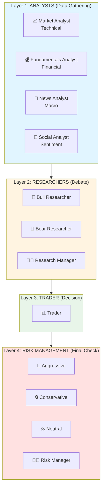
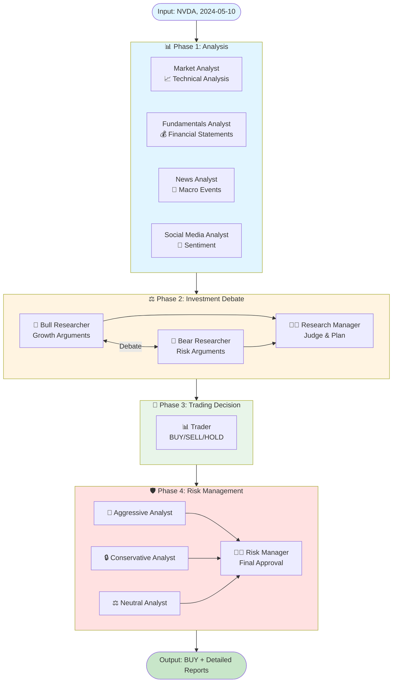

# TradingAgents - Overview

## What is TradingAgents?

TradingAgents is an open-source Python framework that simulates real-world financial trading operations using a multi-agent system powered by Large Language Models (LLMs). The framework mimics the structure of a professional trading firm, where specialized AI agents collaborate to analyze markets, debate investment opportunities, and execute trading decisions with risk management oversight.

## Key Concept

Instead of relying on a single AI model to make trading decisions, TradingAgents employs a **multi-agent system** where different agents with specialized roles work together:

- **Analysts** gather and analyze data from different perspectives
- **Researchers** debate the merits of investment opportunities
- **Traders** synthesize information into actionable decisions
- **Risk Managers** evaluate and approve/reject proposed trades

This approach mirrors how institutional trading firms operate, with checks and balances at each stage.

## Core Features

### 1. Multi-Agent Architecture



**Agent Counts**:
- **4 Analyst Types**: Market (Technical), Fundamentals, News, Social Media
- **2 Debate Researchers**: Bull and Bear perspectives
- **3 Risk Debators**: Aggressive, Conservative, and Neutral viewpoints
- **3 Manager Roles**: Research Manager, Trader, Risk Manager

### 2. Flexible LLM Support
- **OpenAI** (GPT-4o, o4-mini, etc.)
- **Anthropic** (Claude models)
- **Google** (Gemini models)
- **Ollama/OpenRouter** (Local and alternative models)

### 3. Multi-Vendor Data Integration
- **yfinance**: Stock prices and technical indicators
- **Alpha Vantage**: Fundamentals, news, insider trading data
- **OpenAI**: Natural language data analysis
- **Google**: News aggregation
- Built-in fallback mechanism for vendor failures

### 4. Memory-Augmented Learning
- Agents learn from past trading decisions
- ChromaDB vector storage for similarity-based retrieval
- Reflection system for post-trade learning

### 5. Structured Decision Process
- Configurable debate rounds for thorough analysis
- Conditional workflow logic via LangGraph
- Tool-using agents that gather data on-demand
- JSON-logged decision trail for auditability

## Technology Stack

| Component | Technology |
|-----------|------------|
| **Orchestration** | LangGraph (workflow management) |
| **LLM Framework** | LangChain (agent creation, tool calling) |
| **Vector Memory** | ChromaDB (embedding-based retrieval) |
| **Data Sources** | yfinance, Alpha Vantage, OpenAI, Google |
| **CLI** | Rich, Typer, Questionary |
| **Language** | Python 3.10+ |

## Project Structure

```
TradingAgents/
├── main.py                      # Simple programmatic usage example
├── tradingagents/               # Core framework package
│   ├── agents/                  # Agent implementations (20 files)
│   │   ├── analysts/            # Data gathering agents (4 types)
│   │   ├── researchers/         # Investment debate agents
│   │   ├── risk_mgmt/           # Risk evaluation agents
│   │   ├── managers/            # Decision synthesis agents
│   │   └── utils/               # Shared tools, state, memory
│   ├── graph/                   # LangGraph workflow orchestration
│   ├── dataflows/               # Multi-vendor data abstraction
│   └── default_config.py        # Configuration management
├── cli/                         # Interactive command-line interface
├── requirements.txt             # Python dependencies
└── README.md                    # Official documentation
```

## How It Works (High-Level)



### Step-by-Step Process

1. **Analysis Phase**: Multiple specialized analysts gather data about a stock
   - Market Analyst: Technical indicators (MACD, RSI, Bollinger Bands, etc.)
   - Fundamentals Analyst: Financial statements and ratios
   - News Analyst: Macroeconomic trends and news events
   - Social Media Analyst: Sentiment and public opinion

2. **Investment Debate Phase**: Bull and Bear researchers debate the opportunity
   - Bull Researcher: Argues for investment with growth focus
   - Bear Researcher: Identifies risks and bearish indicators
   - Research Manager: Judges the debate and creates investment plan

3. **Trading Decision Phase**: Trader synthesizes all information
   - Reviews analyst reports and investment plan
   - Makes BUY/SELL/HOLD recommendation

4. **Risk Management Phase**: Three risk perspectives evaluate the decision
   - Aggressive Debator: Champions high-reward strategies
   - Conservative Debator: Emphasizes risk mitigation
   - Neutral Debator: Provides balanced perspective
   - Risk Manager: Makes final judgment and approval

5. **Signal Processing**: Extract actionable decision from verbose output

6. **Reflection** (Optional): Learn from actual trade outcomes
   - Update agent memories based on returns/losses
   - Improve future decisions using past experiences

## Use Cases

### 1. Trading Research & Simulation
- Test trading strategies with multi-perspective analysis
- Simulate institutional decision-making processes
- Educational tool for understanding trading operations

### 2. LLM Multi-Agent System Research
- Study agent collaboration patterns
- Experiment with debate-driven decision making
- Test different LLM providers and configurations

### 3. Financial Analysis Automation
- Automated stock screening with multiple data sources
- Structured analysis reports for investment decisions
- Risk assessment framework

### 4. Backtesting Framework
- Test trading signals against historical data
- Evaluate decision quality over time
- Optimize agent configurations

## Key Design Principles

1. **Specialization**: Each agent has a focused role and expertise
2. **Debate-Driven**: Multiple perspectives ensure thorough analysis
3. **Memory-Augmented**: Agents learn from past experiences
4. **Vendor-Agnostic**: Flexible data source integration
5. **Configurable**: Extensive customization options
6. **Transparent**: JSON logging of entire decision process

## Quick Start Example

```python
from tradingagents.graph.trading_graph import TradingAgentsGraph
from tradingagents.default_config import DEFAULT_CONFIG

# Initialize the framework
ta = TradingAgentsGraph(debug=True, config=DEFAULT_CONFIG.copy())

# Analyze a stock on a specific date
final_state, decision = ta.propagate("NVDA", "2024-05-10")

# Get the final decision
print(decision)  # Output: "BUY", "SELL", or "HOLD"

# Access detailed reports
print(final_state["market_report"])
print(final_state["fundamentals_report"])
print(final_state["final_decision"])
```

## Requirements

- Python 3.10+
- OpenAI API key (for LLM and embeddings)
- Alpha Vantage API key (optional, for fundamentals/news)
- See `requirements.txt` for full dependency list

## License

Apache-2.0 License

## Links

- **GitHub Repository**: https://github.com/TauricResearch/TradingAgents
- **Tauric Research**: https://tauric.com

## Next Steps

- **Architecture Guide**: Detailed system architecture and workflow
- **Agent Documentation**: In-depth explanation of each agent type
- **Configuration Guide**: Customization options and setup
- **Usage Guide**: Integration patterns and examples
- **Data Flow Documentation**: Understanding data sources and vendors
