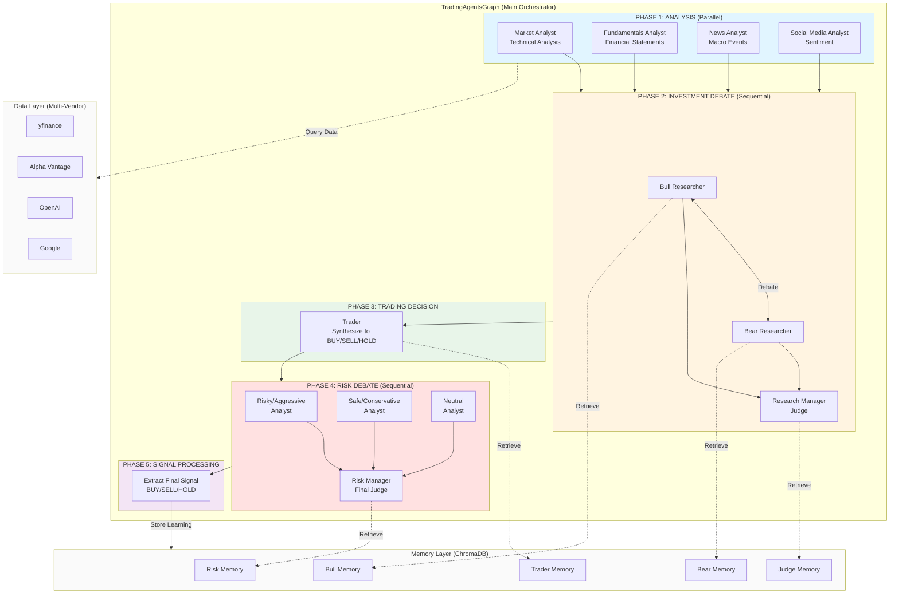
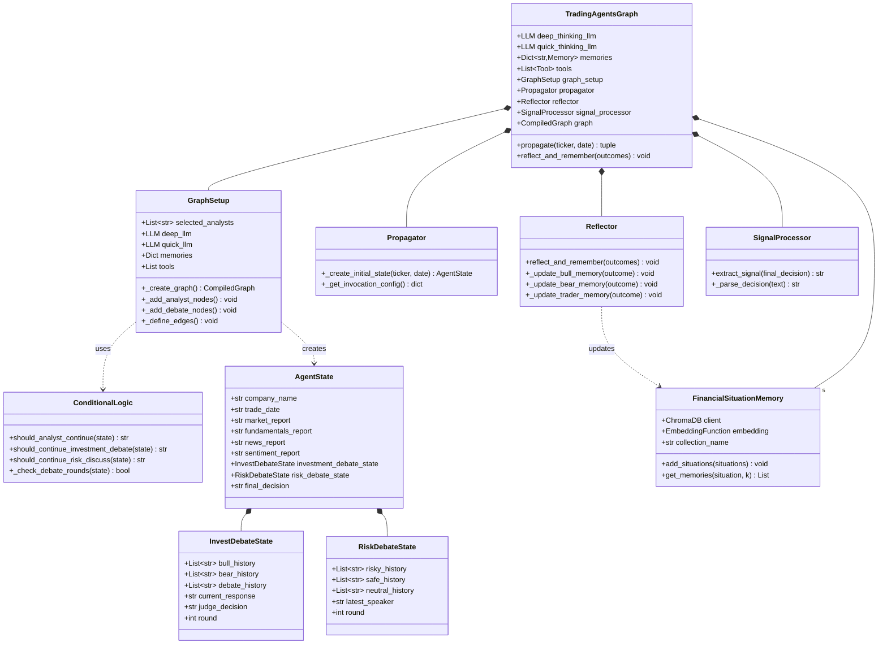
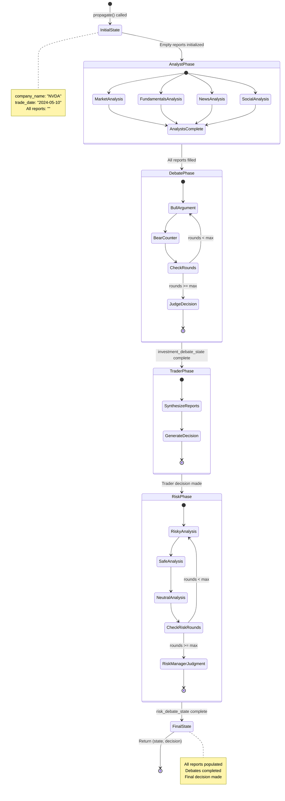
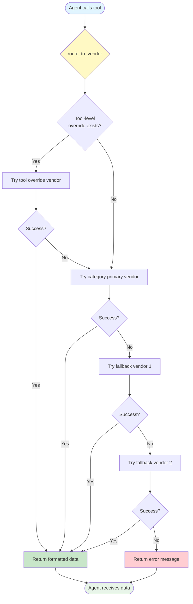
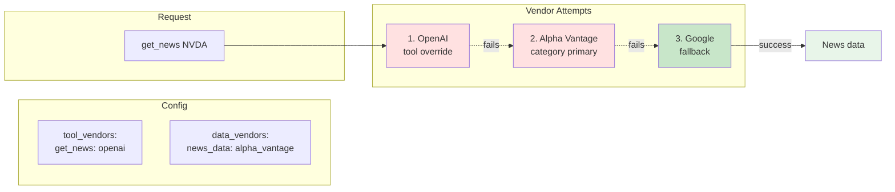
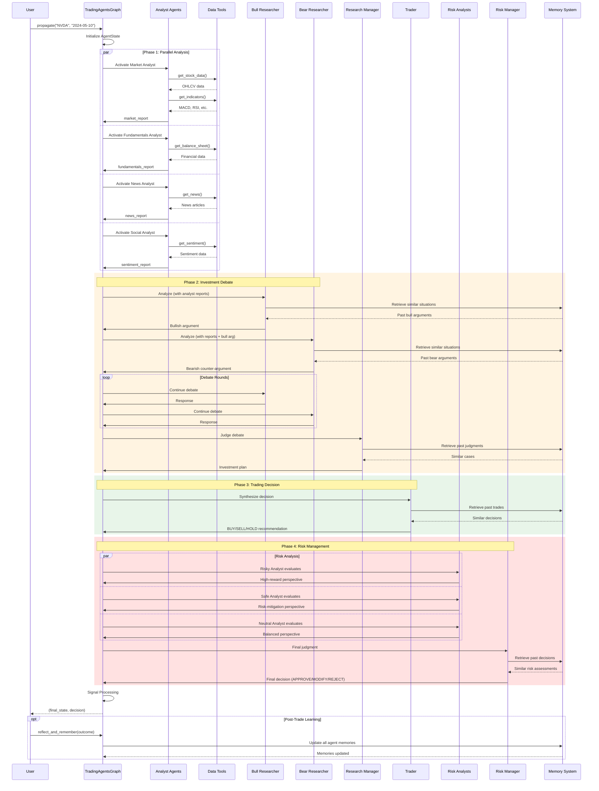

# TradingAgents - Architecture Documentation

## System Architecture Overview

TradingAgents employs a **hierarchical multi-agent architecture** built on LangGraph, where specialized agents collaborate through a structured workflow to make trading decisions.

## High-Level Architecture Diagram



## Core Components

### Component Architecture



### 1. TradingAgentsGraph (Main Orchestrator)

**Location**: `tradingagents/graph/trading_graph.py`

The central class that initializes and manages the entire system.

**Responsibilities**:
- Initialize LLM instances (deep_thinking_llm, quick_thinking_llm)
- Create memory systems for all agents (5 ChromaDB collections)
- Set up data tools with multi-vendor routing
- Initialize graph components (GraphSetup, Propagator, Reflector, SignalProcessor)
- Compile and execute the LangGraph workflow

**Key Methods**:
```python
def __init__(self, selected_analysts, debug, config):
    # Initialize LLMs, memories, tools, and graph components

def propagate(self, company_name, trade_date):
    # Execute the full workflow and return final state + decision

def reflect_and_remember(self, returns_or_losses):
    # Post-trade learning and memory updates
```

### 2. GraphSetup (Workflow Builder)

**Location**: `tradingagents/graph/setup.py`

Constructs the LangGraph workflow with nodes and edges.

**Key Responsibilities**:
- Create analyst nodes (dynamically based on selected_analysts)
- Create researcher nodes (bull, bear, research manager)
- Create trader node
- Create risk debate nodes (risky, safe, neutral, risk manager)
- Define conditional edges for workflow control
- Compile the graph

**Workflow Construction**:
```python
def _create_graph(self):
    graph = StateGraph(AgentState)

    # Add analyst nodes (parallel execution)
    for analyst_type in self.selected_analysts:
        graph.add_node(f"{analyst_type}_analyst", analyst_node)

    # Add debate and decision nodes
    graph.add_node("bull_researcher", bull_node)
    graph.add_node("bear_researcher", bear_node)
    graph.add_node("research_manager", research_manager_node)
    graph.add_node("trader", trader_node)
    graph.add_node("risky_analyst", risky_node)
    graph.add_node("safe_analyst", safe_node)
    graph.add_node("neutral_analyst", neutral_node)
    graph.add_node("risk_manager", risk_manager_node)

    # Set entry point and edges
    graph.set_entry_point("market_analyst")
    # ... conditional edges defined ...

    return graph.compile()
```

### 3. ConditionalLogic (Flow Control)

**Location**: `tradingagents/graph/conditional_logic.py`

Manages the conditional routing between agents.

**Key Decision Points**:

1. **Analyst Continuation**: Should analyst continue gathering data or move forward?
   ```python
   def should_analyst_continue(state):
       # If last message has tool_calls, continue
       # Otherwise, move to next analyst or bull_researcher
   ```

2. **Investment Debate Routing**: Who speaks next in bull/bear debate?
   ```python
   def should_continue_investment_debate(state):
       # Check if max_debate_rounds reached
       # Alternate between bull and bear
       # End at research_manager
   ```

3. **Risk Debate Routing**: Three-way debate management
   ```python
   def should_continue_risk_discuss(state):
       # Check if max_risk_discuss_rounds reached
       # Rotate: risky -> safe -> neutral -> risky
       # End at risk_manager
   ```

### 4. State Management

**Location**: `tradingagents/agents/utils/agent_states.py`

Three TypedDict classes define the data structure:

#### AgentState (Main State)
```python
class AgentState(MessagesState):
    company_name: str
    trade_date: str
    market_report: str
    sentiment_report: str
    news_report: str
    fundamentals_report: str
    investment_debate_state: InvestDebateState
    risk_debate_state: RiskDebateState
    final_decision: str
```

#### InvestDebateState (Bull/Bear Debate)
```python
class InvestDebateState(TypedDict):
    bull_history: list[str]
    bear_history: list[str]
    debate_history: list[str]
    current_response: str
    judge_decision: str
    round: int
```

#### RiskDebateState (Risk Analysis Debate)
```python
class RiskDebateState(TypedDict):
    risky_history: list[str]
    safe_history: list[str]
    neutral_history: list[str]
    risky_current: str
    safe_current: str
    neutral_current: str
    latest_speaker: str
    round: int
```

#### State Evolution Diagram



**State Flow**:
1. Initial state created with empty reports
2. Each analyst updates their specific report field
3. Debate states track conversation histories
4. Final state contains complete analysis chain

### 5. Memory System

**Location**: `tradingagents/agents/utils/memory.py`

**FinancialSituationMemory Class**:

```python
class FinancialSituationMemory:
    def __init__(self, collection_name, embedding_model):
        # ChromaDB client setup
        # OpenAI embedding function

    def add_situations(self, situations):
        # Store (situation, recommendation) pairs with embeddings

    def get_memories(self, situation, k=2):
        # Retrieve k most similar past situations
```

**Memory Collections**:
- `bull_memory`: Bull researcher's past arguments and outcomes
- `bear_memory`: Bear researcher's past arguments and outcomes
- `trader_memory`: Trader's past decisions and outcomes
- `invest_judge_memory`: Research manager's past judgments
- `risk_manager_memory`: Risk manager's past approvals/rejections

**Memory Integration**:
Each agent's prompt includes:
```python
memories = memory.get_memories(current_situation, k=2)
prompt = f"""
Your role: {role_description}

Similar past situations:
{format_memories(memories)}

Current situation:
{current_data}

Your analysis:
"""
```

### 6. Agent Creation Pattern

**All agents follow the same higher-order function pattern**:

```python
def create_agent_x(llm, tools, memory, config):
    """
    Returns a node function that processes state
    """
    def agent_node(state: AgentState) -> dict:
        # 1. Extract relevant data from state
        # 2. Retrieve memories for context
        # 3. Format prompt with role and context
        # 4. Invoke LLM (with or without tools)
        # 5. Return state update

        return {
            "messages": [response],
            "specific_report_field": extracted_report
        }

    return agent_node
```

**Tool-Using Agents**:
- Analysts use `.bind_tools(tools)` to enable tool calling
- LLM decides when to call tools vs. provide final report
- Tools return data that's appended to message history
- Agent continues until no more tool calls needed

**Debate Agents**:
- Access opponent's history from debate state
- Generate response based on context and memories
- Update their own history in debate state
- No tool calling, pure reasoning

### 7. Data Abstraction Layer

**Location**: `tradingagents/dataflows/`

**Multi-Vendor Architecture**:



**Vendor Selection Example**:



**Key Files**:
- `routing_interface.py`: Central routing logic
- `yfinance/`, `alpha_vantage/`, `openai/`, `google/`: Vendor-specific implementations
- Each vendor implements the same interface for tool categories

**Example Tool Flow**:
```python
@tool
def get_stock_data(ticker, start_date, end_date):
    """Get OHLCV stock price data"""
    return route_to_vendor(
        tool_name="get_stock_data",
        category="core_stock_apis",
        ticker=ticker,
        start_date=start_date,
        end_date=end_date
    )
```

**route_to_vendor() Logic**:
1. Check tool-level override in config
2. Fall back to category-level vendor
3. Try primary vendor implementation
4. On failure, try fallback vendors
5. Return formatted data or error message

### 8. Reflection System

**Location**: `tradingagents/graph/reflection.py`

**Post-Trade Learning Mechanism**:

```python
def reflect_and_remember(self, returns_or_losses: dict):
    """
    Update agent memories based on actual trade outcomes

    Args:
        returns_or_losses: {
            "ticker": "NVDA",
            "actual_return": 0.15,
            "decision": "BUY",
            "components": {
                "bull_argument": "...",
                "bear_argument": "...",
                "trader_decision": "...",
                "research_judge": "...",
                "risk_manager": "..."
            }
        }
    """
    # Extract outcomes
    # Format reflection for each component
    # Update respective memories
```

**Reflection Process**:
1. Compare predicted outcome with actual return
2. Generate reflection text for each agent's contribution
3. Store in agent's memory with embedding
4. Future similar situations retrieve this learning

## Workflow Execution Flow

### Workflow Sequence Diagram



### Detailed Step-by-Step Execution

1. **Initialization** (`propagate()` called)
   ```python
   ta.propagate("NVDA", "2024-05-10")
   ```
   - Propagator creates initial AgentState with empty reports
   - Trade date and company name set

2. **Phase 1: Analyst Execution** (Parallel)
   - Market Analyst node activated
   - LLM decides to call `get_stock_data()` tool
   - Tool returns OHLCV data via yfinance
   - LLM calls `get_indicators()` for MACD, RSI, etc.
   - LLM generates market_report
   - State updated: `market_report: "Technical analysis: ..."`

   (Similarly for fundamentals, news, social media analysts)

3. **Phase 2: Investment Debate** (Sequential)
   - Bull Researcher receives all analyst reports
   - Retrieves similar past situations from bull_memory
   - Generates bullish argument
   - Bear Researcher receives analyst reports + bull's argument
   - Retrieves from bear_memory
   - Generates bearish counter-argument
   - Rounds alternate until max_debate_rounds reached
   - Research Manager judges debate
   - Creates investment plan

4. **Phase 3: Trading Decision**
   - Trader receives:
     - All analyst reports
     - Investment plan from research manager
   - Retrieves similar past decisions from trader_memory
   - Generates BUY/SELL/HOLD recommendation with rationale

5. **Phase 4: Risk Debate** (Sequential 3-way)
   - Risky Analyst evaluates trader's decision (high-reward perspective)
   - Safe Analyst evaluates (risk-mitigation perspective)
   - Neutral Analyst evaluates (balanced perspective)
   - Rounds rotate through all three
   - Risk Manager makes final judgment
   - Approves or modifies the trading decision

6. **Phase 5: Signal Processing**
   - SignalProcessor extracts clean BUY/SELL/HOLD from verbose final_decision
   - Returns final_state and decision signal

7. **Optional: Reflection** (After actual trade outcome known)
   - Call `reflect_and_remember()` with actual returns
   - All agent memories updated for future learning

## Configuration Architecture

**Location**: `tradingagents/default_config.py`

```python
DEFAULT_CONFIG = {
    # LLM Configuration
    "llm_provider": "openai",
    "deep_think_llm": "o4-mini",
    "quick_think_llm": "gpt-4o-mini",
    "backend_url": "https://api.openai.com/v1",

    # Workflow Configuration
    "max_debate_rounds": 1,
    "max_risk_discuss_rounds": 1,

    # Data Vendor Configuration
    "data_vendors": {
        "core_stock_apis": "yfinance",
        "technical_indicators": "yfinance",
        "fundamental_data": "alpha_vantage",
        "news_data": "alpha_vantage",
    },

    # Tool-Level Overrides (Optional)
    "tool_vendors": {
        "get_balance_sheet": "alpha_vantage",
        "get_income_statement": "yfinance",
    }
}
```

**Customization Points**:
- LLM provider and models
- Debate iteration limits
- Vendor selection at category or tool level
- Selected analysts
- Debug mode for streaming output

## Performance Characteristics

### Execution Time Factors

1. **Number of Analysts**: 4 analysts run in parallel
2. **Debate Rounds**: Each round adds 2 LLM calls (bull + bear)
3. **Risk Rounds**: Each round adds 3 LLM calls (risky + safe + neutral)
4. **LLM Speed**: o4-mini slower than gpt-4o-mini
5. **Tool Calls**: API latency for data fetching

**Typical Execution**:
- 4 analysts (parallel): ~30-60 seconds
- 1 investment debate round: ~20-30 seconds
- 1 trader decision: ~10-15 seconds
- 1 risk debate round: ~30-45 seconds
- **Total**: ~2-3 minutes per stock analysis

### Scalability Considerations

**Current Architecture**:
- Single-stock, single-date analysis
- Sequential workflow (cannot analyze multiple stocks in parallel within single graph)
- Memory retrieval: O(log n) with vector similarity search

**For Multiple Stocks**:
- Create multiple TradingAgentsGraph instances
- Run in parallel with thread/process pools
- Share memory collections across instances

## Key Design Decisions

### 1. Why LangGraph?
- **Stateful workflows**: Perfect for multi-step agent processes
- **Conditional routing**: Enables dynamic debate rounds
- **Tool integration**: Native LangChain tool support
- **Debugging**: Built-in state inspection

### 2. Why Higher-Order Functions for Agents?
- **Closure over dependencies**: LLM, tools, memory encapsulated
- **Clean node interface**: All nodes have same signature (state) -> dict
- **Easy testing**: Mock dependencies in factory function

### 3. Why Separate Debate States?
- **Cleaner state management**: Debate logic isolated
- **Round tracking**: Independent counters for different debates
- **History preservation**: Each debate's full context maintained

### 4. Why Multi-Vendor Abstraction?
- **Resilience**: Fallback when primary vendor fails
- **Cost optimization**: Mix free and paid data sources
- **Flexibility**: Easy vendor switching via config

### 5. Why Memory-Augmented Agents?
- **Learning from experience**: Past decisions inform future ones
- **Context-aware**: Similar situations retrieve relevant memories
- **Continuous improvement**: Reflection loop after real outcomes

## Error Handling

**Built-in Resilience**:
1. **Vendor Fallback**: If yfinance fails, try alpha_vantage
2. **Tool Error Messages**: Returned as strings to LLM for adaptation
3. **Max Recursion**: LangGraph limits prevent infinite loops
4. **Debate Round Caps**: Prevents endless debates

**No Circuit Breakers For**:
- LLM API failures (raises exception)
- Missing API keys (raises exception)
- Invalid ticker symbols (handled by tools, passed to LLM)

## Extension Points

### Adding New Agents
1. Create agent file in appropriate `agents/` subdirectory
2. Implement higher-order function following pattern
3. Add node in `GraphSetup._create_graph()`
4. Update conditional logic if needed

### Adding New Data Vendors
1. Create directory in `dataflows/`
2. Implement tool interface matching existing vendors
3. Register in `routing_interface.py`
4. Add to `default_config.py`

### Custom Debate Structures
1. Modify `ConditionalLogic` routing functions
2. Adjust round limits in config
3. Add new debate state fields if needed

### Alternative Memory Systems
1. Implement same interface as `FinancialSituationMemory`
2. Replace ChromaDB with Pinecone, Weaviate, etc.
3. Adjust embedding function if desired

---

This architecture provides a flexible, extensible framework for multi-agent trading systems with clear separation of concerns and well-defined extension points.
