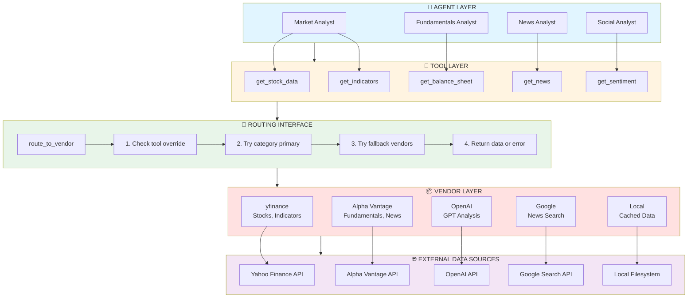
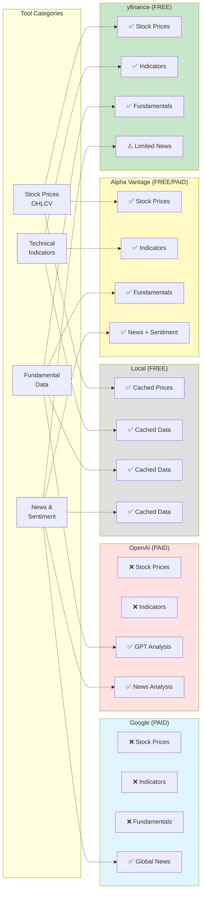

# TradingAgents - Data Flow and Vendor Documentation

## Data Flow Architecture

### Overview

TradingAgents uses a **multi-vendor data abstraction layer** that provides:
1. **Vendor-agnostic tools**: Agents call tools without knowing the underlying data source
2. **Automatic fallback**: If primary vendor fails, try alternatives
3. **Flexible routing**: Configure vendors at category or tool level
4. **Resilient execution**: System continues even with partial vendor failures

### High-Level Data Flow



**Data Flow Path**:
1. **Agent calls tool**: Market Analyst calls `get_stock_data("NVDA", ...)`
2. **Tool routes request**: Tool calls `route_to_vendor(tool_name, category, ...)`
3. **Routing logic executes**: Check overrides → Try primary → Try fallbacks
4. **Vendor executes**: yfinance calls Yahoo Finance API
5. **Data returns**: Formatted OHLCV data flows back to agent

---

## Tool Categories and Available Tools

### 1. Core Stock APIs

**Purpose**: Basic stock price data (OHLCV)

**Tools**:
- `get_stock_data(ticker, start_date, end_date)`
  - Returns: DataFrame with Open, High, Low, Close, Volume
  - Use case: Historical price analysis, trend identification

**Supported Vendors**:
- **yfinance** (Primary, Free)
- **alpha_vantage** (Fallback, Free with limits)

**Example**:
```python
@tool
def get_stock_data(ticker: str, start_date: str, end_date: str):
    """Get historical OHLCV stock price data"""
    return route_to_vendor(
        tool_name="get_stock_data",
        category="core_stock_apis",
        ticker=ticker,
        start_date=start_date,
        end_date=end_date
    )
```

**Response Format**:
```json
{
    "ticker": "NVDA",
    "data": [
        {"date": "2024-05-01", "open": 445.20, "high": 452.30, "low": 443.10, "close": 450.32, "volume": 42500000},
        {"date": "2024-05-02", "open": 451.00, "high": 458.75, "low": 449.20, "close": 456.10, "volume": 38200000}
    ]
}
```

---

### 2. Technical Indicators

**Purpose**: Calculated technical indicators for chart analysis

**Tools**:
- `get_indicators(ticker, start_date, end_date, indicators)`
  - Returns: Calculated values for requested indicators
  - Available indicators:
    - SMA (Simple Moving Averages): 20, 50, 200 day
    - MACD (Moving Average Convergence Divergence)
    - RSI (Relative Strength Index)
    - Bollinger Bands
    - ATR (Average True Range)
    - Stochastic Oscillator

**Supported Vendors**:
- **yfinance** (Primary, Free)
- **alpha_vantage** (Fallback, Free with limits)

**Example**:
```python
@tool
def get_indicators(ticker: str, start_date: str, end_date: str, indicators: list):
    """Get technical indicators"""
    return route_to_vendor(
        tool_name="get_indicators",
        category="technical_indicators",
        ticker=ticker,
        start_date=start_date,
        end_date=end_date,
        indicators=indicators
    )
```

**Response Format**:
```json
{
    "ticker": "NVDA",
    "indicators": {
        "SMA_20": 445.67,
        "SMA_50": 425.32,
        "SMA_200": 398.45,
        "MACD": {"macd": 12.5, "signal": 8.3, "histogram": 4.2},
        "RSI": 68.5,
        "Bollinger_Bands": {"upper": 465.20, "middle": 450.32, "lower": 435.44},
        "ATR": 15.6
    }
}
```

---

### 3. Fundamental Data

**Purpose**: Financial statement data and fundamental metrics

**Tools**:

1. `get_balance_sheet(ticker, period="annual")`
   - Returns: Assets, liabilities, equity
   - Periods: annual, quarterly

2. `get_income_statement(ticker, period="annual")`
   - Returns: Revenue, expenses, profit
   - Periods: annual, quarterly

3. `get_cash_flow_statement(ticker, period="annual")`
   - Returns: Operating, investing, financing cash flows
   - Periods: annual, quarterly

4. `get_fundamental_data(ticker)`
   - Returns: P/E ratio, market cap, EPS, dividend yield, etc.

**Supported Vendors**:
- **alpha_vantage** (Primary, Free with limits)
- **yfinance** (Fallback, Free)
- **openai** (Alternative, uses GPT to query financial databases)

**Example**:
```python
@tool
def get_balance_sheet(ticker: str, period: str = "annual"):
    """Get balance sheet data"""
    return route_to_vendor(
        tool_name="get_balance_sheet",
        category="fundamental_data",
        ticker=ticker,
        period=period
    )
```

**Response Format**:
```json
{
    "ticker": "NVDA",
    "period": "annual",
    "fiscal_year": "2024",
    "balance_sheet": {
        "total_assets": 65700000000,
        "current_assets": 42300000000,
        "total_liabilities": 22100000000,
        "current_liabilities": 10200000000,
        "shareholders_equity": 43600000000,
        "cash": 18500000000,
        "debt": 14800000000
    }
}
```

---

### 4. News Data

**Purpose**: News articles, sentiment, insider trading data

**Tools**:

1. `get_news(ticker, limit=10)`
   - Returns: Company-specific news articles
   - Includes: title, summary, source, timestamp, sentiment

2. `get_global_news(category="market", limit=10)`
   - Returns: Broader market news
   - Categories: market, economy, technology, etc.

3. `get_insider_sentiment(ticker)`
   - Returns: Insider buying/selling sentiment

4. `get_insider_transactions(ticker, limit=10)`
   - Returns: Detailed insider transactions

**Supported Vendors**:
- **alpha_vantage** (Primary, Free with limits)
- **openai** (Alternative, uses GPT to search and summarize news)
- **google** (Alternative, uses Google News API)

**Example**:
```python
@tool
def get_news(ticker: str, limit: int = 10):
    """Get company-specific news"""
    return route_to_vendor(
        tool_name="get_news",
        category="news_data",
        ticker=ticker,
        limit=limit
    )
```

**Response Format**:
```json
{
    "ticker": "NVDA",
    "news": [
        {
            "title": "NVIDIA Announces New AI Chip Architecture",
            "summary": "NVIDIA unveiled next-gen GPU designed for AI workloads...",
            "source": "Reuters",
            "timestamp": "2024-05-08T14:30:00Z",
            "url": "https://...",
            "sentiment": "positive"
        }
    ]
}
```

---

## Vendor-Specific Implementations

### Vendor Capabilities Overview



**Vendor Comparison Table**:

| Vendor | Cost | Stock Prices | Indicators | Fundamentals | News/Sentiment | Rate Limit |
|--------|------|--------------|------------|--------------|----------------|------------|
| **yfinance** | Free | ✅ Excellent | ✅ Good | ✅ Good | ⚠️ Limited | ~2000/hr |
| **Alpha Vantage** | Free/Paid | ✅ Good | ✅ Excellent | ✅ Excellent | ✅ Excellent | 25/day (free) |
| **OpenAI** | Paid | ❌ No | ❌ No | ✅ GPT | ✅ GPT | 10k/min |
| **Google** | Paid | ❌ No | ❌ No | ❌ No | ✅ News | 100/day |
| **Local** | Free | ✅ Cached | ✅ Cached | ✅ Cached | ✅ Cached | Unlimited |

### 1. yfinance Vendor

**Location**: `tradingagents/dataflows/yfinance/`

**Capabilities**:
- ✅ Stock prices (OHLCV)
- ✅ Technical indicators
- ✅ Balance sheet
- ✅ Income statement
- ✅ Cash flow statement
- ✅ Basic fundamentals (P/E, market cap, etc.)
- ⚠️ Limited news (company announcements only)

**Pros**:
- Free, no API key required
- Reliable Yahoo Finance backend
- Fast response times
- Good for historical data

**Cons**:
- Rate limited by Yahoo (not documented)
- Limited news coverage
- No sentiment analysis
- Sometimes incomplete data for small caps

**Configuration**:
```python
config["data_vendors"] = {
    "core_stock_apis": "yfinance",
    "technical_indicators": "yfinance",
    "fundamental_data": "yfinance",
}
```

**Implementation Example**:
```python
# yfinance/core_stock_apis.py
import yfinance as yf

def get_stock_data_yfinance(ticker, start_date, end_date):
    """Get stock data using yfinance"""
    try:
        stock = yf.Ticker(ticker)
        hist = stock.history(start=start_date, end=end_date)

        return {
            "ticker": ticker,
            "data": hist.to_dict('records')
        }
    except Exception as e:
        raise Exception(f"yfinance error: {e}")
```

---

### 2. Alpha Vantage Vendor

**Location**: `tradingagents/dataflows/alpha_vantage/`

**Capabilities**:
- ✅ Stock prices (OHLCV)
- ✅ Technical indicators (pre-calculated)
- ✅ Comprehensive fundamentals
- ✅ News with sentiment
- ✅ Insider trading data
- ✅ Global economic indicators

**Pros**:
- Comprehensive financial data
- News with sentiment analysis
- Insider trading data
- Free tier available

**Cons**:
- **Free tier limit**: 25 requests/day (severely limiting)
- **Paid tier**: $49.99/month for 500 requests/day
- TradingAgents-specific rate limit: 60 requests/minute
- Slower than yfinance

**Configuration**:
```python
config["data_vendors"] = {
    "fundamental_data": "alpha_vantage",
    "news_data": "alpha_vantage",
}
```

**API Key Setup**:
```bash
export ALPHA_VANTAGE_API_KEY="your_key_here"
```

**Implementation Example**:
```python
# alpha_vantage/fundamental_data.py
import requests
import os

def get_balance_sheet_alpha_vantage(ticker, period="annual"):
    """Get balance sheet using Alpha Vantage"""
    api_key = os.getenv("ALPHA_VANTAGE_API_KEY")

    url = f"https://www.alphavantage.co/query"
    params = {
        "function": "BALANCE_SHEET",
        "symbol": ticker,
        "apikey": api_key
    }

    response = requests.get(url, params=params)
    data = response.json()

    if "Note" in data:
        raise Exception("Alpha Vantage rate limit exceeded")

    # Parse and format response
    return format_balance_sheet(data, period)
```

---

### 3. OpenAI Vendor

**Location**: `tradingagents/dataflows/openai/`

**Capabilities**:
- ✅ News analysis (GPT-powered search and summarization)
- ✅ Fundamental data (GPT queries financial databases)
- ✅ Sentiment analysis
- ⚠️ No raw OHLCV data
- ⚠️ No technical indicators

**Pros**:
- Natural language queries
- Intelligent summarization
- Can combine multiple sources
- Flexible and adaptive

**Cons**:
- **Cost**: $2.50 per 1M input tokens (GPT-4o)
- Slower than direct APIs
- Less structured data
- Potential hallucinations

**Configuration**:
```python
config["tool_vendors"] = {
    "get_news": "openai",  # Use GPT for news
    "get_fundamental_data": "openai",  # Use GPT for fundamentals
}
```

**Implementation Example**:
```python
# openai/news_data.py
from langchain_openai import ChatOpenAI

def get_news_openai(ticker, limit=10):
    """Get news using GPT-4"""
    llm = ChatOpenAI(model="gpt-4o-mini")

    prompt = f"""
    Search for the latest {limit} news articles about {ticker}.
    For each article, provide:
    - Title
    - Summary (2-3 sentences)
    - Source
    - Timestamp (approximate)
    - Sentiment (positive/negative/neutral)

    Format as JSON.
    """

    response = llm.invoke(prompt)
    return parse_news_response(response.content)
```

---

### 4. Google Vendor

**Location**: `tradingagents/dataflows/google/`

**Capabilities**:
- ✅ Global news (Google News API)
- ✅ Market news
- ⚠️ Limited to news only

**Pros**:
- Comprehensive news coverage
- Real-time updates
- Global sources

**Cons**:
- **Cost**: Google Search API pricing
- News only, no financial data
- Requires API key and project setup

**Configuration**:
```python
config["tool_vendors"] = {
    "get_global_news": "google",
}
```

---

### 5. Local Vendor

**Location**: `tradingagents/dataflows/local/`

**Capabilities**:
- ✅ Cached data files
- ✅ Custom CSV/JSON data sources
- ✅ Backtesting with historical snapshots

**Pros**:
- Free, no API calls
- Fast (local file access)
- Perfect for backtesting
- No rate limits

**Cons**:
- Requires manual data management
- Not real-time
- Data staleness

**Configuration**:
```python
config["data_vendors"] = {
    "core_stock_apis": "local",
}
```

**Implementation Example**:
```python
# local/core_stock_apis.py
import pandas as pd
from pathlib import Path

def get_stock_data_local(ticker, start_date, end_date):
    """Get stock data from local cache"""
    cache_dir = Path("data/cache")
    file_path = cache_dir / f"{ticker}.csv"

    if not file_path.exists():
        raise FileNotFoundError(f"No cached data for {ticker}")

    df = pd.read_csv(file_path)
    df = df[(df['date'] >= start_date) & (df['date'] <= end_date)]

    return {
        "ticker": ticker,
        "data": df.to_dict('records')
    }
```

---

## Routing Logic

### Routing Algorithm

**File**: `tradingagents/dataflows/routing_interface.py`

```python
def route_to_vendor(tool_name, category, **kwargs):
    """
    Route tool call to appropriate vendor with fallback

    Priority:
    1. Tool-level override (config["tool_vendors"][tool_name])
    2. Category-level primary (config["data_vendors"][category])
    3. Fallback vendors for category
    4. Error message

    Args:
        tool_name: Name of the tool being called
        category: Tool category (core_stock_apis, fundamental_data, etc.)
        **kwargs: Tool-specific arguments

    Returns:
        Formatted data from vendor or error message
    """

    # Step 1: Check tool-level override
    if tool_name in config.get("tool_vendors", {}):
        vendor = config["tool_vendors"][tool_name]
        try:
            return execute_tool(vendor, tool_name, **kwargs)
        except Exception as e:
            logger.warning(f"Tool override {vendor} failed for {tool_name}: {e}")
            # Fall through to category-level

    # Step 2: Try category-level primary vendor
    if category in config["data_vendors"]:
        vendor = config["data_vendors"][category]
        try:
            return execute_tool(vendor, tool_name, **kwargs)
        except Exception as e:
            logger.warning(f"Primary vendor {vendor} failed for {tool_name}: {e}")
            # Fall through to fallbacks

    # Step 3: Try fallback vendors
    fallback_vendors = get_fallback_vendors(category)
    for vendor in fallback_vendors:
        try:
            logger.info(f"Trying fallback vendor {vendor} for {tool_name}")
            return execute_tool(vendor, tool_name, **kwargs)
        except Exception as e:
            logger.warning(f"Fallback vendor {vendor} failed: {e}")
            continue

    # Step 4: All vendors failed
    error_msg = f"Error: All vendors failed for {tool_name}. Check API keys and rate limits."
    logger.error(error_msg)
    return error_msg
```

### Fallback Vendor Mapping

```python
FALLBACK_VENDORS = {
    "core_stock_apis": ["yfinance", "alpha_vantage"],
    "technical_indicators": ["yfinance", "alpha_vantage"],
    "fundamental_data": ["alpha_vantage", "yfinance", "openai"],
    "news_data": ["alpha_vantage", "openai", "google"],
}

def get_fallback_vendors(category):
    """Get fallback vendors for a category, excluding primary"""
    primary = config["data_vendors"].get(category)
    all_vendors = FALLBACK_VENDORS.get(category, [])

    # Remove primary from fallbacks
    return [v for v in all_vendors if v != primary]
```

---

## Data Format Standardization

### Standardized Response Format

All vendors must return data in standardized formats for consistency:

**Stock Price Data**:
```python
{
    "ticker": str,
    "data": [
        {
            "date": "YYYY-MM-DD",
            "open": float,
            "high": float,
            "low": float,
            "close": float,
            "volume": int
        }
    ]
}
```

**Fundamental Data**:
```python
{
    "ticker": str,
    "period": "annual" | "quarterly",
    "fiscal_year": str,
    "balance_sheet": {
        "total_assets": float,
        "total_liabilities": float,
        "shareholders_equity": float,
        # ... other fields
    }
}
```

**News Data**:
```python
{
    "ticker": str,
    "news": [
        {
            "title": str,
            "summary": str,
            "source": str,
            "timestamp": "ISO-8601",
            "url": str,
            "sentiment": "positive" | "negative" | "neutral"
        }
    ]
}
```

---

## Vendor Selection Strategy

### By Use Case

**1. Free Setup (No Costs)**
```python
config["data_vendors"] = {
    "core_stock_apis": "yfinance",
    "technical_indicators": "yfinance",
    "fundamental_data": "yfinance",
    "news_data": "yfinance",  # Limited
}
```
- **Cost**: $0 (only LLM costs)
- **Limitation**: Limited news, no sentiment

**2. Balanced Setup (Free + Alpha Vantage)**
```python
config["data_vendors"] = {
    "core_stock_apis": "yfinance",  # Fast and reliable
    "technical_indicators": "yfinance",  # Pre-calculated
    "fundamental_data": "alpha_vantage",  # Better quality
    "news_data": "alpha_vantage",  # Sentiment included
}
```
- **Cost**: Free tier (25 requests/day) or $49.99/month
- **Best for**: Comprehensive analysis with budget

**3. Premium Setup (OpenAI Integration)**
```python
config["data_vendors"] = {
    "core_stock_apis": "yfinance",
    "technical_indicators": "yfinance",
    "fundamental_data": "alpha_vantage",
    "news_data": "openai",  # GPT-powered news analysis
}
config["tool_vendors"] = {
    "get_global_news": "google",  # Google News for global events
}
```
- **Cost**: Alpha Vantage + OpenAI usage + Google Search API
- **Best for**: Maximum quality and flexibility

**4. Backtesting Setup (Local Data)**
```python
config["data_vendors"] = {
    "core_stock_apis": "local",  # Cached historical data
    "technical_indicators": "local",
    "fundamental_data": "local",
    "news_data": "local",
}
```
- **Cost**: $0 (after data collection)
- **Best for**: Historical backtesting

---

## Rate Limits and Quotas

### Vendor Limits

| Vendor | Free Tier | Paid Tier | Rate Limit |
|--------|-----------|-----------|------------|
| **yfinance** | Unlimited | N/A | ~2000 req/hour (undocumented) |
| **Alpha Vantage** | 25 req/day | 500 req/day ($49.99/mo) | 60 req/minute |
| **OpenAI** | None | Pay-as-you-go | 10,000 req/min (tier 1) |
| **Google Search** | 100 queries/day | Custom pricing | Varies by plan |

### Rate Limit Handling

```python
from time import sleep
from functools import wraps

def rate_limit(max_per_minute=60):
    """Decorator to enforce rate limiting"""
    min_interval = 60.0 / max_per_minute
    last_called = [0.0]

    def decorator(func):
        @wraps(func)
        def wrapper(*args, **kwargs):
            elapsed = time.time() - last_called[0]
            wait_time = min_interval - elapsed
            if wait_time > 0:
                sleep(wait_time)
            last_called[0] = time.time()
            return func(*args, **kwargs)
        return wrapper
    return decorator

# Apply to vendor functions
@rate_limit(max_per_minute=60)
def call_alpha_vantage_api(endpoint, params):
    """Call Alpha Vantage with rate limiting"""
    # Implementation
    pass
```

---

## Extending the Data Layer

### Adding a New Vendor

**Step 1**: Create vendor directory
```bash
mkdir tradingagents/dataflows/new_vendor
touch tradingagents/dataflows/new_vendor/__init__.py
```

**Step 2**: Implement tool interfaces
```python
# tradingagents/dataflows/new_vendor/core_stock_apis.py

def get_stock_data_new_vendor(ticker, start_date, end_date):
    """Get stock data from new vendor"""
    # 1. Call vendor API
    # 2. Parse response
    # 3. Format to standard structure
    return {
        "ticker": ticker,
        "data": [...]  # Standardized format
    }
```

**Step 3**: Register in routing interface
```python
# tradingagents/dataflows/routing_interface.py

VENDOR_IMPLEMENTATIONS = {
    "new_vendor": {
        "core_stock_apis": "new_vendor.core_stock_apis",
        "technical_indicators": "new_vendor.technical_indicators",
        # ... other categories
    }
}
```

**Step 4**: Configure and use
```python
config["data_vendors"]["core_stock_apis"] = "new_vendor"
```

### Adding a New Tool

**Step 1**: Define tool in utils
```python
# tradingagents/agents/utils/new_tools.py

@tool
def get_crypto_data(symbol: str, start_date: str, end_date: str):
    """Get cryptocurrency price data"""
    return route_to_vendor(
        tool_name="get_crypto_data",
        category="crypto_apis",  # New category
        symbol=symbol,
        start_date=start_date,
        end_date=end_date
    )
```

**Step 2**: Implement for vendors
```python
# tradingagents/dataflows/yfinance/crypto_apis.py

def get_crypto_data_yfinance(symbol, start_date, end_date):
    """Get crypto data from yfinance"""
    # Implementation
    pass
```

**Step 3**: Add to configuration
```python
config["data_vendors"]["crypto_apis"] = "yfinance"
```

---

## Troubleshooting Data Issues

### Common Issues

**1. Rate Limit Exceeded**
```
Error: Alpha Vantage rate limit exceeded
```
**Solution**:
- Switch to yfinance: `config["data_vendors"]["fundamental_data"] = "yfinance"`
- Upgrade to paid tier
- Wait for rate limit reset (daily for free tier)

**2. Missing API Key**
```
Error: Alpha Vantage API key not found
```
**Solution**:
```bash
export ALPHA_VANTAGE_API_KEY="your_key"
```

**3. Invalid Ticker Symbol**
```
Error: Ticker "XYZ" not found
```
**Solution**:
- Verify ticker symbol is correct
- Check if symbol exists on data provider
- Some vendors use different symbols (e.g., "BRK.B" vs "BRK-B")

**4. Vendor Timeout**
```
Error: Request timeout for yfinance
```
**Solution**:
- Retry with backoff
- Check internet connection
- Try fallback vendor

**5. Data Quality Issues**
```
Error: Incomplete data returned
```
**Solution**:
- Try different vendor
- Adjust date range
- Check if stock was trading during specified dates

---

## Data Caching Best Practices

### Local Caching Implementation

```python
import pickle
from pathlib import Path
from datetime import datetime, timedelta

class DataCache:
    def __init__(self, cache_dir="data/cache", ttl_hours=24):
        self.cache_dir = Path(cache_dir)
        self.cache_dir.mkdir(parents=True, exist_ok=True)
        self.ttl = timedelta(hours=ttl_hours)

    def get_cache_key(self, tool_name, **kwargs):
        """Generate cache key from tool name and args"""
        key_parts = [tool_name] + [f"{k}={v}" for k, v in sorted(kwargs.items())]
        return "_".join(key_parts) + ".pkl"

    def get(self, tool_name, **kwargs):
        """Get cached data if fresh"""
        cache_file = self.cache_dir / self.get_cache_key(tool_name, **kwargs)

        if not cache_file.exists():
            return None

        # Check if cache is fresh
        mtime = datetime.fromtimestamp(cache_file.stat().st_mtime)
        if datetime.now() - mtime > self.ttl:
            return None  # Cache expired

        with open(cache_file, 'rb') as f:
            return pickle.load(f)

    def set(self, tool_name, data, **kwargs):
        """Cache data"""
        cache_file = self.cache_dir / self.get_cache_key(tool_name, **kwargs)
        with open(cache_file, 'wb') as f:
            pickle.dump(data, f)

# Integrate with routing
cache = DataCache(ttl_hours=24)

def route_to_vendor_cached(tool_name, category, **kwargs):
    """Route with caching"""
    # Check cache first
    cached = cache.get(tool_name, **kwargs)
    if cached:
        logger.info(f"Cache hit for {tool_name}")
        return cached

    # Call vendor
    result = route_to_vendor(tool_name, category, **kwargs)

    # Cache result
    cache.set(tool_name, result, **kwargs)

    return result
```

---

This comprehensive data flow and vendor documentation provides complete understanding of how TradingAgents retrieves, processes, and standardizes financial data from multiple sources with built-in resilience and flexibility.
