# Claude-Supermemory Architecture Document

## Overview

Claude-Supermemory is a plugin that enables persistent AI memory across coding sessions. It integrates with Claude Code and the Supermemory platform to retain knowledge about user projects, preferences, and workflows.

**Repository**: [supermemoryai/claude-supermemory](https://github.com/supermemoryai/claude-supermemory)

### Key Capabilities

- **Persistent Memory**: Remembers context across sessions and projects
- **Context Injection**: Automatically loads relevant memories at session start
- **Automatic Capture**: Stores conversation turns for future reference
- **Codebase Indexing**: Indexes project architecture, patterns, and conventions
- **Semantic Search**: Retrieves relevant memories using the `super-search` skill

---

## High-Level Architecture

### System Context Diagram

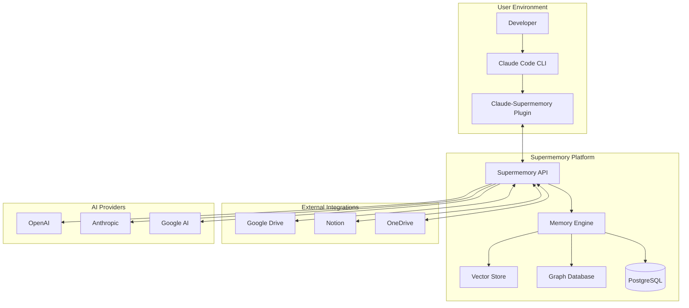

### Component Overview

| Component | Description |
|-----------|-------------|
| Claude Code CLI | Anthropic's official CLI tool for AI-assisted coding |
| Claude-Supermemory Plugin | JavaScript plugin that hooks into Claude Code lifecycle |
| Supermemory API | Unified HTTP API for memory operations |
| Memory Engine | Core processing pipeline for ingestion, embedding, and retrieval |
| Vector Store | Semantic similarity search using vector embeddings |
| Graph Database | Knowledge graph for relationship-based queries |
| PostgreSQL | Persistent storage via Drizzle ORM |

---

## Deep Dive: How Supermemory Works

### Core Philosophy

Supermemory is not a simple document storage system. It's designed to mirror how human memory works:
- **Forming connections** between related pieces of information
- **Evolving over time** as new information arrives
- **Generating insights** from accumulated knowledge
- **Smart forgetting** where less relevant information fades

When you upload a document, Supermemory doesn't just store it. It breaks it into hundreds of interconnected memories, each understanding its context and relationships to other knowledge.

### Why Dual Storage (Vector + Graph)?

**The Problem with Vector-Only Approaches:**
- Vector embeddings capture semantic similarity but relationships are **implicit**
- No understanding that "Supplier A ships to Germany" or "Product X requires temperature control"
- Cannot track how facts evolve over time

**The Solution - Knowledge Graph:**
- Relationships are **explicit** and queryable
- Enables sophisticated queries beyond simple similarity search
- Tracks memory evolution and contradictions

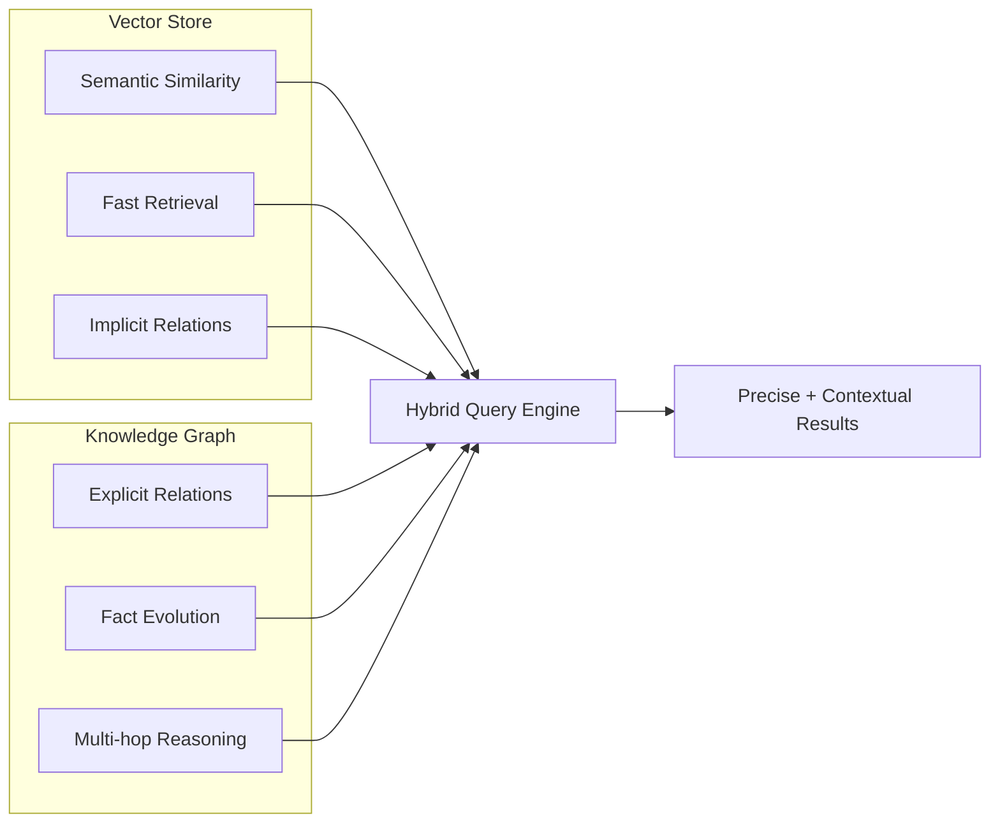

---

## Plugin Architecture

### Claude Code Integration Flow

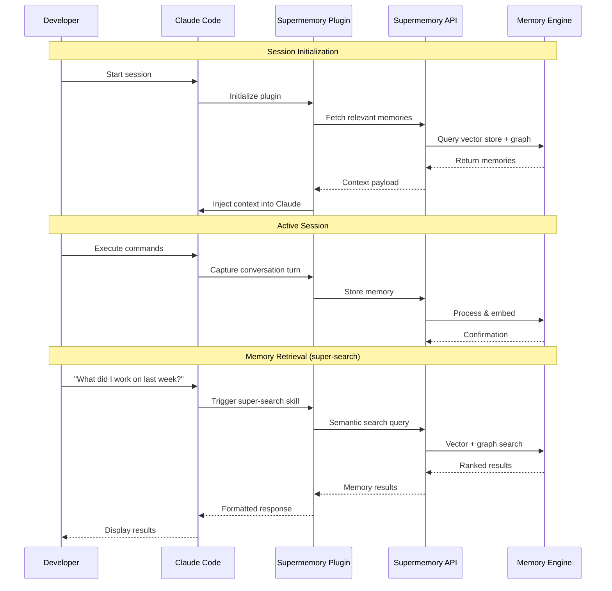

### Claude Code Hooks System

The plugin leverages Claude Code's hook system for memory capture:

| Hook Event | When It Fires | Plugin Action |
|------------|---------------|---------------|
| `Stop` | After Claude finishes responding | Capture conversation turn |
| `PreCompact` | Before context compaction | Archive full transcript |
| `PostToolUse` | After tool execution | Capture tool results |
| `SessionEnd` | When session terminates | Final sync to Supermemory |

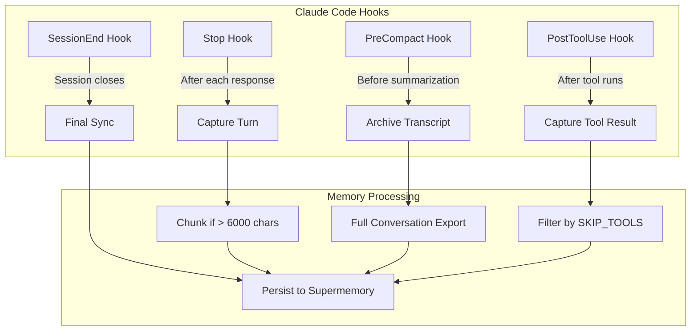

### Conversation Capture Detail

```
When a hook fires:
1. Extractor reads conversation transcript from last cursor position
2. IF new content > 6,000 characters:
   - Split into manageable chunks
   - Each chunk sent for embedding
3. Each chunk includes existing memories for context
4. Cursor file updated to track position
```

---

## Memory Engine Architecture

### Brain-Inspired Memory Layers

Like the human brain, Supermemory uses tiered memory with different access speeds:

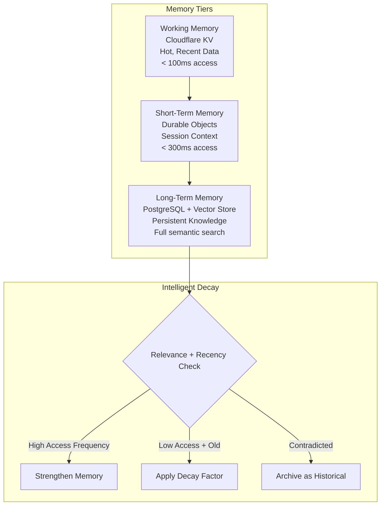

**Memory Characteristics:**
- **Recency Bias**: More recent information prioritized in retrieval
- **Access Frequency**: Frequently retrieved memories stay "sharp"
- **Smart Forgetting**: Like forgetting where you parked 3 weeks ago but remembering yesterday's meeting

### Data Ingestion Pipeline (Detailed)

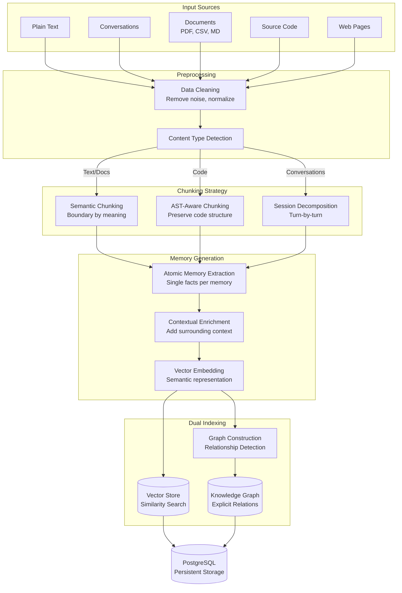

---

## Deep Dive: Conversation Indexing

### How Conversations Become Searchable Memories

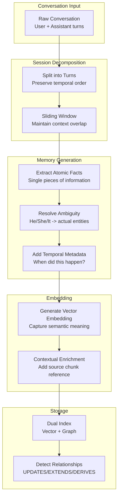

### The Two-Layer Retrieval Strategy

**Problem**: Balancing precision vs. context in retrieval

**Solution**: Supermemory's unique approach:

```
1. SEARCH on atomic memories (high signal, low noise)
   - Memories = single facts, very precise
   - Example: "User prefers TypeScript over JavaScript"

2. RETRIEVE the original source chunk
   - Contains "finer details" and nuance
   - Example: Full conversation where preference was expressed

3. INJECT both into LLM prompt
   - Atomic memory for precision
   - Source chunk for context
```

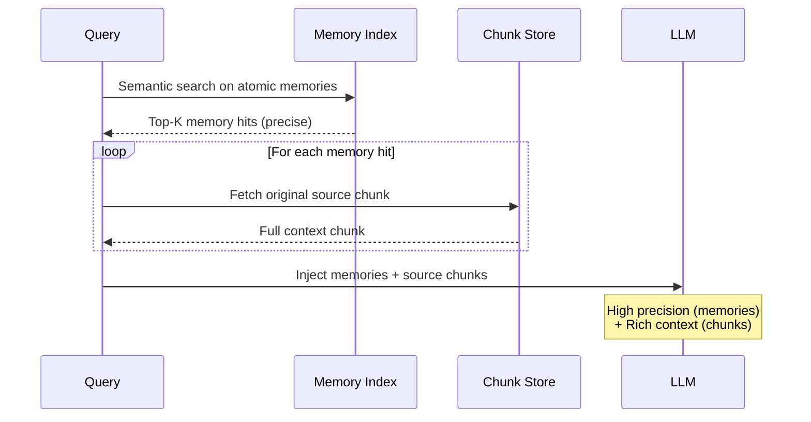

### Temporal Metadata & Dual-Timestamping

A key differentiator: every memory has two timestamps:

| Timestamp | Purpose |
|-----------|---------|
| `created_at` | When the memory was stored |
| `event_time` | When the event actually occurred |

This enables:
- **Temporal reasoning**: "What was I working on last Tuesday?"
- **Knowledge update tracking**: "What changed about X over time?"
- **Multi-session reasoning**: Connect events across different sessions

---

## Knowledge Graph Relationships

### The Three Relationship Types

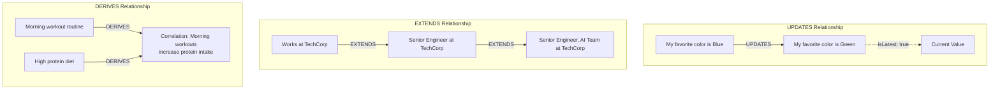

**1. UPDATES (State Mutation)**
- New information contradicts existing knowledge
- System tracks `isLatest` field
- Searches return current information by default
- Example: Address changes, preference updates

**2. EXTENDS (Refinement)**
- New information enriches existing knowledge
- No contradiction, just more detail
- Example: Adding job title to employment record

**3. DERIVES (Inference)**
- System infers connections from patterns
- Second-order logic from combining memories
- Surfaces insights user didn't explicitly state

---

## Chunking Strategies

### Semantic Chunking (for Text/Documents)

```
Algorithm:
1. Embed each sentence individually
2. Compute cosine distance between consecutive sentences
3. Start new chunk when distance > threshold (e.g., 95th percentile)
4. Result: Chunks aligned with semantic boundaries
```

**Why not fixed-size chunking?**
- Fixed chunks split meaningful units arbitrarily
- Semantic boundaries preserve coherent ideas
- Better retrieval precision

### AST-Aware Code Chunking (for Source Code)

Supermemory uses tree-sitter for structure-preserving code chunking:

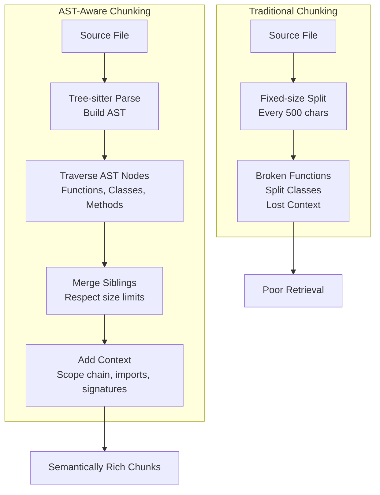

**What each code chunk contains:**
- The code itself (function, class, method)
- **Scope chain**: What class/module it belongs to
- **Imports**: Dependencies used
- **Siblings**: Related functions
- **Signatures**: Types and parameters

**Why this matters for embeddings:**
Embedding models are trained on natural language. When you embed `async getUser(id: string)`, the model doesn't know it's inside a `UserService` class or uses a `Database`. By prepending context, the embedding captures semantic relationships that pure code misses.

---

## Retrieval Architecture

### Hybrid Search (Vector + Graph)

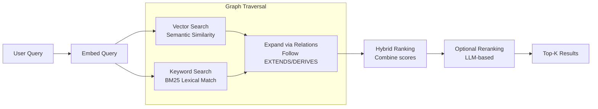

**Hybrid Search Benefits:**
- **Semantic**: Catches conceptually similar content
- **Lexical (BM25)**: Catches exact term matches
- **Graph Expansion**: Finds related memories not directly matching

### Context Injection Process

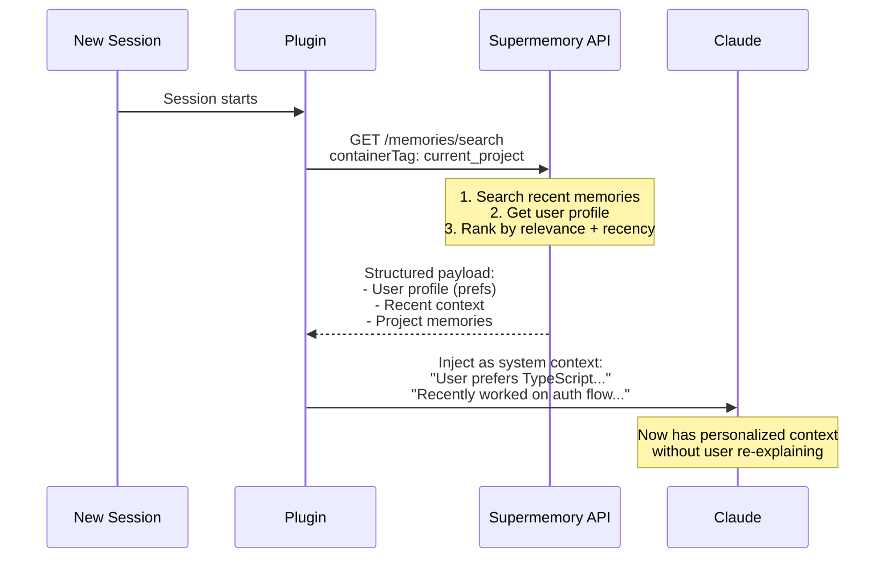

---

## Performance & Benchmarks

### LongMemEval Results

Supermemory achieves state-of-the-art on LongMemEval_s benchmark:

| Category | Supermemory Score | Notes |
|----------|-------------------|-------|
| Multi-Session | 71.43% | Connecting events across sessions |
| Temporal Reasoning | 76.69% | "What happened last week?" queries |
| Knowledge Update | High | Tracking fact changes over time |
| Information Extraction | High | Pulling specific facts |
| Abstention | High | Knowing when NOT to answer |

**Why Supermemory excels:**
- Dual-layer timestamping
- Atomic memory generation (high signal)
- Knowledge graph relationships
- Source chunk injection for context

### Performance Targets

| Metric | Target |
|--------|--------|
| Memory Recall | < 300ms |
| Scale | 50M tokens per user |
| Daily Throughput | 5B+ tokens globally |

---

## Data Model

### Memory Entity

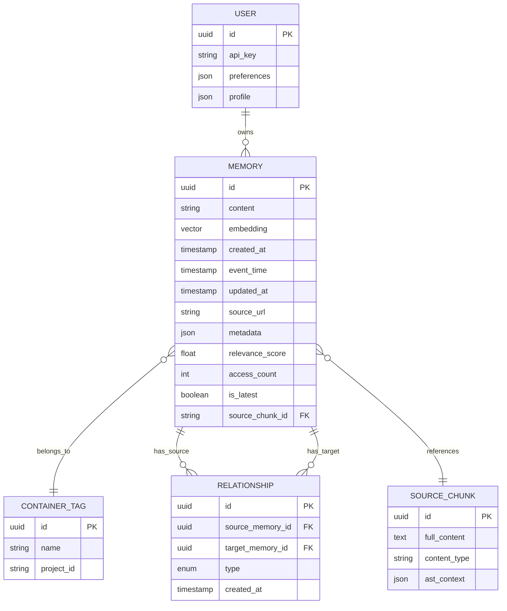

### Relationship Types Enum

```
UPDATES  - New info replaces old (contradictions)
EXTENDS  - New info enriches existing (additions)
DERIVES  - Inferred from combining memories
CHUNK_SEQUENCE - Sequential chunks from same source
```

---

## API Architecture

### Memory API Endpoints

| Endpoint | Method | Purpose |
|----------|--------|---------|
| `/v3/documents` | POST | Add new memory/document |
| `/memories/search` | GET | Semantic + keyword search |
| `/memories/:id` | GET | Retrieve specific memory |
| `/memories/:id` | PUT | Update memory |
| `/memories/:id` | DELETE | Remove memory |

### Key Parameters

**Adding Memories:**
```
content: string          - The actual content
containerTags: string[]  - Project/workspace identifiers
metadata: object         - Custom key-value pairs
customId: string         - For upsert functionality
```

**Searching:**
```
informationToGet: string  - Search terms
includeFullDocs: boolean  - Include source chunks (default: true)
limit: number             - Max results (default: 10)
containerTag: string      - Scope to project
```

### Memory Router (Drop-in Proxy)

For automatic memory without code changes:

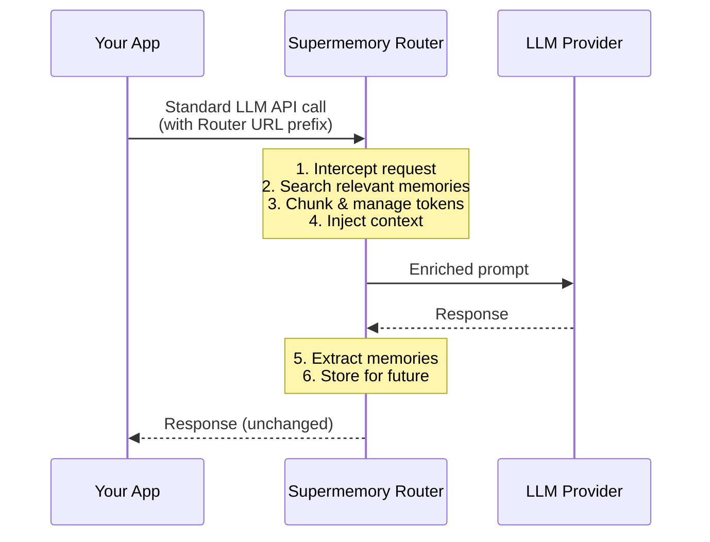

---

## Technology Stack

### Infrastructure

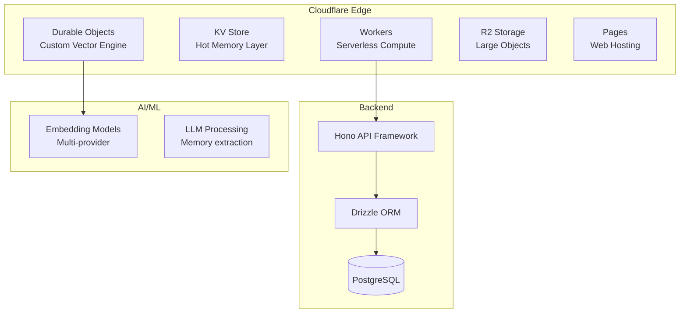

### Why Cloudflare Durable Objects?

Traditional approach problems:
- Database call after every message = expensive
- No DB call = inconsistencies if user opens multiple tabs
- WebSocket state management complexity

Durable Objects solution:
- Stateful serverless at the edge
- Built-in WebSocket support
- Consistent state across connections
- Scales automatically

---

## Configuration

### Environment Variables

| Variable | Required | Description |
|----------|----------|-------------|
| `SUPERMEMORY_CC_API_KEY` | Yes | API key from console.supermemory.ai |
| `SUPERMEMORY_SKIP_TOOLS` | No | Comma-separated tools to exclude from capture |
| `SUPERMEMORY_DEBUG` | No | Enable diagnostic logging |

### Settings File

**Location**: `~/.supermemory-claude/settings.json`

```
Settings include:
- Tool filtering preferences
- Capture preferences (what to store)
- Profile item limits
- Project-specific configurations
```

---

## Plugin Commands

| Command | Description |
|---------|-------------|
| `/claude-supermemory:index` | Index current project structure, architecture, and key files |
| `/claude-supermemory:logout` | Terminate session and remove stored credentials |

---

## Installation

1. Add from marketplace:
   ```
   /plugin marketplace add supermemoryai/claude-supermemory
   ```

2. Install plugin:
   ```
   /plugin install claude-supermemory
   ```

3. Configure API key:
   ```bash
   export SUPERMEMORY_CC_API_KEY="sm_..."
   ```

4. Obtain API key from [console.supermemory.ai](https://console.supermemory.ai)

**Note**: Requires Supermemory Pro subscription or higher.

---

## Sources

- [GitHub: supermemoryai/claude-supermemory](https://github.com/supermemoryai/claude-supermemory)
- [GitHub: supermemoryai/supermemory](https://github.com/supermemoryai/supermemory)
- [GitHub: supermemoryai/code-chunk](https://github.com/supermemoryai/code-chunk)
- [Supermemory Documentation](https://supermemory.ai/docs)
- [Supermemory: How It Works](https://supermemory.ai/docs/how-it-works)
- [Supermemory Research](https://supermemory.ai/research)
- [LongMemEval Benchmark](https://github.com/xiaowu0162/LongMemEval)
- [Claude Code Hooks Reference](https://code.claude.com/docs/en/hooks)
- [cAST: AST-based Code Chunking (CMU)](https://arxiv.org/abs/2506.15655)