# Clawdbot Memory Architecture - Complete Guide with Mermaid Diagrams

This document explains the complete memory architecture of Clawdbot, an open-source personal AI assistant. All diagrams are provided in Mermaid format for easy visualization.

---

## 1. HIGH-LEVEL ARCHITECTURE OVERVIEW

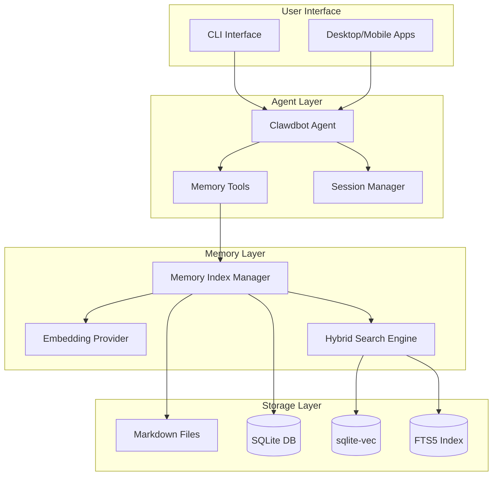

---

## 2. CONTEXT vs MEMORY

Understanding the distinction between context and memory is fundamental:

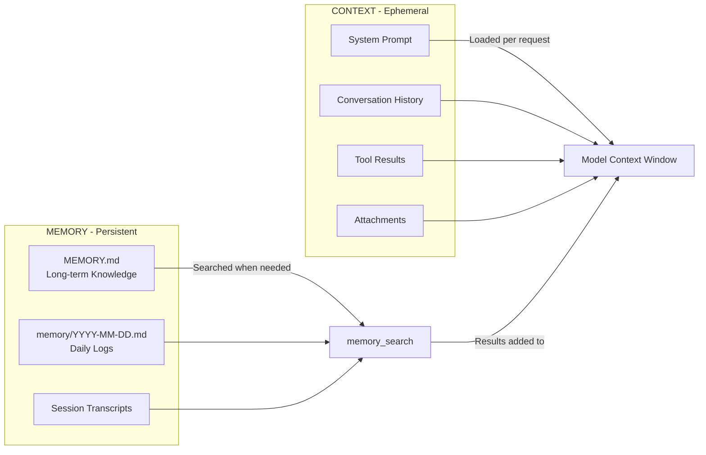

**CONTEXT Properties:**

- Ephemeral: exists only for this request
- Bounded: limited by model's context window (200K tokens for Claude)
- Expensive: every token counts toward API costs

**MEMORY Properties:**

- Persistent: survives restarts, days, months
- Unbounded: can grow indefinitely
- Cheap: no API cost to store
- Searchable: indexed for semantic retrieval

---

## 3. TWO-LAYER MEMORY SYSTEM

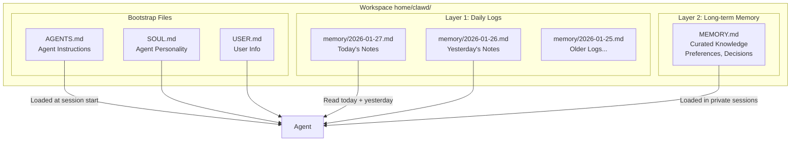

**Layer 1 - Daily Logs (memory/YYYY-MM-DD.md):**

- Append-only daily notes
- Agent writes throughout the day
- Timestamp-based organization

**Layer 2 - Long-term Memory (MEMORY.md):**

- Curated, persistent knowledge
- Significant decisions, preferences
- Important facts and lessons learned

---

## 4. MEMORY TOOLS FLOW

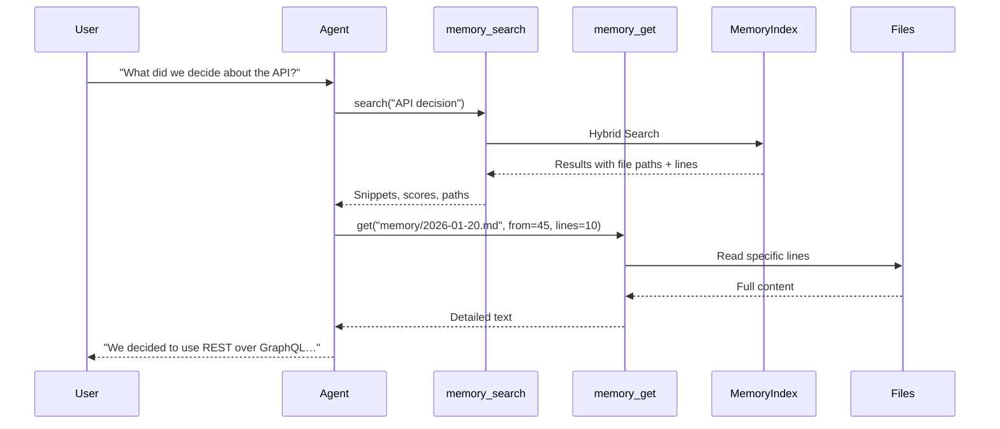

**Memory_search Tool:**

- Purpose: Find relevant memories semantically
- Parameters: query, maxResults, minScore
- Returns: snippets with path, line range, score

**Memory_get Tool:**

- Purpose: Read specific content after finding it
- Parameters: path, from (line), lines (count)
- Returns: Full text content from file

---

## 5. MEMORY INDEXING PIPELINE

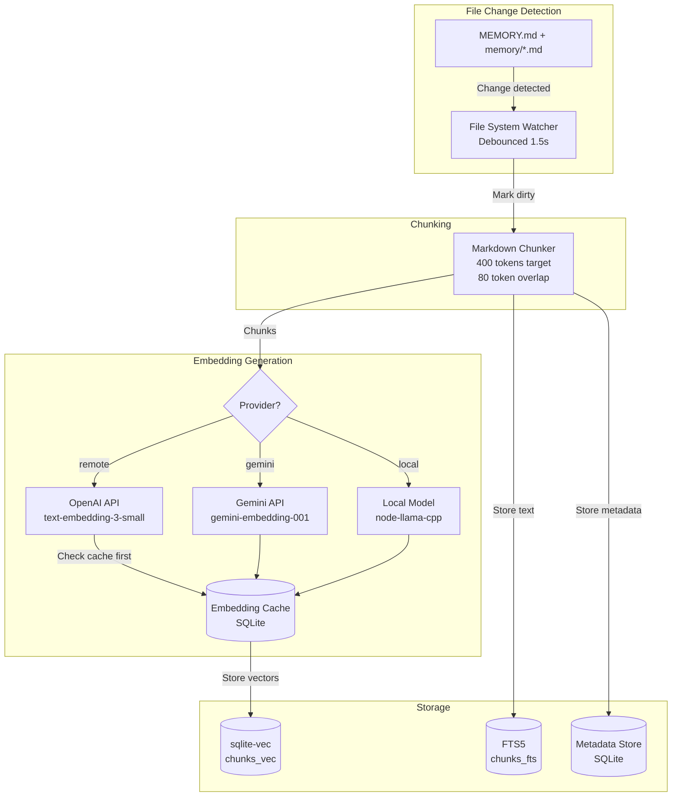

---

## 6. HYBRID SEARCH ALGORITHM

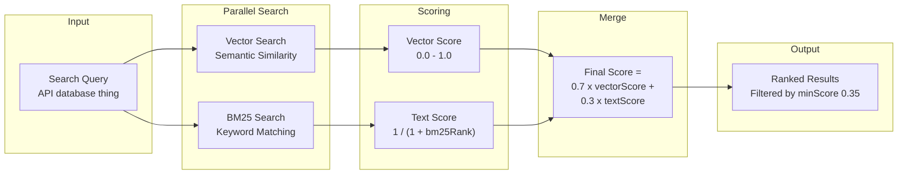

**Why 70/30 Weighting?**

- Semantic similarity (70%): Primary signal for memory recall
- BM25 keywords (30%): Catches exact matches like IDs, code symbols, env vars

**Example Searches:**

- Semantic: "Mac Studio gateway host" ≈ "the machine running the gateway"
- Keyword: "a828e60" (commit ID) needs exact match

---

## 7. COMPACTION LIFECYCLE

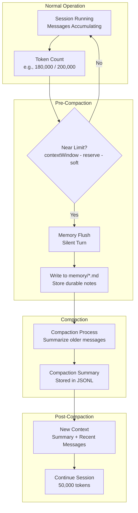

**Compaction Flow:**

1. Context approaches limit (e.g., 180K/200K tokens)
2. Memory flush: silent turn to save durable memories
3. Compaction: older conversation summarized
4. Summary persisted to JSONL file
5. Session continues with compact context

**Manual Compaction:** `/compact [instructions]`

---

## 8. SESSION LIFECYCLE

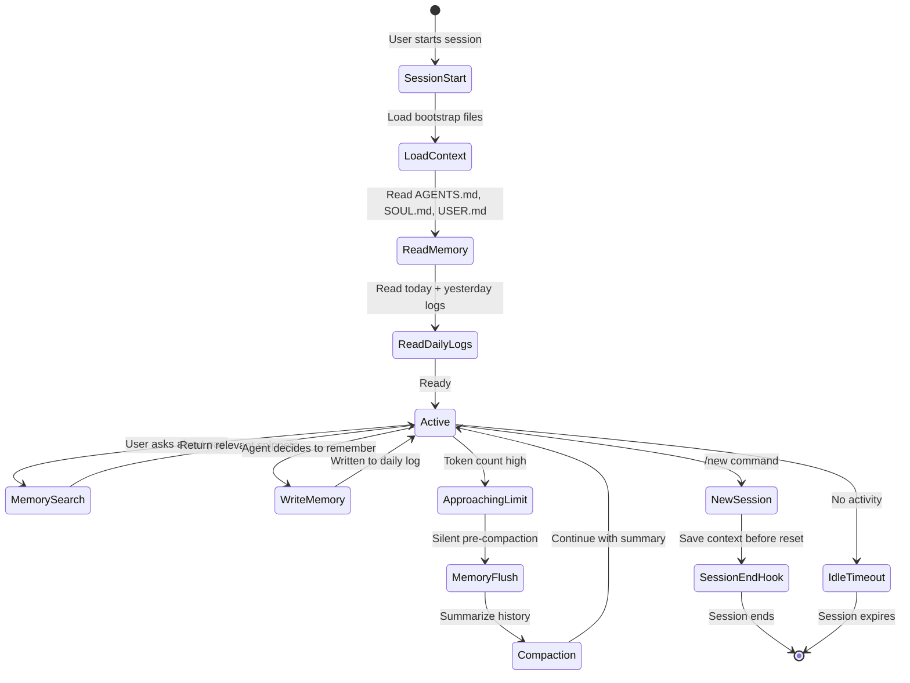

**Session Reset Rules:**

- Configurable: calendar day boundary
- Manual: `/new` or `/reset` commands
- Timeout: after idle period

---

## 9. MULTI-AGENT MEMORY ISOLATION

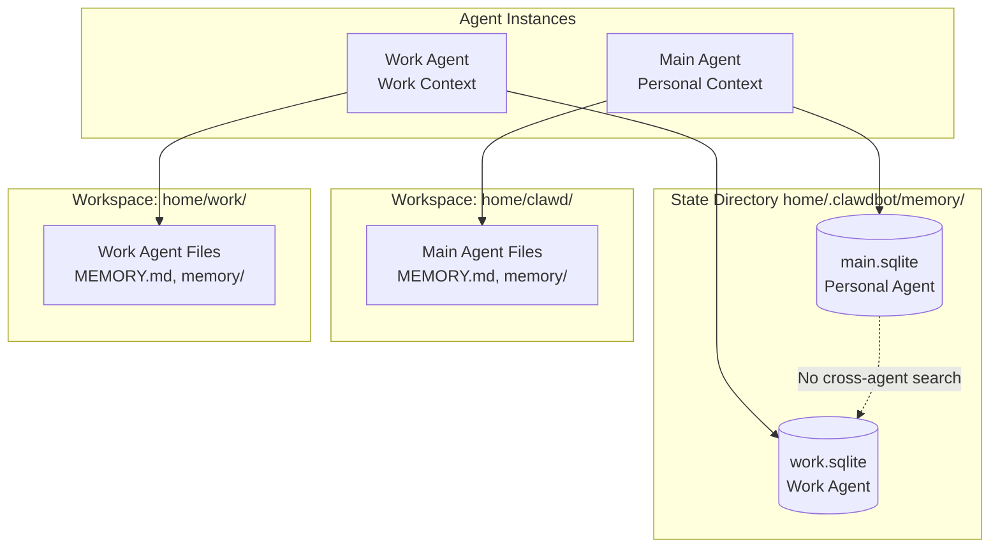

**Key Points:**

- Each agent has complete memory isolation
- Keyed by agentId + workspaceDir
- Markdown files (source) in each workspace
- SQLite indexes (derived) in state directory
- Agents cannot read each other's memories by default
- Workspace is a soft sandbox (can be escaped with file tools)

---

## 10. PRUNING vs COMPACTION

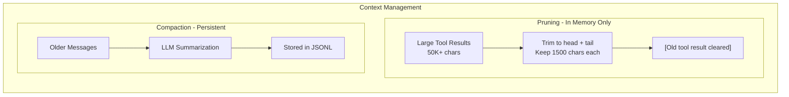

**Pruning:**

- Trims large tool outputs
- In-memory only (per request)
- JSONL on disk unchanged
- Cache-TTL mode: prune after cache expires

**Compaction:**

- Summarizes conversation history
- Persists summary to disk
- Lossy process (info may be lost)
- Memory flush saves important bits first

---

## 11. COMPLETE DATA FLOW DIAGRAM

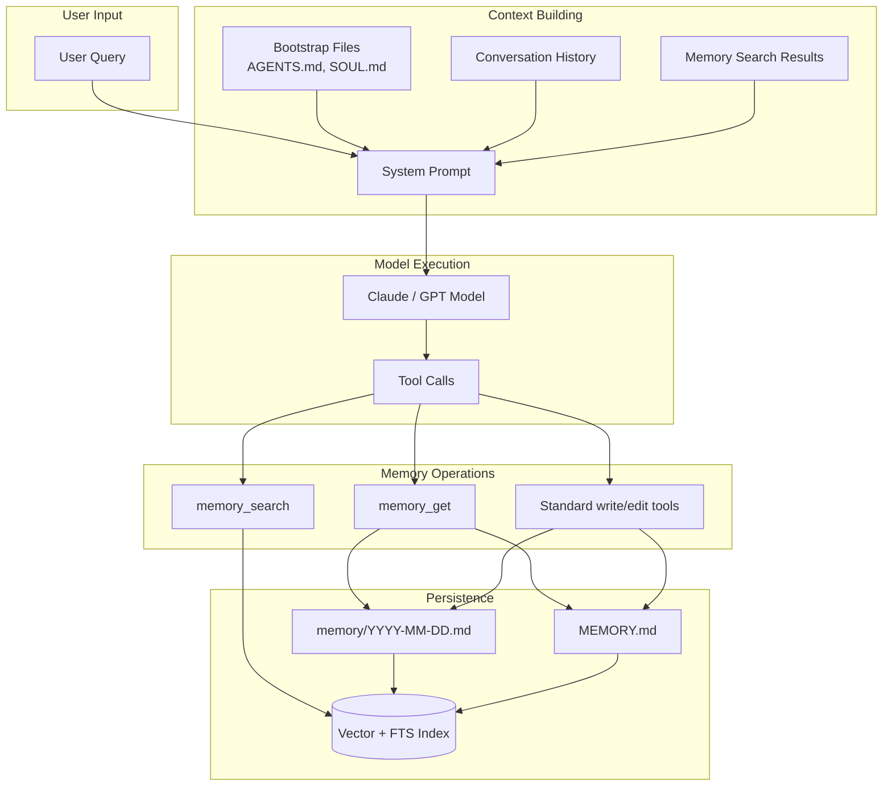

---

## 12. CONFIGURATION REFERENCE

### Key Configuration Paths

**Memory Search:**

```json
{
  "Agents": {
    "Defaults": {
      "memorySearch": {
        "Provider": "openai",
        "Model": "text-embedding-3-small",
        "Fallback": "openai",
        "Query": {
          "maxResults": 10,
          "minScore": 0.35,
          "Hybrid": {
            "Enabled": true,
            "vectorWeight": 0.7,
            "textWeight": 0.3
          }
        }
      }
    }
  }
}
```

**Compaction:**

```json
{
  "Agents": {
    "Defaults": {
      "Compaction": {
        "reserveTokensFloor": 20000,
        "memoryFlush": {
          "Enabled": true,
          "softThresholdTokens": 4000,
          "systemPrompt": "Session nearing compaction...",
          "Prompt": "Write lasting notes to memory/YYYY-MM-DD.md..."
        }
      }
    }
  }
}
```

**Context Pruning:**

```json
{
  "Agent": {
    "contextPruning": {
      "Mode": "cache-ttl",
      "Ttl": 600,
      "keepLastAssistants": 3,
      "softTrim": {
        "maxChars": 4000,
        "headChars": 1500,
        "tailChars": 1500
      }
    }
  }
}
```

---

## 13. KEY DESIGN PRINCIPLES

1. **TRANSPARENCY OVER BLACK BOXES**
   - Memory is plain Markdown
   - You can read, edit, version control
   - No opaque databases or proprietary formats

2. **SEARCH OVER INJECTION**
   - Agent searches for relevant memories
   - Not everything stuffed into context
   - Keeps context lean and focused

3. **PERSISTENCE OVER SESSION**
   - Important info survives in files
   - Compaction can't delete disk memories
   - Long-term knowledge preserved

4. **HYBRID OVER PURE**
   - Vector search catches semantic matches
   - BM25 catches exact keywords
   - Best of both worlds

---

## END OF DOCUMENT

For more information, visit:

- GitHub: https://github.com/clawdbot/clawdbot
- Documentation: https://docs.clawd.bot/
