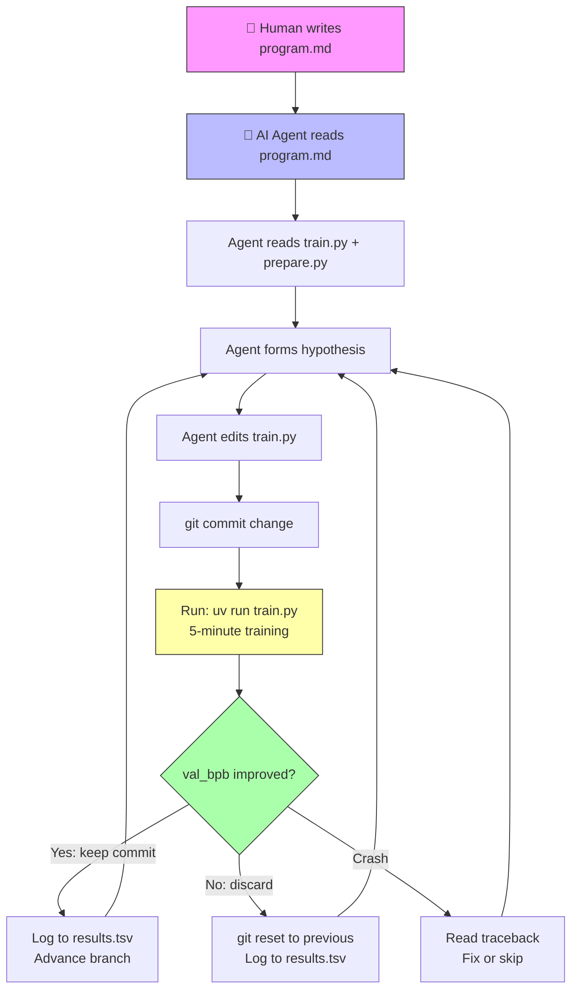
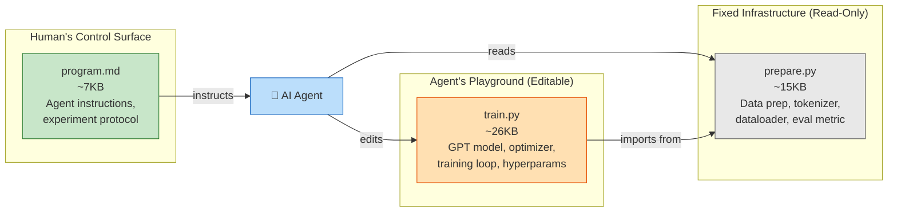
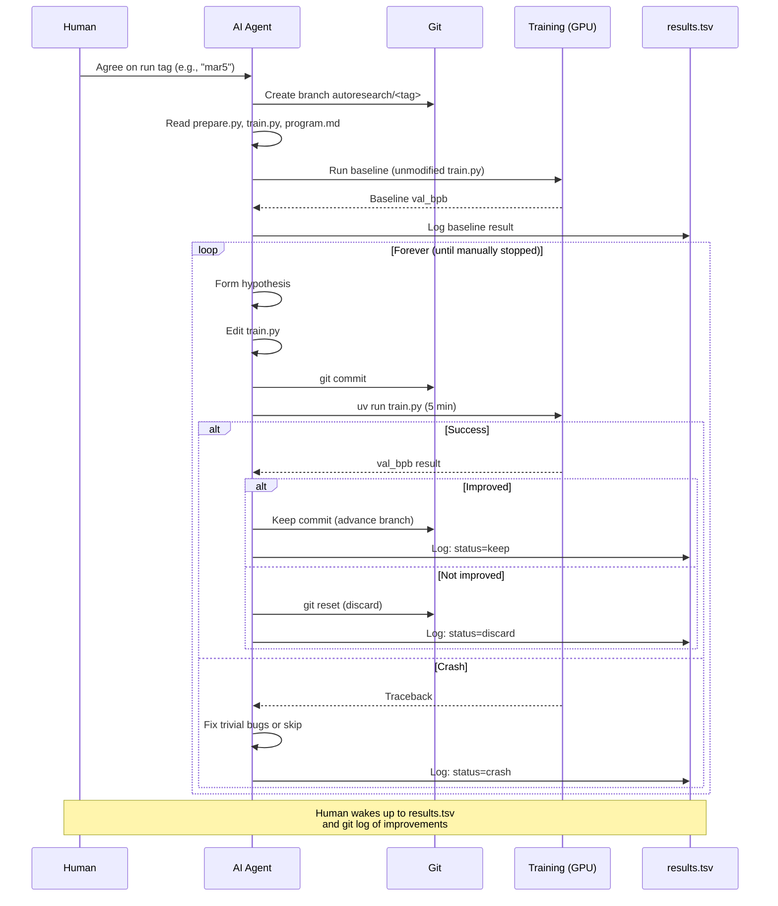
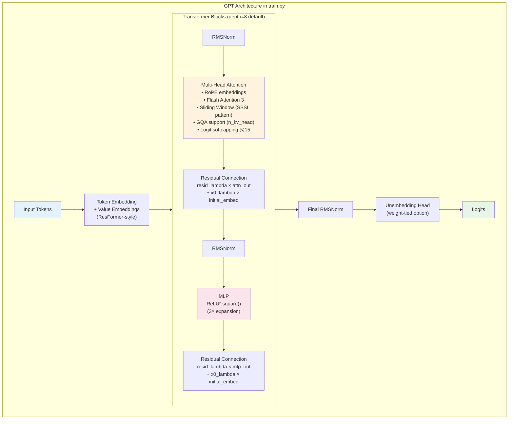
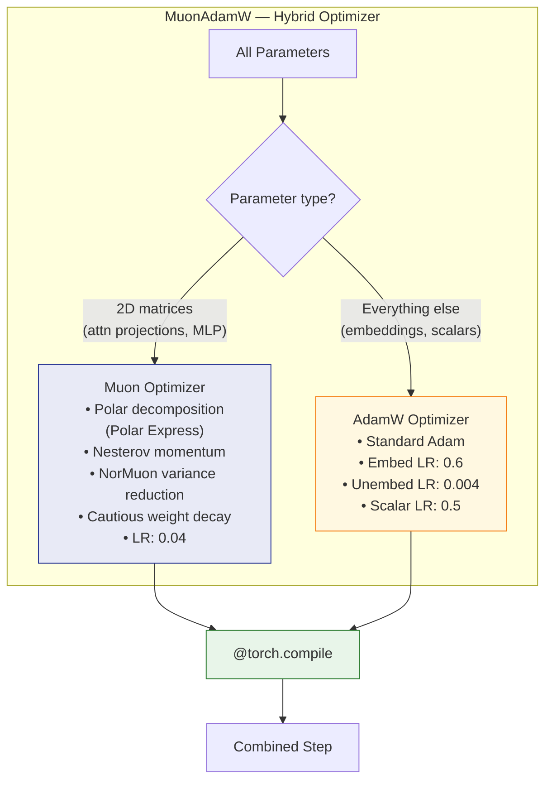
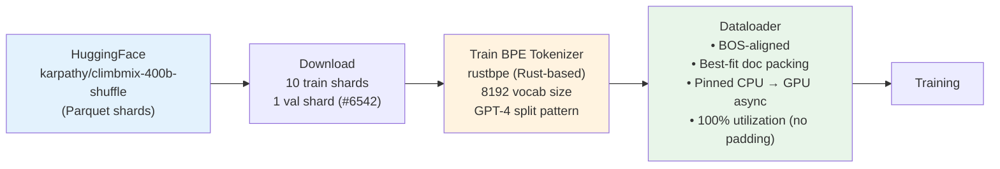
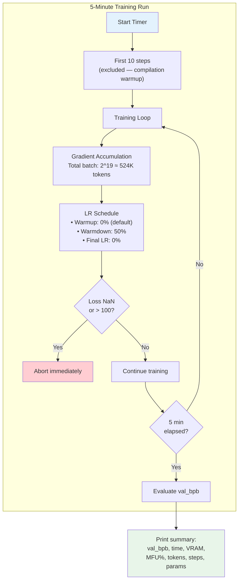
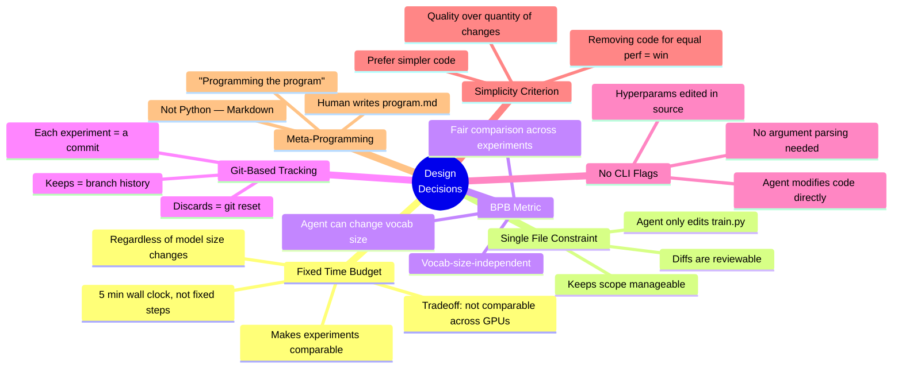
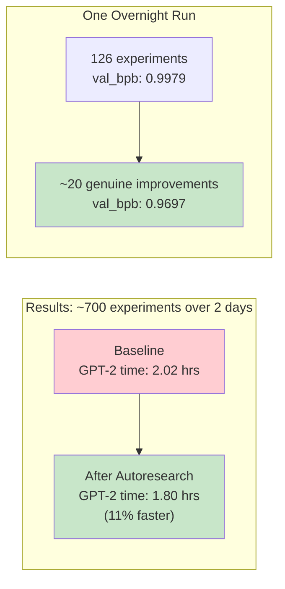

# Karpathy's Autoresearch: Complete Guide

> *"One day, frontier AI research used to be done by meat computers in between eating, sleeping, having other fun... Research is now entirely the domain of autonomous swarms of AI agents running across compute cluster megastructures in the skies."* — [@karpathy, March 2026](https://github.com/karpathy/autoresearch)

**Repository**: [github.com/karpathy/autoresearch](https://github.com/karpathy/autoresearch)
**Created**: March 6, 2026 | **License**: MIT | **Stars**: ~32K | **Language**: Python

---

## What Is Autoresearch?

Autoresearch is Karpathy's framework for **autonomous AI-driven ML research**. The idea: give an AI coding agent (Claude, Codex, etc.) a small but real LLM training setup and let it **experiment autonomously overnight**. The agent modifies training code, trains for 5 minutes, checks if validation loss improved, keeps or discards the change, and repeats indefinitely.

You wake up to a log of experiments and a better model.

---

## High-Level Architecture



---

## The Three-File Architecture

The repo is **deliberately minimal** — only 3 files matter:



| File | Role | Who Edits It? |
|------|------|---------------|
| `prepare.py` | Fixed constants, data download, BPE tokenizer training, dataloader, BPB evaluation | **Nobody** (read-only) |
| `train.py` | Full GPT model, Muon+AdamW optimizer, training loop, hyperparameters | **The AI agent** |
| `program.md` | Instructions/prompt for the agent — the "research org code" | **The human** |

**Key insight**: You're not programming Python anymore; you're programming the `program.md` Markdown file that instructs AI agents on how to do research.

---

## The Experiment Loop (Detailed)



### Setup Phase
1. Agree on a run tag (e.g., `mar5`)
2. Create branch `autoresearch/<tag>` from master
3. Read all in-scope files for context
4. Verify data exists at `~/.cache/autoresearch/`
5. Create `results.tsv` with header
6. Run baseline experiment (unmodified `train.py`)

### Each Experiment
1. Look at git state (current branch/commit)
2. Form a hypothesis and edit `train.py`
3. `git commit` the change
4. Run `uv run train.py > run.log 2>&1` (5-minute training)
5. Read results: `grep "^val_bpb:\|^peak_vram_mb:" run.log`
6. If crashed → read traceback, attempt fix or skip
7. Log results to `results.tsv` (untracked by git)
8. If val_bpb **improved** (lower) → keep the commit, advance the branch
9. If val_bpb **equal or worse** → `git reset` back to previous state
10. **GOTO 1. NEVER STOP.**

From `program.md`: *"The human might be asleep... expects you to continue working indefinitely until you are manually stopped."*

---

## Model Architecture (train.py)



### GPTConfig Defaults

| Parameter | Value | Notes |
|-----------|-------|-------|
| `sequence_len` | 2048 | Context length |
| `vocab_size` | 8192 | Small BPE vocabulary |
| `n_layer` | 8 | Depth (agent can change) |
| `n_head` | auto | Based on n_embd / HEAD_DIM(128) |
| `n_kv_head` | same as n_head | GQA ratio |
| `n_embd` | 512 | depth × aspect_ratio(64), rounded |
| `window_pattern` | "SSSL" | Short/Long window alternation |

### Key Architectural Features
- **RMSNorm** via `F.rms_norm`
- **Rotary Position Embeddings (RoPE)**
- **Flash Attention 3** via `kernels` package (Hopper-native, with non-Hopper fallback)
- **Sliding Window Attention**: `"SSSL"` pattern — alternating short (half-context) and long (full-context) windows
- **Value Embeddings** (ResFormer-style): alternating layers get learned value embeddings with input-dependent gating
- **Residual Scaling**: per-layer learnable `resid_lambdas` and `x0_lambdas` (skip connection from initial embedding)
- **Logit Softcapping** at 15
- **Activation**: `ReLU().square()` (ReGLU-like without the gate)

---

## Optimizer: MuonAdamW



- LRs scaled by `1/sqrt(d_model/768)` for width-independence
- Muon momentum ramps from 0.85 → 0.95 over first 300 steps
- Weight decay linearly decays to 0
- Both optimizers are `@torch.compile`-d for performance

---

## Data Pipeline (prepare.py)



### Fixed Constants in prepare.py

| Constant | Value | Purpose |
|----------|-------|---------|
| `MAX_SEQ_LEN` | 2048 | Context length |
| `TIME_BUDGET` | 300 | 5 minutes wall clock per experiment |
| `EVAL_TOKENS` | ~20M | Validation evaluation size |
| `VOCAB_SIZE` | 8192 | BPE vocabulary size |

### Evaluation Metric: Bits per Byte (BPB)
Unlike cross-entropy loss, BPB is **vocab-size-independent** — meaning the agent can even change the tokenizer vocabulary size and still get a fair comparison across experiments.

---

## Training Loop Details



### Performance Optimizations
- GC disabled after step 0 (Python GC causes ~500ms stalls), collected every 5000 steps
- Pinned CPU buffers + async GPU transfer
- `@torch.compile` on optimizer steps
- Flash Attention 3 (Hopper-native)

---

## Dependencies

```
dependencies = [
    "kernels>=0.11.7",     # Flash Attention 3 kernels
    "matplotlib>=3.10.8",  # for analysis notebook
    "numpy>=2.2.6",
    "pandas>=2.3.3",
    "pyarrow>=21.0.0",     # parquet data loading
    "requests>=2.32.0",    # data download
    "rustbpe>=0.1.0",      # Rust BPE tokenizer training
    "tiktoken>=0.11.0",    # tokenizer runtime
    "torch==2.9.1",        # PyTorch (pinned, CUDA 12.8)
]
```

Uses **`uv`** as the package manager with a custom PyTorch index for CUDA 12.8.

---

## Design Decisions



### Key Decision Rationale

1. **Fixed time budget (not fixed steps)**: Training always runs exactly 5 minutes. This makes experiments comparable regardless of what the agent changes (model size, batch size, architecture).

2. **BPB metric (not cross-entropy loss)**: Bits per Byte is vocab-size-independent, allowing fair comparison even when the agent changes vocabulary size.

3. **Git-based experiment tracking**: Each experiment is a commit. Keeps become branch history; discards are reset. Simple, effective, no extra tooling.

4. **Simplicity criterion** from `program.md`: *"A 0.001 val_bpb improvement that adds 20 lines of hacky code? Probably not worth it. A 0.001 improvement from deleting code? Definitely keep."*

---

## Real-World Results



### Specific Improvements Discovered by the Agent
- Adding a scaler to parameterless QKnorm to sharpen attention
- Applying regularization to Value Embeddings
- Widening banded attention windows
- Correcting AdamW betas
- Tuning weight decay schedules and initialization

Karpathy noted this was **surprising** because he already had 20 years of manual optimization experience and thought the codebase was well-tuned.

---

## The Paradigm Shift

```mermaid
graph TD
    subgraph "Traditional ML Research"
        H1["Human reads papers"] --> H2["Human forms hypothesis"]
        H2 --> H3["Human writes code"]
        H3 --> H4["Human runs experiment"]
        H4 --> H5["Human analyzes results"]
        H5 --> H2
        H5 -.->|"~2-5 experiments/day"| Speed1["Slow iteration"]
    end

    subgraph "Autoresearch Paradigm"
        P["Human writes program.md"] --> Agent["AI Agent runs autonomously"]
        Agent -->|"~100+ experiments/night"| Results["Results in results.tsv<br/>+ git log of improvements"]
    end

    style Speed1 fill:#ffcdd2
    style Results fill:#c8e6c9
    style P fill:#e8eaf6
```



---

## Community and Ecosystem

### Forks for Different Platforms
| Fork | Platform | Link |
|------|----------|------|
| `miolini/autoresearch-macos` | macOS | [GitHub](https://github.com/miolini/autoresearch-macos) |
| `trevin-creator/autoresearch-mlx` | macOS/MLX | [GitHub](https://github.com/trevin-creator/autoresearch-mlx) |
| `jsegov/autoresearch-win-rtx` | Windows/RTX | [GitHub](https://github.com/jsegov/autoresearch-win-rtx) |

### Karpathy's Vision for Next Steps
From [Twitter](https://x.com/karpathy/status/2030705271627284816):
> *"The next step for autoresearch is that it has to be asynchronously massively collaborative for agents (think: SETI@home style). The goal is not to emulate a single PhD student, it's to emulate a research community of them."*

---

## Further Reading

| Source | Link |
|--------|------|
| **GitHub Repo** | [github.com/karpathy/autoresearch](https://github.com/karpathy/autoresearch) |
| **VentureBeat** | ["Karpathy's autoresearch lets you run hundreds of AI experiments a night"](https://venturebeat.com/technology/andrej-karpathys-new-open-source-autoresearch-lets-you-run-hundreds-of-ai) |
| **MarkTechPost** | ["A 630-Line Python Tool Letting AI Agents Run Autonomous ML Experiments"](https://www.marktechpost.com/2026/03/08/andrej-karpathy-open-sources-autoresearch-a-630-line-python-tool-letting-ai-agents-run-autonomous-ml-experiments-on-single-gpus/) |
| **Ken Huang Substack** | ["Exploring Karpathy's Autoresearch"](https://kenhuangus.substack.com/p/exploring-andrej-karpathys-autoresearch) |
| **Philipp Schmid** | ["How Autoresearch will change Small Language Models"](https://www.philschmid.de/autoresearch) |
| **Context Studios** | ["A Prompt Replaces the Paper"](https://www.contextstudios.ai/blog/karpathy-autoresearch-prompt-replaces-paper) |
| **Medium (Nikhil)** | ["Getting Started with autoresearch — Full Guide"](https://medium.com/modelmind/getting-started-with-andrej-karpathys-autoresearch-full-guide-c2f3a80b9ce6) |
| **Analytics Vidhya** | ["AI That Improves Its Own Training"](https://www.analyticsvidhya.com/blog/2026/03/nanochat-gpt-2-training/) |

---

*Research compiled March 2026. Repository: [karpathy/autoresearch](https://github.com/karpathy/autoresearch)*
