# mem0 — Architecture & Claude Code Integration Guide

> **Repository:** [github.com/mem0ai/mem0](https://github.com/mem0ai/mem0)
> **Current Release:** v1.0.0 (API modernization milestone)
> **License:** Apache 2.0

---

## Table of Contents

1. [What Is mem0?](#1-what-is-mem0)
2. [High-Level Repository Layout](#2-high-level-repository-layout)
3. [Core Architecture Overview](#3-core-architecture-overview)
4. [Memory Layer Deep Dive](#4-memory-layer-deep-dive)
5. [Data Flow: `add()` — Storing a Memory](#5-data-flow-add--storing-a-memory)
6. [Data Flow: `search()` — Retrieving Memories](#6-data-flow-search--retrieving-memories)
7. [The Dual-Store Strategy: Vector + Graph](#7-the-dual-store-strategy-vector--graph)
8. [Configuration System](#8-configuration-system)
9. [LLM Integrations](#9-llm-integrations)
10. [Embedding Providers](#10-embedding-providers)
11. [Vector Store Backends](#11-vector-store-backends)
12. [Graph Store Backends](#12-graph-store-backends)
13. [Reranking Pipeline](#13-reranking-pipeline)
14. [Hosted Platform vs. Self-Hosted](#14-hosted-platform-vs-self-hosted)
15. [OpenMemory — Local MCP Server](#15-openmemory--local-mcp-server)
16. [Using mem0 with Claude Code](#16-using-mem0-with-claude-code)
17. [Key Design Patterns](#17-key-design-patterns)
18. [Performance Benchmarks (from Research Paper)](#18-performance-benchmarks-from-research-paper)

---

## 1. What Is mem0?

mem0 ("mem-zero") is an **intelligent, persistent memory layer** for AI agents and assistants. Instead of passing full conversation history into every prompt (expensive, slow, lossy), mem0 extracts, deduplicates, and stores discrete *memory facts* that can be semantically retrieved on-demand. The result is:

- **+26% accuracy** vs OpenAI Memory on the LOCOMO benchmark
- **91% faster** responses than full-context injection
- **90% fewer tokens** consumed vs full-context methods

It supports three memory scopes:

| Scope | Identifier | Use-case |
|---|---|---|
| **User memory** | `user_id` | Preferences, history, personal facts |
| **Session memory** | `run_id` | Ephemeral in-session context |
| **Agent memory** | `agent_id` | The agent's own behaviour and style |

---

## 2. High-Level Repository Layout

```
mem0ai/mem0/
├── mem0/                   ← Core Python library (pip install mem0ai)
│   ├── client/             ← Managed API client (MemoryClient)
│   ├── configs/            ← Pydantic config classes & prompts
│   ├── embeddings/         ← Embedding provider adapters (15)
│   ├── graphs/             ← Graph memory tools & configs
│   ├── llms/               ← LLM provider adapters (19)
│   ├── memory/             ← Core Memory class + graph/kuzu/memgraph
│   ├── proxy/              ← OpenAI-compatible proxy layer
│   ├── reranker/           ← Re-ranking backends (5)
│   ├── utils/              ← Factory classes, helpers
│   └── vector_stores/      ← Vector store adapters (25)
├── openmemory/             ← Self-hosted MCP server + UI
│   ├── api/                ← FastAPI backend + MCP server
│   └── ui/                 ← Next.js frontend
├── mem0-ts/                ← TypeScript/Node.js SDK
├── vercel-ai-sdk/          ← Vercel AI SDK integration
├── server/                 ← Standalone REST server
├── examples/               ← Demo applications
├── cookbooks/              ← Jupyter notebook guides
├── evaluation/             ← Benchmarking suite
└── tests/                  ← Test suite
```

---

## 3. Core Architecture Overview

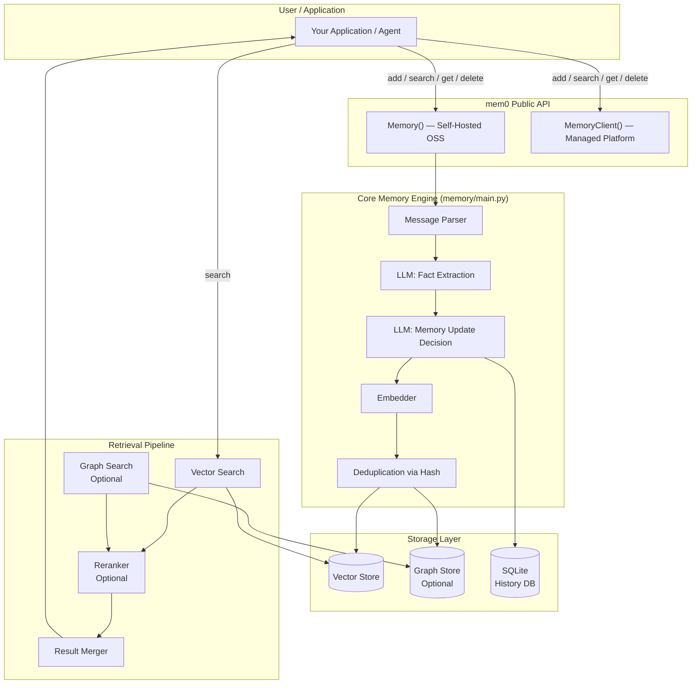

---

## 4. Memory Layer Deep Dive

The `Memory` class (`mem0/memory/main.py`) is the heart of the library. It exposes both a **synchronous** and an **asynchronous** (`AsyncMemory`) implementation with identical semantics.

### Class Hierarchy

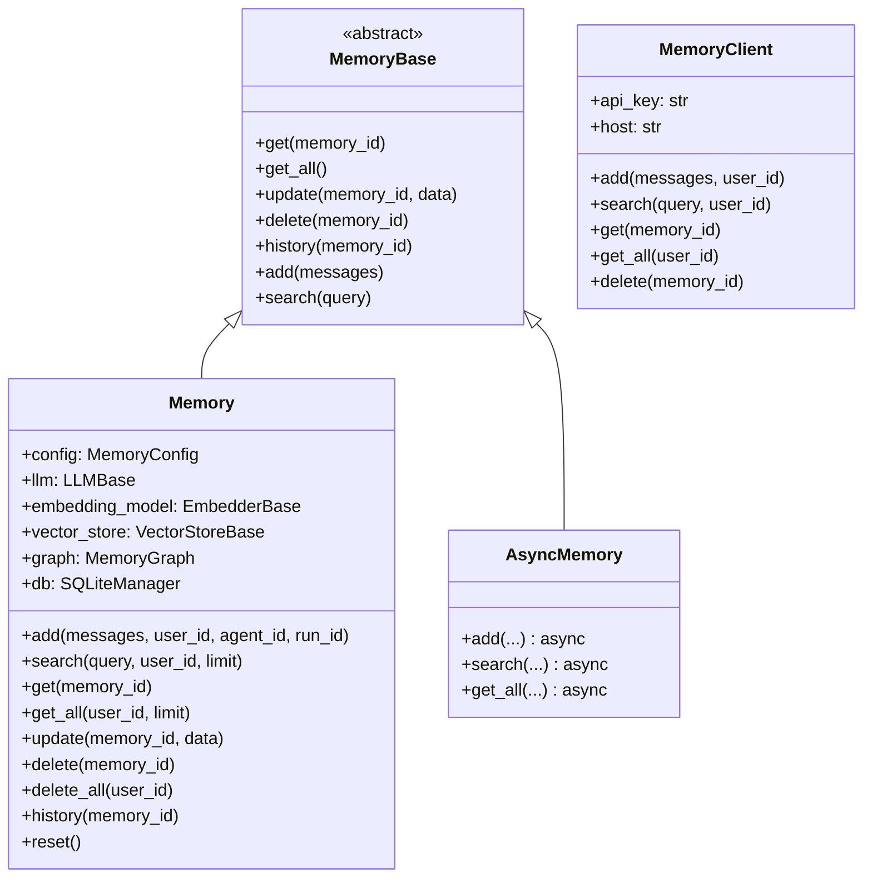

### MemoryConfig — The Central Configuration Object

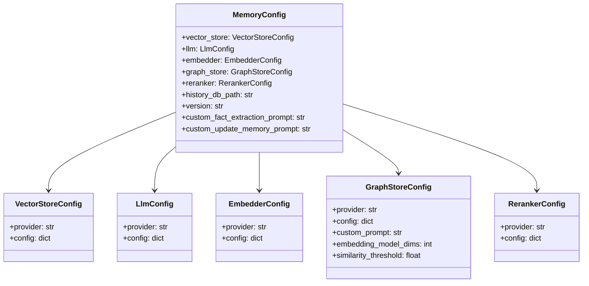

### MemoryItem — The Atom of Storage

```python
class MemoryItem(BaseModel):
    id: str          # UUID
    memory: str      # The extracted fact text
    hash: str        # SHA256 for deduplication
    metadata: dict   # user_id, agent_id, run_id, custom keys
    score: float     # Similarity score (on retrieval)
    created_at: str
    updated_at: str
```

---

## 5. Data Flow: `add()` — Storing a Memory

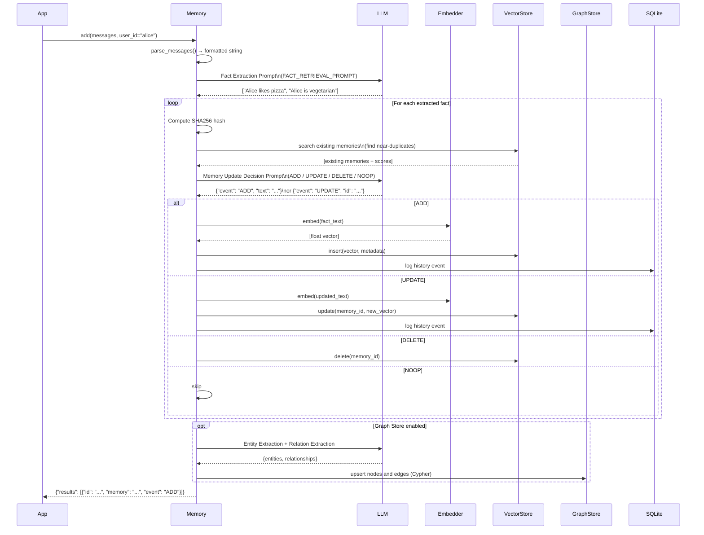

---

## 6. Data Flow: `search()` — Retrieving Memories

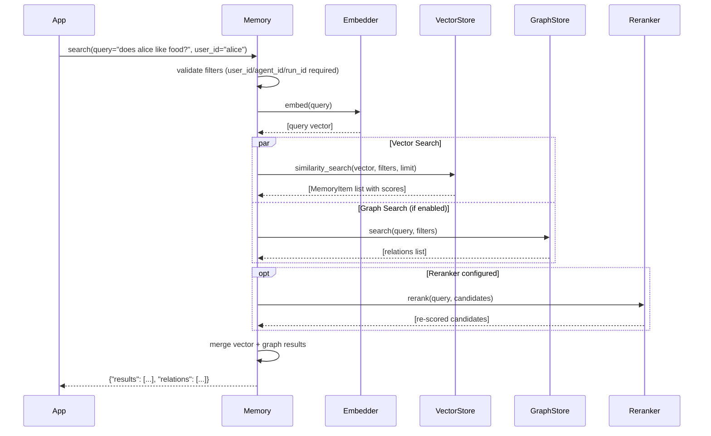

---

## 7. The Dual-Store Strategy: Vector + Graph

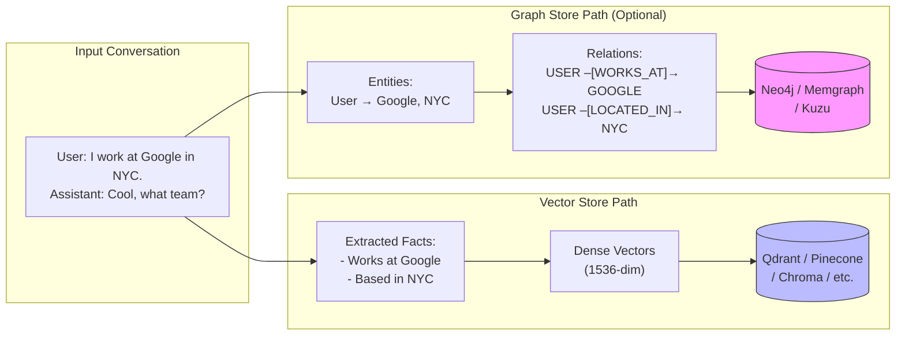

The **vector store** handles semantic similarity search across facts. The **graph store** (optional) captures *structural relationships* between entities — enabling traversal queries like "what does Alice know about her colleagues?" — complementing the vector search with relational reasoning.

---

## 8. Configuration System

### Factory Pattern

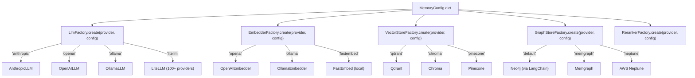

All factories use **lazy dynamic imports** (`importlib.import_module`) so you only pay the dependency cost for the providers you actually configure.

---

## 9. LLM Integrations

The LLM is used for **two critical tasks**: extracting facts from conversations and deciding whether to ADD / UPDATE / DELETE / NOOP existing memories.

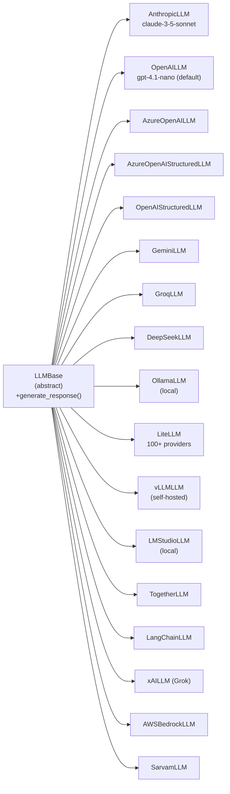

The `AnthropicLLM` adapter handles the Anthropic-specific requirement of extracting `system` messages from the messages list and passing them via the dedicated `system=` parameter of `client.messages.create()`.

---

## 10. Embedding Providers

Embeddings convert memory text and search queries into vectors for similarity search.

| Provider | Class | Notes |
|---|---|---|
| `openai` | `OpenAIEmbedder` | Default — `text-embedding-3-small` |
| `azure_openai` | `AzureOpenAIEmbedder` | Azure Identity auth support |
| `ollama` | `OllamaEmbedder` | Local models |
| `fastembed` | `FastEmbedEmbedder` | Fully local, no API key needed |
| `huggingface` | `HuggingFaceEmbedder` | Custom HF models via base URL |
| `gemini` | `GeminiEmbedder` | Google models |
| `vertexai` | `VertexAIEmbedder` | GCP Vertex AI |
| `aws_bedrock` | `AWSBedrockEmbedder` | AWS Bedrock |
| `together` | `TogetherEmbedder` | Together AI |
| `lmstudio` | `LMStudioEmbedder` | Local LM Studio |
| `langchain` | `LangChainEmbedder` | Any LangChain embedder |

---

## 11. Vector Store Backends

25 backends are supported. The `VectorStoreBase` interface requires: `insert`, `search`, `delete`, `update`, `get`, `list`, `reset`.

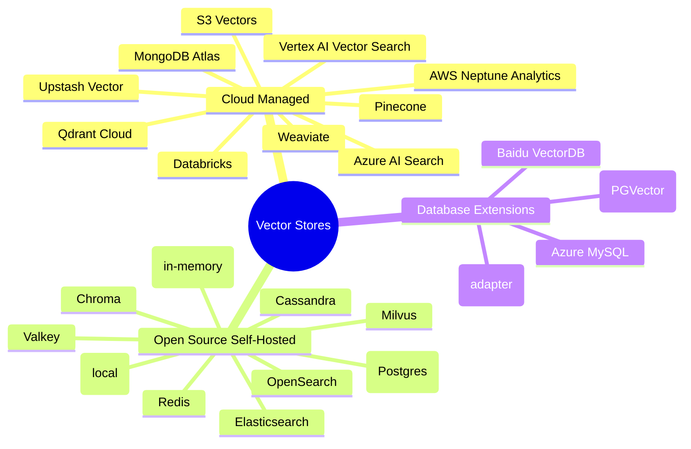

**Default:** Qdrant running locally, storing data in `~/.mem0/qdrant`.

---

## 12. Graph Store Backends

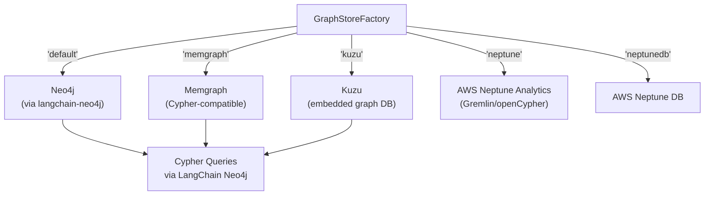

Graph memories store **entity-relationship triples** (e.g., `User -[WORKS_AT]-> Google`) extracted by the LLM. During search, both the vector store and the graph store are queried in parallel (via `asyncio.gather`) and results are merged.

---

## 13. Reranking Pipeline

After initial vector retrieval, an optional reranker rescores results for higher precision.

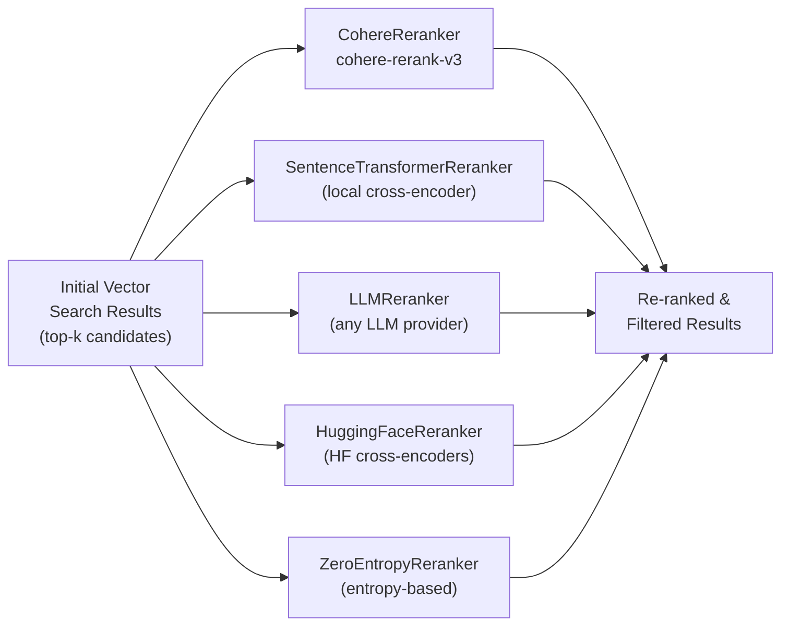

---

## 14. Hosted Platform vs. Self-Hosted

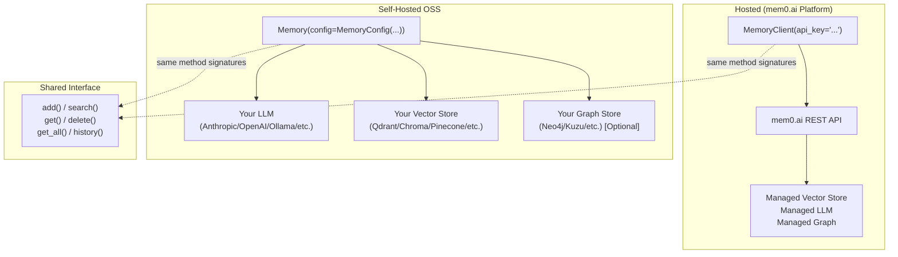

Both implement the same method interface so you can switch between them without changing application code.

---

## 15. OpenMemory — Local MCP Server

OpenMemory is the self-hosted, Docker-based deployment that exposes mem0 as an **MCP (Model Context Protocol) server** — the protocol used by Claude Code and other AI tools.

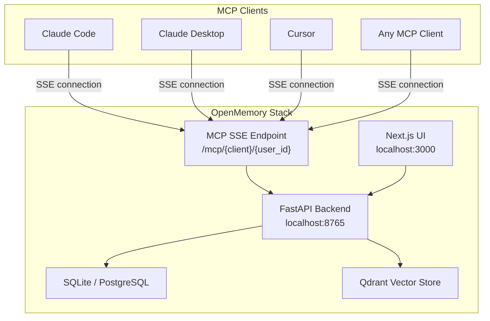

**MCP Tools exposed by OpenMemory:**

| MCP Tool | Description |
|---|---|
| `add_memories` | Store new memories from the current session |
| `search_memories` | Semantic search over stored memories |
| `list_memories` | Get all memories for the user |
| `delete_memory` | Remove a specific memory |

**Quick-start command:**
```bash
curl -sL https://raw.githubusercontent.com/mem0ai/mem0/main/openmemory/run.sh | \
  OPENAI_API_KEY=your_key bash
```

**Register with a client (e.g., Claude Code):**
```bash
npx @openmemory/install local \
  http://localhost:8765/mcp/claude_code/sse/<user-id> \
  --client claude_code
```

---

## 16. Using mem0 with Claude Code

There are **two distinct integration patterns** for Claude Code.

### Pattern A: OpenMemory MCP Server (Zero-Code Integration)

This is the plug-and-play approach. Claude Code connects to OpenMemory via MCP and automatically gains persistent memory across all sessions — no code changes required.

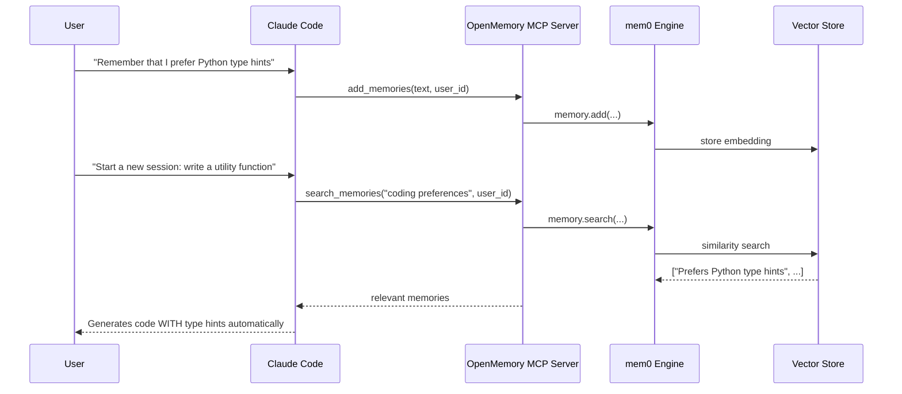

**Setup steps for Claude Code:**

1. Start OpenMemory locally:
```bash
export OPENAI_API_KEY=sk-...
curl -sL https://raw.githubusercontent.com/mem0ai/mem0/main/openmemory/run.sh | bash
```

2. Register the MCP server with Claude Code:
```bash
npx @openmemory/install local \
  "http://localhost:8765/mcp/claude_code/sse/my_user" \
  --client claude_code
```

3. Claude Code will now automatically call `add_memories` and `search_memories` tools when appropriate.

### Pattern B: Direct Library Integration in Code Generated by Claude Code

When Claude Code *writes code for you*, it can scaffold applications that directly use mem0. You can instruct Claude Code with a context like:

> "Build a customer support chatbot using Anthropic Claude and mem0 for persistent memory."

**Example scaffolded pattern (with Anthropic):**

```python
import anthropic
from mem0 import Memory

# Configure mem0 to use Claude for fact extraction too
config = {
    "llm": {
        "provider": "anthropic",
        "config": {
            "model": "claude-3-5-sonnet-20240620",
            "api_key": "ANTHROPIC_API_KEY"  # or via env var
        }
    },
    "embedder": {
        "provider": "openai",
        "config": {"model": "text-embedding-3-small"}
    },
    "vector_store": {
        "provider": "qdrant",
        "config": {"collection_name": "support_bot"}
    }
}

memory = Memory.from_config(config)
anthropic_client = anthropic.Anthropic()

def chat_with_memory(user_message: str, user_id: str) -> str:
    # 1. Retrieve relevant memories
    memories = memory.search(query=user_message, user_id=user_id, limit=5)
    memory_context = "\n".join(
        f"- {m['memory']}" for m in memories["results"]
    )

    # 2. Build prompt with memory context
    system = f"""You are a helpful support agent.
Known context about this user:
{memory_context}"""

    # 3. Call Claude
    response = anthropic_client.messages.create(
        model="claude-opus-4-5",
        max_tokens=1024,
        system=system,
        messages=[{"role": "user", "content": user_message}]
    )
    reply = response.content[0].text

    # 4. Store new memories from this exchange
    memory.add(
        [
            {"role": "user", "content": user_message},
            {"role": "assistant", "content": reply}
        ],
        user_id=user_id
    )
    return reply
```

### Why mem0 + Claude Code Is Particularly Powerful

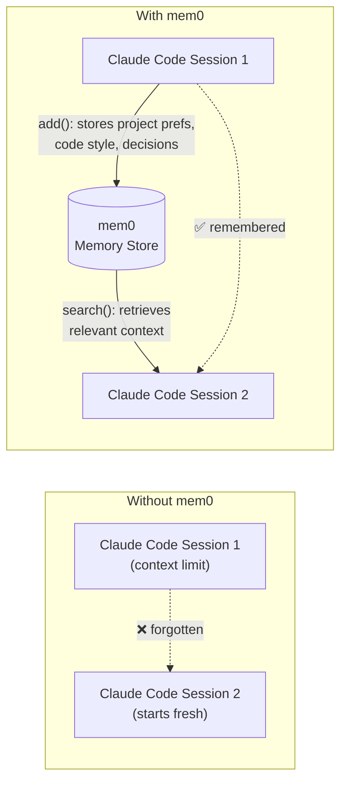

Things mem0 can persist across Claude Code sessions:

- Your preferred code style (tabs vs spaces, type hint conventions, docstring format)
- Project architecture decisions and constraints
- Libraries and frameworks already in use
- Previous bugs encountered and their resolutions
- Team conventions and naming standards
- Personal workflow shortcuts and preferences

---

## 17. Key Design Patterns

### Provider Pattern (Factory + Lazy Imports)

Every subsystem (LLM, embedder, vector store, graph store, reranker) follows the same pattern:

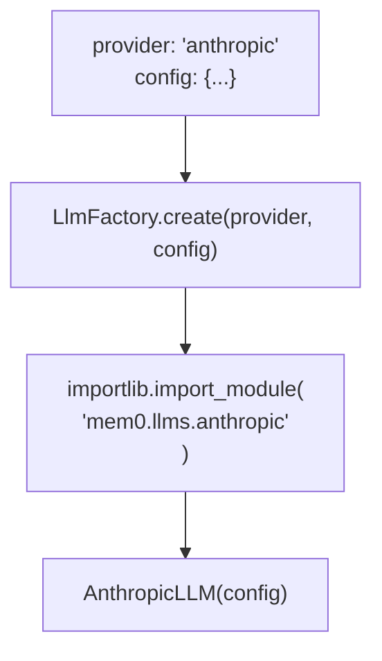

This means unused providers have zero import overhead — you don't pay for the `anthropic` package unless you configure `provider: 'anthropic'`.

### Dual Sync/Async API

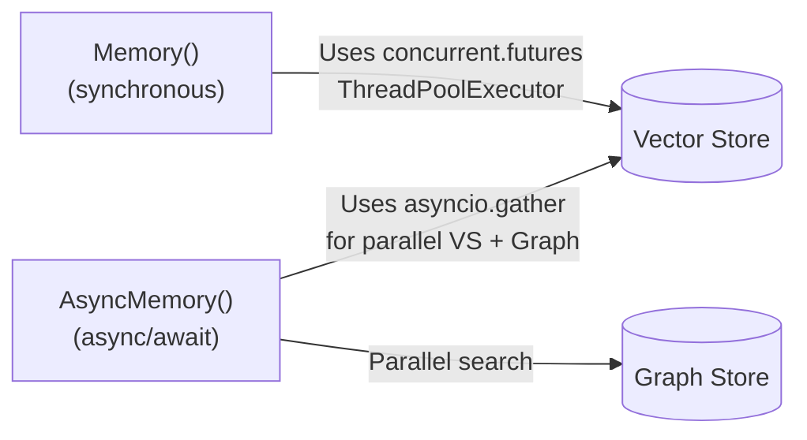

`AsyncMemory` uses `asyncio.gather` to query the vector store and graph store simultaneously during `search`, substantially reducing latency when both are enabled.

### Deduplication via Hashing

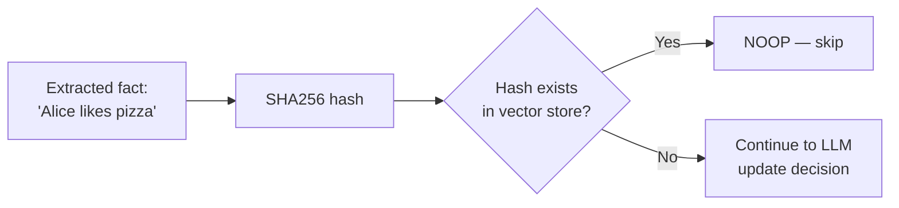

### Memory Scoping via Metadata Filters

All CRUD operations accept `user_id`, `agent_id`, and `run_id` as filter dimensions. These are stored as vector metadata and used for namespace isolation — so multiple users, agents, and sessions share one collection without cross-contamination.

---

## 18. Performance Benchmarks (from Research Paper)

From the arXiv paper *"Mem0: Building Production-Ready AI Agents with Scalable Long-Term Memory"* (arXiv:2504.19413):

| Metric | mem0 vs. OpenAI Memory | mem0 vs. Full-Context |
|---|---|---|
| Accuracy (LOCOMO benchmark) | +26% | — |
| Response Speed | — | 91% faster |
| Token Usage Reduction | — | 90% fewer tokens |

The key insight is that retrieving 3–5 targeted memory facts is orders of magnitude more token-efficient than passing 50+ turns of conversation history — while actually being *more* accurate because the LLM isn't overwhelmed with irrelevant context.

---

## Quick Reference: API Cheat Sheet

```python
from mem0 import Memory

m = Memory()  # uses OpenAI LLM + OpenAI embeddings + local Qdrant by default

# Store memories from a conversation
result = m.add(
    [{"role": "user", "content": "I love hiking and Python."}],
    user_id="alice"
)
# → {"results": [{"id": "...", "memory": "Loves hiking", "event": "ADD"}, ...]}

# Search for relevant memories
hits = m.search("what does alice like?", user_id="alice", limit=5)
# → {"results": [{"memory": "Loves hiking", "score": 0.92}, ...]}

# Retrieve all memories for a user
all_mem = m.get_all(user_id="alice")

# Update a specific memory
m.update(memory_id="abc123", data="Alice loves trail running and Python")

# Delete a memory
m.delete(memory_id="abc123")

# View the history of changes to a memory
m.history(memory_id="abc123")

# Wipe everything for a user
m.delete_all(user_id="alice")
```

**Using Claude as the LLM for mem0:**

```python
from mem0 import Memory

m = Memory.from_config({
    "llm": {
        "provider": "anthropic",
        "config": {"model": "claude-3-5-sonnet-20240620"}
        # Set ANTHROPIC_API_KEY env var
    }
})
```

**Fully local / private setup (no external API calls):**

```python
m = Memory.from_config({
    "llm": {"provider": "ollama", "config": {"model": "llama3.2"}},
    "embedder": {"provider": "fastembed", "config": {"model": "BAAI/bge-small-en-v1.5"}},
    "vector_store": {"provider": "chroma", "config": {"collection_name": "local_mem"}}
})
```

---

*Generated from a full read of the `mem0ai/mem0` repository at commit `a140829` (February 18, 2026).*
