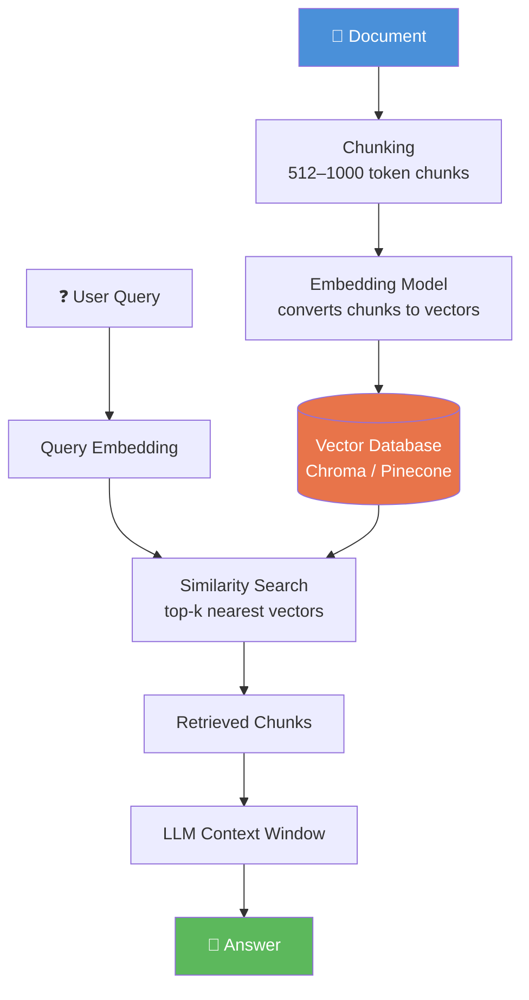
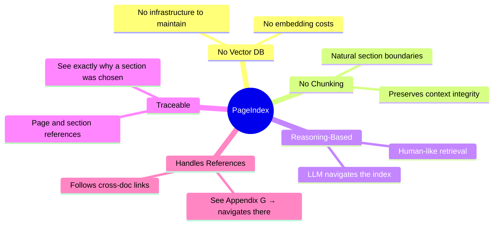
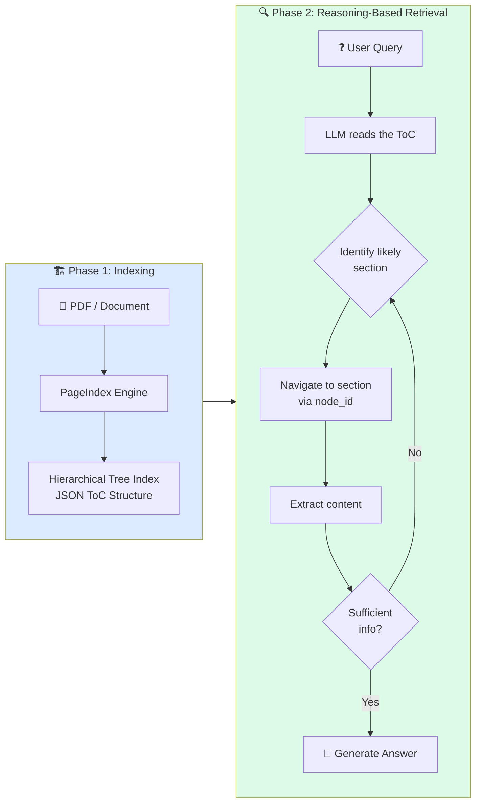
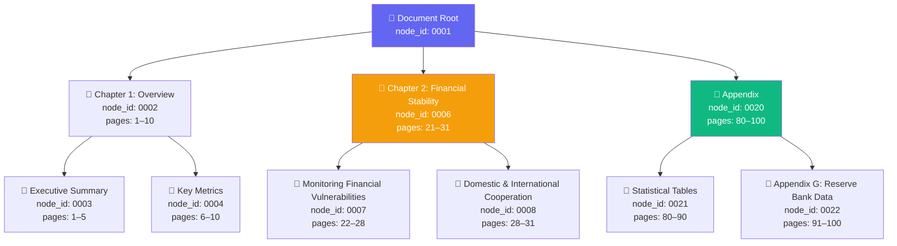
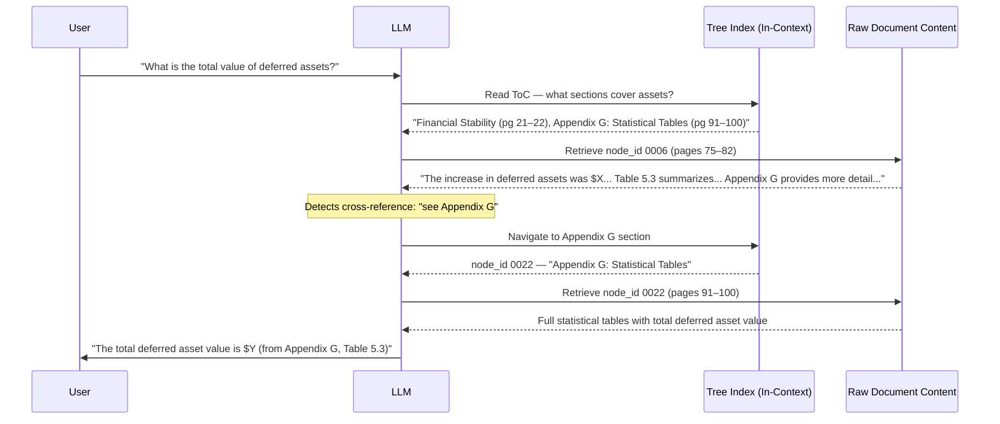
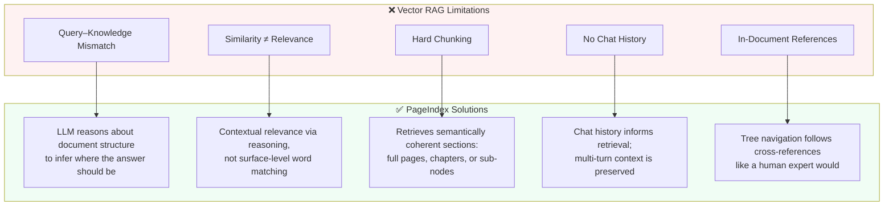
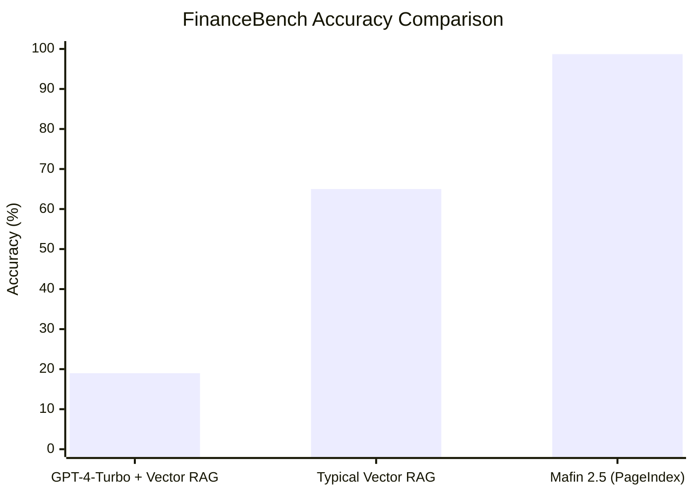
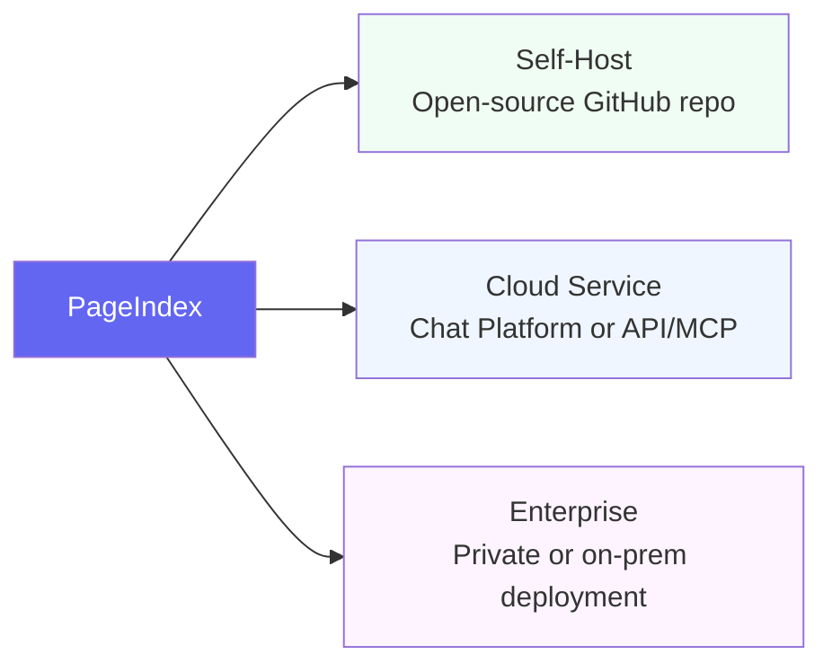
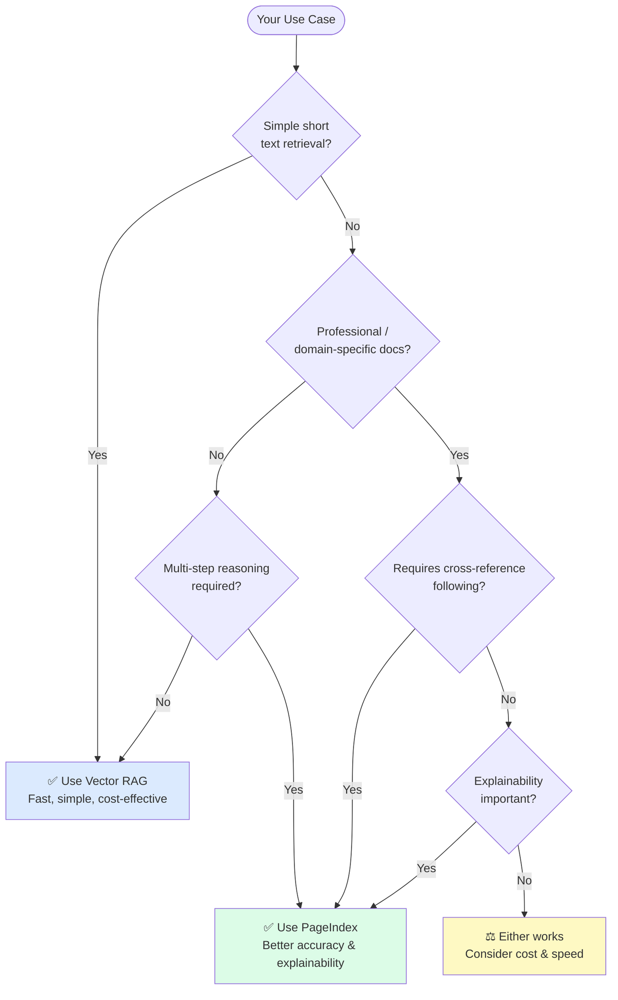

# PageIndex: Vectorless, Reasoning-Based RAG — A Complete Guide

> *Based on the [X/Twitter post](https://x.com/akshay_pachaar/status/2025548705605341336) by @akshay_pachaar, the [PageIndex blog post](https://pageindex.ai/blog/pageindex-intro), the [GitHub repository](https://github.com/VectifyAI/PageIndex), and the [FinanceBench paper](https://arxiv.org/abs/2311.11944).*

---

## Table of Contents

1. [The Problem: Why Traditional RAG Falls Short](#1-the-problem)
2. [What is PageIndex?](#2-what-is-pageindex)
3. [How PageIndex Works](#3-how-pageindex-works)
4. [The Tree Index Structure](#4-the-tree-index-structure)
5. [Reasoning-Based Retrieval Process](#5-reasoning-based-retrieval-process)
6. [Overcoming Traditional RAG Limitations](#6-overcoming-limitations)
7. [Benchmark Results: FinanceBench](#7-benchmark-results)
8. [Architecture Comparison](#8-architecture-comparison)
9. [Getting Started](#9-getting-started)
10. [When to Use PageIndex vs. Vector RAG](#10-when-to-use)
11. [Citations & References](#11-citations)

---

## 1. The Problem: Why Traditional RAG Falls Short

Large Language Models (LLMs) are constrained by a fundamental architectural limit: the **context window** — the maximum number of tokens the model can process at once. Research (including Chroma's "context rot" study) has shown that model performance deteriorates as context length grows, making it hard to accurately reason over long, complex, domain-specific documents like financial reports or legal filings.

**Retrieval-Augmented Generation (RAG)** emerged as the dominant solution: instead of feeding the entire document into the model, retrieve only the most relevant chunks. However, conventional *vector-based* RAG has serious limitations.

### How Traditional Vector RAG Works



### The Core Problem: Similarity ≠ Relevance

The fundamental flaw in vector RAG is that it equates **semantic similarity** with **relevance**. These are not the same thing. [^1]

Consider the query: *"What were the debt trends in 2023?"*

- Vector search returns chunks that **look similar** to the query text
- The actual answer may be buried in an **Appendix**, referenced on a specific page, in a section that shares **zero semantic overlap** with your query
- Traditional RAG would likely never find it

### The Five Key Limitations of Vector RAG

| # | Limitation | Description |
|---|-----------|-------------|
| 1 | **Query–Knowledge Mismatch** | Queries express intent; documents express content. Similarity search assumes they overlap — they often don't. |
| 2 | **Similarity ≠ Relevance** | Semantically similar text is not always the most relevant text, especially in domain-specific docs. |
| 3 | **Hard Chunking** | Splitting at fixed token lengths (512, 1000) cuts through sentences, paragraphs, and sections, fragmenting meaning. |
| 4 | **No Chat History** | Each query is treated independently; prior conversation context is lost. |
| 5 | **In-Document References** | "See Appendix G" or "refer to Table 5.3" share no semantic similarity with the referenced content — traditional RAG misses them. |

---

## 2. What is PageIndex?

**PageIndex** is an open-source, vectorless, reasoning-based RAG framework built by [VectifyAI](https://vectify.ai). It was inspired by AlphaGo and mimics how human experts navigate and extract knowledge from complex documents. [^2]

Instead of chunking and embedding, PageIndex:
- Builds a **hierarchical tree structure** (like an intelligent Table of Contents) from documents
- Uses **LLM reasoning** to traverse that tree
- Asks: *"Based on this document's structure, where would a human expert look for this answer?"*



### Key Differentiators at a Glance

- **No Vector DB** — uses document structure + LLM reasoning for retrieval
- **No chunking** — documents are organized into natural sections
- **Human-like retrieval** — simulates how experts navigate complex documents
- **Explainable & traceable** — every retrieval step has a clear rationale
- **State-of-the-art accuracy** — 98.7% on FinanceBench (SOTA)

---

## 3. How PageIndex Works

PageIndex operates in two main phases:



### Phase 1: Building the PageIndex Tree

The document is parsed into a **JSON-based hierarchical tree** — a "Table of Contents" optimized for LLM reasoning. Each node represents a logical section (chapter, paragraph, page) and contains:

- `node_id` — unique reference key to locate raw content
- `title` — human-readable section name
- `summary` — brief description of section content
- `start_index` / `end_index` — page range
- `sub_nodes` — array of child nodes (recursive)
- `metadata` — arbitrary key-value pairs (doc type, author, tags, etc.)

### Phase 2: Reasoning-Based Retrieval

The retrieval loop follows this iterative process:

1. **Read the ToC** — understand the document's structure and identify candidate sections
2. **Select a section** — choose the section most likely to contain the answer
3. **Extract information** — parse the selected section for relevant content
4. **Sufficiency check** — if enough information, proceed to answer; if not, return to step 1
5. **Answer the question** — generate a complete, well-supported response

---

## 4. The Tree Index Structure

The PageIndex tree is stored as JSON and lives **inside the LLM's context window** — not in an external database. This is called an **in-context index**. [^2]



### Example Tree JSON (from Financial Report)

```json
{
  "node_id": "0006",
  "title": "Financial Stability",
  "start_index": 21,
  "end_index": 22,
  "summary": "The Federal Reserve monitors financial system stability...",
  "sub_nodes": [
    {
      "node_id": "0007",
      "title": "Monitoring Financial Vulnerabilities",
      "start_index": 22,
      "end_index": 28,
      "summary": "The Federal Reserve's monitoring of financial vulnerabilities..."
    },
    {
      "node_id": "0008",
      "title": "Domestic and International Cooperation",
      "start_index": 28,
      "end_index": 31,
      "summary": "In 2023, the Federal Reserve collaborated with..."
    }
  ]
}
```

The mapping `node_id → node_content` enables precise, context-aware retrieval. The LLM selects specific nodes and retrieves their raw content (text, images, tables) as needed.

---

## 5. Reasoning-Based Retrieval Process

Here is a detailed sequence diagram showing how PageIndex handles a real financial query:



This example illustrates a key superpower: PageIndex follows cross-references like a human expert would — a task vector-based RAG would likely fail. [^2]

---

## 6. Overcoming Traditional RAG Limitations



### Comparison Table

| Limitation | Vector-Based RAG | PageIndex (Reasoning-Based) |
|---|---|---|
| Query–Knowledge Mismatch | Matches surface-level similarity; misses true context | Uses inference to identify the most relevant sections |
| Similarity ≠ Relevance | Retrieves semantically similar but irrelevant chunks | Retrieves contextually relevant information |
| Hard Chunking | Fixed-length chunks fragment meaning | Retrieves coherent sections dynamically |
| No Chat Context | Each query is isolated | Multi-turn reasoning considers prior context |
| Cross-References | Fails to follow internal document links | Follows in-text references via tree navigation |

---

## 7. Benchmark Results: FinanceBench

### About FinanceBench

**FinanceBench** [^3] is a first-of-its-kind benchmark for evaluating LLMs on open-book financial question answering. It consists of:

- **10,231 questions** about publicly traded companies
- Questions sourced from **SEC filings** (10-K, 10-Q, 8-K forms)
- Covers diverse scenarios requiring precise financial reasoning

The original paper (Islam et al., 2023) tested 16 state-of-the-art model configurations — and found alarming results:

> GPT-4-Turbo used with a retrieval system incorrectly answered or refused to answer **81% of questions**. [^3]

### Mafin 2.5 Results

**Mafin 2.5** is VectifyAI's reasoning-based RAG system powered by PageIndex, built specifically for financial document analysis.



| System | Accuracy | Dataset Coverage |
|---|---|---|
| GPT-4-Turbo + Vector RAG | ~19% | 100% |
| Typical Advanced Vector RAG | ~65–85% | 66.7% |
| **Mafin 2.5 (PageIndex)** | **98.7%** | **100%** |

### Why PageIndex Excels at Financial Documents

Financial reports are inherently hierarchical — sections, tables, footnotes, appendices. Three key factors explain the performance: [^4]

1. **Preservation of Document Structure** — Financial reports map naturally to PageIndex's hierarchical tree. Hierarchy is preserved rather than flattened.
2. **Traceable Retrieval** — Each node carries metadata (page range, section title), making every retrieval step explainable.
3. **Reasoning-Driven Search** — The model reasons about where the answer *should* be, like a human analyst navigating a 10-K report.

---

## 8. Architecture Comparison

```mermaid
flowchart TB
    subgraph VectorRAG["🔵 Traditional Vector RAG"]
        direction LR
        vDoc[Document] --> vChunk[Chunker
Fixed 512–1000 tokens]
        vChunk --> vEmbed[Embedding Model]
        vEmbed --> vDB[(Vector DB
Chroma/Pinecone)]
        vQuery[Query] --> vQEmbed[Query Embedding]
        vQEmbed --> vSearch[Similarity Search]
        vDB --> vSearch
        vSearch --> vContext[Retrieved Chunks]
        vContext --> vLLM[LLM → Answer]
    end

    subgraph PageIndexRAG["🟢 PageIndex (Reasoning-Based RAG)"]
        direction LR
        pDoc[Document] --> pIndex[PageIndex Engine]
        pIndex --> pTree[Hierarchical Tree
JSON ToC]
        pTree --> pCtx[In-Context Index
LLM's Context Window]
        pQuery[Query] --> pReason[LLM Reasoning]
        pCtx --> pReason
        pReason --> pNav[Tree Navigation
Select node_id]
        pNav --> pRaw[Raw Section Content]
        pRaw --> pLoop{Sufficient?}
        pLoop -- No --> pReason
        pLoop -- Yes --> pAnswer[LLM → Answer]
    end

    style VectorRAG fill:#dbeafe
    style PageIndexRAG fill:#dcfce7
```



---

## 9. Getting Started

### Installation

```bash
# Clone the repository
git clone https://github.com/VectifyAI/PageIndex.git
cd PageIndex

# Install dependencies
pip3 install --upgrade -r requirements.txt
```

### Setup

Create a `.env` file in the root directory:

```bash
CHATGPT_API_KEY=your_openai_key_here
```

### Run PageIndex on a PDF

```bash
python3 run_pageindex.py --pdf_path /path/to/your/document.pdf
```

### Optional Parameters

| Parameter | Description | Default |
|---|---|---|
| `--model` | OpenAI model to use | `gpt-4o-2024-11-20` |
| `--toc-check-pages` | Pages to check for existing ToC | `20` |
| `--max-pages-per-node` | Max pages per tree node | `10` |
| `--max-tokens-per-node` | Max tokens per node | `20000` |
| `--if-add-node-id` | Include node IDs | `yes` |
| `--if-add-node-summary` | Include node summaries | `yes` |
| `--if-add-doc-description` | Include doc description | `yes` |

### Run on Markdown

```bash
python3 run_pageindex.py --md_path /path/to/your/document.md
```

> **Note:** For Markdown converted from PDF/HTML, use PageIndex OCR first to preserve the original hierarchy.

### Deployment Options



---

## 10. When to Use PageIndex vs. Vector RAG



### Ideal Use Cases for PageIndex

- Financial reports (10-K, 10-Q, SEC filings, earnings disclosures)
- Legal contracts and regulatory filings
- Academic textbooks and technical manuals
- Any document that exceeds LLM context limits
- Use cases requiring traceable, explainable retrieval

### When Vector RAG is Still Fine

- Simple FAQ retrieval from short documents
- Applications where speed is paramount and accuracy is acceptable
- Low-cost, high-volume retrieval at scale
- Documents with no hierarchical structure

---

## 11. Citations & References

[^1]: Akshay Pachaar, "Researchers built a new RAG approach that..." X (Twitter), Feb 22, 2026. https://x.com/akshay_pachaar/status/2025548705605341336

[^2]: Mingtian Zhang, Yu Tang and PageIndex Team, "PageIndex: Next-Generation Vectorless, Reasoning-based RAG," *PageIndex Blog*, September 2025. https://pageindex.ai/blog/pageindex-intro

[^3]: Pranab Islam, Anand Kannappan, Douwe Kiela, Rebecca Qian, Nino Scherrer, Bertie Vidgen, "FinanceBench: A New Benchmark for Financial Question Answering," *arXiv:2311.11944*, November 20, 2023. https://arxiv.org/abs/2311.11944

[^4]: Mingtian Zhang, Yu Tang, "PageIndex Leads Financial QA Benchmark," *PageIndex Blog*, February 19, 2025. https://pageindex.ai/blog/Mafin2.5

### BibTeX Citations

```bibtex
@article{zhang2025pageindex,
  author  = {Mingtian Zhang and Yu Tang and PageIndex Team},
  title   = {PageIndex: Next-Generation Vectorless, Reasoning-based RAG},
  journal = {PageIndex Blog},
  year    = {2025},
  month   = {September},
  note    = {https://pageindex.ai/blog/pageindex-intro},
}

@article{islam2023financebench,
  title   = {FinanceBench: A New Benchmark for Financial Question Answering},
  author  = {Islam, Pranab and Kannappan, Anand and Kiela, Douwe and Qian, Rebecca and Scherrer, Nino and Vidgen, Bertie},
  journal = {arXiv preprint arXiv:2311.11944},
  year    = {2023},
  url     = {https://arxiv.org/abs/2311.11944}
}
```

---

*Document compiled on Feb 23, 2026. Sources: [X Post](https://x.com/akshay_pachaar/status/2025548705605341336) · [Blog Post](https://pageindex.ai/blog/pageindex-intro) · [GitHub Repo](https://github.com/VectifyAI/PageIndex) · [FinanceBench Paper](https://arxiv.org/abs/2311.11944) · [Benchmark Results](https://pageindex.ai/blog/Mafin2.5)*
