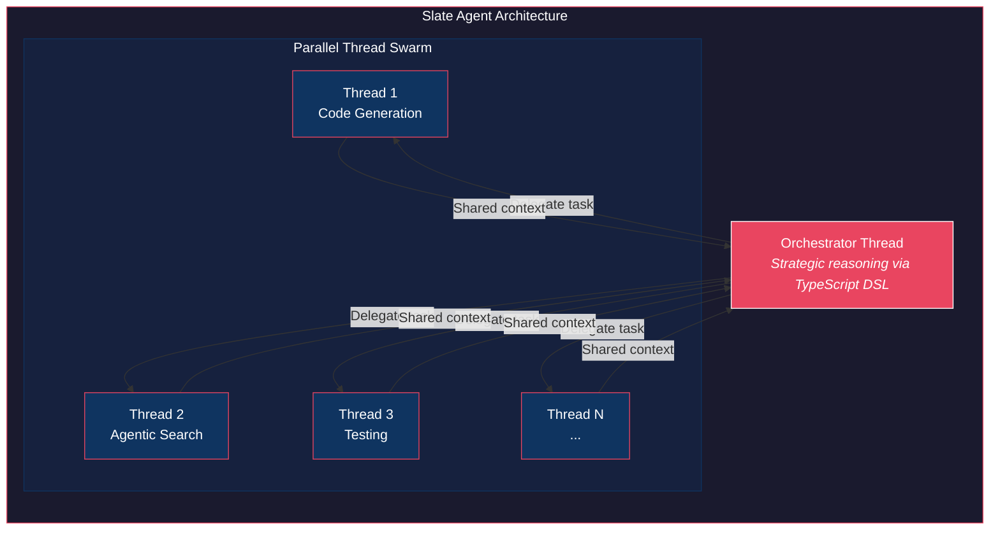
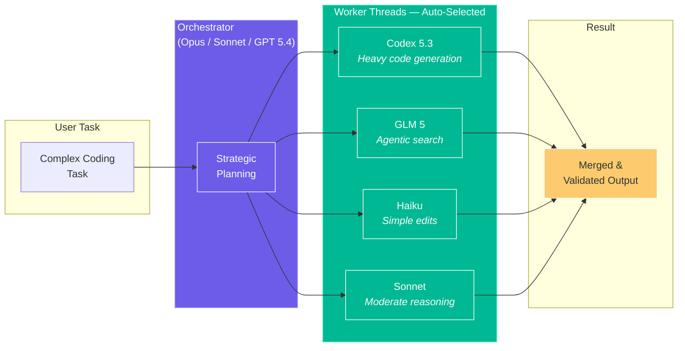
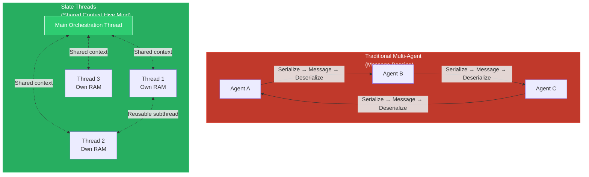
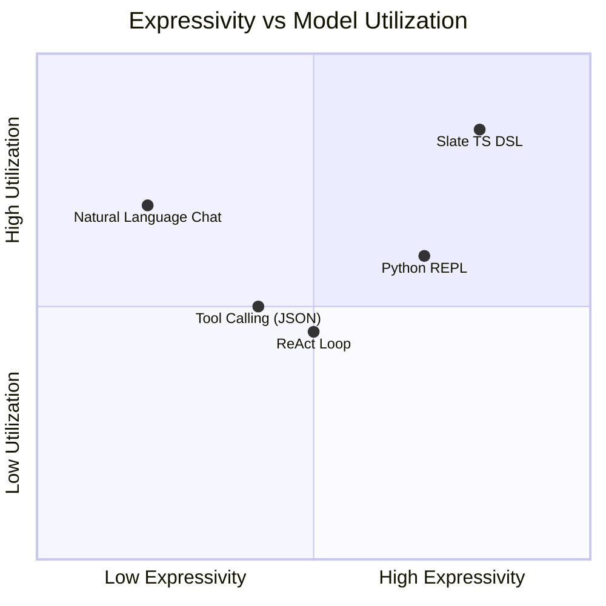
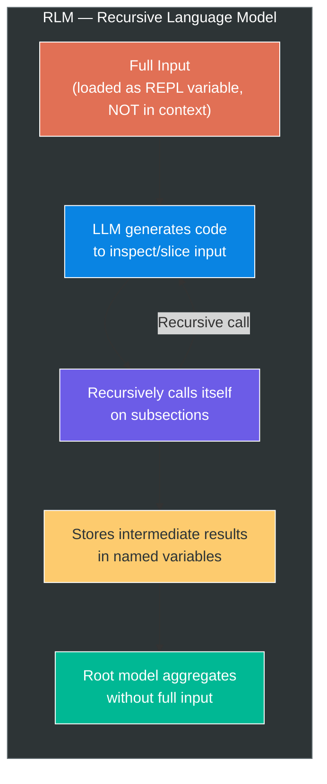
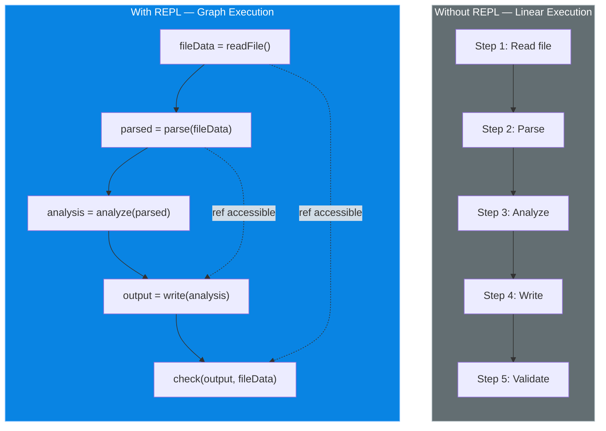
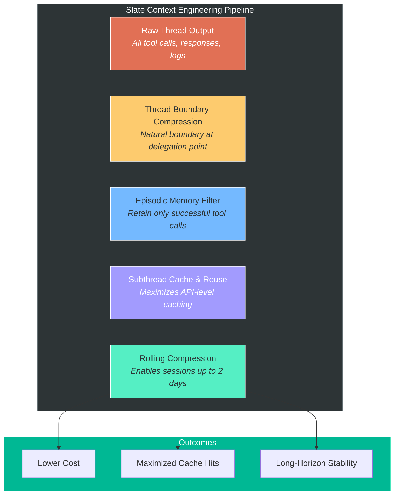
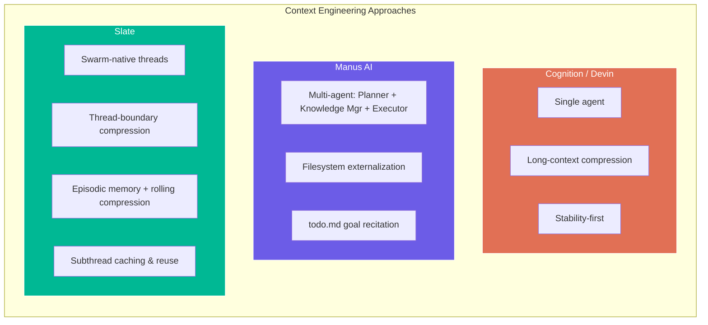
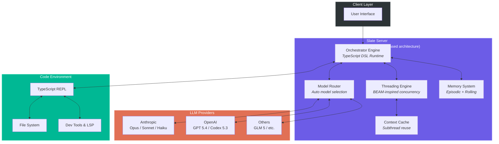
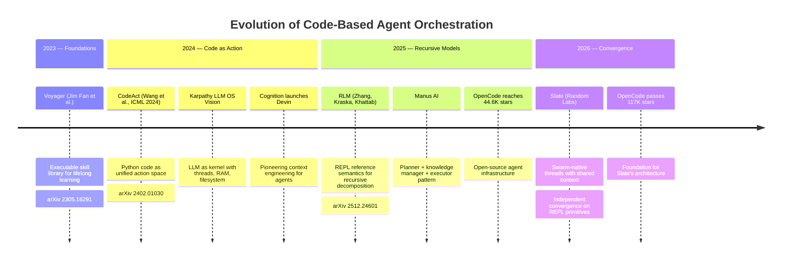

# Slate — Swarm-Native Coding Agent by Random Labs

**Source:** [X post by @realmcore_](https://x.com/realmcore_/status/2032146316730778004)
**Date:** March 12, 2026
**Author:** akira (@realmcore_) — [Random Labs](https://www.ycombinator.com/companies/random-labs) (@0xrandomlabs)
**Technical Report:** randomlabs.ai/blog/slate

---

## 1. What is Slate?

Slate is a coding agent that uses a code environment directly for swarm orchestration. Instead of relying on message-passing between isolated subagents (the typical multi-agent pattern), Slate programmatically orchestrates tasks by spinning up parallel "threads" — subagents that share context with a central orchestrator.

The core architectural bet: give an LLM a TypeScript REPL so it can reason at a **strategic level** about what needs to happen, while delegating the **tactical execution** to specialized subthreads. This separation is what makes it "swarm-native" — it's a hive mind, not a relay chain.

---

## 2. Multi-Model Orchestration

Slate automatically selects the optimal LLM for each subtask. A powerful model handles high-level planning; cheaper/faster models handle routine work; specialized models handle domain-specific tasks like agentic search.

---

## 3. Core Concepts

### 3.1 Threads — Shared-Context Subagents

In traditional multi-agent systems, each subagent has isolated context and communicates through explicit messages. Slate's threads are fundamentally different: they **share context** with the orchestrator. Each thread has its own working memory ("RAM"), but the orchestrator can read and compose results across all threads.

This maps directly to Karpathy's "LLM OS" vision, where he proposed treating the LLM as a kernel process with its own CPU (reasoning), RAM (context window), and file system (retrieval). In Karpathy's model, each thread would have its own RAM and the main thread delegates to other threads directly — which is exactly what Slate implements.

The threading architecture is also inspired by the **BEAM VM** (Erlang/Elixir's runtime). In the BEAM, processes are extremely lightweight, fully isolated (each has its own heap, stack, and garbage collector), and communicate through non-blocking message passing via mailboxes. BEAM achieves concurrency by interleaving process execution with preemptive scheduling — one scheduler per core, picking processes from a ready queue. Slate adapts these concurrency semantics for LLM orchestration: each thread is lightweight, has its own context, and can be composed by the orchestrator.

The team originally called threads "actors" (matching BEAM terminology) but found that LLMs understand the concept of "threads" more naturally.

### 3.2 Knowledge Overhang

LLMs possess extensive knowledge about how to perform tasks strategically — but during typical execution, they only use a fraction of it because they're bogged down in tactical details. Slate calls this gap **knowledge overhang**.

By giving the model a TypeScript DSL to orchestrate at the strategic level, Slate separates the model's **strategic knowledge** (how to plan and decompose) from its **tactical knowledge** (how to execute individual steps). The orchestrator accesses strategic knowledge directly while threads handle tactics.

### 3.3 Expressivity

Expressivity describes the relationship between how powerful an interface is and how much of that power the model actually leverages. A natural language chat interface is low-expressivity (the model can only describe actions). A full programming language is high-expressivity (the model can compose, loop, branch, and parallelize). Slate's TypeScript DSL is designed to be expressive enough that the model can "program in action space."

---

## 4. Technical Foundations — The REPL Principle

Slate and RLM independently converged on the same insight: giving an agent a REPL fundamentally changes task decomposition. The CodeAct paper (ICML 2024) and Voyager (2023) also explored related ideas. Three independent teams arriving at the same primitives suggests these are foundational.

### 4.1 How RLM Works

RLM (Recursive Language Models) was created by Alex L. Zhang, Tim Kraska, and Omar Khattab at MIT CSAIL. Published as arXiv:2512.24601 in late 2025.

The key mechanism: the full input is loaded as a variable in a Python REPL notebook, **not** directly into the model's context window. The model then generates code to inspect, search, or slice the input. It can recursively call itself on subsections, storing results symbolically in variables. The root model aggregates outcomes without ever loading the entire input at once.

This enables handling of extremely long contexts (10M+ tokens) with better accuracy and lower cost than direct context feeding or context compaction.

### 4.2 CodeAct — Code as Unified Action Space

The CodeAct paper (Wang et al., ICML 2024) proposed using executable Python code as a unified action space for LLM agents. Instead of generating JSON or text in a predefined format (which constrains flexibility), CodeAct agents generate Python code that is directly executed.

Integrated with a Python interpreter, CodeAct agents can dynamically revise prior actions or emit new actions based on execution feedback. Across 17 LLMs, CodeAct achieved up to 20% higher success rates than alternatives.

### 4.3 Voyager — Lifelong Learning Through Code

Voyager (Wang, Xie, Jiang, Fan et al., 2023) is an embodied lifelong learning agent in Minecraft. Its key innovation: an ever-growing **skill library of executable code** for storing and retrieving complex behaviors. Skills are temporally extended, interpretable, and compositional — they compound over time and avoid catastrophic forgetting.

Voyager achieved 3.3x more unique items and unlocked milestones up to 15.3x faster than prior methods.

### 4.4 Shared Primitive: REPL Reference Semantics

All these systems share a common primitive — using a code environment to:

1. **Decompose work** into operations that store values in named references
2. **Reason about the execution graph** rather than performing each operation inline
3. **Compose results** from stored references in non-linear ways

---

## 5. Context Engineering & Memory

Context engineering is a central challenge for long-running agents. Slate employs multiple strategies that align with techniques used by other leading agents.

### 5.1 How Other Agents Handle Context

**Cognition (Devin)** favors a single-agent approach with long-context compression. They argue this delivers greater stability and lower costs than multi-agent setups. Over 2025, Devin became 4x faster at problem-solving and 2x more efficient in resource consumption.

**Manus AI** uses a multi-agent architecture with a planner (assigns tasks), a knowledge manager (determines what to save to filesystem), and an executor (performs tasks). Manus externalizes data to the filesystem — deleting web page content but retaining URLs, clearing documents but keeping file paths. It continuously updates a `todo.md` file, reciting incomplete goals at the end of context to avoid "lost-in-the-middle" problems.

**Fundamental (formerly Altera)** and **Cognition** both operate on the principle of thinking at a high level and delegating at a lower level, compressing lower-level context into something understandable by the strategizing agent.

### 5.2 Slate's Context Pipeline

Slate creates a natural compression boundary at the thread delegation point. Because it delegates simple tactical actions to threads one at a time, each completed thread can be compressed without losing critical information. This leads to tractable **episodic memory**: the system retains only tool calls that contributed to success.

### 5.3 Context Technique Comparison

---

## 6. System Architecture

Slate's client-server architecture is built on top of [OpenCode](https://opencode.ai/), an open-source coding agent framework. OpenCode uses event-driven design for orchestration without tight coupling, structured memory for context management, permission systems for balancing autonomy with user control, and snapshot systems for safety nets during autonomous actions.

---

## 7. Intellectual Lineage

---

## 8. Early Results

An earlier, less flexible version of Slate's architecture passed 2 out of 3 tests on the `make-mips-interpreter` task from Terminal Bench 2.0 — a task that Opus 4.5 and 4.6 solve at most 1 in 5 times. Full benchmarks are planned for the coming weeks.

---

## 9. What's Next

- **Codex & Claude Code integration** — Direct support planned for the week following the announcement
- **Long-term memory** — The next major challenge beyond episodic memory
- **Benchmarking** — Hiring a research role for comprehensive evaluation

---

## 10. Citations & References

| Reference | Authors | Year | Link |
|-----------|---------|------|------|
| **RLM: Recursive Language Models** | Alex L. Zhang, Tim Kraska, Omar Khattab (MIT CSAIL) | 2025 | [arXiv:2512.24601](https://arxiv.org/abs/2512.24601), [Blog](https://alexzhang13.github.io/blog/2025/rlm/), [GitHub](https://github.com/alexzhang13/rlm) |
| **CodeAct: Executable Code Actions Elicit Better LLM Agents** | Xingyao Wang, Yangyi Chen, Lifan Yuan et al. | 2024 (ICML) | [arXiv:2402.01030](https://arxiv.org/abs/2402.01030), [GitHub](https://github.com/xingyaoww/code-act) |
| **Voyager: Open-Ended Embodied Agent with LLMs** | Guanzhi Wang, Yuqi Xie, Yunfan Jiang, Jim Fan et al. | 2023 | [arXiv:2305.16291](https://arxiv.org/abs/2305.16291), [Project](https://voyager.minedojo.org/) |
| **Karpathy LLM OS Vision** | Andrej Karpathy | 2024 | [X Post](https://x.com/karpathy/status/1723140519554105733) |
| **Context Engineering for AI Agents (Manus)** | Manus AI Team | 2025 | [Blog](https://manus.im/blog/Context-Engineering-for-AI-Agents-Lessons-from-Building-Manus) |
| **Context Engineering in Manus (Analysis)** | Lance Martin | 2025 | [Blog](https://rlancemartin.github.io/2025/10/15/manus/) |
| **Devin Performance Review** | Cognition | 2025 | [Blog](https://cognition.ai/blog/devin-annual-performance-review-2025) |
| **OpenCode** | thdxr (Dax) et al. | 2025–2026 | [opencode.ai](https://opencode.ai/), [GitHub](https://github.com/sst/opencode) |
| **BEAM VM / Erlang Concurrency** | Ericsson | 1986– | [BEAM Book](https://blog.stenmans.org/theBeamBook/) |
| **Random Labs (YC)** | — | 2026 | [YC Profile](https://www.ycombinator.com/companies/random-labs) |
| **Slate Announcement** | akira (@realmcore_) | Mar 2026 | [X Post](https://x.com/realmcore_/status/2032146316730778004) |
| **Prime Intellect RLM Analysis** | Prime Intellect | 2026 | [Blog](https://www.primeintellect.ai/blog/rlm) |
