# Superpowers — Complete Architecture & Deep-Dive

> **Repository:** [github.com/obra/superpowers](https://github.com/obra/superpowers)
> **Version:** 5.0.5 | **Author:** Jesse Vincent | **License:** MIT
> **Generated:** 2026-03-19

---

## 1. Project Overview

Superpowers is a **composable skills framework** that transforms AI coding agents (Claude Code, Cursor, Gemini CLI, Codex, OpenCode) into disciplined software engineers. Rather than letting agents jump straight into writing code, Superpowers enforces a structured workflow: brainstorm a design, write a plan, execute via subagents with two-stage review, and finish with proper branch management — all driven by automatically-triggered "skills."

The core philosophy rests on four pillars: **Test-Driven Development** (write tests first, always), **Systematic over ad-hoc** (process over guessing), **Complexity reduction** (simplicity as the primary goal), and **Evidence over claims** (verify before declaring success).

> *Source: [`README.md`](https://github.com/obra/superpowers/blob/main/README.md)*

---

## 2. High-Level System Architecture

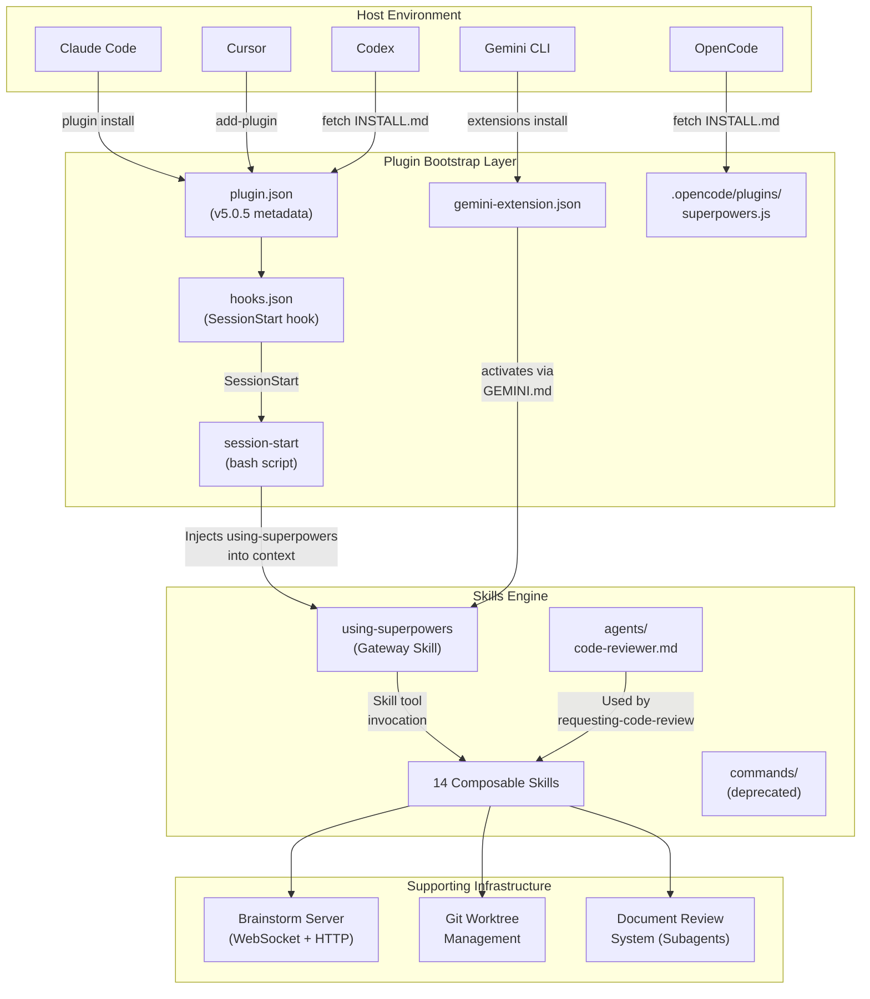

> *Sources: [`.claude-plugin/plugin.json`](https://github.com/obra/superpowers/blob/main/.claude-plugin/plugin.json), [`hooks/hooks.json`](https://github.com/obra/superpowers/blob/main/hooks/hooks.json), [`hooks/session-start`](https://github.com/obra/superpowers/blob/main/hooks/session-start)*

---

## 3. Bootstrap & Initialization Flow

When a session starts, the plugin injects the gateway skill into the agent's context so that all subsequent actions are routed through the skills system.

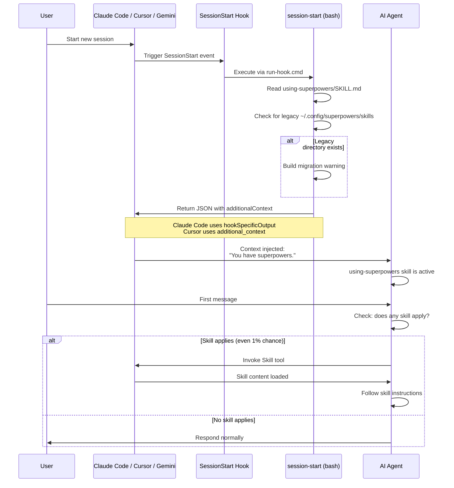

The `session-start` script handles platform detection: if `CURSOR_PLUGIN_ROOT` is set, it emits `additional_context`; if `CLAUDE_PLUGIN_ROOT` is set, it emits `hookSpecificOutput.additionalContext`. This prevents double-injection when both environment variables exist.

> *Sources: [`hooks/session-start`](https://github.com/obra/superpowers/blob/main/hooks/session-start), [`hooks/hooks.json`](https://github.com/obra/superpowers/blob/main/hooks/hooks.json), [`hooks/run-hook.cmd`](https://github.com/obra/superpowers/blob/main/hooks/run-hook.cmd)*

---

## 4. The Complete Development Workflow

This is the core value proposition of Superpowers — an end-to-end workflow from idea to merged code.

```mermaid
flowchart TD
    A["User has an idea"] --> B{"brainstorming<br/>skill"}
    B -->|"Explore context,<br/>ask questions,<br/>propose approaches"| C["Design Document<br/>(spec)"]
    C --> D{"Spec Review Loop<br/>(subagent reviewer)"}
    D -->|"Issues found"| C
    D -->|"Approved"| E["User reviews spec"]
    E -->|"Changes requested"| C
    E -->|"Approved"| F{"writing-plans<br/>skill"}
    F -->|"Break into<br/>bite-sized tasks<br/>(2-5 min each)"| G["Implementation Plan"]
    G --> H{"Plan Review Loop<br/>(subagent reviewer)"}
    H -->|"Issues found"| G
    H -->|"Approved"| I{"Execution Choice"}

    I -->|"Subagent-Driven<br/>(recommended)"| J{"subagent-driven-<br/>development"}
    I -->|"Inline Execution"| K{"executing-plans"}

    J --> L["Per-Task Loop"]
    K --> L

    subgraph "Per-Task Execution"
        L --> M["using-git-worktrees<br/>(isolated workspace)"]
        M --> N["test-driven-development<br/>(RED-GREEN-REFACTOR)"]
        N --> O["requesting-code-review<br/>(subagent reviewer)"]
        O -->|"Issues"| N
        O -->|"Approved"| P["Next task"]
    end

    P --> Q{"All tasks<br/>complete?"}
    Q -->|"No"| L
    Q -->|"Yes"| R["Final code review<br/>(full implementation)"]
    R --> S{"finishing-a-<br/>development-branch"}
    S --> T["Merge / PR / Keep / Discard"]

    style B fill:#f9e79f
    style F fill:#f9e79f
    style J fill:#aed6f1
    style K fill:#aed6f1
    style N fill:#a9dfbf
    style S fill:#f5b7b1
```

> *Sources: [`README.md`](https://github.com/obra/superpowers/blob/main/README.md), [`skills/brainstorming/SKILL.md`](https://github.com/obra/superpowers/blob/main/skills/brainstorming/SKILL.md), [`skills/writing-plans/SKILL.md`](https://github.com/obra/superpowers/blob/main/skills/writing-plans/SKILL.md), [`skills/subagent-driven-development/SKILL.md`](https://github.com/obra/superpowers/blob/main/skills/subagent-driven-development/SKILL.md)*

---

## 5. Skills Taxonomy & Dependency Map

The 14 skills fall into four categories and form a directed dependency graph.

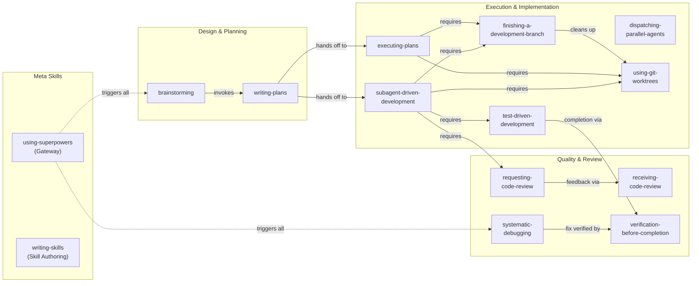

### Skills Reference Table

| Skill | Category | Trigger | Key Behavior |
|-------|----------|---------|--------------|
| `using-superpowers` | Meta | Every session start | Gateway; checks if any skill applies before every response |
| `writing-skills` | Meta | Creating new skills | TDD applied to documentation; skill authoring guide |
| `brainstorming` | Design | Before any creative/feature work | Hard gate: no code until design approved |
| `writing-plans` | Planning | After approved spec | Bite-sized tasks (2-5 min), exact file paths, complete code |
| `subagent-driven-development` | Execution | Executing plans (same session) | Fresh subagent per task + two-stage review |
| `executing-plans` | Execution | Executing plans (parallel session) | Batch execution with human checkpoints |
| `dispatching-parallel-agents` | Execution | Multiple independent tasks | Concurrent subagent dispatch pattern |
| `test-driven-development` | Execution | Any feature or bugfix | Iron law: no production code without failing test first |
| `using-git-worktrees` | Execution | Feature work needing isolation | Smart directory selection + safety verification |
| `finishing-a-development-branch` | Execution | Work complete, tests pass | 4 options: merge, PR, keep, discard |
| `requesting-code-review` | Quality | After each task, before merge | Dispatches code-reviewer subagent |
| `receiving-code-review` | Quality | When review feedback arrives | Technical evaluation over performative agreement |
| `verification-before-completion` | Quality | Any completion claim | Iron law: no completion without fresh verification evidence |
| `systematic-debugging` | Quality | Bug investigation | 4-phase root cause process; no fixes without root cause |

> *Sources: All 14 `SKILL.md` files in [`skills/`](https://github.com/obra/superpowers/tree/main/skills)*

---

## 6. Subagent-Driven Development — Deep Dive

This is the flagship execution model. A coordinator agent dispatches fresh subagents per task, with a two-stage review pipeline (spec compliance, then code quality).

```mermaid
stateDiagram-v2
    [*] --> ReadPlan: Load plan file

    ReadPlan --> ExtractTasks: Extract all tasks with full text

    state "Per-Task Loop" as TaskLoop {
        ExtractTasks --> DispatchImpl: Dispatch implementer subagent

        state DispatchImpl <<choice>>
        DispatchImpl --> AnswerQuestions: NEEDS_CONTEXT
        DispatchImpl --> Implementation: DONE / proceeds
        DispatchImpl --> HandleBlocked: BLOCKED

        AnswerQuestions --> DispatchImpl: Re-dispatch with context

        HandleBlocked --> ProvideMoreContext: Context problem
        HandleBlocked --> UpgradeModel: Needs more reasoning
        HandleBlocked --> SplitTask: Task too large
        HandleBlocked --> EscalateHuman: Plan is wrong

        ProvideMoreContext --> DispatchImpl
        UpgradeModel --> DispatchImpl
        SplitTask --> DispatchImpl

        Implementation --> SpecReview: Dispatch spec reviewer

        state SpecReview <<choice>>
        SpecReview --> FixSpecGaps: Issues found
        SpecReview --> QualityReview: Approved

        FixSpecGaps --> SpecReview: Re-review

        QualityReview --> FixQuality: Issues found
        QualityReview --> TaskComplete: Approved

        state QualityReview <<choice>>
        FixQuality --> QualityReview: Re-review
    end

    TaskComplete --> MoreTasks: Check remaining tasks

    state MoreTasks <<choice>>
    MoreTasks --> DispatchImpl: More tasks
    MoreTasks --> FinalReview: All done

    FinalReview --> FinishBranch: finishing-a-development-branch
    FinishBranch --> [*]
```

### Subagent Roles & Prompt Templates

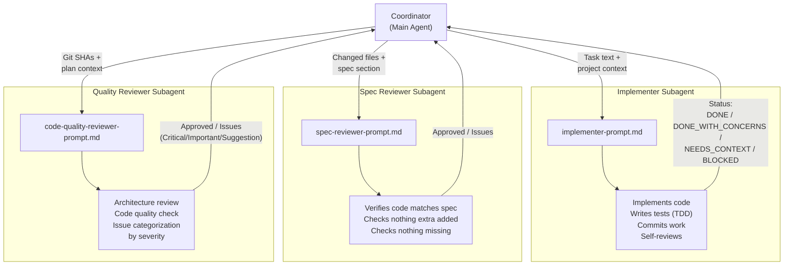

Model selection follows a cost-optimization strategy: mechanical tasks (1-2 files, clear spec) use cheap/fast models, integration tasks use standard models, and architecture/review tasks use the most capable model.

> *Sources: [`skills/subagent-driven-development/SKILL.md`](https://github.com/obra/superpowers/blob/main/skills/subagent-driven-development/SKILL.md), [`skills/subagent-driven-development/implementer-prompt.md`](https://github.com/obra/superpowers/blob/main/skills/subagent-driven-development/implementer-prompt.md), [`skills/subagent-driven-development/spec-reviewer-prompt.md`](https://github.com/obra/superpowers/blob/main/skills/subagent-driven-development/spec-reviewer-prompt.md), [`skills/subagent-driven-development/code-quality-reviewer-prompt.md`](https://github.com/obra/superpowers/blob/main/skills/subagent-driven-development/code-quality-reviewer-prompt.md)*

---

## 7. Test-Driven Development Cycle

The TDD skill enforces the strictest discipline in the entire system, with an absolute iron law.

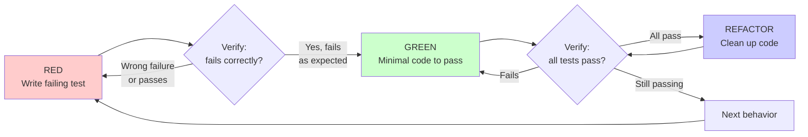

The iron law is enforced through rationalization prevention — the skill explicitly lists common excuses and marks them as red flags that mean "delete code, start over."

> *Source: [`skills/test-driven-development/SKILL.md`](https://github.com/obra/superpowers/blob/main/skills/test-driven-development/SKILL.md)*

---

## 8. Systematic Debugging — 4-Phase Process

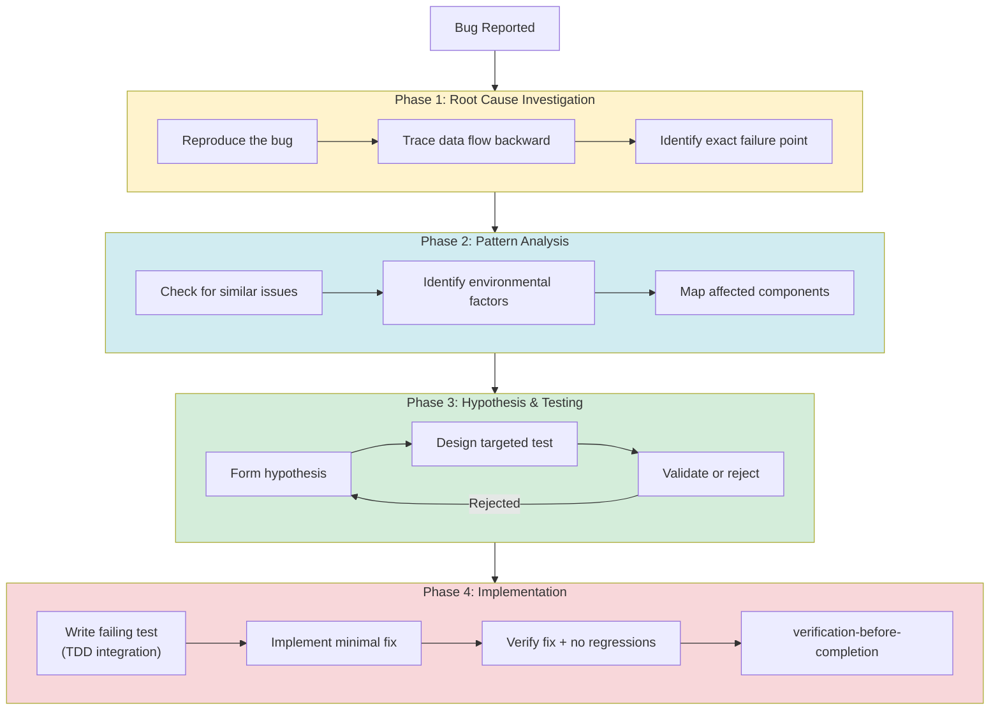

Supporting techniques include root-cause tracing (tracing bugs backward through stack traces), defense-in-depth (four-layer validation pattern), and condition-based waiting (replacing arbitrary timeouts with polling for flaky tests).

> *Sources: [`skills/systematic-debugging/SKILL.md`](https://github.com/obra/superpowers/blob/main/skills/systematic-debugging/SKILL.md), [`skills/systematic-debugging/root-cause-tracing.md`](https://github.com/obra/superpowers/blob/main/skills/systematic-debugging/root-cause-tracing.md), [`skills/systematic-debugging/defense-in-depth.md`](https://github.com/obra/superpowers/blob/main/skills/systematic-debugging/defense-in-depth.md), [`skills/systematic-debugging/condition-based-waiting.md`](https://github.com/obra/superpowers/blob/main/skills/systematic-debugging/condition-based-waiting.md)*

---

## 9. Brainstorming & Visual Companion Architecture

The brainstorming skill includes a browser-based visual companion powered by a zero-dependency WebSocket server.

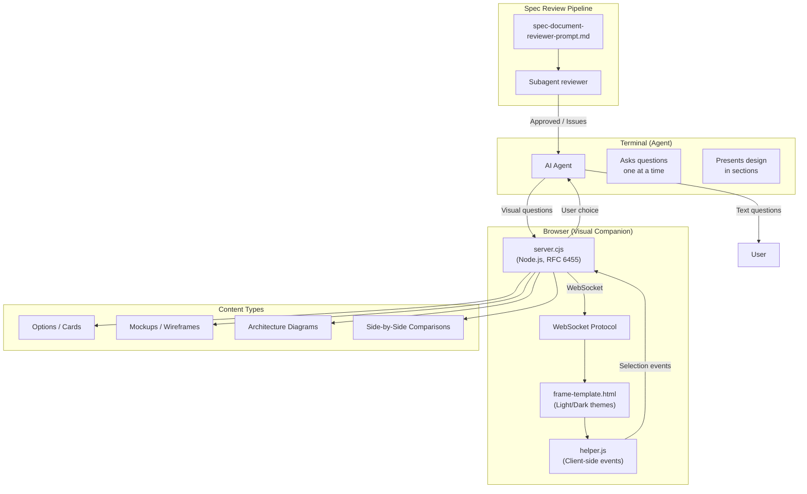

The server implements RFC 6455 WebSocket handshake with zero external dependencies (no `node_modules`). It supports file watching for live updates and persistence of brainstorming state.

> *Sources: [`skills/brainstorming/SKILL.md`](https://github.com/obra/superpowers/blob/main/skills/brainstorming/SKILL.md), [`skills/brainstorming/visual-companion.md`](https://github.com/obra/superpowers/blob/main/skills/brainstorming/visual-companion.md), [`skills/brainstorming/scripts/server.cjs`](https://github.com/obra/superpowers/blob/main/skills/brainstorming/scripts/server.cjs)*

---

## 10. Document Review System

A subagent-based review pipeline ensures quality at every stage of the workflow.

```mermaid
flowchart TD
    subgraph "Brainstorming Phase"
        SPEC_DOC["Spec Document Written"]
        SPEC_REV["spec-document-reviewer<br/>(subagent)"]
        SPEC_DOC --> SPEC_REV
        SPEC_REV -->|"Issues"| SPEC_DOC
        SPEC_REV -->|"Approved<br/>(max 3 iterations)"| USER_REV["User Review Gate"]
    end

    subgraph "Planning Phase"
        PLAN_DOC["Plan Document Written"]
        PLAN_REV["plan-document-reviewer<br/>(subagent)"]
        PLAN_DOC --> PLAN_REV
        PLAN_REV -->|"Issues"| PLAN_DOC
        PLAN_REV -->|"Approved<br/>(max 3 iterations)"| EXEC["Execution Handoff"]
    end

    subgraph "Execution Phase"
        TASK["Task Implemented"]
        SPEC_CR["Spec Compliance<br/>Reviewer (subagent)"]
        QUAL_CR["Code Quality<br/>Reviewer (subagent)"]
        TASK --> SPEC_CR
        SPEC_CR -->|"Issues"| TASK
        SPEC_CR -->|"Approved"| QUAL_CR
        QUAL_CR -->|"Issues"| TASK
        QUAL_CR -->|"Approved"| DONE["Task Complete"]
    end

    subgraph "Completion Phase"
        ALL["All Tasks Done"]
        FINAL["Final Code Review<br/>(full implementation)"]
        ALL --> FINAL
        FINAL --> FINISH["finishing-a-development-branch"]
    end
```

Each review loop has a maximum of 3 iterations before escalating to the human. Reviewers are dispatched with precisely crafted context (never session history) to keep them focused.

> *Sources: [`skills/brainstorming/spec-document-reviewer-prompt.md`](https://github.com/obra/superpowers/blob/main/skills/brainstorming/spec-document-reviewer-prompt.md), [`skills/writing-plans/plan-document-reviewer-prompt.md`](https://github.com/obra/superpowers/blob/main/skills/writing-plans/plan-document-reviewer-prompt.md), [`docs/superpowers/specs/2026-01-22-document-review-system-design.md`](https://github.com/obra/superpowers/blob/main/docs/superpowers/specs/2026-01-22-document-review-system-design.md)*

---

## 11. Multi-Platform Integration Architecture

Superpowers supports five different AI coding platforms with platform-specific adapters.

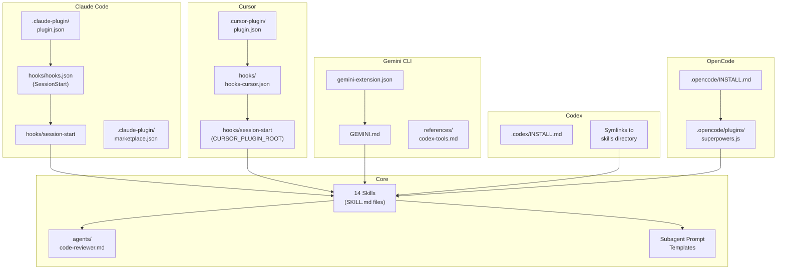

The `run-hook.cmd` file is a polyglot script (both Windows batch and Unix shell) enabling cross-platform hook execution. The OpenCode plugin (`superpowers.js`) is a native ESM module that injects the bootstrap content and auto-registers skills.

> *Sources: [`.claude-plugin/plugin.json`](https://github.com/obra/superpowers/blob/main/.claude-plugin/plugin.json), [`.cursor-plugin/plugin.json`](https://github.com/obra/superpowers/blob/main/.cursor-plugin/plugin.json), [`gemini-extension.json`](https://github.com/obra/superpowers/blob/main/gemini-extension.json), [`.codex/INSTALL.md`](https://github.com/obra/superpowers/blob/main/.codex/INSTALL.md), [`.opencode/plugins/superpowers.js`](https://github.com/obra/superpowers/blob/main/.opencode/plugins/superpowers.js), [`docs/windows/polyglot-hooks.md`](https://github.com/obra/superpowers/blob/main/docs/windows/polyglot-hooks.md)*

---

## 12. Repository File Structure

```mermaid
graph TD
    ROOT["superpowers/"]

    ROOT --> SKILLS_DIR["skills/ (14 skills)"]
    ROOT --> AGENTS_DIR["agents/"]
    ROOT --> COMMANDS["commands/ (deprecated)"]
    ROOT --> HOOKS["hooks/"]
    ROOT --> DOCS["docs/"]
    ROOT --> TESTS["tests/"]
    ROOT --> PLUGIN_CC[".claude-plugin/"]
    ROOT --> PLUGIN_CUR[".cursor-plugin/"]
    ROOT --> OPENCODE[".opencode/"]
    ROOT --> CODEX[".codex/"]
    ROOT --> CONFIG["Config files"]

    SKILLS_DIR --> SK_META["Meta: using-superpowers,<br/>writing-skills"]
    SKILLS_DIR --> SK_DESIGN["Design: brainstorming,<br/>writing-plans"]
    SKILLS_DIR --> SK_EXEC["Execution: subagent-driven-dev,<br/>executing-plans, dispatching-<br/>parallel-agents, TDD,<br/>git-worktrees, finishing-branch"]
    SKILLS_DIR --> SK_QUALITY["Quality: requesting-code-review,<br/>receiving-code-review,<br/>verification-before-completion,<br/>systematic-debugging"]

    AGENTS_DIR --> CR["code-reviewer.md"]

    HOOKS --> HJ["hooks.json"]
    HOOKS --> HCJ["hooks-cursor.json"]
    HOOKS --> HSS["session-start"]
    HOOKS --> HRC["run-hook.cmd"]

    DOCS --> SPECS["superpowers/specs/<br/>(3 design specs)"]
    DOCS --> PLANS["superpowers/plans/<br/>(3 impl plans)"]
    DOCS --> LEGACY["plans/<br/>(4 legacy plans)"]

    TESTS --> T_BS["brainstorm-server/"]
    TESTS --> T_OC["opencode/"]
    TESTS --> T_SK["skill-triggering/"]
    TESTS --> T_EX["explicit-skill-requests/"]
    TESTS --> T_SDD["subagent-driven-dev/"]
    TESTS --> T_CC["claude-code/"]

    CONFIG --> PKG["package.json"]
    CONFIG --> GEM["gemini-extension.json + GEMINI.md"]
    CONFIG --> LIC["LICENSE (MIT)"]
```

> *Source: Repository file listing*

---

## 13. Skill Authoring & Testing (Meta-Skill)

The `writing-skills` skill applies TDD principles to documentation itself.

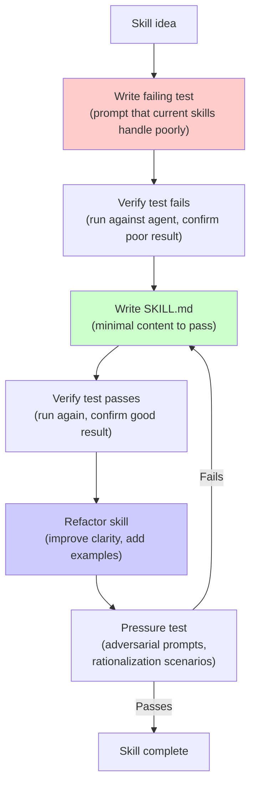

Skills use Claude Search Optimization (CSO) — structuring content so the agent will find and follow instructions reliably. The `writing-skills` skill includes guidance on persuasion principles (authority, commitment, scarcity), Graphviz conventions for flow diagrams, and a render-graphs.js utility.

> *Sources: [`skills/writing-skills/SKILL.md`](https://github.com/obra/superpowers/blob/main/skills/writing-skills/SKILL.md), [`skills/writing-skills/anthropic-best-practices.md`](https://github.com/obra/superpowers/blob/main/skills/writing-skills/anthropic-best-practices.md), [`skills/writing-skills/persuasion-principles.md`](https://github.com/obra/superpowers/blob/main/skills/writing-skills/persuasion-principles.md)*

---

## 14. Git Worktree Lifecycle

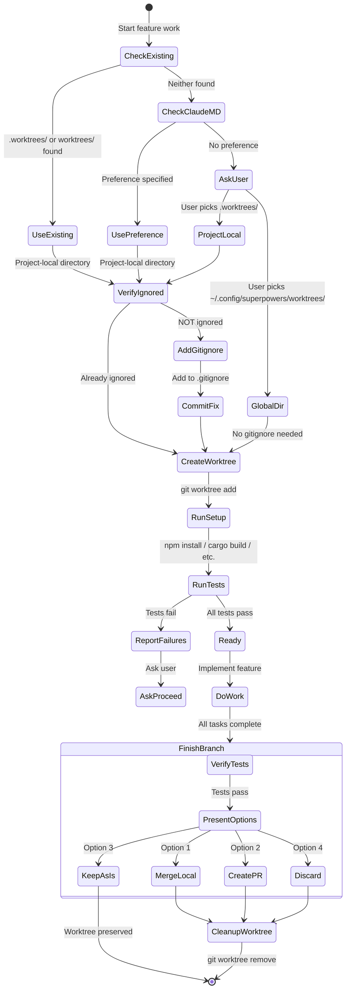

> *Sources: [`skills/using-git-worktrees/SKILL.md`](https://github.com/obra/superpowers/blob/main/skills/using-git-worktrees/SKILL.md), [`skills/finishing-a-development-branch/SKILL.md`](https://github.com/obra/superpowers/blob/main/skills/finishing-a-development-branch/SKILL.md)*

---

## 15. Instruction Priority & Rationalization Prevention

A key design pattern throughout Superpowers is explicit rationalization prevention. Multiple skills define "iron laws" and then list common excuses agents use to skip them.

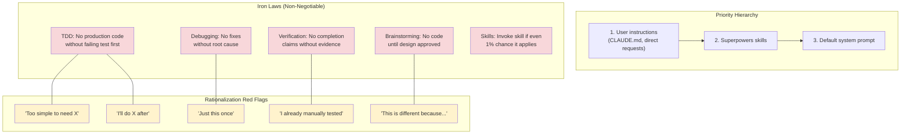

> *Sources: [`skills/using-superpowers/SKILL.md`](https://github.com/obra/superpowers/blob/main/skills/using-superpowers/SKILL.md), [`skills/test-driven-development/SKILL.md`](https://github.com/obra/superpowers/blob/main/skills/test-driven-development/SKILL.md), [`skills/systematic-debugging/SKILL.md`](https://github.com/obra/superpowers/blob/main/skills/systematic-debugging/SKILL.md), [`skills/verification-before-completion/SKILL.md`](https://github.com/obra/superpowers/blob/main/skills/verification-before-completion/SKILL.md)*

---

## 16. Testing Infrastructure

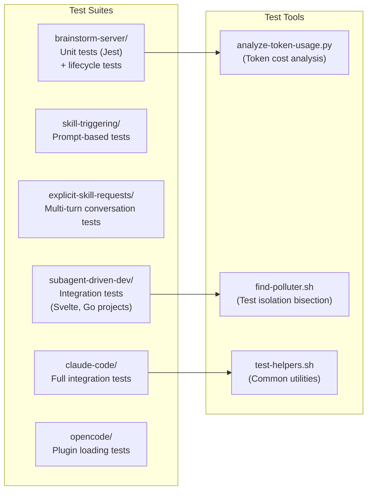

The testing approach includes prompt-based tests (running prompts through agents and checking for correct skill triggering), integration tests with real scaffolded projects, and token usage analysis for cost optimization.

> *Sources: [`docs/testing.md`](https://github.com/obra/superpowers/blob/main/docs/testing.md), [`tests/`](https://github.com/obra/superpowers/tree/main/tests)*

---

## 17. Evolution & Design History

The project has evolved through several major architectural decisions, documented in its specs and plans.

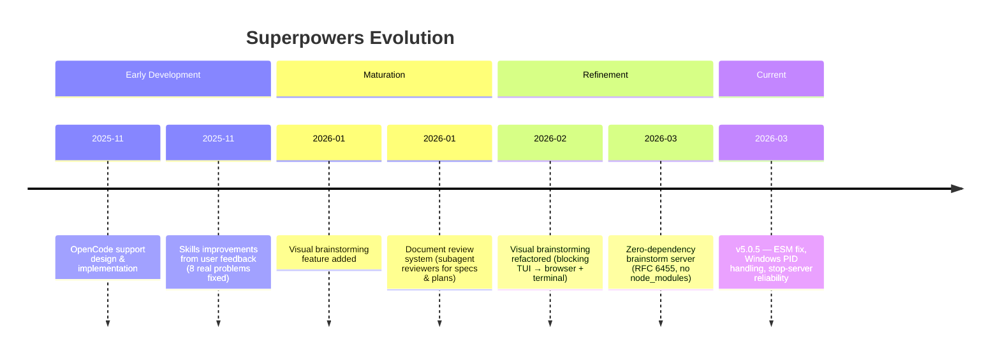

> *Sources: [`CHANGELOG.md`](https://github.com/obra/superpowers/blob/main/CHANGELOG.md), [`RELEASE-NOTES.md`](https://github.com/obra/superpowers/blob/main/RELEASE-NOTES.md), all files in [`docs/superpowers/specs/`](https://github.com/obra/superpowers/tree/main/docs/superpowers/specs) and [`docs/plans/`](https://github.com/obra/superpowers/tree/main/docs/plans)*

---

## 18. Key Design Decisions & Trade-offs

| Decision | Rationale | Trade-off |
|----------|-----------|-----------|
| Fresh subagent per task | Prevents context pollution; each task gets clean slate | More subagent invocations = higher token cost |
| Two-stage review (spec then quality) | Spec compliance prevents over/under-building; quality ensures good code | Adds latency per task |
| Iron laws with rationalization lists | Agents tend to rationalize skipping discipline; explicit lists counter this | Verbose skill files; feels rigid |
| Zero-dependency brainstorm server | Eliminates vendored `node_modules`; simpler distribution | Must implement RFC 6455 from scratch |
| Polyglot hook script | Single file works on Windows and Unix | Complex bash/batch interleaving |
| Skills trigger automatically | User doesn't need to remember workflows | May feel intrusive for simple tasks |
| Max 3 review iterations then escalate | Prevents infinite loops | May surface to human prematurely |
| Plan tasks are 2-5 minutes each | Small enough for reliable subagent execution | Requires very granular planning |

---

## Summary

Superpowers transforms AI coding agents from eager-but-undisciplined code generators into structured software engineers. Its architecture is built around composable skills that enforce a linear workflow (brainstorm → plan → execute → review → finish), with multiple quality gates (spec review, code review, verification-before-completion) and explicit rationalization prevention at every stage. The system supports five different AI platforms through platform-specific adapters, all sharing the same core skill files.
