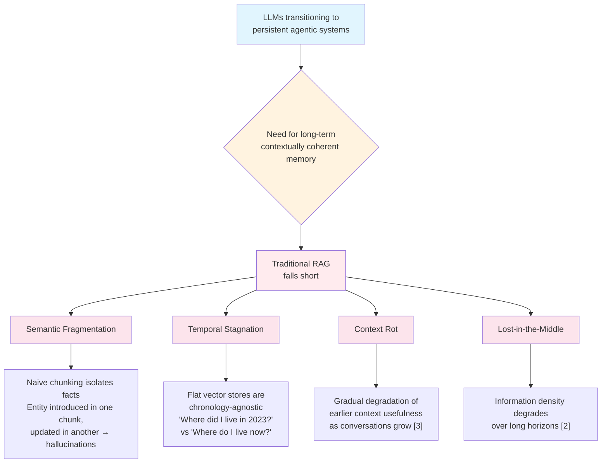
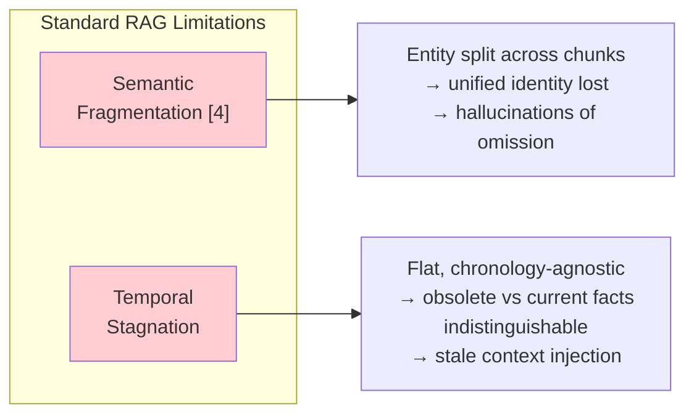
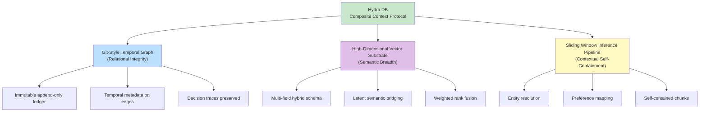

# Hydra DB: Overview and Motivation

> **Navigation**: [Architecture Hub](./09-end-to-end-architecture.md) | **Overview** | [Next: Ontological Structure](./02-ontological-structure-vs-flat-index.md) | [All References](./10-all-references.md)

**Paper**: *Hydra DB: Beyond Context Windows for Long-Term Agentic Memory*
**Authors**: Soham Ratnaparkhi, Nishkarsh Srivastava, Aadil Garg, Pratham Garg, Tejas Kumar
**Affiliation**: Engineering, Hydra DB, San Francisco, California, USA

---

## What is Hydra DB?

Hydra DB is a **persistent memory architecture for AI agents** that combines:
1. A **[Sliding Window Inference Pipeline](./04-sliding-window-inference-pipeline.md)** for contextual self-containment
2. A **[Git-Style Versioned Contextual Knowledge Graph](./03-temporal-knowledge-graph.md)** for temporal integrity
3. A **[High-Dimensional Vector Substrate](./06-vector-substrate-and-latent-bridging.md)** for semantic breadth

It achieves **90.79% accuracy** on the LongMemEval-s benchmark (SOTA), outperforming the previous best by +5 points. See [full benchmark results](./08-results-and-benchmarks.md).

---

## The Problem Space

### Why Context Window Scaling Alone Fails

| Problem | Description |
|---------|-------------|
| **Computational Cost** | Extremely high costs for large context windows [\[1\]](./10-all-references.md#1-llms-bigger-is-not-always-better) |
| **Lost-in-the-Middle** | Information density degrades over long horizons [\[2\]](./10-all-references.md#2-lost-in-the-middle-how-language-models-use-long-contexts) |
| **Context Rot** | Stale/irrelevant info accumulates, degrading recall [\[3\]](./10-all-references.md#3-context-rot-how-increasing-input-tokens-impacts-llm-performance) |
| **State Persistence** | Every new session resets the model's understanding |
| **Sentiment Loss** | RAG preserves facts but loses emotional intensity |

### Why Standard RAG Fails

See [\[4\] Introducing Contextual Retrieval](./10-all-references.md#4-introducing-contextual-retrieval) for more on semantic fragmentation.

---

## Hydra DB's Solution: Composite Context Protocol

**Deep dives into each component:**
- [Git-Style Temporal Graph](./03-temporal-knowledge-graph.md)
- [Sliding Window Inference Pipeline](./04-sliding-window-inference-pipeline.md)
- [High-Dimensional Vector Substrate](./06-vector-substrate-and-latent-bridging.md)
- [Multi-Stage Recall Pipeline](./07-recall-pipeline.md)

---

## Key Results at a Glance

| Benchmark Category | Hydra DB | Best Competitor | Improvement |
|---|---|---|---|
| Single-Session (User) | **100.00%** | 98.57% | +1.43 |
| Single-Session (Assistant) | **100.00%** | 98.21% | +1.79 |
| Single-Session (Preference) | **96.67%** | 70.00% | +26.67 |
| Knowledge Update | **97.43%** | 89.74% | +7.69 |
| Temporal Reasoning | **90.97%** | 81.95% | +9.02 |
| Multi-Session Reasoning | **76.69%** | 76.69% | 0.00 |
| **Overall** | **90.79%** | 85.20% | **+5.59** |

Competitors: [\[10\] Supermemory](./10-all-references.md#10-supermemory-state-of-the-art-agent-memory-on-longmemeval), [\[11\] Zep](./10-all-references.md#11-zep-a-temporal-knowledge-graph-architecture-for-agent-memory), Full-context (GPT-4o), [\[12\] Mem0-oss](./10-all-references.md#12-mem0-building-production-ready-ai-agents-with-scalable-long-term-memory)

See [detailed benchmark analysis](./08-results-and-benchmarks.md) for cross-model generalization results.

---

## References from This Section

- [\[1\] Rigoni, T. "LLMs: Bigger Is Not Always Better."](./10-all-references.md#1-llms-bigger-is-not-always-better) Ampere Computing Blog (2024)
- [\[2\] Liu, N.F. et al. "Lost in the Middle: How Language Models Use Long Contexts"](./10-all-references.md#2-lost-in-the-middle-how-language-models-use-long-contexts) (2023). arXiv:2307.03172
- [\[3\] Hong, K. et al. "Context Rot: How Increasing Input Tokens Impacts LLM Performance"](./10-all-references.md#3-context-rot-how-increasing-input-tokens-impacts-llm-performance) (2025)
- [\[4\] Ford, D. "Introducing Contextual Retrieval."](./10-all-references.md#4-introducing-contextual-retrieval) Anthropic Engineering Blog (2024)
- [\[5\] Wu, D. et al. "LongMemEval: Benchmarking Chat Assistants on Long-Term Interactive Memory"](./10-all-references.md#5-longmemeval-benchmarking-chat-assistants-on-long-term-interactive-memory) (2025). arXiv:2410.10813
- [\[6\] Maharana, A. et al. "Evaluating very long-term conversational memory of llm agents"](./10-all-references.md#6-evaluating-very-long-term-conversational-memory-of-llm-agents) (2024). arXiv:2402.17753
- [\[7\] Chalef, D. & Rasmussen, P. "Is Mem0 Really SOTA in Agent Memory?"](./10-all-references.md#7-is-mem0-really-sota-in-agent-memory) Zep Blog (2025)

---

> **Navigation**: [Architecture Hub](./09-end-to-end-architecture.md) | **Overview** | [Next: Ontological Structure](./02-ontological-structure-vs-flat-index.md) | [All References](./10-all-references.md)
