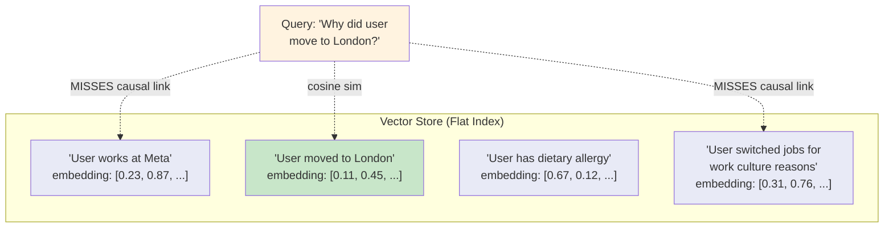
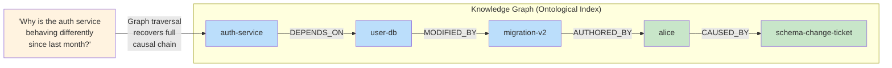
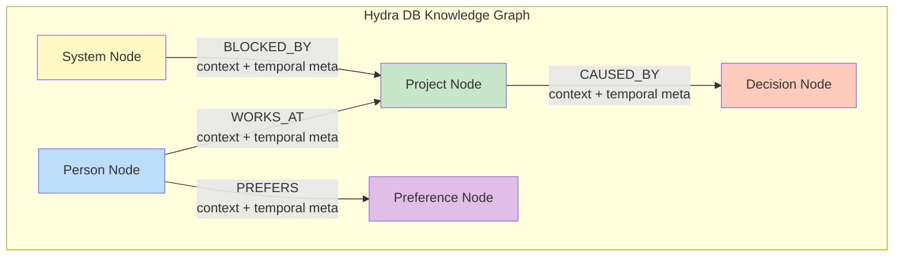
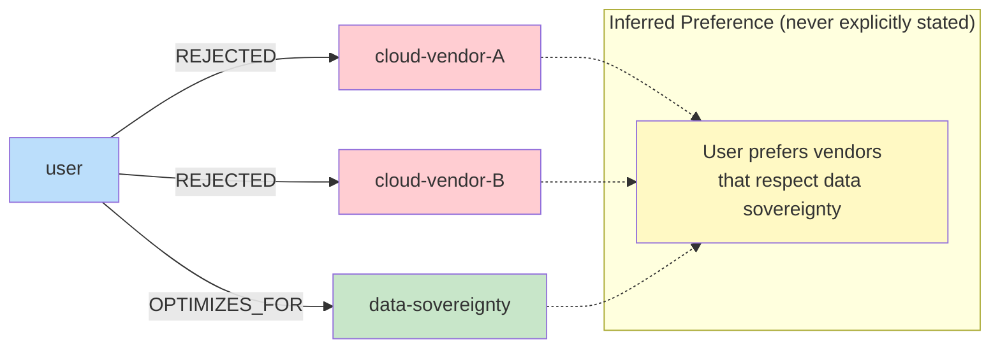
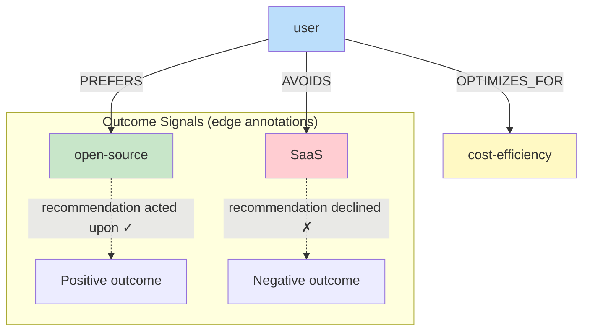

# Ontological Structure vs. the Flat Index Problem

> **Navigation**: [Architecture Hub](./09-end-to-end-architecture.md) | [Prev: Overview](./01-overview-and-motivation.md) | **Ontological Structure** | [Next: Temporal Graph](./03-temporal-knowledge-graph.md) | [All References](./10-all-references.md)

## Section 2.1 of the Paper

---

## The Core Assumption That Fails

Standard RAG assumes: **semantic proximity implies informational relevance**.

This is **false in production** because:
- Two facts can be **semantically distant yet causally linked** (career switch → relocation)
- Two facts can be **semantically close yet factually orthogonal** ("I love Python" ≈ "I used to love Python")

> Vector stores reduce all knowledge to a *flat index* — a high-dimensional soup of embeddings where the only retrieval primitive is cosine similarity. Microsoft Research demonstrated this baseline approach "struggles to connect the dots" [\[9\]](./10-all-references.md#9-from-local-to-global-a-graph-rag-approach-to-query-focused-summarization).

---

## Hydra DB's Approach: Ontological Substrate

Instead of asking **"what is similar?"**, Hydra DB asks **"how is everything actually related?"**

> The graph makes *distant but causally connected* facts retrievable, while preserving the semantic retrieval capabilities of the [vector substrate](./06-vector-substrate-and-latent-bridging.md) for cases where entity identity is ambiguous.

---

## Three Architectural Consequences

### 2.1.1 Structured Relational Index over Flat Embedding Space

Each entity (person, project, system, preference, decision) is a **first-class node**. Each relationship carries:
- A **semantic type** (e.g., `WORKS_AT`, `PREFERS`, `CAUSED_BY`, `BLOCKED_BY`)
- A **natural language context string**
- **Temporal metadata**

This enables **deterministic, multi-hop traversal** impossible in a flat index.

---

### 2.1.2 Graph-Derived Conclusions as Universal Context Signals

The graph doesn't just store facts — it stores **decision traces** (the *why* behind state changes). See also [how the temporal graph preserves decision context](./03-temporal-knowledge-graph.md).

When a new edge `e_k` is committed to `E(u,v)`, the accompanying `C_meta` field preserves:
- **Reasoning context** surrounding the transition
- **Sentiment** and situational factors
- **Why** the user changed their preference
- **What alternatives** were considered

> The result is a memory system that grows progressively smarter with use: the more the graph is traversed, the more latent structure it surfaces.

---

### 2.1.3 Preference and Outcome Accumulation Across Sessions

Vector databases are **stateless** with respect to preference learning. Hydra DB **accumulates** preferences as structured, typed relationships.

Outcome signals transform memory from a **passive record** of what was said into an **active model** of what the user values — enabling agents to move from *retrieving stated preferences* to *reasoning over demonstrated outcomes*.

---

## Key Insight

| Flat Index (Vector Store) | Ontological Index (Hydra DB) |
|---|---|
| "What is similar?" | "How is everything related?" |
| Cosine similarity only | Typed relationships + traversal |
| Independent chunks | Connected entities |
| Stateless per session | Accumulates preferences |
| Loses decision context | Preserves decision traces |
| Cannot do multi-hop | Deterministic multi-hop traversal |

---

## References

- [\[8\] Lewis, P. et al. "Retrieval-Augmented Generation for Knowledge-Intensive NLP Tasks"](./10-all-references.md#8-retrieval-augmented-generation-for-knowledge-intensive-nlp-tasks) (2021). arXiv:2005.11401
- [\[9\] Edge, D. et al. "From local to global: A graph rag approach to query-focused summarization."](./10-all-references.md#9-from-local-to-global-a-graph-rag-approach-to-query-focused-summarization) arXiv:2404.16130 (2024)

---

> **Navigation**: [Architecture Hub](./09-end-to-end-architecture.md) | [Prev: Overview](./01-overview-and-motivation.md) | **Ontological Structure** | [Next: Temporal Graph](./03-temporal-knowledge-graph.md) | [All References](./10-all-references.md)
