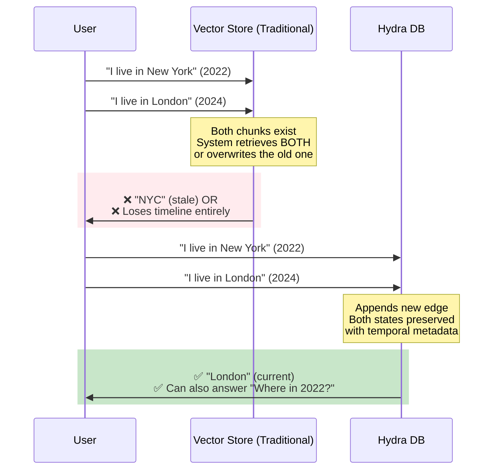
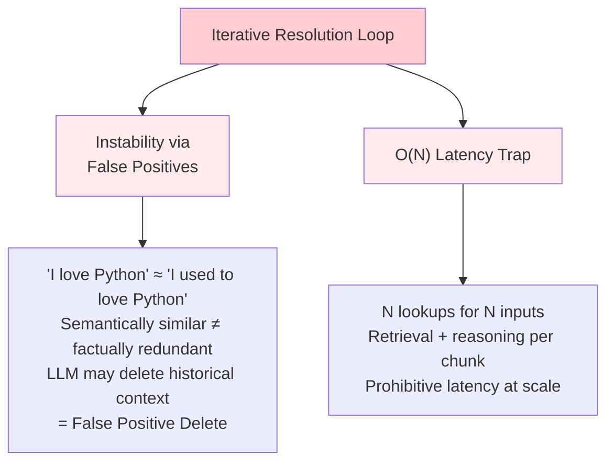
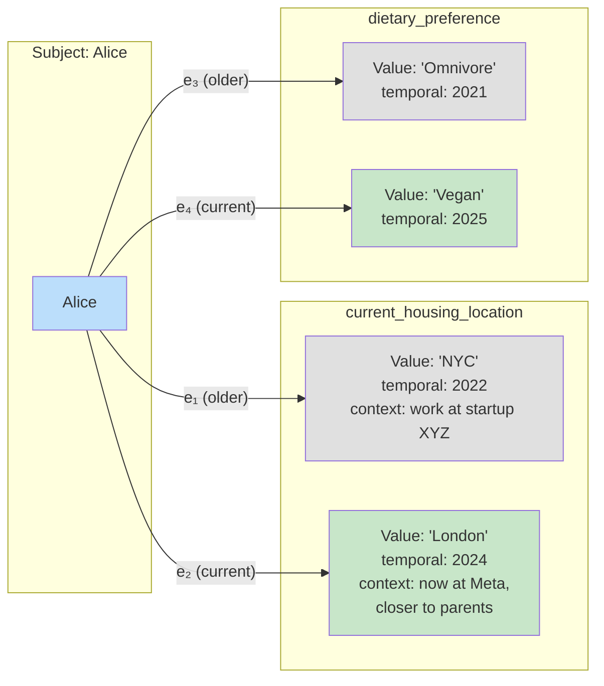
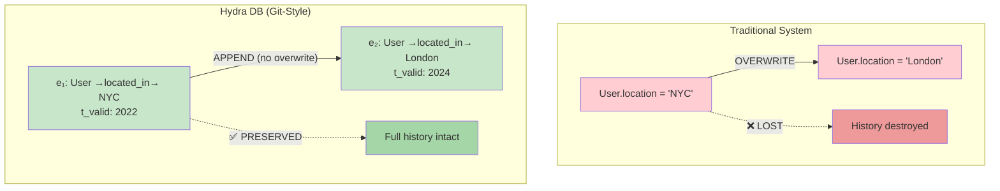
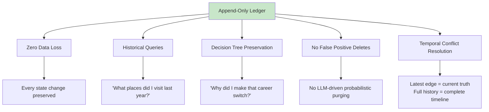

# Temporally-Aware Contextual Knowledge Graph

> **Navigation**: [Architecture Hub](./09-end-to-end-architecture.md) | [Prev: Ontological Structure](./02-ontological-structure-vs-flat-index.md) | **Temporal Graph** | [Next: Sliding Window Pipeline](./04-sliding-window-inference-pipeline.md) | [All References](./10-all-references.md)

## Section 2.2 of the Paper

---

## The State Confusion Problem

Standard RAG systems suffer when facts change over time:



---

## The Destructive Update Problem (Section 2.2.1)

Many memory systems use an **Iterative Resolution Loop**: find "similar" facts → ask LLM to update or delete.

Hydra DB **rejects** this for two reasons:



---

## The Solution: Git-Style Append-Only Log (Section 2.2.2)

Hydra DB treats memory as an **immutable ledger**, analogous to a Git repository's commit history.

### Temporal-State Graph Topology



### Formal Edge Definition

Each relationship `R` between entities `u` and `v` is not a single static edge, but a **time-ordered sequence of state changes** (versioned commits).

Let `E(u,v)` denote the set of all edges connecting entities `u` and `v`. Each edge:

```
e_k = (r_k, t_commit, t_valid, C_meta)
```

| Component | Description | Example |
|---|---|---|
| `r_k` | Semantic relation | `located_in`, `prefers` |
| `t_commit` | Ingestion timestamp | When the system recorded it |
| `t_valid` | Real-world temporal validity | "in 2022", "since 2024" |
| `C_meta` | Auxiliary metadata | Context, sentiment, reasoning |

### Append-Only Behavior



### Differential Reasoning

The current relational state is formalized as:

```
ΔState(u, v) = SortByTime(E(u, v)) | t ≤ t_now
```

This strictly monotonic growth enables **Differential Reasoning** — the system can:
- Answer "Where do you live **now**?" → London (latest edge)
- Answer "Where did you live **in 2022**?" → NYC (historical edge)
- Answer "**Why** did you move?" → C_meta from the London edge (context: "switched to Meta, closer to parents")
- Answer "What places have you visited?" → Traverse all edges

---

## Key Guarantees



---

## Analogy: Git vs. Hydra DB

| Git | Hydra DB |
|---|---|
| Repository | Knowledge Graph `G` |
| Commit | Edge `e_k` with timestamp |
| Commit message | `C_meta` (context, reasoning) |
| Branch history | `E(u,v)` — all edges between two entities |
| `HEAD` | Latest edge (current state) |
| `git log` | `ΔState(u,v)` — full temporal history |
| Never mutates past commits | Never mutates past edges |

---

## Related Components

- The [Ontological Structure](./02-ontological-structure-vs-flat-index.md) explains *why* a graph is used over a flat index
- The [Sliding Window Pipeline](./04-sliding-window-inference-pipeline.md) produces the enriched chunks that get stored as graph edges
- The [Recall Pipeline](./07-recall-pipeline.md) traverses this graph during retrieval (Stage 3: Graph-Augmented Retrieval)
- The [Bio-Mimetic Decay](./05-bio-mimetic-memory-decay.md) manages retention scores on these edges (experimental)

## References

- [\[8\] Lewis, P. et al. "Retrieval-Augmented Generation for Knowledge-Intensive NLP Tasks"](./10-all-references.md#8-retrieval-augmented-generation-for-knowledge-intensive-nlp-tasks) (2021). arXiv:2005.11401

---

> **Navigation**: [Architecture Hub](./09-end-to-end-architecture.md) | [Prev: Ontological Structure](./02-ontological-structure-vs-flat-index.md) | **Temporal Graph** | [Next: Sliding Window Pipeline](./04-sliding-window-inference-pipeline.md) | [All References](./10-all-references.md)
