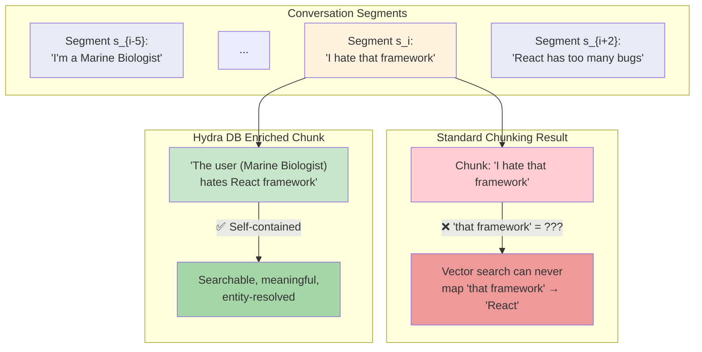
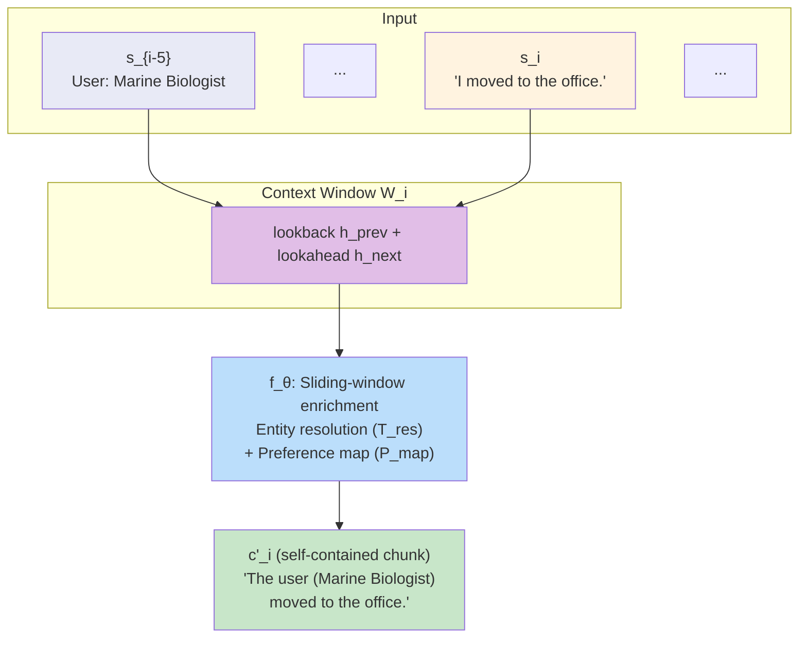
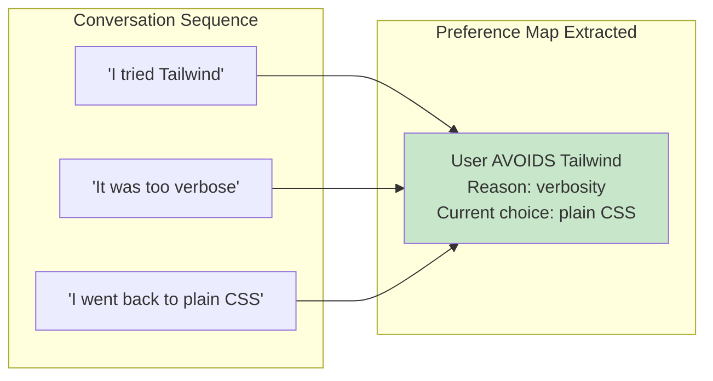
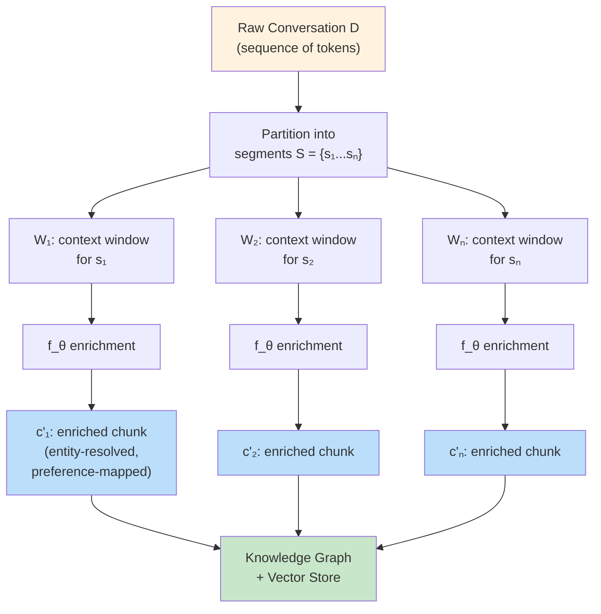

# Sliding Window Inference Pipeline

> **Navigation**: [Architecture Hub](./09-end-to-end-architecture.md) | [Prev: Temporal Graph](./03-temporal-knowledge-graph.md) | **Sliding Window** | [Next: Bio-Mimetic Decay](./05-bio-mimetic-memory-decay.md) | [All References](./10-all-references.md)

## Section 2.3 of the Paper

---

## The Orphaned Pronoun Paradox (Section 2.3.1)

Standard document chunking (e.g., recursive character splitting) rendered **nearly 40% of chunks semantically invisible**. This is the [Semantic Fragmentation problem](./01-overview-and-motivation.md#why-standard-rag-fails) discussed by [\[4\] Anthropic](./10-all-references.md#4-introducing-contextual-retrieval).



**Initial attempt**: Larger overlap windows → just increased downstream token costs without solving the core problem.

---

## The Solution (Section 2.3.2)

### Step 1: Partition into Base Segments

Let `D` be a conversational session (sequence of tokens). Partition into base segments:

```
S = {s₁, s₂, ..., sₙ}
```

### Step 2: Construct Context Windows

For each segment `sᵢ`, construct a context window `Wᵢ` with a **lookback horizon** `h_prev` and a **lookahead horizon** `h_next`:

```
Wᵢ = [s_{i-h_prev}, ..., sᵢ, ..., s_{i+h_next}]
```

### Step 3: Enrichment Transformation

Apply transformation function `f_θ` (a lightweight LLM) that maps raw segment `sᵢ` and its context window `Wᵢ` to an enriched chunk `c'ᵢ`:

```
c'ᵢ = f_θ(sᵢ | Wᵢ) = {T_res, P_map, sᵢ}
```



---

## Two Key Operations

### T_res: Entity Resolution

Replaces implicit references with explicit, uniquely identifiable entities inferred from the context window.

| Before (Raw) | After (Resolved) |
|---|---|
| "he" | "John (the user's manager)" |
| "that project" | "Project Atlas" |
| "I moved to the office" | "The user (Marine Biologist) moved to the office" |
| "that framework" | "React" |

### P_map: Preference Mapping

Extracts persistent user constraints and conclusions from sequences that may influence future interactions. These preferences feed into the [Ontological Structure](./02-ontological-structure-vs-flat-index.md#213-preference-and-outcome-accumulation-across-sessions) as typed graph relationships.



---

## End-to-End Pipeline Flow



Enriched chunks flow into two destinations:
- The [Git-Style Temporal Knowledge Graph](./03-temporal-knowledge-graph.md) as append-only edges
- The [High-Dimensional Vector Substrate](./06-vector-substrate-and-latent-bridging.md) as triple-vector embeddings (including `v_latent` from the enriched context)

---

## Why This Matters

| Standard Chunking | Sliding Window Inference |
|---|---|
| Chunks are "blind segments" | Every chunk is self-contained |
| Pronouns unresolved | Entity resolution via `T_res` |
| Preferences lost | Preference mapping via `P_map` |
| ~40% of chunks semantically useless | All chunks are semantically rich |
| Context lost at chunk boundaries | Context preserved via overlapping windows |
| Requires LLM to reconstruct context at query time | Context pre-computed at ingestion time |

This pipeline directly enables:
- **100% single-session accuracy** — see [benchmark results](./08-results-and-benchmarks.md#performance-gemini-30-pro-section-321)
- **96.67% preference extraction** — via `P_map` + [Latent Semantic Bridging](./06-vector-substrate-and-latent-bridging.md#latent-semantic-bridging-section-252)

---

> **Navigation**: [Architecture Hub](./09-end-to-end-architecture.md) | [Prev: Temporal Graph](./03-temporal-knowledge-graph.md) | **Sliding Window** | [Next: Bio-Mimetic Decay](./05-bio-mimetic-memory-decay.md) | [All References](./10-all-references.md)
