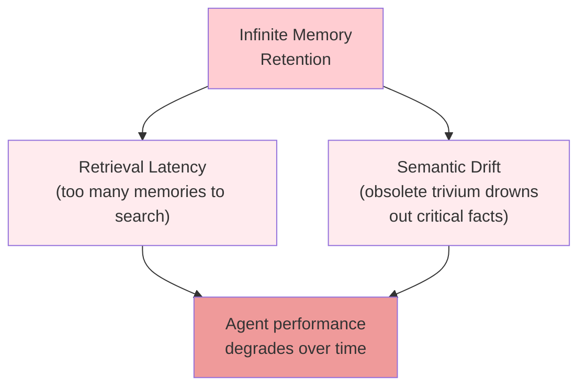
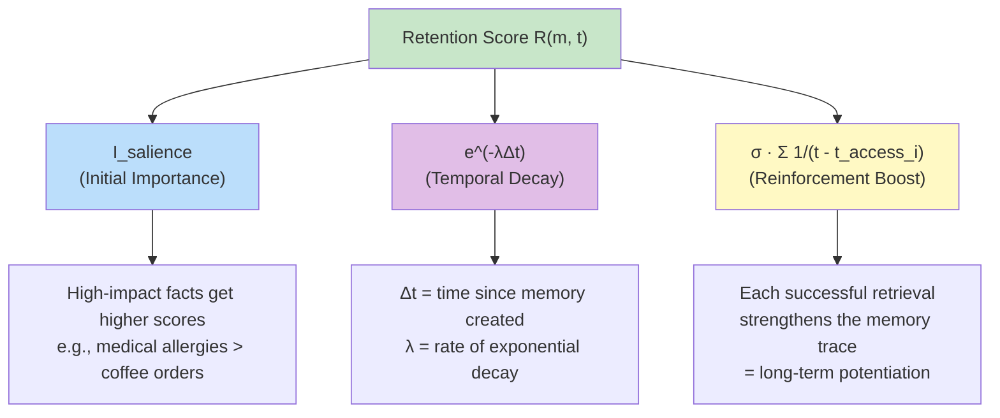
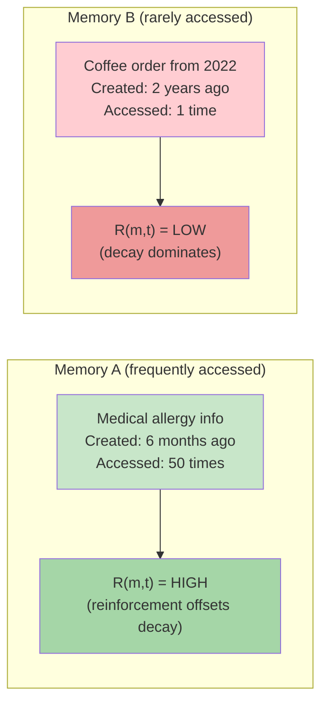
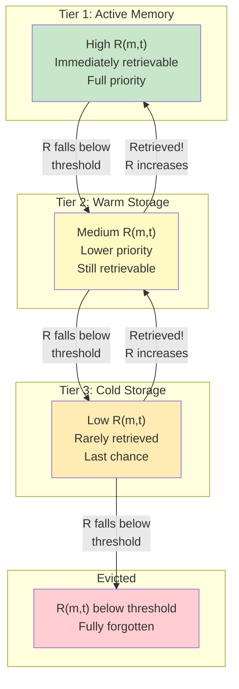

# Bio-Mimetic Memory Consolidation (Experimental)

> **Navigation**: [Architecture Hub](./09-end-to-end-architecture.md) | [Prev: Sliding Window](./04-sliding-window-inference-pipeline.md) | **Memory Decay** | [Next: Vector Substrate](./06-vector-substrate-and-latent-bridging.md) | [All References](./10-all-references.md)

## Section 2.4 of the Paper

> **Note**: This is an **experimental framework** — the authors state they are "currently experimenting" with this approach.

---

## The Problem: Infinite Memory Retention

The assumption that "more data is better" leads to:



## The Solution: Memory as a Living Lifecycle

Inspired by the human brain's process of **synaptic pruning** and **memory consolidation**.

**Hypothesis**: Memory should not be a static repository, but a living lifecycle managed by a **Retention Score** (R).

This operates on top of the [Temporal Knowledge Graph](./03-temporal-knowledge-graph.md) and [Vector Substrate](./06-vector-substrate-and-latent-bridging.md), managing which memories remain in active storage.

---

## The Time-Frequency Decay Function (Section 2.4.1)

Inspired by the **Ebbinghaus Forgetting Curve**, augmented with **reinforcement learning** principles.

### The Retention Score Formula

```
R(m, t) = I_salience · e^(-λΔt) + σ · Σᵢ₌₁ⁿ (1 / (t - t_access_i))
           \_________/   \________/       \______________________________/
          Initial       Temporal           Reinforcement Boost
          Importance    Decay
```



### Parameters

| Symbol | Meaning |
|---|---|
| `I_salience` | Initial importance assigned during preprocessing + retrieval frequency |
| `Δt` | Elapsed time since memory was first created |
| `λ` | Rate of exponential decay |
| `σ` | Reinforcement scaling factor |
| `t_access_i` | Timestamp of the i-th successful retrieval of memory `m` |

### Key Behavior: Long-Term Potentiation



Each successful retrieval **resets and elevates** the decay curve — frequently accessed memories are prevented from fading regardless of chronological age. This retrieval happens via the [Multi-Stage Recall Pipeline](./07-recall-pipeline.md).

---

## Tiered Storage Architecture (Section 2.4.2)

Memories that are candidates for forgetting move through a **multi-stage relevance storage process**.



A memory is moved down one level when its Retention Score `R` falls below a specified threshold.

---

## Analogy to Human Memory

| Human Brain | Hydra DB |
|---|---|
| Ebbinghaus Forgetting Curve | Exponential decay `e^(-λΔt)` |
| Synaptic pruning | Tiered eviction |
| Long-term potentiation | Reinforcement boost from retrieval |
| Working memory → Long-term memory | Tier promotion on access |
| Forgetting trivial details | Low-salience facts decay faster |
| Medical allergies = always remembered | High `I_salience` = slow decay |

---

> **Navigation**: [Architecture Hub](./09-end-to-end-architecture.md) | [Prev: Sliding Window](./04-sliding-window-inference-pipeline.md) | **Memory Decay** | [Next: Vector Substrate](./06-vector-substrate-and-latent-bridging.md) | [All References](./10-all-references.md)
