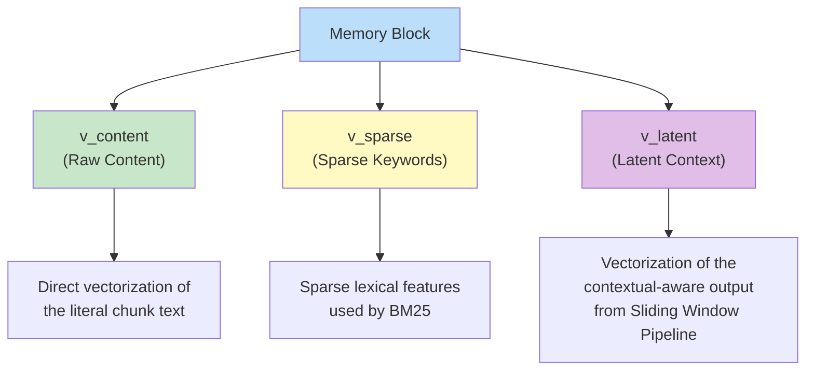
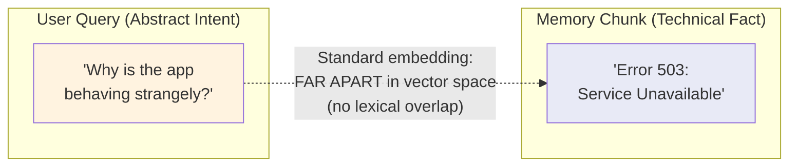
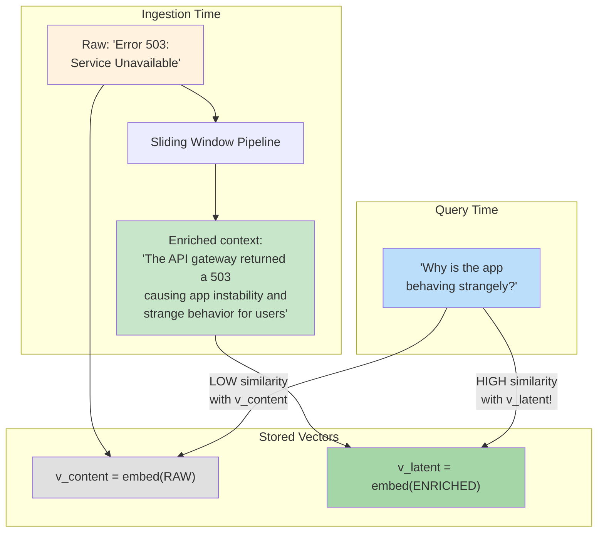
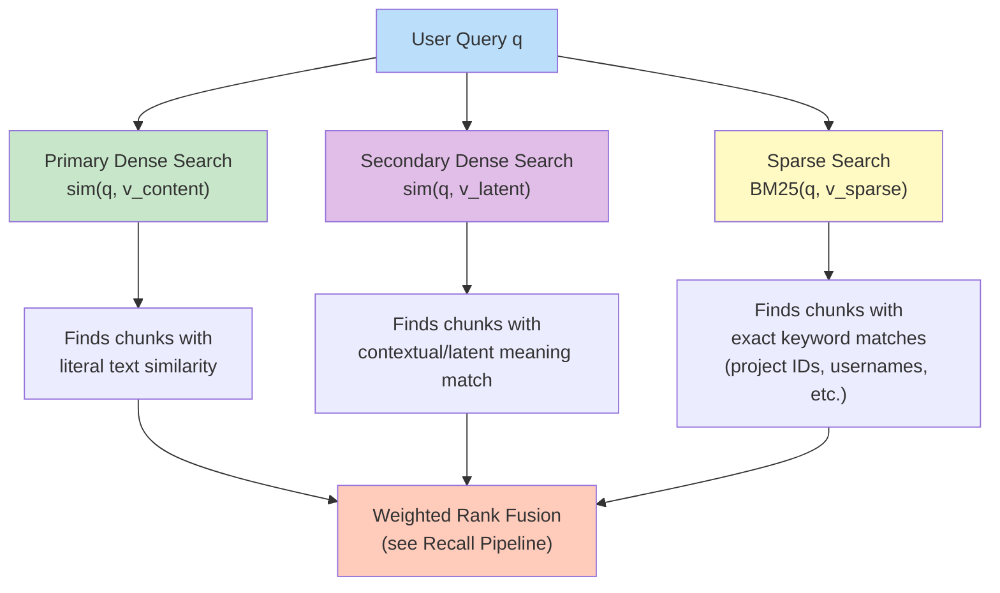

# High-Dimensional Vector Substrate & Latent Semantic Bridging

> **Navigation**: [Architecture Hub](./09-end-to-end-architecture.md) | [Prev: Bio-Mimetic Decay](./05-bio-mimetic-memory-decay.md) | **Vector Substrate** | [Next: Recall Pipeline](./07-recall-pipeline.md) | [All References](./10-all-references.md)

## Section 2.5 of the Paper

---

## The Role of the Vector Substrate

While the [Knowledge Graph](./03-temporal-knowledge-graph.md) maintains structural & relational integrity, the **vector substrate** powers the core semantic recall. Hydra DB uses a **Multi-Field Hybrid Schema** within a self-hosted vector store.

### Three Representations per Memory Block

> Crucially, `v_latent` is **not** an arbitrary projection — it is the direct vectorization of context from the [Sliding Window Inference Pipeline](./04-sliding-window-inference-pipeline.md). This ensures resolved entities and dependencies are physically embedded into the search space.

---

## The Vocabulary Mismatch Gap (Section 2.5.1)

A persistent failure mode in RAG (see also [\[8\] the foundational RAG paper](./10-all-references.md#8-retrieval-augmented-generation-for-knowledge-intensive-nlp-tasks)): **disconnect between user intent and stored content**.

Standard embedding models are **"literal-minded"** — they place these two strings far apart because they share no lexical or immediate semantic overlap.

---

## Latent Semantic Bridging (Section 2.5.2)

Instead of just embedding the raw text, Hydra DB also embeds the **contextual implications** of a chunk.

The enrichment comes from the [Sliding Window Pipeline](./04-sliding-window-inference-pipeline.md#step-3-enrichment-transformation) — specifically the `f_θ` transformation that resolves entities and maps preferences.

By embedding the contextual-aware output (`v_latent`), abstract queries can latch onto the **meaning** of the event — even if the raw description (`v_content`) is technically obscure.

> We effectively "pre-compute" the answer at ingestion time.

---

## How the Three Vectors Work Together

These three vectors are combined via [Weighted Hybrid Search](./07-recall-pipeline.md#stage-2-weighted-hybrid-search-section-262) in the Recall Pipeline.

| Vector | What It Captures | When It Shines |
|---|---|---|
| `v_content` | Literal chunk text | Direct factual lookups |
| `v_latent` | Contextual implications + resolved entities | Abstract/inferential queries |
| `v_sparse` | Sparse lexical features (BM25) | Exact tokens: IDs, names, numbers |

---

> **Navigation**: [Architecture Hub](./09-end-to-end-architecture.md) | [Prev: Bio-Mimetic Decay](./05-bio-mimetic-memory-decay.md) | **Vector Substrate** | [Next: Recall Pipeline](./07-recall-pipeline.md) | [All References](./10-all-references.md)
