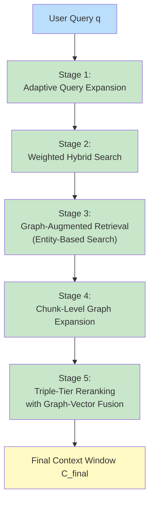
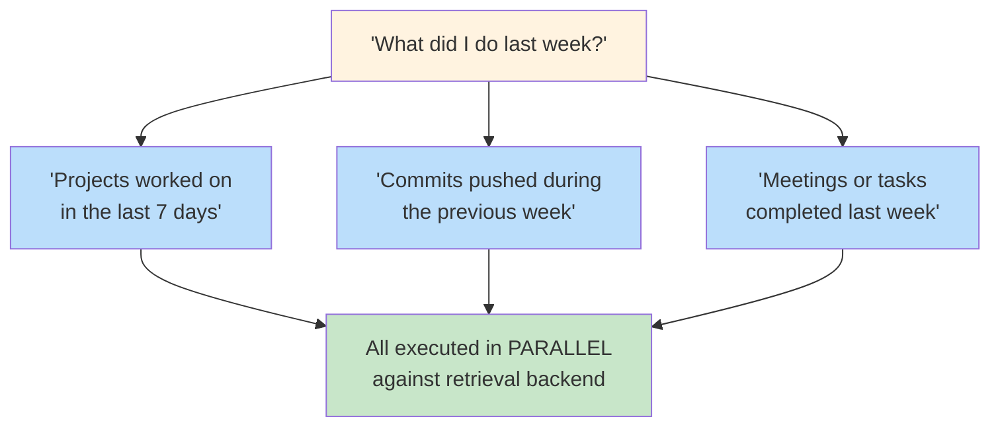
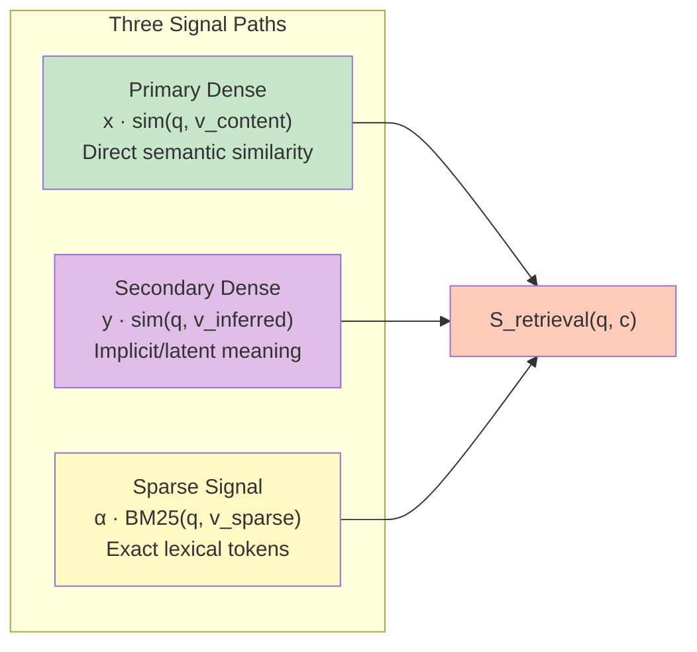
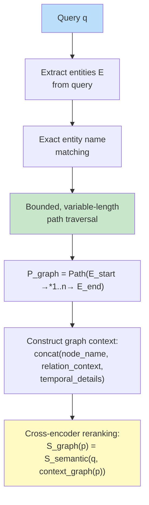
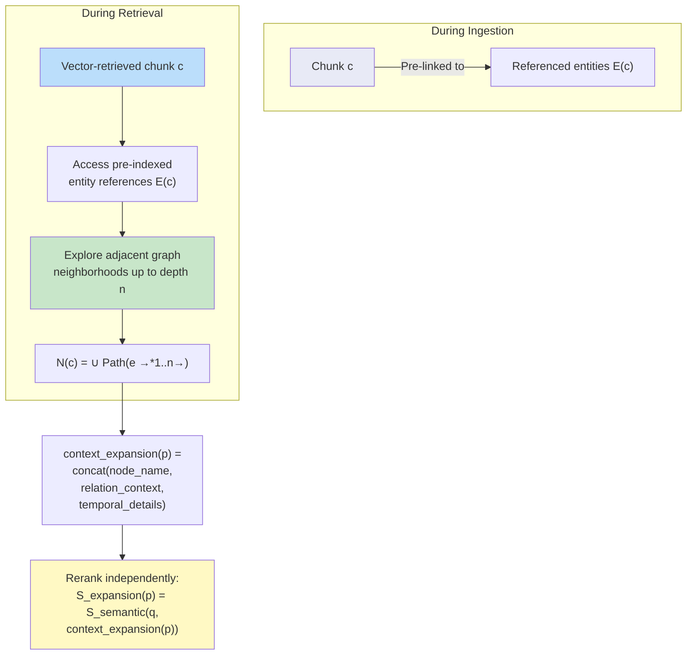
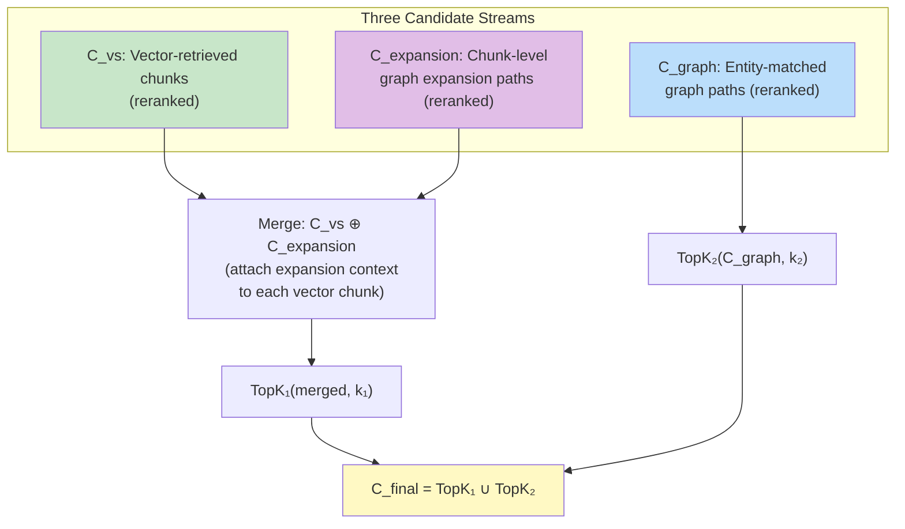
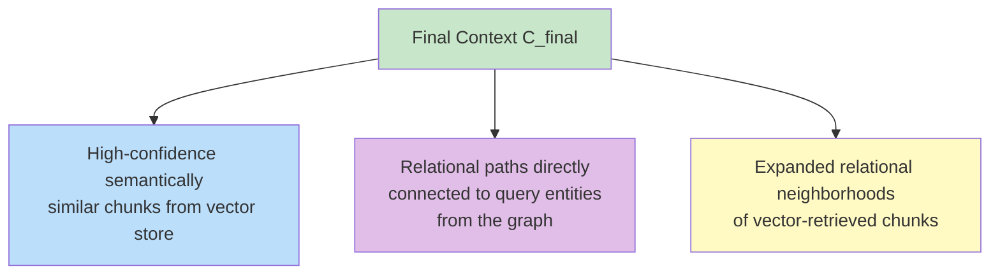
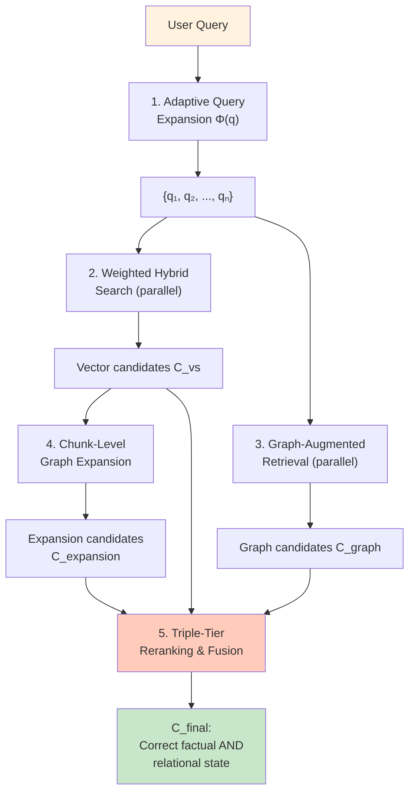

# Recall Pipeline (Multi-Stage Retrieval)

> **Navigation**: [Architecture Hub](./09-end-to-end-architecture.md) | [Prev: Vector Substrate](./06-vector-substrate-and-latent-bridging.md) | **Recall Pipeline** | [Next: Results](./08-results-and-benchmarks.md) | [All References](./10-all-references.md)

## Section 2.6 of the Paper

---

## Overview

Hydra DB employs a **Multi-Stage Pipeline** that combines hybrid semantic search with a versioned memory graph. The pipeline has five stages:



This pipeline retrieves from two data stores populated during ingestion:
- The [Git-Style Temporal Knowledge Graph](./03-temporal-knowledge-graph.md) (for graph-based retrieval in Stages 3-4)
- The [Multi-Field Vector Substrate](./06-vector-substrate-and-latent-bridging.md) (for hybrid search in Stage 2)

---

## Stage 1: Adaptive Query Expansion (Section 2.6.1)

Hydra DB treats the user query `q` as a **semantic seed**, not a fixed string. An LLM-based projection function `Φ(q)` generates `N` semantically diverse reformulations:

```
Q' = {q₁, q₂, ..., qₙ}
```

### Example



**Why**: Ensures high recall even when relevant memories differ significantly in surface phrasing from the original query.

---

## Stage 2: Weighted Hybrid Search (Section 2.6.2)

For a query `q` and candidate chunk `c`, the initial retrieval score is a **linear combination of three signal paths** from the [Vector Substrate](./06-vector-substrate-and-latent-bridging.md#how-the-three-vectors-work-together):

```
S_retrieval(q, c) = x · sim(q, v_content) + y · sim(q, v_inferred) + α · BM25(q, v_sparse)
                     \________________/     \___________________/     \__________________/
                      Primary Dense          Secondary Dense           Sparse Signal
```



| Signal | Weight | Captures |
|---|---|---|
| Primary Dense | `x` | Direct semantic similarity to literal content |
| Secondary Dense | `y` | Implicit meaning via [Latent Semantic Bridging](./06-vector-substrate-and-latent-bridging.md#latent-semantic-bridging-section-252) |
| Sparse (BM25) | `α` | Rare but critical tokens (project IDs, usernames) |

---

## Stage 3: Graph-Augmented Retrieval (Section 2.6.3)

**In parallel** with hybrid vector retrieval, Hydra DB runs a **graph-based retrieval pass** over the [Temporal Knowledge Graph](./03-temporal-knowledge-graph.md).



The cross-encoder evaluates the combination of entity names, relational context, and temporal information against the query — capturing relational dependencies and temporal sequences not present in any single text chunk.

**Example**: "Project A is blocked by Issue B" — this relationship exists in the graph but may never appear in a single text chunk. This is the [structured relational index](./02-ontological-structure-vs-flat-index.md#211-structured-relational-index-over-flat-embedding-space) advantage.

---

## Stage 4: Chunk-Level Graph Expansion (Section 2.6.4)

A **second-stage expansion** that avoids post-hoc entity extraction from vector results.



**Why this matters**: A retrieved meeting note may expand to include related tasks, blockers, or decisions recorded elsewhere. This expansion happens **before** context assembly — no entity extraction needed at query time.

The entity pre-linking at ingestion time is enabled by the [Sliding Window Pipeline](./04-sliding-window-inference-pipeline.md) which resolves entities during enrichment.

---

## Stage 5: Triple-Tier Reranking with Graph-Vector Fusion (Section 2.6.5)

The final context window fuses **three independently reranked candidate streams**.

### Vector Stream Reranking

```
S_rerank_vs(c) = γ · S_semantic(c) + (1 - γ) · S_lexical(c)         -- semantic + lexical balance
S_final_vs(c)  = β · S_vs(c) + (1 - β) · S_rerank_vs(c)             -- vector confidence bias
```

- `γ` controls balance between deep semantic understanding and exact lexical matching
- `β` preserves global structure learned by the vector index

### Graph Stream Fusion



### Final Context Formula

```
C_final = TopK₁(C_vs_final ⊕ C_expansion, k₁) ∪ TopK₂(C_graph, k₂)
```

Where:
- `⊕` = merge operation that attaches expansion context `N(c)` to each vector chunk `c`
- `k₁` = number of merged vector-expansion pairs
- `k₂` = number of independent entity-based graph paths
- `k_total` determined dynamically based on relevance score distributions and context window constraints

### What the Final Context Includes



This retrieval architecture directly underpins Hydra DB's **[90.79% overall accuracy](./08-results-and-benchmarks.md)** on LongMemEval-s.

---

## Complete Pipeline Summary



---

> **Navigation**: [Architecture Hub](./09-end-to-end-architecture.md) | [Prev: Vector Substrate](./06-vector-substrate-and-latent-bridging.md) | **Recall Pipeline** | [Next: Results](./08-results-and-benchmarks.md) | [All References](./10-all-references.md)
