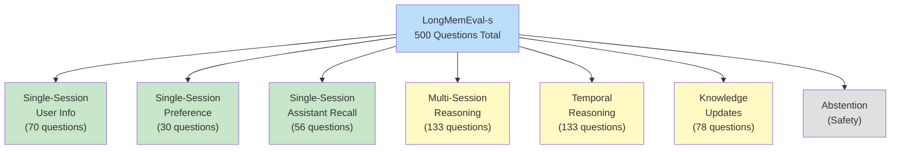
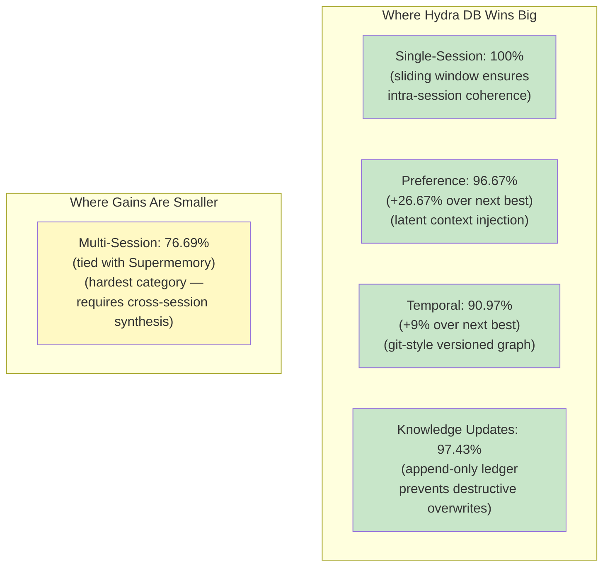
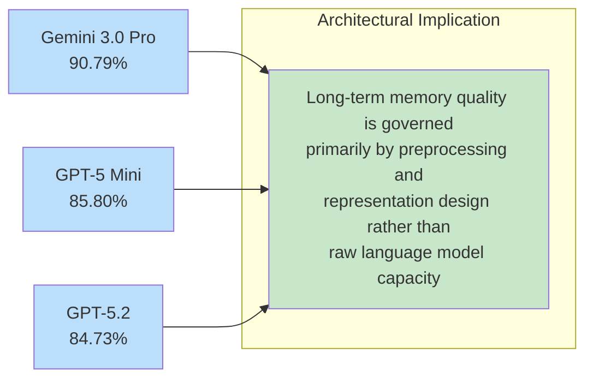
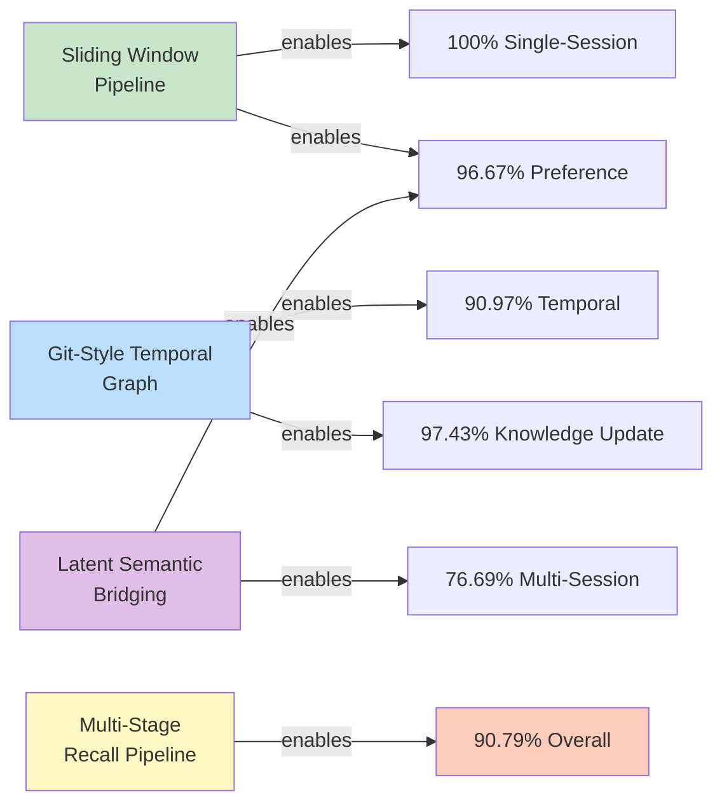

# Results and Benchmarks

> **Navigation**: [Architecture Hub](./09-end-to-end-architecture.md) | [Prev: Recall Pipeline](./07-recall-pipeline.md) | **Results** | [Next: Architecture Hub](./09-end-to-end-architecture.md) | [All References](./10-all-references.md)

## Section 3 of the Paper

---

## Experimental Setup (Section 3.1)

| Parameter | Value |
|---|---|
| **Benchmark** | LongMemEval-s (ICLR 2025) [\[5\]](./10-all-references.md#5-longmemeval-benchmarking-chat-assistants-on-long-term-interactive-memory) |
| **Dataset** | 500 question-conversation stacks |
| **Avg. context length** | >115,000 tokens per stack |
| **Sessions per stack** | ~50 continuous user sessions |
| **Ingestion method** | Session-by-session (not round-by-round) |
| **Primary eval model** | Gemini 3.0 Pro |
| **Judge** | Gemini 3.0 Pro (LLM-as-a-Judge) |
| **Cross-model eval** | GPT-5.2, GPT-5 Mini |

### Why LongMemEval-s over LoCoMo?

[\[6\] LoCoMo](./10-all-references.md#6-evaluating-very-long-term-conversational-memory-of-llm-agents) conversations average 16k-26k tokens — too short to stress-test the [\[2\] "lost-in-the-middle" phenomenon](./10-all-references.md#2-lost-in-the-middle-how-language-models-use-long-contexts). LongMemEval-s averages **115k tokens**, pushing memory frameworks far beyond simple "needle-in-a-haystack" lookups. See also [\[7\]](./10-all-references.md#7-is-mem0-really-sota-in-agent-memory) for discussion on benchmark selection.

---

## Benchmark Categories

---

## Performance: Gemini 3.0 Pro (Section 3.2.1)

### Overall Comparison

| Category | Hydra DB* | [\[10\] Supermemory*](./10-all-references.md#10-supermemory-state-of-the-art-agent-memory-on-longmemeval) | [\[11\] Zep**](./10-all-references.md#11-zep-a-temporal-knowledge-graph-architecture-for-agent-memory) | Full-context** (GPT-4o) | [\[12\] Mem0-oss***](./10-all-references.md#12-mem0-building-production-ready-ai-agents-with-scalable-long-term-memory) |
|---|---|---|---|---|---|
| Single-session (User) | **100.00%** | 98.57% | 92.9% | 81.4% | 38.71% |
| Single-session (Assistant) | **100.00%** | 98.21% | 80.4% | 94.6% | 8.93% |
| Single-session (Preference) | **96.67%** | 70.00% | 56.7% | 20.0% | 40.00% |
| Knowledge Update | **97.43%** | 89.74% | 83.3% | 78.2% | 52.56% |
| Temporal Reasoning | **90.97%** | 81.95% | 62.4% | 45.1% | 25.56% |
| Multi-Session Reasoning | 76.69% | **76.69%** | 57.9% | 44.3% | 20.30% |
| **Overall** | **90.79%** | 85.20% | 71.2% | 60.2% | 29.07% |

> *Gemini 3.0 Pro, **GPT-4o, ***Gemini 3.0 Pro with defaults

### Key Findings

---

## Cross-Model Generalization (Section 3.2.2)

### Performance Across Backbone Models

| Category | Gemini 3.0 Pro | GPT-5 Mini | GPT-5.2 |
|---|---|---|---|
| Single-session (User) | 100.00% | 98.59% | 100.00% |
| Single-session (Assistant) | 100.00% | 96.36% | 98.18% |
| Single-session (Preference) | 96.67% | 93.10% | 89.66% |
| Knowledge Update | 97.4% | 92.31% | 91.03% |
| Temporal Reasoning | 90.97% | 85.71% | 83.46% |
| Multi-Session Reasoning | 76.69% | 66.37% | 64.60% |
| **Overall** | **90.79%** | **85.80%** | **84.73%** |

**Key insight**: Only modest degradation as model capacity decreases — validates that Hydra DB's architecture reduces dependence on raw model capability. Operators can choose backbone models based on cost/latency/throughput without compromising long-horizon memory reliability.

---

## Why Each Component Matters (Architecture → Results)

**Component deep dives:**
- [Sliding Window Pipeline](./04-sliding-window-inference-pipeline.md) → Single-Session & Preference results
- [Temporal Knowledge Graph](./03-temporal-knowledge-graph.md) → Temporal Reasoning & Knowledge Update results
- [Latent Semantic Bridging](./06-vector-substrate-and-latent-bridging.md#latent-semantic-bridging-section-252) → Preference & Multi-Session results
- [Multi-Stage Recall Pipeline](./07-recall-pipeline.md) → Overall 90.79% accuracy

---

## References

- [\[5\] Wu, D. et al. "LongMemEval"](./10-all-references.md#5-longmemeval-benchmarking-chat-assistants-on-long-term-interactive-memory) (2025). arXiv:2410.10813
- [\[6\] Maharana, A. et al. "LoCoMo"](./10-all-references.md#6-evaluating-very-long-term-conversational-memory-of-llm-agents) (2024). arXiv:2402.17753
- [\[10\] Daga, S. et al. "Supermemory"](./10-all-references.md#10-supermemory-state-of-the-art-agent-memory-on-longmemeval) (2026)
- [\[11\] Rasmussen, P. et al. "Zep"](./10-all-references.md#11-zep-a-temporal-knowledge-graph-architecture-for-agent-memory) (2025). arXiv:2501.13956
- [\[12\] Chhikara, P. et al. "Mem0"](./10-all-references.md#12-mem0-building-production-ready-ai-agents-with-scalable-long-term-memory) (2025). arXiv:2504.19413

---

> **Navigation**: [Architecture Hub](./09-end-to-end-architecture.md) | [Prev: Recall Pipeline](./07-recall-pipeline.md) | **Results** | [Next: Architecture Hub](./09-end-to-end-architecture.md) | [All References](./10-all-references.md)
