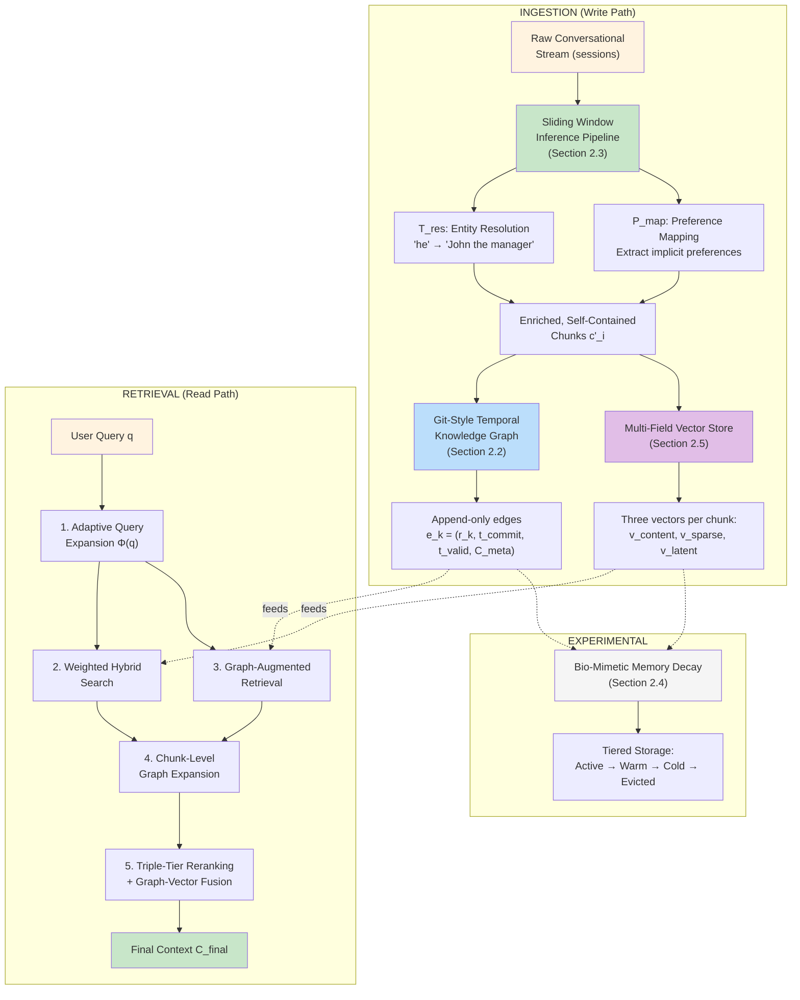
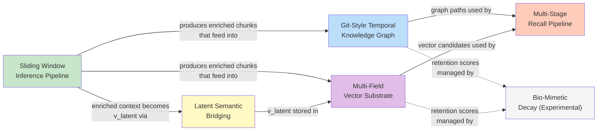
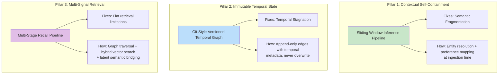
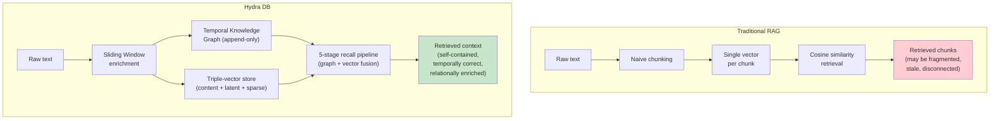

# End-to-End Architecture: How It All Fits Together

> **Start here.** This is the central hub linking all Hydra DB breakdown documents.

---

## The Big Picture

This document ties together all components described in the individual breakdowns. Use this as the **map** that connects everything.

---

## Component Dependency Map

---

## File Index: How to Read the Breakdown

| # | File | Section | What You'll Learn |
|---|---|---|---|
| 1 | [Overview and Motivation](./01-overview-and-motivation.md) | 1 (Intro) | Why Hydra DB exists, what problems it solves, key results |
| 2 | [Ontological Structure vs. Flat Index](./02-ontological-structure-vs-flat-index.md) | 2.1 | Why knowledge graphs beat flat vector stores |
| 3 | [Temporal Knowledge Graph](./03-temporal-knowledge-graph.md) | 2.2 | Git-style append-only temporal graph design |
| 4 | [Sliding Window Inference Pipeline](./04-sliding-window-inference-pipeline.md) | 2.3 | How chunks become self-contained via entity resolution |
| 5 | [Bio-Mimetic Memory Decay](./05-bio-mimetic-memory-decay.md) | 2.4 | Experimental memory forgetting inspired by neuroscience |
| 6 | [Vector Substrate & Latent Bridging](./06-vector-substrate-and-latent-bridging.md) | 2.5 | Triple-vector schema and vocabulary mismatch fix |
| 7 | [Recall Pipeline](./07-recall-pipeline.md) | 2.6 | The 5-stage retrieval pipeline with all equations |
| 8 | [Results and Benchmarks](./08-results-and-benchmarks.md) | 3 | Benchmark results, cross-model generalization |
| 9 | **This file** (Architecture Hub) | All | How all components connect |
| 10 | [All References](./10-all-references.md) | Refs | Complete bibliography with descriptions |

---

## The Three Pillars

The entire system rests on **three architectural pillars** that address the three failures of traditional RAG:

**Deep dives:**
- Pillar 1: [Sliding Window Inference Pipeline](./04-sliding-window-inference-pipeline.md)
- Pillar 2: [Temporal Knowledge Graph](./03-temporal-knowledge-graph.md) + [Ontological Structure](./02-ontological-structure-vs-flat-index.md)
- Pillar 3: [Recall Pipeline](./07-recall-pipeline.md) + [Vector Substrate](./06-vector-substrate-and-latent-bridging.md)

---

## Ingestion vs. Retrieval Complexity

| Aspect | Ingestion (Write) | Retrieval (Read) |
|---|---|---|
| **Primary cost** | [Sliding window](./04-sliding-window-inference-pipeline.md) LLM enrichment | [Multi-query expansion](./07-recall-pipeline.md#stage-1-adaptive-query-expansion-section-261) + reranking |
| **Graph ops** | Append [edges](./03-temporal-knowledge-graph.md#formal-edge-definition) (O(1) per edge) | [Path traversal](./07-recall-pipeline.md#stage-3-graph-augmented-retrieval-section-263) (bounded depth n) |
| **Vector ops** | Embed [3 vectors per chunk](./06-vector-substrate-and-latent-bridging.md#three-representations-per-memory-block) | [Hybrid search](./07-recall-pipeline.md#stage-2-weighted-hybrid-search-section-262) + cross-encoder rerank |
| **Key property** | Pre-computes context (expensive once) | Fast retrieval (cheap many times) |
| **Philosophy** | "Do the hard work at write time" | "Reap the benefits at read time" |

---

## What Makes Hydra DB Different — In One Diagram

See [benchmark results](./08-results-and-benchmarks.md) for how this architecture translates to **90.79% overall accuracy**.
