# Complete References

> **Navigation**: [Architecture Hub](./09-end-to-end-architecture.md) | [All Files Index](./09-end-to-end-architecture.md#file-index-how-to-read-the-breakdown)

All references cited in the Hydra DB paper, with descriptions of how they relate to the work.

---

## [1] LLMs: Bigger Is Not Always Better
- **Author**: Rigoni, T.
- **Source**: Ampere Computing Blog (2024)
- **Relevance**: Cited to support the claim that scaling context windows introduces extremely high computational costs.
- **Cited in**: [Overview and Motivation](./01-overview-and-motivation.md)

---

## [2] Lost in the Middle: How Language Models Use Long Contexts
- **Authors**: Liu, N.F., Lin, K., Hewitt, J., Paranjape, A., Bevilacqua, M., Petroni, F., Liang, P.
- **Year**: 2023
- **Link**: arXiv:2307.03172
- **Relevance**: Demonstrates that information density degrades over long horizons — LLMs attend less to content in the middle of long contexts. This is a core motivation for why simply expanding context windows doesn't solve the memory problem.
- **Cited in**: [Overview and Motivation](./01-overview-and-motivation.md), [Results and Benchmarks](./08-results-and-benchmarks.md)

---

## [3] Context Rot: How Increasing Input Tokens Impacts LLM Performance
- **Authors**: Hong, K., Troynikov, A., Huber, J.
- **Year**: 2025
- **Source**: research.trychroma.com/context-rot
- **Relevance**: Introduces the concept of "context rot" — gradual degradation in the usefulness of earlier context as conversations grow. Supports the argument for external memory systems over brute-force context scaling.
- **Cited in**: [Overview and Motivation](./01-overview-and-motivation.md)

---

## [4] Introducing Contextual Retrieval
- **Author**: Ford, D.
- **Source**: Anthropic Engineering Blog (2024)
- **Relevance**: Cited regarding naive chunking strategies that isolate facts, leading to semantic fragmentation. This is the problem Hydra DB's [Sliding Window Inference Pipeline](./04-sliding-window-inference-pipeline.md) addresses.
- **Cited in**: [Overview and Motivation](./01-overview-and-motivation.md), [Sliding Window Pipeline](./04-sliding-window-inference-pipeline.md)

---

## [5] LongMemEval: Benchmarking Chat Assistants on Long-Term Interactive Memory
- **Authors**: Wu, D., Wang, H., Yu, W., Zhang, Y., Chang, K.-W., Yu, D.
- **Year**: 2025
- **Link**: arXiv:2410.10813
- **Relevance**: The primary benchmark used to evaluate Hydra DB. Tests 500 question-conversation stacks with average length >115k tokens across five memory capabilities: extraction, multi-session reasoning, temporal reasoning, knowledge updates, and abstention.
- **Cited in**: [Overview and Motivation](./01-overview-and-motivation.md), [Results and Benchmarks](./08-results-and-benchmarks.md)

---

## [6] Evaluating Very Long-Term Conversational Memory of LLM Agents
- **Authors**: Maharana, A., Lee, D.-H., Tulyakov, S., Bansal, M., Barbieri, F., Fang, Y.
- **Year**: 2024
- **Link**: arXiv:2402.17753
- **Relevance**: Introduces the LoCoMo benchmark (16k-26k token conversations). The authors explain why LoCoMo is insufficient for stress-testing long-horizon memory — its shorter conversations don't trigger "lost-in-the-middle" failures.
- **Cited in**: [Overview and Motivation](./01-overview-and-motivation.md), [Results and Benchmarks](./08-results-and-benchmarks.md)

---

## [7] Is Mem0 Really SOTA in Agent Memory?
- **Authors**: Chalef, D., Rasmussen, P.
- **Source**: Zep Blog (2025)
- **Relevance**: Cited in the context of choosing LongMemEval over LoCoMo as a benchmark, and for understanding the competitive landscape of agent memory systems.
- **Cited in**: [Overview and Motivation](./01-overview-and-motivation.md), [Results and Benchmarks](./08-results-and-benchmarks.md)

---

## [8] Retrieval-Augmented Generation for Knowledge-Intensive NLP Tasks
- **Authors**: Lewis, P., Perez, E., Piktus, A., Petroni, F., Karpukhin, V., Goyal, N., Küttler, H., Lewis, M., Yih, W.-t., Rocktäschel, T., Riedel, S., Kiela, D.
- **Year**: 2021
- **Link**: arXiv:2005.11401
- **Relevance**: The foundational RAG paper. Cited as the baseline approach that Hydra DB improves upon — standard RAG treats memory as a static library of text chunks relying on cosine similarity for retrieval.
- **Cited in**: [Ontological Structure](./02-ontological-structure-vs-flat-index.md), [Temporal Knowledge Graph](./03-temporal-knowledge-graph.md), [Vector Substrate](./06-vector-substrate-and-latent-bridging.md)

---

## [9] From Local to Global: A Graph RAG Approach to Query-Focused Summarization
- **Authors**: Edge, D., Trinh, H., Cheng, N., Bradley, J., Chao, A., Mody, A., Truitt, S., Larson, J.
- **Year**: 2024
- **Link**: arXiv:2404.16130
- **Relevance**: Microsoft Research work demonstrating that flat vector approaches "struggle to connect the dots" when answers require traversing disparate pieces of information. Supports Hydra DB's use of graph-based retrieval alongside vector search.
- **Cited in**: [Ontological Structure](./02-ontological-structure-vs-flat-index.md)

---

## [10] Supermemory: State-of-the-Art Agent Memory on LongMemEval
- **Authors**: Daga, S., Sreedhar, S., Shah, D.
- **Year**: 2026
- **Source**: supermemory.ai/research
- **Relevance**: The strongest competing system on LongMemEval-s with 85.20% overall accuracy. Evaluated using Gemini 3.0 Pro. Hydra DB outperforms it by +5.59 points.
- **Cited in**: [Overview and Motivation](./01-overview-and-motivation.md), [Results and Benchmarks](./08-results-and-benchmarks.md)

---

## [11] Zep: A Temporal Knowledge Graph Architecture for Agent Memory
- **Authors**: Rasmussen, P., Paliychuk, P., Beauvais, T., Ryan, J., Chalef, D.
- **Year**: 2025
- **Link**: arXiv:2501.13956
- **Relevance**: Another competing memory system evaluated on LongMemEval-s using GPT-4o, achieving 71.2% overall accuracy. Also uses a temporal knowledge graph approach but without Hydra DB's [sliding window enrichment](./04-sliding-window-inference-pipeline.md) or [multi-field vector substrate](./06-vector-substrate-and-latent-bridging.md).
- **Cited in**: [Overview and Motivation](./01-overview-and-motivation.md), [Results and Benchmarks](./08-results-and-benchmarks.md)

---

## [12] Mem0: Building Production-Ready AI Agents with Scalable Long-Term Memory
- **Authors**: Chhikara, P., Khant, D., Aryan, S., Singh, T., Yadav, D.
- **Year**: 2025
- **Link**: arXiv:2504.19413
- **Relevance**: Mem0-oss results evaluated using Gemini 3.0 Pro with default parameters. Achieves 29.07% overall accuracy on LongMemEval-s — the weakest competitor, suggesting that default out-of-the-box configurations of general-purpose memory systems struggle significantly on long-horizon tasks.
- **Cited in**: [Overview and Motivation](./01-overview-and-motivation.md), [Results and Benchmarks](./08-results-and-benchmarks.md)

---

## Reference Map: Which Components Cite Which Papers

```mermaid
graph TD
    subgraph "Motivation"
        R1["[1] Computational cost"]
        R2["[2] Lost-in-the-middle"]
        R3["[3] Context rot"]
        R4["[4] Semantic fragmentation"]
    end

    subgraph "Benchmarks"
        R5["[5] LongMemEval"]
        R6["[6] LoCoMo"]
        R7["[7] Mem0 SOTA critique"]
    end

    subgraph "Baselines"
        R8["[8] RAG (foundational)"]
        R9["[9] Graph RAG (Microsoft)"]
    end

    subgraph "Competitors"
        R10["[10] Supermemory (85.2%)"]
        R11["[11] Zep (71.2%)"]
        R12["[12] Mem0-oss (29.07%)"]
    end

    R1 --> MOT["Problem motivation<br/>(Section 1)"]
    R2 --> MOT
    R3 --> MOT
    R4 --> MOT

    R8 --> METH["Methodology baseline<br/>(Section 2)"]
    R9 --> METH

    R5 --> EVAL["Evaluation<br/>(Section 3)"]
    R6 --> EVAL
    R7 --> EVAL
    R10 --> EVAL
    R11 --> EVAL
    R12 --> EVAL

    style MOT fill:#ffcdd2
    style METH fill:#bbdefb
    style EVAL fill:#c8e6c9
```

---

> **Navigation**: [Architecture Hub](./09-end-to-end-architecture.md) | [All Files Index](./09-end-to-end-architecture.md#file-index-how-to-read-the-breakdown)
