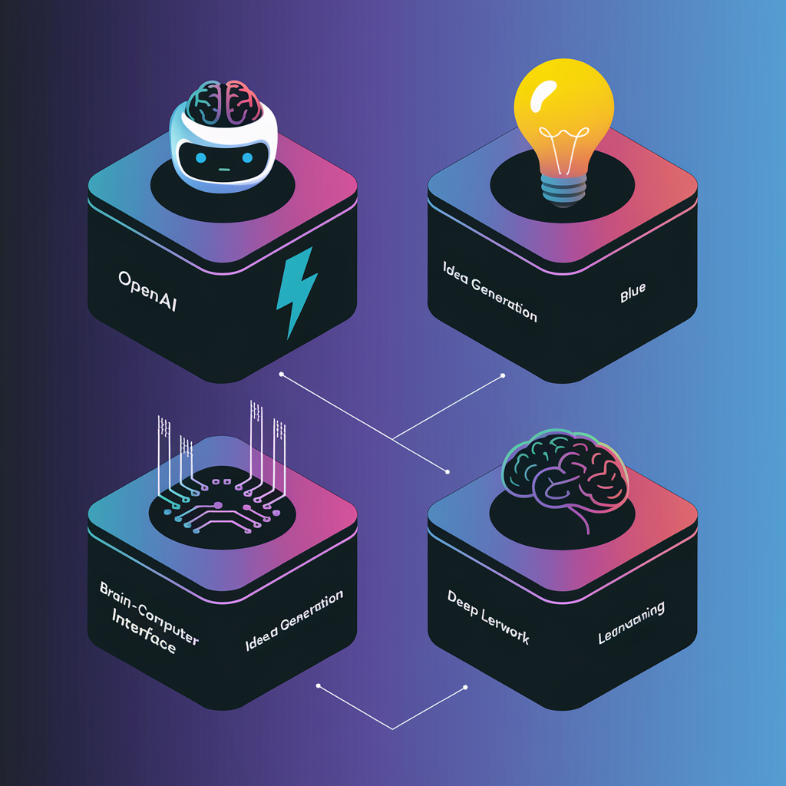

# 4 Open-Source Alternatives to OpenAI’s $200/Month Deep Research AI Agent

> OpenAI’s Deep Research AI Agent offers a powerful research assistant at a premium price of $200 per month. However, the open-source community has stepped up to provide cost-effective and customizable alternatives. Here are four fully open-source AI research agents that can rival OpenAI’s offering: 1. Deep-Research Overview:Deep-Research is an iterative research agent that autonomously generates […]

OpenAI’s Deep Research AI Agent offers a powerful research assistant at a premium price of $200 per month. However, the open-source community has stepped up to provide cost-effective and customizable alternatives. Here are four fully open-source AI research agents that can rival OpenAI’s offering:

### 1. Deep-Research

**Overview:**
Deep-Research is an iterative research agent that autonomously generates search queries, scrapes websites, and processes information using AI reasoning models. It aims to provide a structured approach to deep research tasks.

**Key Features:**

- **Query Generation:** Dynamically generates optimized search queries.

- **Web Scraping with Firecrawl:** Extracts useful information from websites.

- **o3-Mini Model for Reasoning:** Uses OpenAI’s o3-mini model for intelligent processing.

- **100% Open Source:** Fully accessible and modifiable.

**GitHub Repository:**[ https://github.com/dzhng/deep-research](https://github.com/dzhng/deep-research)

### 2. OpenDeepResearcher

**Overview:**
OpenDeepResearcher is an asynchronous AI research agent designed to conduct comprehensive research iteratively. It utilizes multiple search engines, content extraction tools, and LLM APIs to provide detailed insights.

**Key Features:**

- **SERP API Integration:** Automates iterative search queries.

- **Jina AI for Content Extraction:** Extracts and summarizes webpage content.

- **OpenRouter LLM Processing:** Utilizes various open LLMs for reasoning.

- **100% Open Source:** Offers flexibility in customization and deployment.

**GitHub Repository:** [https://github.com/mshumer/OpenDeepResearcher](https://github.com/mshumer/OpenDeepResearcher)

### 3. Open Deep Research by Firecrawl

**Overview:**
Open Deep Research is a lightweight and efficient AI research agent that leverages Firecrawl search and extraction mechanisms. It allows users to reason with any LLM of their choice rather than relying on a fine-tuned proprietary model.

**Key Features:**

- **Firecrawl Search + Extract:** Fetches and extracts relevant content efficiently.

- **Customizable AI Reasoning:** Supports any LLM via the AI SDK.

- **Open Source & Self-Hostable:** Full control over deployment and customization.

**GitHub Repository:**[ https://github.com/nickscamara/open-deep-research](https://github.com/nickscamara/open-deep-research)

### 4. DeepResearch by Jina AI

**Overview:**
DeepResearch by Jina AI is an advanced AI research assistant that replicates OpenAI’s agentic search, read, and reasoning workflow. It integrates multiple search engines and employs an AI-driven approach to extract and summarize relevant information.

**Key Features:**

- **Search Integration:** Uses Gemini Flash, Brave, and DuckDuckGo for diverse search results.

- **AI-Powered Reading:** Implements Jina Reader to extract and summarize content efficiently.

- **Reasoning Process:** Uses advanced AI models for contextual understanding.

- **100% Open Source:** Fully customizable and self-hostable.

**GitHub Repository:** [https://github.com/jina-ai/node-DeepResearch](https://github.com/jina-ai/node-DeepResearch)

### Conclusion

These four open-source AI research agents provide powerful alternatives to OpenAI’s Deep Research AI Agent. With robust search capabilities, AI-powered extraction, and reasoning features, they enable researchers to automate and optimize their workflows without incurring high costs. Since all options are open-source, users have complete flexibility to modify, extend, and self-host these tools based on their specific needs.

---

This article is inspired from this **[Tweet](https://x.com/Saboo_Shubham_/status/1886979972566524080)**. Also, don’t forget to follow us on **[Twitter](https://x.com/intent/follow?screen_name=marktechpost)** and join our **[Telegram Channel](https://arxiv.org/abs/2406.09406)** and [**LinkedIn Gr**](https://www.linkedin.com/groups/13668564/)[**oup**](https://www.linkedin.com/groups/13668564/). Don’t Forget to join our **[75k+ ML SubReddit](https://www.reddit.com/r/machinelearningnews/)**.

**[🚨 Recommended Open-Source AI Platform: ‘IntellAgent is a An Open-Source Multi-Agent Framework to Evaluate Complex Conversational AI System’ (Promoted)](https://pxl.to/82homag)**
