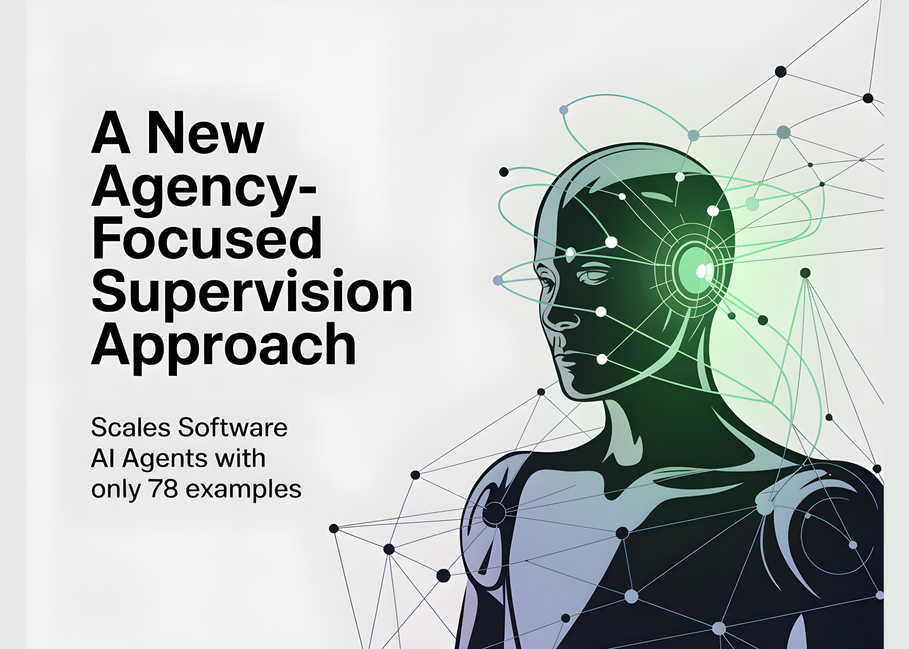

# A New Agency-Focused Supervision Approach Scales Software AI Agents With Only 78 Examples

> Do curated, tool-grounded demonstrations build stronger software agents than broad piles of generic instruction data? A team of researchers from Shanghai Jiao Tong University and SII Generative AI Research Lab (GAIR) proposes LIMI (“Less Is More for Agency”), a supervised fine-tuning method that turns a base model into a capable software/research agent using 78 samples. […]

Do curated, tool-grounded demonstrations build stronger software agents than broad piles of generic instruction data? A team of researchers  from Shanghai Jiao Tong University and SII Generative AI Research Lab (GAIR) proposes **LIMI (“Less Is More for Agency”)**, a supervised fine-tuning method that turns a base model into a capable software/research agent using **78** samples. LIMI scores **73.5%** average on **AgencyBench** (FTFC 71.7, RC@3 74.2, SR@3 74.6), beating strong baselines (GLM-4.5 45.1, Qwen3-235B-A22B 27.5, Kimi-K2 24.1, DeepSeek-V3.1 11.9) and even surpassing variants trained on **10,000** samples—**with 128× less data**.

*https://arxiv.org/pdf/2509.17567*

### What exactly is new?

- **Agency Efficiency Principle**: LIMI state that _agentic competence_ scales more with **data quality/structure** than raw sample count. The research team fine-tune GLM-4.5/GLM-4.5-Air on **78** long-horizon, tool-use trajectories (samples) and report large gains on AgencyBench and generalization suites (TAU2-bench, EvalPlus-HE/MBPP, DS-1000, SciCode).

- **Minimal but dense supervision.** Each trajectory (~13k–152k tokens; ~42.4k avg.) captures complete multi-turn workflows—model reasoning, tool calls, and environment observations—collected in the **SII-CLI** execution environment. Tasks span “**vibe coding**” (interactive software development) and **research workflows** (search, analysis, experiment design).

*https://arxiv.org/pdf/2509.17567*

### How does it work?

- **Base models:** GLM-4.5 (355B) and GLM-4.5-Air (106B). Training uses the **slime** SFT framework with identical configs across comparisons (to isolate data effects).

- **Data construction:** 60 real queries from practitioners + 18 synthesized from high-star GitHub PRs (tight QA by PhD annotators). For each query, LIMI logs the full agent trajectory to successful completion inside **SII-CLI**.

- **Evaluation:** **AgencyBench** (R=3 rounds) with FTFC, SR@3, RC@3; plus generalization suites (TAU2-airline/retail Pass^4, EvalPlus HE/MBPP, DS-1000, SciCode).

*https://arxiv.org/pdf/2509.17567*

### Results

- **AgencyBench (avg): 73.5%.** LIMI vs. GLM-4.5 **(+28.4 pts)**; FTFC **71.7%** vs **37.8%**; SR@3 **74.6%** vs **47.4%**.

- **Data efficiency:** LIMI (**78** samples) outperforms GLM-4.5 trained on **AFM-CodeAgent SFT (10,000 samples)**: **73.5% vs 47.8%**—**+53.7%** absolute with **128×** less data. Similar gaps hold vs AFM-WebAgent (7,610) and CC-Bench-Traj (260).

- **Generalization:** Across tool-use/coding/scientific computing, LIMI averages **~57%**, exceeding GLM-4.5 and other baselines; without tool access, LIMI still leads slightly (**50.0% vs 48.7%** for GLM-4.5), indicating intrinsic gains beyond environment tooling.

*https://arxiv.org/pdf/2509.17567*

### Key Takeaways

- **Data efficiency dominates scale.** LIMI reaches **73.5%** average on AgencyBench using **curated trajectories**, surpassing GLM-4.5 (45.1%) and showing a **+53.7-point** advantage over a **10k-sample** SFT baseline—**with 128× fewer samples**.

- **Trajectory quality, not bulk.** Training data are **long-horizon, tool-grounded** workflows in collaborative software development and scientific research, collected via the **SII-CLI** execution stack referenced by the paper.

- **Across-metric gains.** On AgencyBench, LIMI reports **FTFC 71.7%**, **SR@3 74.6%**, and strong **RC@3**, with detailed tables showing large margins over baselines; generalization suites (TAU2, EvalPlus-HE/MBPP, DS-1000, SciCode) average **57.2%**.

- **Works across scales.** Fine-tuning **GLM-4.5 (355B)** and **GLM-4.5-Air (106B)** both yields large deltas over their bases, indicating method robustness to model size.

### Our Comments

The research team trains GLM-4.5 variants with 78 curated, long-horizon, tool-grounded trajectories captured in a CLI environment spanning software-engineering and research tasks. It reports 73.5% average on AgencyBench with FTFC, RC@3, and SR@3 metrics; baseline GLM-4.5 is reported at 45.1%. A comparison against a 10,000-sample AFM-CodeAgent SFT baseline shows 73.5% vs 47.8%; tool-free evaluation indicates intrinsic gains (≈50.0% for LIMI vs 48.7% GLM-4.5). Trajectories are multi-turn and token-dense, emphasizing planning, tool orchestration, and verification.

---

Check out the **[Paper](https://arxiv.org/abs/2509.17567)**, **[GitHub Page](https://github.com/GAIR-NLP/LIMI) **and **[Model Card on HF](https://huggingface.co/GAIR/LIMI)**. Feel free to check out our **[GitHub Page for Tutorials, Codes and Notebooks](https://github.com/Marktechpost/AI-Tutorial-Codes-Included)**. Also, feel free to follow us on **[Twitter](https://x.com/intent/follow?screen_name=marktechpost)** and don’t forget to join our **[100k+ ML SubReddit](https://www.reddit.com/r/machinelearningnews/)** and Subscribe to **[our Newsletter](https://www.aidevsignals.com/)**.
