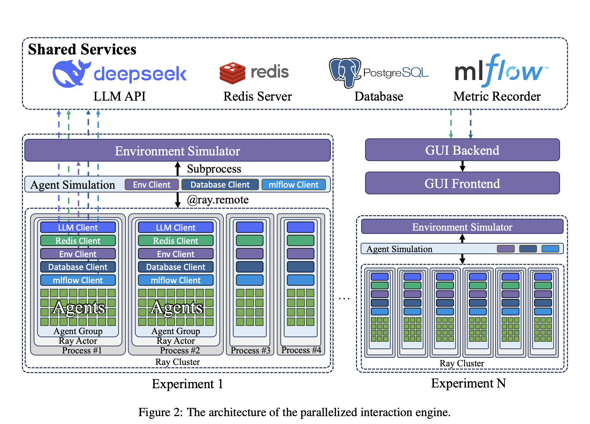

# AgentSociety: An Open Source AI Framework for Simulating Large-Scale Societal Interactions with LLM Agents

> AgentSociety is a cutting-edge, open-source framework designed to simulate large populations of agents, each powered by Large Language Models (LLMs), to realistically model the complex interactions found in human societies. Leveraging powerful distributed processing technologies—especially Ray—this project achieves simulations involving tens of thousands of simultaneously active agents, each embedded in detailed, realistic environments that capture […]

AgentSociety is a cutting-edge, open-source framework designed to simulate large populations of agents, each powered by Large Language Models (LLMs), to realistically model the complex interactions found in human societies. Leveraging powerful distributed processing technologies—especially Ray—this project achieves simulations involving tens of thousands of simultaneously active agents, each embedded in detailed, realistic environments that capture social, economic, and mobility behaviors.

### Key Capabilities

#### Massive Scale and Fast Performance

- **Supports Large Populations:** The framework demonstrated simulations with up to 30,000 agents, outperforming wall-clock time—that is, running the virtual society faster than real time1.

- **Parallelization with Ray:** AgentSociety uses the Ray framework to manage large-scale parallel execution of agents, critical for handling massive and non-deterministic interactions.

- **Efficient Resource Usage:** By grouping agents and sharing network clients within groups, the framework greatly reduces memory and connection overhead, overcoming the port and memory bottlenecks common in scaling distributed simulations.

#### Realistic Societal Environments

AgentSociety differentiates itself by integrating highly realistic feedback and constraints, enabling agents to behave in a way that mirrors real societal systems.

- **Urban Space:** Incorporates real-world map data (e.g., from OpenStreetMap), road networks, points of interest, and models of mobility (walking, driving, public transport) updated every simulated second1.

- **Social Space:** Agents form evolving social networks, engaging in both online and offline social interactions. Messaging (including content moderation and user blocking) is modeled to simulate social media and real-world communication patterns.

- **Economic Space:** Implements employment, consumption, banking, government (taxes), and macroeconomic reporting—all driven by agent decisions. Agents must balance income and spending, simulating realistic economic behavior.

### Architecture & Technology

#### Parallelized Interaction Engine

- **Group-Based Distributed Execution:** Agents are partitioned into groups managed by Ray “actors,” optimizing resource use while maintaining high parallelism, with asynchronous network requests utilizing connection reuse.

- **High-Performance Messaging:** Utilizing Redis’s Pub/Sub capabilities, agents efficiently communicate, supporting agent-agent and user-agent (external program) interactions.

- **Time Alignment Mechanism:** The framework synchronizes agent and environment progression, ensuring consistent and reproducible simulations despite variable processing times from LLM API calls.

- **Comprehensive Utilities:** Simulation logging (via PostgreSQL and local file storage), metric recording (mlflow), and a GUI for experiment creation/management and results visualization.

### Quantitative Results

#### Scalability and Speed

- **Faster than Real-Time:** On a deployment with 24 NVIDIA A800 GPUs, simulations of 30,000 agents achieved faster-than-wall-clock operation (e.g., an iteration round for all agents executed faster than the equivalent real-world elapsed time).

- **Linear Scaling:** Performance scales linearly with computing resources; increasing LLM-serving GPUs enables higher simulation throughput, up to the service limits of the language model backend.

- **Example Metrics:** In the largest experiment (30,000 agents, 8 groups), an average agent round completed in 252 seconds, staying under real-time and with 100% LLM call success rate. Environment simulation and message passing times remain far below LLM inference time, affirming the system’s computational efficiency.

#### Impact of Realistic Environments

- **Authenticity of Agent Behaviors:** Incorporating realistic environment simulators significantly improved the authenticity and human-likeness of agent behaviors compared to both pure LLM-prompt-based “text simulators” and various generative trajectory baselines.

- **Empirical Benchmarks:** On measures such as radius of gyration, daily visited locations, and behavioral intention distributions, LLM agents with environment support dramatically outperformed both prompt-only and classical model baselines, matching closely to real-world data.

#### Use Cases and Applications

The open design and configurable environments make AgentSociety a powerful tool for:

- **Social Science Research:** Studying societal patterns, emergent phenomena, mobility, and information spread.

- **Urban Planning and Policy Analysis:** Evaluating interventions in simulated environments before real-world deployment.

- **Management Science:** Modeling organizational dynamics, workforce changes, and economic behaviors.

### Conclusion

AgentSociety stands out as the first open source framework to efficiently and realistically simulate societal interactions at unprecedented scale. Its integration of LLM-powered agents with parallelized, data-driven environments positions it as a critical tool for both computational research and practical decision support in understanding complex societal dynamics.

---

Check out the **[Paper](https://aclanthology.org/2025.acl-industry.94.pdf)_ and _[Project](https://github.com/tsinghua-fib-lab/agentsociety/)_._** All credit for this research goes to the researchers of this project. Also, feel free to follow us on **[Twitter](https://x.com/intent/follow?screen_name=marktechpost)** and don’t forget to join our **[100k+ ML SubReddit](https://www.reddit.com/r/machinelearningnews/)** and Subscribe to **[our Newsletter](https://www.aidevsignals.com/)**.
