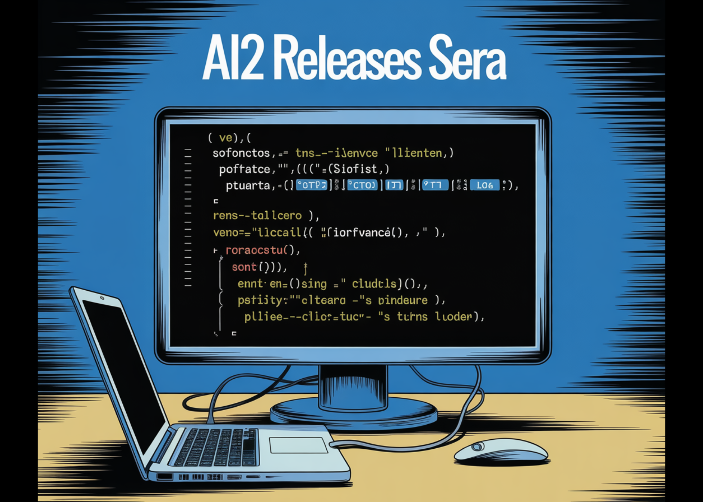

# AI2 Releases SERA, Soft Verified Coding Agents Built with Supervised Training Only for Practical Repository Level Automation Workflows

> Allen Institute for AI (AI2) Researchers introduce SERA, Soft Verified Efficient Repository Agents, as a coding agent family that aims to match much larger closed systems using only supervised training and synthetic trajectories. What is SERA? SERA is the first release in AI2’s Open Coding Agents series. The flagship model, SERA-32B, is built on the […]

Allen Institute for AI (AI2) Researchers introduce SERA, Soft Verified Efficient Repository Agents, as a coding agent family that aims to match much larger closed systems using only supervised training and synthetic trajectories.

### What is SERA?

SERA is the first release in AI2’s Open Coding Agents series. The flagship model, SERA-32B, is built on the Qwen 3 32B architecture and is trained as a repository level coding agent.

On SWE bench Verified at 32K context, SERA-32B reaches 49.5 percent resolve rate. At 64K context it reaches 54.2 percent. These numbers place it in the same performance band as open weight systems such as Devstral-Small-2 with 24B parameters and GLM-4.5 Air with 110B parameters, while SERA remains fully open in code, data, and weights.

The series includes four models today, SERA-8B, SERA-8B GA, SERA-32B, and SERA-32B GA. All are released on Hugging Face under an Apache 2.0 license.

### Soft Verified Generation

The training pipeline relies on Soft Verified Generation, SVG. SVG produces agent trajectories that look like realistic developer workflows, then uses patch agreement between two rollouts as a soft signal of correctness.

**The process is:**

- **First rollout**: A function is sampled from a real repository. The teacher model, GLM-4.6 in the SERA-32B setup, receives a bug style or change description and operates with tools to view files, edit code, and run commands. It produces a trajectory T1 and a patch P1.

- **Synthetic pull request**: The system converts the trajectory into a pull request like description. This text summarizes intent and key edits in a format similar to real pull requests.

- **Second rollout**: The teacher starts again from the original repository, but now it only sees the pull request description and the tools. It produces a new trajectory T2 and patch P2 that tries to implement the described change.

- **Soft verification**: The patches P1 and P2 are compared line by line. A recall score r is computed as the fraction of modified lines in P1 that appear in P2. When r equals 1 the trajectory is hard verified. For intermediate values, the sample is soft verified.

The key result from the ablation study is that strict verification is not required. When models are trained on T2 trajectories with different thresholds on r, even r equals 0, performance on SWE bench Verified is similar at a fixed sample count. This suggests that realistic multi step traces, even if noisy, are valuable supervision for coding agents.

*https://allenai.org/blog/open-coding-agents*

### Data scale, training, and cost

SVG is applied to 121 Python repositories derived from the SWE-smith corpus. Across GLM-4.5 Air and GLM-4.6 teacher runs, the full SERA datasets contain more than 200,000 trajectories from both rollouts, making this one of the largest open coding agent datasets.

SERA-32B is trained on a subset of 25,000 T2 trajectories from the Sera-4.6-Lite T2 dataset. Training uses standard supervised fine tuning with Axolotl on Qwen-3-32B for 3 epochs, learning rate 1e-5, weight decay 0.01, and maximum sequence length 32,768 tokens.

Many trajectories are longer than the context limit. The research team define a truncation ratio, the fraction of steps that fit into 32K tokens. They then prefer trajectories that already fit, and for the rest they select slices with high truncation ratio. This ordered truncation strategy clearly outperforms random truncation when they compare SWE bench Verified scores.

The reported compute budget for SERA-32B, including data generation and training, is about 40 GPU days. Using a scaling law over dataset size and performance, the research team estimated that the SVG approach is around 26 times cheaper than reinforcement learning based systems such as SkyRL-Agent and 57 times cheaper than earlier synthetic data pipelines such as SWE-smith for reaching similar SWE-bench scores.

*https://allenai.org/blog/open-coding-agents*

### Repository specialization

A central use case is adapting an agent to a specific repository. The research team studies this on three major SWE-bench Verified projects, Django, SymPy, and Sphinx.

For each repository, SVG generates on the order of 46,000 to 54,000 trajectories. Due to compute limits, the specialization experiments train on 8,000 trajectories per repository, mixing 3,000 soft verified T2 trajectories with 5,000 filtered T1 trajectories.

At 32K context, these specialized students match or slightly outperform the GLM-4.5-Air teacher, and also compare well with Devstral-Small-2 on those repository subsets. For Django, a specialized student reaches 52.23 percent resolve rate versus 51.20 percent for GLM-4.5-Air. For SymPy, the specialized model reaches 51.11 percent versus 48.89 percent for GLM-4.5-Air.

### Key Takeaways

- **SERA turns coding agents into a supervised learning problem**: SERA-32B is trained with standard supervised fine tuning on synthetic trajectories from GLM-4.6, with no reinforcement learning loop and no dependency on repository test suites.

- **Soft Verified Generation removes the need for tests**: SVG uses two rollouts and patch overlap between P1 and P2 to compute a soft verification score, and the research team show that even unverified or weakly verified trajectories can train effective coding agents.

- **Large, realistic agent dataset from real repositories**: The pipeline applies SVG to 121 Python projects from the SWE smith corpus, producing more than 200,000 trajectories and creating one of the largest open datasets for coding agents.

- **Efficient training with explicit cost and scaling analysis**: SERA-32B trains on 25,000 T2 trajectories and the scaling study shows that SVG is about 26 times cheaper than SkyRL-Agent and 57 times cheaper than SWE-smith at similar SWE bench Verified performance.

---

Check out the **[Paper](https://arxiv.org/pdf/2601.20789), [Repo ](https://github.com/allenai/sera-cli)and [Model Weights](https://huggingface.co/collections/allenai/open-coding-agents)**. Also, feel free to follow us on **[Twitter](https://x.com/intent/follow?screen_name=marktechpost)** and don’t forget to join our **[100k+ ML SubReddit](https://www.reddit.com/r/machinelearningnews/)** and Subscribe to **[our Newsletter](https://www.aidevsignals.com/)**. Wait! are you on telegram? **[now you can join us on telegram as well.](https://t.me/machinelearningresearchnews)**
