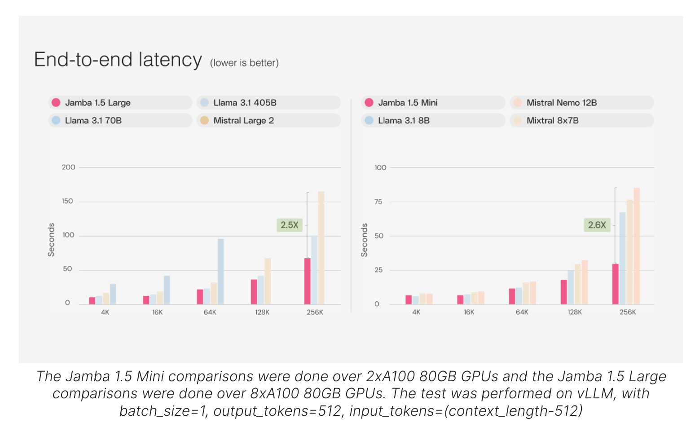

# AI21 Labs Released Jamba 1.5 Family of Open Models: Jamba 1.5 Mini and Jamba 1.5 Large Redefining Long-Context AI with Unmatched Speed, Quality, and Multilingual Capabilities for Global Enterprises

> AI21 Labs has made a significant stride in the AI landscape by releasing the Jamba 1.5 family of open models, comprising Jamba 1.5 Mini and Jamba 1.5 Large. These models, built on the novel SSM-Transformer architecture, represent a breakthrough in AI technology, particularly in handling long-context tasks. AI21 Labs aims to democratize access to these […]

AI21 Labs has made a significant stride in the AI landscape by releasing the [**Jamba 1.5 family of open models**](https://www.ai21.com/blog/announcing-jamba-model-family), comprising [**Jamba 1.5 Mini**](https://huggingface.co/ai21labs/AI21-Jamba-1.5-Mini) and [**Jamba 1.5 Large**](https://huggingface.co/ai21labs/AI21-Jamba-1.5-Large). These models, built on the novel SSM-Transformer architecture, represent a breakthrough in AI technology, particularly in handling long-context tasks. AI21 Labs aims to democratize access to these powerful models by releasing them under the Jamba Open Model License, encouraging widespread experimentation and innovation.

**Key Features of the Jamba 1.5 Models**

One of the standout features of the Jamba 1.5 models is their ability to handle exceptionally long contexts. They boast an effective context window of 256K tokens, the longest in the market for open models. This feature is critical for enterprise applications requiring the analysis and summarization of lengthy documents. The models also excel in agentic and Retrieval-Augmented Generation (RAG) workflows, enhancing both the quality and efficiency of these processes.

*[**Image Source**](https://www.ai21.com/blog/announcing-jamba-model-family)*

Regarding speed, the Jamba 1.5 models are up to 2.5 times faster on long contexts than their competitors, and they maintain superior performance across all context lengths within their size class. This speed advantage is crucial for enterprises that need rapid turnaround times for tasks such as customer support or large-scale data processing.

The quality of the Jamba 1.5 models is another area where they outshine their peers. Jamba 1.5 Mini has been recognized as the strongest open model in its size class, achieving a score of 46.1 on the Arena Hard benchmark, outperforming larger models like Mixtral 8x22B and Command-R+. Jamba 1.5 Large goes even further, scoring 65.4, which surpasses leading models such as Llama 3.1 70B and 405B. This high-quality performance across different benchmarks highlights the robustness of the Jamba 1.5 models in delivering reliable and accurate results.

**Multilingual Support and Developer Readiness**

In addition to their technical prowess, the Jamba 1.5 models are designed with multilingual support, catering to languages such as Spanish, French, Portuguese, Italian, Dutch, German, Arabic, and Hebrew. This makes them versatile tools for global enterprises operating in diverse linguistic environments.

For developers, Jamba 1.5 models offer native support for structured JSON output, function calling, document object digestion, and citation generation. These features make the models adaptable to various development needs, enabling seamless integration into existing workflows.

*[**Image Source**](https://www.ai21.com/blog/announcing-jamba-model-family)*

**Deployment and Efficiency**

AI21 Labs has ensured that the Jamba 1.5 models are accessible and deployable across multiple platforms. They are available for immediate download on Hugging Face and are supported by major cloud providers, including Google Cloud Vertex AI, Microsoft Azure, and NVIDIA NIM. The models are expected to be available soon on additional platforms such as Amazon Bedrock, Databricks Marketplace, Snowflake Cortex, and others, making them easily deployable in various environments, including on-premises and virtual private clouds.

*[**Image Source**](https://www.ai21.com/blog/announcing-jamba-model-family)*

Another critical advantage of the Jamba 1.5 models is their resource efficiency. Built on a hybrid architecture that combines the strengths of Transformer and Mamba architectures, these models offer a lower memory footprint, allowing enterprises to handle extensive context lengths on a single GPU. AI21 Labs’ novel quantization technique, ExpertsInt8, further enhances this efficiency, which optimizes model performance without compromising quality.

*[**Image Source**](https://www.ai21.com/blog/announcing-jamba-model-family)*

**Conclusion**

The release of the Jamba 1.5 family by AI21 Labs marks a significant advancement in long-context handling. These models set new benchmarks in speed, quality, and efficiency and democratize access to cutting-edge AI technology through their open model license. As enterprises continue to seek AI solutions that deliver real-world value, the Jamba 1.5 models stand out as powerful tools capable of meeting the demands of complex, large-scale applications. Their availability across multiple platforms and support for multilingual environments further enhance their appeal, making them a versatile choice for developers and businesses.

---

Check out the **[Jamba 1.5 mini,](https://huggingface.co/ai21labs/AI21-Jamba-1.5-Mini) [Jamba 1.5 large](https://huggingface.co/ai21labs/AI21-Jamba-1.5-Large), and [Details](https://www.ai21.com/blog/announcing-jamba-model-family).** All credit for this research goes to the researchers of this project. Also, don’t forget to follow us on **[Twitter](https://twitter.com/Marktechpost)** and join our **[Telegram Channel](https://arxiv.org/abs/2408.08231)** and [**LinkedIn Gr**](https://www.linkedin.com/groups/13668564/)[**oup**](https://www.linkedin.com/groups/13668564/). **If you like our work, you will love our**[** newsletter..**](https://marktechpost-newsletter.beehiiv.com/subscribe)

Don’t Forget to join our **[49k+ ML SubReddit](https://www.reddit.com/r/machinelearningnews/)**

**Find Upcoming [AI Webinars here](https://www.marktechpost.com/ai-webinars-list-llms-rag-generative-ai-ml-vector-database/)**
