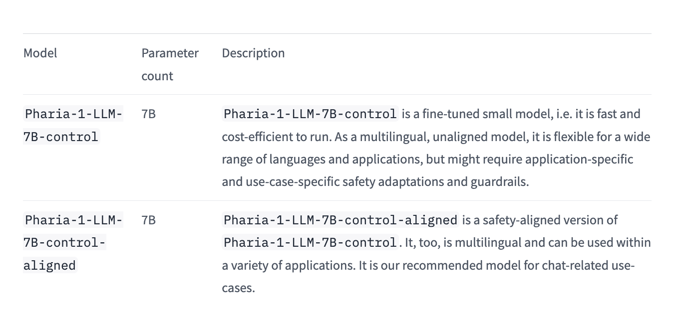

# Aleph Alpha Researchers Release Pharia-1-LLM-7B: Two Distinct Variants- Pharia-1-LLM-7B-Control and Pharia-1-LLM-7B-Control-Aligned

> Researchers from Aleph Alpha announce a new foundation model family that includes Pharia-1-LLM-7B-control and Pharia-1-LLM-7B-control-aligned. These models are now publicly available under the Open Aleph License, explicitly allowing for non-commercial research and educational use. This release marks a significant step forward in providing accessible, high-performance language models to the community. Pharia-1-LLM-7B-control is engineered to deliver […]

Researchers from Aleph Alpha announce a new foundation model family that includes Pharia-1-LLM-7B-control and Pharia-1-LLM-7B-control-aligned. These models are now publicly available under the Open Aleph License, explicitly allowing for non-commercial research and educational use. This release marks a significant step forward in providing accessible, high-performance language models to the community.

Pharia-1-LLM-7B-control is engineered to deliver concise, length-controlled responses that match the performance of leading open-source models in the 7B to 8B parameter range. The model is culturally and linguistically optimized for German, French, and Spanish, thanks to its training on a multilingual base corpus. This feature enhances its versatility across different language contexts.

The model’s training data has been carefully curated to comply with applicable EU and national regulations, including copyright and data privacy laws. This attention to legal and ethical considerations ensures that Pharia-1-LLM-7B-control can be used confidently in various research and educational settings.

With improved token efficiency, Pharia-1-LLM-7B-control excels in domain-specific applications, particularly in the automotive and engineering industries. Its ability to be aligned to user preferences makes it suitable for critical applications without the risk of shutdown behavior, addressing a common concern in AI deployment.

The Pharia-1-LLM-7B-control-aligned variant has been enhanced with additional safety guardrails via alignment methods. This version offers an extra layer of security and reliability, making it ideal for applications where safety and controlled output are paramount.

Accompanying the release is a comprehensive model card and a detailed blog post. These resources provide in-depth information about the approach to building the Pharia-1-LLM-7B-control model, offering valuable insights into its development and capabilities.

Researchers initially planned to optimize hyperparameters using a small proxy model with a hidden size of 256 and 27 layers, matching the target model’s layer count. The plan involved sweeping values for learning rate, global init std gain, embedding multiplier, and output multiplier, then upscaling these to the target hidden size using Maximal Update Parametrization (MuP) principles.

This method was successfully applied to find hyperparameters for 1B size ablations, with a brief 7B sanity check yielding positive results. However, severe training instabilities emerged at the 7B scale when deviating from the original configuration, such as changing the dataset or sequence length.

While the full extent of factors contributing to these instabilities has yet to be completely understood, MuP appeared to be a significant contributor. Consequently, researchers decided against using MuP for this model training. Since then, a better understanding of applying MuP to transformers has been developed, resulting in a published paper introducing a modified, numerically stable version of MuP.

For the pre-training runs, researchers relied on heuristics instead of MuP. They adopted the same learning rate as Llama 2 while employing a standard initialization scheme for the weights. This approach allowed for more stable training at the 7B scale.

Researchers conducted ablations on Group-Query-Attention to enhance inference-time performance, investigating the impact of fewer kv heads while maintaining parameter count consistency. No significant degradation was observed with fewer kv heads, but substantial advantages in memory consumption and throughput were noted up to a kv-q ratio of 1/8. Consequently, a 1/9 ratio was chosen for the final 7B model. Also, following Code Llama’s suggestion, a larger rotary embedding base of 1e6 was investigated for improved long-context ability. Tests at the 1B scale showed no harm to pre-training and even slight improvements in downstream scores, leading to the adoption of the 1e6 base during pre-training.

The Pharia-1-LLM-7B base model was trained using the Scaling code base, utilizing parallelization capabilities and performance optimizations. Training employed bfloat16 format with mixed-precision strategy and ZeRO stage 1. A sequence length warm-up strategy was used to address instabilities, scaling from 512 to 8192 tokens. Initial pre-training covered 4.7T tokens, followed by an additional 3T tokens on a different data mix. The learning rate was adjusted for the second phase, with a warmup to 3e-5 and decay to 3e-6. Total training spanned 7.7T tokens, utilizing 256 A100 GPUs for the first phase and 256 H100 GPUs for the second, optimizing model layout for throughput.

The upcoming Model Suite release introduces two variants of the 7B model. **_Pharia-1-LLM-7B-control-aligned_** is an instruction-tuned model refined through human and LLM preferences. The alignment process employed KTO with a learning rate of 1e-6 and a beta parameter of 0.1. To address partial repetitions observed during initial training, researchers filtered out generated samples with repetitions and included them as negative preferences in the data mix. A safety dataset was also incorporated, helping the model reject unsafe prompts by treating safe responses as positive examples and unsafe responses from the Pharia-1-LLM-7B-control model as negative examples.

**_Pharia-1-LLM-7B-control_** is the instruction-tuned variant without preference alignment or additional safety training. Researchers observed that the KTO step led to more verbose, generic answers and reduced responsiveness to specific instructions, such as adhering to desired output length. Despite improved scores on common instruction-tuning benchmarks, this behavior was attributed to increased use of synthetic data in datasets and the tendency of LLM-based evaluation methods to favor verbosity. The Pharia-1-LLM-7B-control model thus maintains a balance between performance on benchmarks and practical usability, offering an alternative to its aligned counterpart for applications requiring more precise control over output characteristics.

The **_Pharia-1-LLM-7B-control-aligned_** model is tailored for conversational use cases, emphasizing clarity, safety, and alignment with user intent. This makes it ideal for applications like chatbots and virtual assistants, where refined and safe interactions are crucial. Conversely, the Pharia-1-LLM-7B-control model, without alignment, is more suitable for tasks such as information extraction and summarization. In these cases, its ability to provide more direct and concise outputs is preferred, making it a better choice for tasks that require straightforward and less verbose responses.

Aleph Alpha has released the _Pharia-1-LLM-7B_ model family, available under the Open Aleph License for non-commercial research and education. The Pharia-1-LLM-7B-control model is optimized for concise, length-controlled outputs, excelling in domain-specific tasks like automotive and engineering. Its aligned variant, Pharia-1-LLM-7B-control-aligned, includes safety guardrails for secure conversational applications. Both models are multilingual and compliant with EU laws. Researchers refined training strategies, bypassed MuP due to instability, and improved inference efficiency. These models provide accessible, high-performance options for varied AI research and application needs.

---

Check out the **[Model](https://huggingface.co/Aleph-Alpha/Pharia-1-LLM-7B-control)** and **[Details](https://aleph-alpha.com/introducing-pharia-1-llm-transparent-and-compliant/).** All credit for this research goes to the researchers of this project. Also, don’t forget to follow us on **[Twitter](https://twitter.com/Marktechpost)** and join our **[Telegram Channel](https://www.zyphra.com/post/zamba2-mini)** and [**LinkedIn Gr**](https://www.linkedin.com/groups/13668564/)[**oup**](https://www.linkedin.com/groups/13668564/). **If you like our work, you will love our**[** newsletter..**](https://marktechpost-newsletter.beehiiv.com/subscribe)

Don’t Forget to join our **[50k+ ML SubReddit](https://www.reddit.com/r/machinelearningnews/)**

Here is a highly recommended webinar from our sponsor: **[‘Building Performant AI Applications with NVIDIA NIMs and Haystack’](https://landing.deepset.ai/webinar-nvidia-nims-and-haystack?utm_campaign=2409-campaign-nvidia-nims-and-haystack-&utm_source=marktechpost&utm_medium=banner-ad-desktop)**
