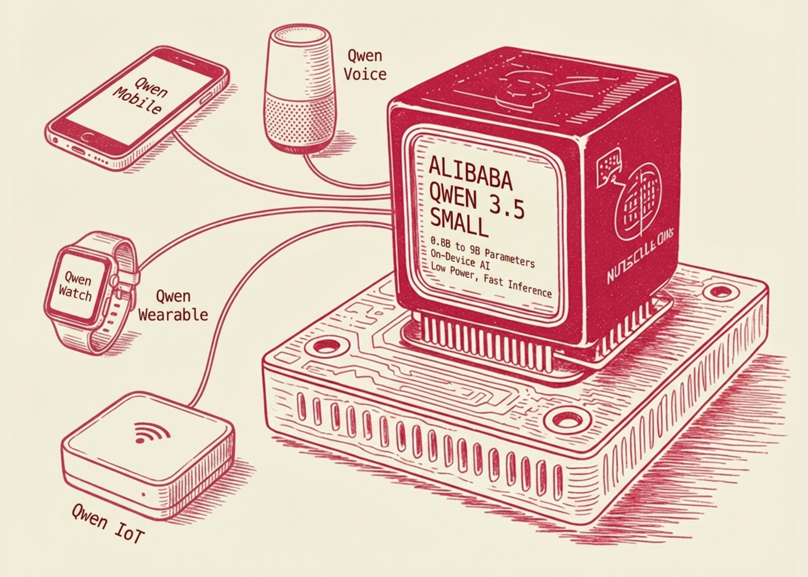

# Alibaba just released Qwen 3.5 Small models: a family of 0.8B to 9B parameters built for on-device applications

> Alibaba’s Qwen team has released the Qwen3.5 Small Model Series, a collection of Large Language Models (LLMs) ranging from 0.8B to 9B parameters. While the industry trend has historically favored increasing parameter counts to achieve ‘frontier’ performance, this release focuses on ‘More Intelligence, Less Compute.‘ These models represent a shift toward deploying capable AI on […]

Alibaba’s Qwen team has released the **Qwen3.5 Small Model Series**, a collection of Large Language Models (LLMs) ranging from 0.8B to 9B parameters. While the industry trend has historically favored increasing parameter counts to achieve ‘frontier’ performance, this release focuses on **‘More Intelligence, Less Compute.**‘ These models represent a shift toward deploying capable AI on consumer hardware and edge devices without the traditional trade-offs in reasoning or multimodality.

The series is currently available on [Hugging Face](https://huggingface.co/collections/Qwen/qwen35) and [ModelScope](https://modelscope.cn/collections/Qwen/Qwen35), including both Instruct and Base versions.

### The Model Hierarchy: Optimization by Scale

The Qwen3.5 small series is categorized into **four distinct tiers**, **each optimized for specific hardware constraints and latency requirements:**

- **Qwen3.5-0.8B and Qwen3.5-2B:** These models are designed for high-throughput, low-latency applications on **edge devices**. By optimizing the dense token training process, these models provide a reduced VRAM footprint, making them compatible with mobile chips and IoT hardware.

- **Qwen3.5-4B:** This model serves as a **multimodal base** for lightweight agents. It bridges the gap between pure text models and complex visual-language models (VLMs), allowing for agentic workflows that require visual understanding—such as UI navigation or document analysis—while remaining small enough for local deployment.

- **Qwen3.5-9B:** The flagship of the small series, the 9B variant, focuses on **reasoning and logic**. It is specifically tuned to close the performance gap with models significantly larger (such as 30B+ parameter variants) through advanced training techniques.

### Native Multimodality vs. Visual Adapters

One of the significant technical shifts in Qwen3.5-4B and above is the move toward **native multimodal capabilities**. In earlier iterations of small models, multimodality was often achieved through ‘adapters’ or ‘bridges’ that connected a pre-trained vision encoder (like CLIP) to a language model.

In contrast, Qwen3.5 incorporates multimodality directly into the architecture. This native approach allows the model to process visual and textual tokens within the same latent space from the early stages of training. This results in better spatial reasoning, improved OCR accuracy, and more cohesive visual-grounded responses compared to adapter-based systems.

### Scaled RL: Enhancing Reasoning in Compact Models

The performance of the Qwen3.5-9B is largely attributed to the implementation of **Scaled Reinforcement Learning (RL)**. Unlike standard Supervised Fine-Tuning (SFT), which teaches a model to mimic high-quality text, Scaled RL uses reward signals to optimize for correct reasoning paths.

**The benefits of Scaled RL in a 9B model include:**

- **Improved Instruction Following:** The model is more likely to adhere to complex, multi-step system prompts.

- **Reduced Hallucinations:** By reinforcing logical consistency during training, the model exhibits higher reliability in fact-retrieval and mathematical reasoning.

- **Efficiency in Inference:** The 9B parameter count allows for faster token generation (higher tokens-per-second) than 70B models, while maintaining competitive logic scores on benchmarks like MMLU and GSM8K.

### Summary Table: Qwen3.5 Small Series Specifications

**Model Size****Primary Use Case****Key Technical Feature****0.8B / 2B**Edge Devices / IoTLow VRAM, high-speed inference**4B**Lightweight AgentsNative multimodal integration**9B**Reasoning & LogicScaled RL for frontier-closing performance

By focusing on architectural efficiency and advanced training paradigms like Scaled RL and native multimodality, the Qwen3.5 series provides a viable path for developers to build sophisticated AI applications without the overhead of massive, cloud-dependent models.

### Key Takeaways

- **More Intelligence, Less Compute:** The series (0.8B to 9B parameters) prioritizes architectural efficiency over raw parameter scale, enabling high-performance AI on consumer-grade hardware and edge devices.

- **Native Multimodal Integration (4B Model):** Unlike models that use ‘bolted-on’ vision towers, the 4B variant features a native architecture where text and visual data are processed in a unified latent space, significantly improving spatial reasoning and OCR accuracy.

- **Frontier-Level Reasoning via Scaled RL:** The 9B model leverages **Scaled Reinforcement Learning** to optimize for logical reasoning paths rather than just token prediction, effectively closing the performance gap with models 5x to 10x its size.

- **Optimized for Edge and IoT:** The 0.8B and 2B models are developed for ultra-low latency and minimal VRAM footprints, making them ideal for local-first applications, mobile deployment, and privacy-sensitive environments.

---

Check out the **[Model Weights](https://huggingface.co/collections/Qwen/qwen35). **Also, feel free to follow us on **[Twitter](https://x.com/intent/follow?screen_name=marktechpost)** and don’t forget to join our **[120k+ ML SubReddit](https://www.reddit.com/r/machinelearningnews/)** and Subscribe to **[our Newsletter](https://www.aidevsignals.com/)**. Wait! are you on telegram? **[now you can join us on telegram as well.](https://t.me/machinelearningresearchnews)**
