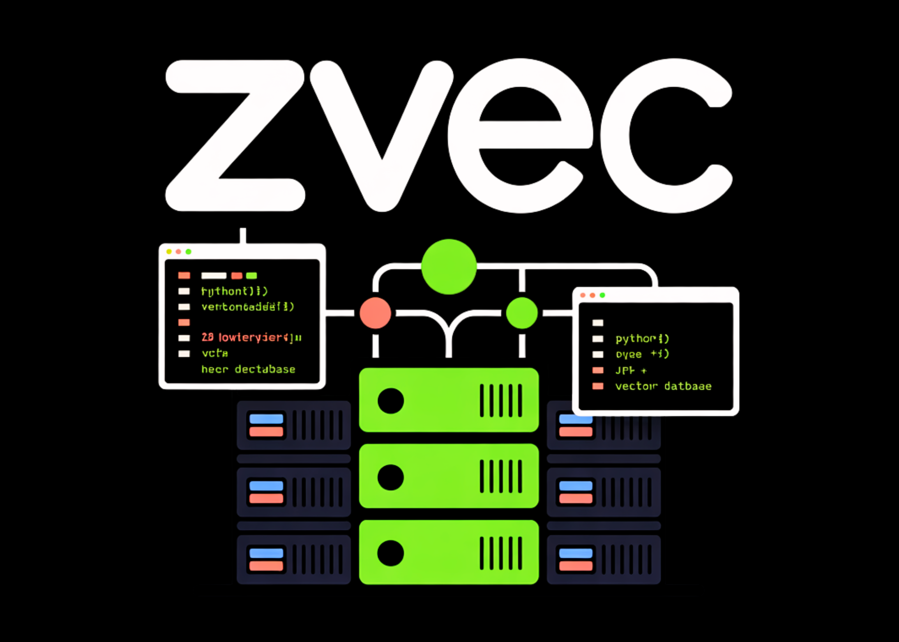

# Alibaba Open-Sources Zvec: An Embedded Vector Database Bringing SQLite-like Simplicity and High-Performance On-Device RAG to Edge Applications

> Alibaba Tongyi Lab research team released ‘Zvec’, an open source, in-process vector database that targets edge and on-device retrieval workloads. It is positioned as ‘the SQLite of vector databases’ because it runs as a library inside your application and does not require any external service or daemon. It is designed for retrieval augmented generation (RAG), […]

Alibaba Tongyi Lab research team released ‘Zvec’, an open source, in-process vector database that targets edge and on-device retrieval workloads. It is positioned as ‘the SQLite of vector databases’ because it runs as a library inside your application and does not require any external service or daemon. It is designed for retrieval augmented generation (RAG), semantic search, and agent workloads that must run locally on laptops, mobile devices, or other constrained hardware/edge devices

The core idea is simple. Many applications now need vector search and metadata filtering but do not want to run a separate vector database service. Traditional server style systems are heavy for desktop tools, mobile apps, or command line utilities. An embedded engine that behaves like SQLite but for embeddings fits this gap.

*https://zvec.org/en/blog/introduction/*

### Why embedded vector search matters for RAG?

RAG and semantic search pipelines need more than a bare index. They need vectors, scalar fields, full CRUD, and safe persistence. Local knowledge bases change as files, notes, and project states change.

Index libraries such as Faiss provide approximate nearest neighbor search but do not handle scalar storage, crash recovery, or hybrid queries. You end up building your own storage and consistency layer. Embedded extensions such as DuckDB-VSS add vector search to DuckDB but expose fewer index and quantization options and weaker resource control for edge scenarios. Service based systems such as Milvus or managed vector clouds require network calls and separate deployment, which is often overkill for on-device tools.

Zvec claims to fit in specifically for these local scenarios. It gives you a vector-native engine with persistence, resource governance, and RAG oriented features, packaged as a lightweight library.

### Core architecture: in-process and vector-native

Zvec is implemented as an embedded library. You install it with `pip install zvec` and open collections directly in your Python process. There is no external server or RPC layer. You define schemas, insert documents, and run queries through the Python API.

The engine is built on Proxima, Alibaba Group’s high performance, production grade, battle tested vector search engine. Zvec wraps Proxima with a simpler API and embedded runtime. The project is released under the Apache 2.0 license.

Current support covers Python 3.10 to 3.12 on Linux x86_64, Linux ARM64, and macOS ARM64.

**The design goals are explicit:**

- Embedded execution in process

- Vector native indexing and storage

- Production ready persistence and crash safety

This makes it suitable for edge devices, desktop applications, and zero-ops deployments.

### Developer workflow: from install to semantic search

The quickstart documentation shows a short path from install to query.

- Install the package:`pip install zvec`

- Define a `CollectionSchema` with one or more vector fields and optional scalar fields.

- Call `create_and_open` to create or open the collection on disk.

- Insert `Doc` objects that contain an ID, vectors, and scalar attributes.

- Build an index and run a `VectorQuery` to retrieve nearest neighbors.

Copy CodeCopiedUse a different Browser
```
pip install zvec
```

**Example:**

Copy CodeCopiedUse a different Browser
```
import zvec

# Define collection schema
schema = zvec.CollectionSchema(
    name="example",
    vectors=zvec.VectorSchema("embedding", zvec.DataType.VECTOR_FP32, 4),
)

# Create collection
collection = zvec.create_and_open(path="./zvec_example", schema=schema,)

# Insert documents
collection.insert([
    zvec.Doc(id="doc_1", vectors={"embedding": [0.1, 0.2, 0.3, 0.4]}),
    zvec.Doc(id="doc_2", vectors={"embedding": [0.2, 0.3, 0.4, 0.1]}),
])

# Search by vector similarity
results = collection.query(
    zvec.VectorQuery("embedding", vector=[0.4, 0.3, 0.3, 0.1]),
    topk=10
)

# Results: list of {'id': str, 'score': float, ...}, sorted by relevance 
print(results)
```

Results come back as dictionaries that include IDs and similarity scores. This is enough to build a local semantic search or RAG retrieval layer on top of any embedding model.

### Performance: VectorDBBench and 8,000+ QPS

Zvec is optimized for high throughput and low latency on CPUs. It uses multithreading, cache friendly memory layouts, SIMD instructions, and CPU prefetching.

In [VectorDBBench](https://zilliz.com/vdbbench-leaderboard?dataset=vectorSearch) on the Cohere 10M dataset, with comparable hardware and matched recall, Zvec reports more than 8,000 QPS. This is more than 2× the previous leaderboard #1, ZillizCloud, while also substantially reducing index build time in the same setup.

*https://zvec.org/en/blog/introduction/*

These metrics show that an embedded library can reach cloud level performance for high volume similarity search, as long as the workload resembles the benchmark conditions.

### RAG capabilities: CRUD, hybrid search, fusion, reranking

The feature set is tuned for RAG and agentic retrieval.

**Zvec supports:**

- Full CRUD on documents so the local knowledge base can change over time.

- Schema evolution to adjust index strategies and fields.

- Multi vector retrieval for queries that combine several embedding channels.

- A built in reranker that supports weighted fusion and Reciprocal Rank Fusion.

- Scalar vector hybrid search that pushes scalar filters into the index execution path, with optional inverted indexes for scalar attributes.

This allows you to build on device assistants that mix semantic retrieval, filters such as user, time, or type, and multiple embedding models, all within one embedded engine.

### Key Takeaways

- Zvec is an embedded, in-process vector database positioned as the ‘SQLite of vector database’ for on-device and edge RAG workloads.

- It is built on Proxima, Alibaba’s high performance, production grade, battle tested vector search engine, and is released under Apache 2.0 with Python support on Linux x86_64, Linux ARM64, and macOS ARM64.

- Zvec delivers >8,000 QPS on VectorDBBench with the Cohere 10M dataset, achieving more than 2× the previous leaderboard #1 (ZillizCloud) while also reducing index build time.

- The engine provides explicit resource governance via 64 MB streaming writes, optional mmap mode, experimental `memory_limit_mb`, and configurable `concurrency`, `optimize_threads`, and `query_threads` for CPU control.

- Zvec is RAG ready with full CRUD, schema evolution, multi vector retrieval, built in reranking (weighted fusion and RRF), and scalar vector hybrid search with optional inverted indexes, plus an ecosystem roadmap targeting LangChain, LlamaIndex, DuckDB, PostgreSQL, and real device deployments.

---

Check out the **[Technical details](https://zvec.org/en/blog/introduction/) **and** [Repo](https://github.com/alibaba/zvec).** Also, feel free to follow us on **[Twitter](https://x.com/intent/follow?screen_name=marktechpost)** and don’t forget to join our **[100k+ ML SubReddit](https://www.reddit.com/r/machinelearningnews/)** and Subscribe to **[our Newsletter](https://www.aidevsignals.com/)**. Wait! are you on telegram? **[now you can join us on telegram as well.](https://t.me/machinelearningresearchnews)**
