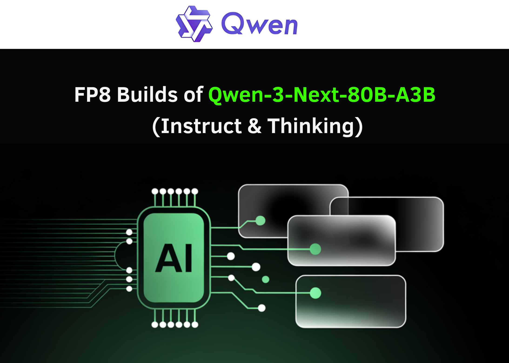

# Alibaba Qwen Team Just Released FP8 Builds of Qwen3-Next-80B-A3B (Instruct & Thinking), Bringing 80B/3B-Active Hybrid-MoE to Commodity GPUs

> Alibaba’s Qwen team has just released FP8-quantized checkpoints for its new Qwen3-Next-80B-A3B models in two post-training variants—Instruct and Thinking—aimed at high-throughput inference with ultra-long context and MoE efficiency. The FP8 repos mirror the BF16 releases but package “fine-grained FP8” weights (block size 128) and deployment notes for sglang and vLLM nightly builds. Benchmarks in the […]

Alibaba’s Qwen team has just released FP8-quantized checkpoints for its new Qwen3-Next-80B-A3B models in two post-training variants—**[Instruct ](https://huggingface.co/Qwen/Qwen3-Next-80B-A3B-Instruct-FP8)**and **[Thinking](https://huggingface.co/Qwen/Qwen3-Next-80B-A3B-Thinking-FP8)**—aimed at high-throughput inference with ultra-long context and MoE efficiency. The FP8 repos mirror the BF16 releases but package “fine-grained FP8” weights (block size 128) and deployment notes for sglang and vLLM nightly builds. Benchmarks in the cards remain those of the original BF16 models; FP8 is provided “for convenience and performance,” not as a separate evaluation run.

### What’s in the A3B stack

Qwen3-Next-80B-A3B is a hybrid architecture combining Gated DeltaNet (a linear/conv-style attention surrogate) with Gated Attention, interleaved with an ultra-sparse Mixture-of-Experts (MoE). The 80B total parameter budget activates ~3B params per token via 512 experts (10 routed + 1 shared). The layout is specified as 48 layers arranged into 12 blocks: `3×(Gated DeltaNet → MoE)` followed by `1×(Gated Attention → MoE)`. Native context is 262,144 tokens, validated up to ~1,010,000 tokens using RoPE scaling (YaRN). Hidden size is 2048; attention uses 16 Q heads and 2 KV heads at head dim 256; DeltaNet uses 32 V and 16 QK linear heads at head dim 128.

Qwen team reports the 80B-A3B base model outperforms Qwen3-32B on downstream tasks at ~10% of its training cost and delivers ~10× inference throughput beyond 32K context—driven by low activation in MoE and multi-token prediction (MTP). The Instruct variant is non-reasoning (no `<think>` tags), whereas the Thinking variant enforces reasoning traces by default and is optimized for complex problems.

### FP8 releases: what actually changed

The FP8 model cards state the quantization is “fine-grained fp8” with block size 128. Deployment differs slightly from BF16: both sglang and vLLM require current main/nightly builds, with example commands provided for 256K context and optional MTP. The Thinking FP8 card also recommends a reasoning parser flag (e.g., `--reasoning-parser deepseek-r1` in sglang, `deepseek_r1` in vLLM). These releases retain Apache-2.0 licensing.

### Benchmarks (reported on BF16 weights)

The Instruct FP8 card reproduces Qwen’s BF16 comparison table, putting Qwen3-Next-80B-A3B-Instruct on par with Qwen3-235B-A22B-Instruct-2507 on several knowledge/reasoning/coding benchmarks, and ahead on long-context workloads (up to 256K). The Thinking FP8 card lists AIME’25, HMMT’25, MMLU-Pro/Redux, and LiveCodeBench v6, where Qwen3-Next-80B-A3B-Thinking surpasses earlier Qwen3 Thinking releases (30B A3B-2507, 32B) and claims wins over Gemini-2.5-Flash-Thinking on multiple benchmarks.

### Training and post-training signals

The series is trained on ~15T tokens before post-training. Qwen highlights stability additions (zero-centered, weight-decayed layer norm, etc.) and uses GSPO in RL post-training for the Thinking model to handle the hybrid attention + high-sparsity MoE combination. MTP is used to speed inference and improve pretraining signal.

### Why FP8 matters?

On modern accelerators, FP8 activations/weights reduce memory bandwidth pressure and resident footprint versus BF16, allowing larger batch sizes or longer sequences at similar latency. Because A3B routes only ~3B parameters per token, the combination of FP8 + MoE sparsity compounds throughput gains in long-context regimes, particularly when paired with speculative decoding via MTP as exposed in the serving flags. That said, quantization interacts with routing and attention variants; real-world acceptance rates for speculative decoding and end-task accuracy can vary with engine and kernel implementations—hence Qwen’s guidance to use current sglang/vLLM and to tune speculative settings.

### Summary

Qwen’s FP8 releases make the 80B/3B-active A3B stack practical to serve at 256K context on mainstream engines, preserving the hybrid-MoE design and MTP path for high throughput. The model cards keep benchmarks from BF16, so teams should validate FP8 accuracy and latency on their own stacks, especially with reasoning parsers and speculative settings. Net outcome: lower memory bandwidth and improved concurrency without architectural regressions, positioned for long-context production workloads.

---

Check out the **Qwen3-Next-80B-A3B models in two post-training variants—[Instruct ](https://huggingface.co/Qwen/Qwen3-Next-80B-A3B-Instruct-FP8)**and **[Thinking](https://huggingface.co/Qwen/Qwen3-Next-80B-A3B-Thinking-FP8)**. Feel free to check out our **[GitHub Page for Tutorials, Codes and Notebooks](https://github.com/Marktechpost/AI-Tutorial-Codes-Included)**. Also, feel free to follow us on **[Twitter](https://x.com/intent/follow?screen_name=marktechpost)** and don’t forget to join our **[100k+ ML SubReddit](https://www.reddit.com/r/machinelearningnews/)** and Subscribe to **[our Newsletter](https://www.aidevsignals.com/)**.
