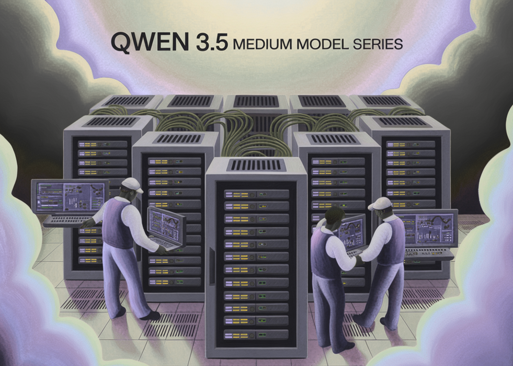

# Alibaba Qwen Team Releases Qwen 3.5 Medium Model Series: A Production Powerhouse Proving that Smaller AI Models are Smarter

> The development of large language models (LLMs) has been defined by the pursuit of raw scale. While increasing parameter counts into the trillions initially drove performance gains, it also introduced significant infrastructure overhead and diminishing marginal utility. The release of the Qwen 3.5 Medium Model Series signals a shift in Alibaba’s Qwen approach, prioritizing architectural […]

The development of large language models (LLMs) has been defined by the pursuit of raw scale. While increasing parameter counts into the trillions initially drove performance gains, it also introduced significant infrastructure overhead and diminishing marginal utility. The release of the **Qwen 3.5 Medium Model Series** signals a shift in Alibaba’s Qwen approach, prioritizing architectural efficiency and high-quality data over traditional scaling.

The series features a lineup including **Qwen3.5-Flash**, **Qwen3.5-35B-A3B**, **Qwen3.5-122B-A10B**, and **Qwen3.5-27B**. These models demonstrate that strategic architectural choices and Reinforcement Learning (RL) can achieve frontier-level intelligence with significantly lower compute requirements.

### The Efficiency Breakthrough: 35B Surpasses 235B

The most notable technical milestone is the performance of **Qwen3.5-35B-A3B**, which now outperforms the older **Qwen3-235B-A22B-2507** and the vision-capable **Qwen3-VL-235B-A22B**.

The ‘A3B’ suffix is the key metric. This indicates the **Active Parameters** in a Mixture-of-Experts (MoE) architecture. Although the model has 35 billion total parameters, it only activates 3 billion during any single inference pass. The fact that a model with 3B active parameters can outperform a predecessor with 22B active parameters highlights a major leap in reasoning density.

This efficiency is driven by a hybrid architecture that integrates **Gated Delta Networks** (linear attention) with standard Gated Attention blocks. This design enables high-throughput decoding and a reduced memory footprint, making high-performance AI more accessible on standard hardware.

### Qwen3.5-Flash: Optimized for Production

**Qwen3.5-Flash** serves as the hosted production version of the 35B-A3B model. It is specifically developed for software devs who require low-latency performance in agentic workflows.

- **1M Context Length:** By providing a 1-million-token context window by default, Flash reduces the need for complex RAG (Retrieval-Augmented Generation) pipelines when handling large document sets or codebases.

- **Official Built-in Tools:** The model features native support for tool use and function calling, allowing it to interface directly with APIs and databases with high precision.

### High-Reasoning Agentic Scenarios

The **Qwen3.5-122B-A10B** and **Qwen3.5-27B** models are designed for ‘agentic’ tasks—scenarios where a model must plan, reason, and execute multi-step workflows. These models narrow the gap between open-weight alternatives and proprietary frontier models.

Alibaba Qwen team utilized a four-stage post-training pipeline for these models, involving long chain-of-thought (CoT) cold starts and reasoning-based RL. This allows the 122B-A10B model, utilizing only 10 billion active parameters, to maintain logical consistency over long-horizon tasks, rivaling the performance of much larger dense models.

### Key Takeaways

- **Architectural Efficiency (MoE):** The **Qwen3.5-35B-A3B** model, with only 3 billion active parameters (A3B), outperforms the previous generation’s 235B model. This demonstrates that Mixture-of-Experts (MoE) architecture, when combined with superior data quality and Reinforcement Learning (RL), can deliver ‘frontier-level’ intelligence at a fraction of the compute cost.

- **Production-Ready Performance (Flash):** **Qwen3.5-Flash** is the hosted production version aligned with the 35B model. It is specifically optimized for high-throughput, low-latency applications, making it the ‘workhorse’ for developers moving from prototype to enterprise-scale deployment.

- **Massive Context Window:** The series features a **1M context length by default**. This enables long-context tasks like full-repository code analysis or massive document retrieval without the need for complex RAG (Retrieval-Augmented Generation) ‘chunking’ strategies, significantly simplifying the developer workflow.

- **Native Tool Use & Agentic Capabilities:** Unlike models that require extensive prompt engineering for external interactions, Qwen 3.5 includes **official built-in tools**. This native support for function calling and API interaction makes it highly effective for ‘agentic’ scenarios where the model must plan and execute multi-step workflows.

- **The ‘Medium’ Sweet Spot:** By focusing on models ranging from **27B to 122B (A10B active)**, Alibaba is targeting the industry’s ‘Goldilocks’ zone. These models are small enough to run on private or localized cloud infrastructure while maintaining the complex reasoning and logical consistency typically reserved for massive, closed-source proprietary models.

---

Check out the **[Model Weights](https://huggingface.co/collections/Qwen/qwen35) **and** [Flash API](https://modelstudio.console.alibabacloud.com/ap-southeast-1/?tab=doc#/doc/?type=model&url=2840914_2&modelId=group-qwen3.5-flash). **Also, feel free to follow us on **[Twitter](https://x.com/intent/follow?screen_name=marktechpost)** and don’t forget to join our **[120k+ ML SubReddit](https://www.reddit.com/r/machinelearningnews/)** and Subscribe to **[our Newsletter](https://www.aidevsignals.com/)**. Wait! are you on telegram? **[now you can join us on telegram as well.](https://t.me/machinelearningresearchnews)**
