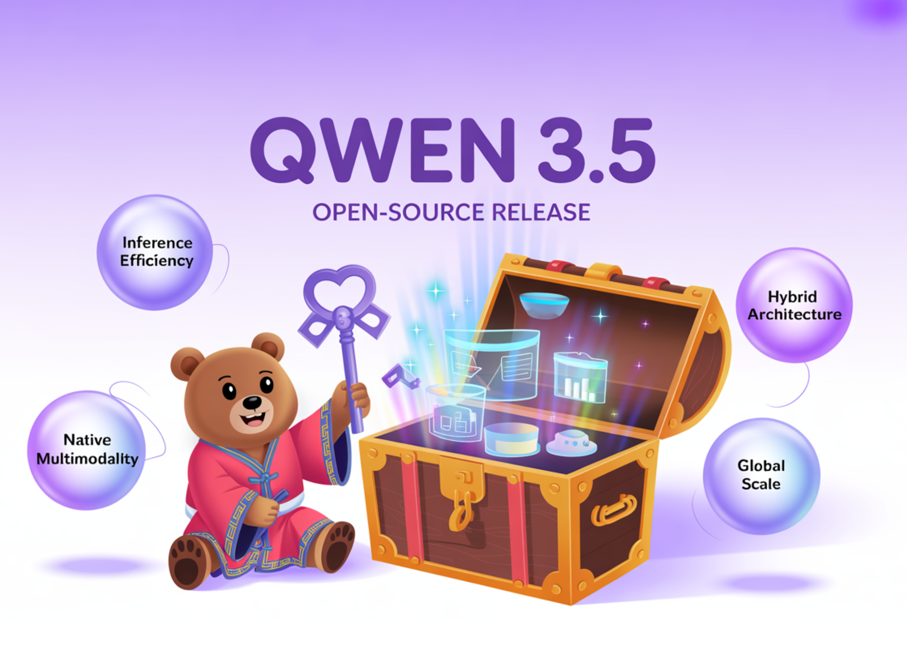

# Alibaba Qwen Team Releases Qwen3.5-397B MoE Model with 17B Active Parameters and 1M Token Context for AI agents

> Alibaba Cloud just updated the open-source landscape. Today, the Qwen team released Qwen3.5, the newest generation of their large language model (LLM) family. The most powerful version is Qwen3.5-397B-A17B. This model is a sparse Mixture-of-Experts (MoE) system. It combines massive reasoning power with high efficiency. Qwen3.5 is a native vision-language model. It is designed specifically […]

Alibaba Cloud just updated the open-source landscape. Today, the Qwen team released **Qwen3.5**, the newest generation of their large language model (LLM) family. The most powerful version is **Qwen3.5-397B-A17B**. This model is a sparse Mixture-of-Experts (MoE) system. It combines massive reasoning power with high efficiency.

Qwen3.5 is a native vision-language model. It is designed specifically for AI agents. It can see, code, and reason across **201** languages.

*https://qwen.ai/blog?id=qwen3.5*

### The Core Architecture: 397B Total, 17B Active

The technical specifications of **Qwen3.5-397B-A17B** are impressive. The model contains **397B** total parameters. However, it uses a sparse MoE design. This means it only activates **17B** parameters during any single forward pass.

This **17B** activation count is the most important number for devs. It allows the model to provide the intelligence of a **400B** model. But it runs with the speed of a much smaller model. The Qwen team reports a **8.6x** to **19.0x** increase in decoding throughput compared to previous generations. This efficiency solves the high cost of running large-scale AI.

*https://qwen.ai/blog?id=qwen3.5*

### Efficient Hybrid Architecture: Gated Delta Networks

Qwen3.5 does not use a standard Transformer design. It uses an ‘Efficient Hybrid Architecture.’ Most LLMs rely only on Attention mechanisms. These can become slow with long text. Qwen3.5 combines **Gated Delta Networks** (linear attention) with **Mixture-of-Experts (MoE)**.

The model consists of **60** layers. The hidden dimension size is **4,096**. These layers follow a specific ‘Hidden Layout.’ The layout groups layers into sets of **4**.

- **3** blocks use Gated DeltaNet-plus-MoE.

- **1** block uses Gated Attention-plus-MoE.

- This pattern repeats **15** times to reach **60** layers.

**Technical details include:**

- **Gated DeltaNet:** It uses **64** linear attention heads for Values (V). It uses **16** heads for Queries and Keys (QK).

- **MoE Structure:** The model has **512** total experts. Each token activates **10** routed experts and **1** shared expert. This equals **11** active experts per token.

- **Vocabulary:** The model uses a padded vocabulary of **248,320** tokens.

### Native Multimodal Training: Early Fusion

Qwen3.5 is a **native vision-language model**. Many other models add vision capabilities later. Qwen3.5 used ‘Early Fusion’ training. This means the model learned from images and text at the same time.

The training used trillions of multimodal tokens. This makes Qwen3.5 better at visual reasoning than previous **Qwen3-VL** versions. It is highly capable of ‘agentic’ tasks. For example, it can look at a UI screenshot and generate the exact HTML and CSS code. It can also analyze long videos with second-level accuracy.

The model supports the **Model Context Protocol (MCP)**. It also handles complex function-calling. These features are vital for building agents that control apps or browse the web. In the **IFBench** test, it scored **76.5**. This score beats many proprietary models.

*https://qwen.ai/blog?id=qwen3.5*

### Solving the Memory Wall: 1M Context Length

Long-form data processing is a core feature of Qwen3.5. The base model has a native context window of **262,144** (256K) tokens. The hosted **Qwen3.5-Plus** version goes even further. It supports **1M tokens.**

Alibaba Qwen team used a new asynchronous Reinforcement Learning (RL) framework for this. It ensures the model stays accurate even at the end of a **1M** token document. For Devs, this means you can feed an entire codebase into one prompt. You do not always need a complex Retrieval-Augmented Generation (RAG) system.

### Performance and Benchmarks

The model excels in technical fields. It achieved high scores on **Humanity’s Last Exam (HLE-Verified)**. This is a difficult benchmark for AI knowledge.

- **Coding:** It shows parity with top-tier closed-source models.

- **Math:** The model uses ‘Adaptive Tool Use.’ It can write Python code to solve math problems. It then runs the code to verify the answer.

- **Languages:** It supports **201** different languages and dialects. This is a big jump from the **119** languages in the previous version.

### Key Takeaways

- **Hybrid Efficiency (MoE + Gated Delta Networks):** Qwen3.5 uses a **3:1** ratio of **Gated Delta Networks** (linear attention) to standard **Gated Attention** blocks across **60** layers. This hybrid design allows for an **8.6x** to **19.0x** increase in decoding throughput compared to previous generations.

- **Massive Scale, Low Footprint:** The **Qwen3.5-397B-A17B** features **397B** total parameters but only activates **17B** per token. You get **400B-class** intelligence with the inference speed and memory requirements of a much smaller model.

- **Native Multimodal Foundation:** Unlike ‘bolted-on’ vision models, Qwen3.5 was trained via **Early Fusion** on trillions of text and image tokens simultaneously. This makes it a top-tier visual agent, scoring **76.5** on **IFBench** for following complex instructions in visual contexts.

- **1M Token Context:** While the base model supports a native **256k** token context, the hosted **Qwen3.5-Plus** handles up to **1M** tokens. This massive window allows devs to process entire codebases or 2-hour videos without needing complex RAG pipelines.

---

Check out the **[Technical details](https://qwen.ai/blog?id=qwen3.5), [Model Weights](https://huggingface.co/collections/Qwen/qwen35) **and** [GitHub Repo](https://github.com/QwenLM/Qwen3.5). **Also, feel free to follow us on **[Twitter](https://x.com/intent/follow?screen_name=marktechpost)** and don’t forget to join our **[100k+ ML SubReddit](https://www.reddit.com/r/machinelearningnews/)** and Subscribe to **[our Newsletter](https://www.aidevsignals.com/)**. Wait! are you on telegram? **[now you can join us on telegram as well.](https://t.me/machinelearningresearchnews)**
