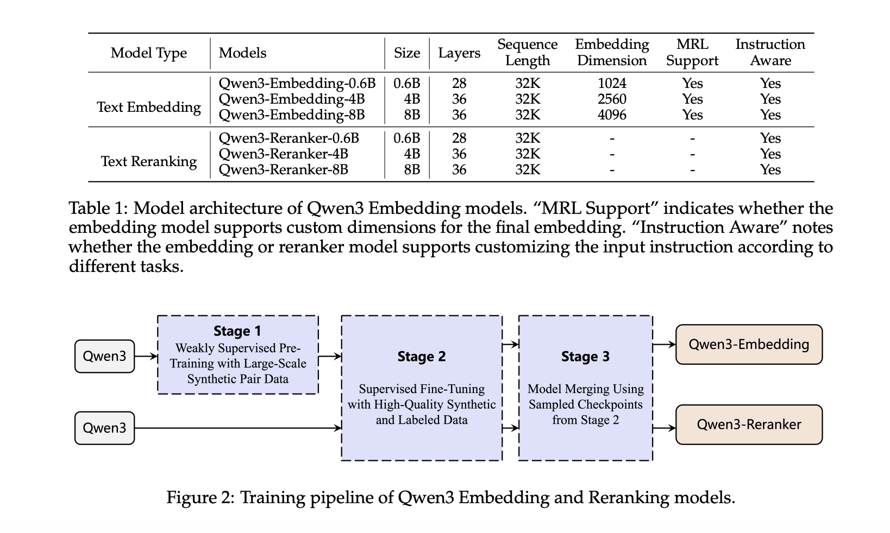

# Alibaba Qwen Team Releases Qwen3-Embedding and Qwen3-Reranker Series – Redefining Multilingual Embedding and Ranking Standards

> Text embedding and reranking are foundational to modern information retrieval systems, powering applications such as semantic search, recommendation systems, and retrieval-augmented generation (RAG). However, current approaches often face key challenges—particularly in achieving both high multilingual fidelity and task adaptability without relying on proprietary APIs. Existing models frequently fall short in scenarios requiring nuanced semantic understanding […]

Text embedding and reranking are foundational to modern information retrieval systems, powering applications such as semantic search, recommendation systems, and retrieval-augmented generation ([RAG](https://www.marktechpost.com/2024/11/25/retrieval-augmented-generation-rag-deep-dive-into-25-different-types-of-rag/)). However, current approaches often face key challenges—particularly in achieving both high multilingual fidelity and task adaptability without relying on proprietary APIs. Existing models frequently fall short in scenarios requiring nuanced semantic understanding across multiple languages or domain-specific tasks like code retrieval and instruction following. Moreover, most open-source models either lack scale or flexibility, while commercial APIs remain costly and closed.

### Qwen3-Embedding and Qwen3-Reranker: A New Standard for Open-Source Embedding

Alibaba’s Qwen Team has unveiled the Qwen3-Embedding and Qwen3-Reranker Series—models that set a new benchmark in multilingual text embedding and relevance ranking. Built on the Qwen3 foundation models, the series includes variants in 0.6B, 4B, and 8B parameter sizes and supports a wide range of languages (119 in total), making it one of the most versatile and performant open-source offerings to date. These models are now open-sourced under the Apache 2.0 license on Hugging Face, GitHub, and ModelScope, and are also accessible via Alibaba Cloud APIs.

These models are optimized for use cases such as semantic retrieval, classification, RAG, sentiment analysis, and code search—providing a strong alternative to existing solutions like Gemini Embedding and OpenAI’s embedding APIs.

### Technical Architecture

Qwen3-Embedding models adopt a dense transformer-based architecture with causal attention, producing embeddings by extracting the hidden state corresponding to the [EOS] token. Instruction-awareness is a key feature: input queries are formatted as `{instruction} {query}<|endoftext|>`, enabling task-conditioned embeddings. The reranker models are trained with a binary classification format, judging document-query relevance in an instruction-guided manner using a token likelihood-based scoring function.

The models are trained using a robust multi-stage training pipeline:

- **Large-scale weak supervision:** 150M synthetic training pairs generated using Qwen3-32B, covering retrieval, classification, STS, and bitext mining across languages and tasks.

- **Supervised fine-tuning:** 12M high-quality data pairs are selected using cosine similarity (>0.7), fine-tuning performance in downstream applications.

- **Model merging:** Spherical linear interpolation (SLERP) of multiple fine-tuned checkpoints ensures robustness and generalization.

This synthetic data generation pipeline enables control over data quality, language diversity, task difficulty, and more—resulting in a high degree of coverage and relevance in low-resource settings.

### Performance Benchmarks and Insights

The Qwen3-Embedding and Qwen3-Reranker series demonstrate strong empirical performance across several multilingual benchmarks.

- **On MMTEB** (216 tasks across 250+ languages), Qwen3-Embedding-8B achieves a mean task score of **70.58**, surpassing Gemini and GTE-Qwen2 series.

- **On MTEB (English v2):** Qwen3-Embedding-8B reaches **75.22**, outperforming other open models including NV-Embed-v2 and GritLM-7B.

- **On MTEB-Code:** Qwen3-Embedding-8B leads with **80.68**, excelling in applications like code retrieval and Stack Overflow QA.

**For reranking:**

- Qwen3-Reranker-0.6B already outperforms Jina and BGE rerankers.

- Qwen3-Reranker-8B achieves **81.22** on MTEB-Code and **72.94** on MMTEB-R, marking state-of-the-art performance.

Ablation studies confirm the necessity of each training stage. Removing synthetic pretraining or model merging led to significant performance drops (up to 6 points on MMTEB), emphasizing their contributions.

### Conclusion

Alibaba’s Qwen3-Embedding and Qwen3-Reranker Series present a robust, open, and scalable solution to multilingual and instruction-aware semantic representation. With strong empirical results across MTEB, MMTEB, and MTEB-Code, these models bridge the gap between proprietary APIs and open-source accessibility. Their thoughtful training design—leveraging high-quality synthetic data, instruction-tuning, and model merging—positions them as ideal candidates for enterprise applications in search, retrieval, and RAG pipelines. By open-sourcing these models, the Qwen team not only pushes the boundaries of language understanding but also empowers the broader community to innovate on top of a solid foundation.

---

**Check out the [Paper,](https://github.com/QwenLM/Qwen3-Embedding/blob/main/qwen3_embedding_technical_report.pdf) [Technical details](https://qwenlm.github.io/blog/qwen3-embedding/), [Qwen3-Embedding](https://huggingface.co/collections/Qwen/qwen3-embedding-6841b2055b99c44d9a4c371f) and [Qwen3-Reranker](https://huggingface.co/collections/Qwen/qwen3-reranker-6841b22d0192d7ade9cdefea)_._** All credit for this research goes to the researchers of this project. Also, feel free to follow us on **[Twitter](https://x.com/intent/follow?screen_name=marktechpost)** and don’t forget to join our **[95k+ ML SubReddit](https://www.reddit.com/r/machinelearningnews/)** and Subscribe to **[our Newsletter](https://www.airesearchinsights.com/subscribe)**.
