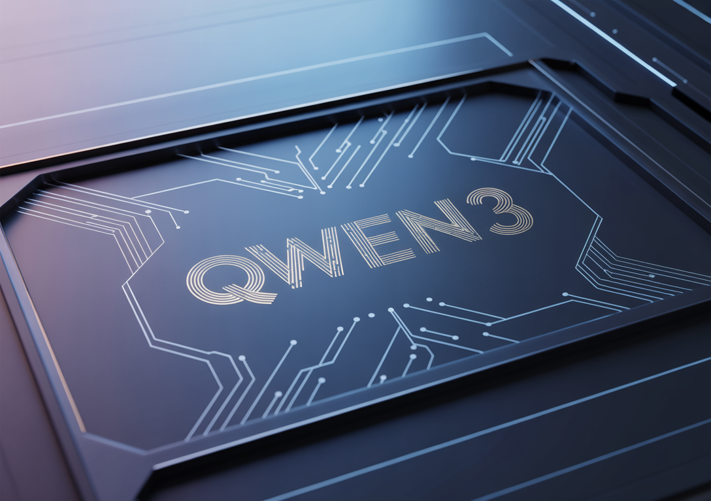

# Alibaba Qwen Unveils Qwen3-4B-Instruct-2507 and Qwen3-4B-Thinking-2507: Refreshing the Importance of Small Language Models

> Smaller Models with Smarter Performance and 256K Context Support Alibaba’s Qwen team has introduced two powerful additions to its small language model lineup: Qwen3-4B-Instruct-2507 and Qwen3-4B-Thinking-2507. Despite having only 4 billion parameters, these models deliver exceptional capabilities across general-purpose and expert-level tasks while running efficiently on consumer-grade hardware. Both are designed with native 256K token […]

### Smaller Models with Smarter Performance and 256K Context Support

Alibaba’s Qwen team has introduced two powerful additions to its small language model lineup: **Qwen3-4B-Instruct-2507** and **Qwen3-4B-Thinking-2507**. Despite having only 4 billion parameters, these models deliver exceptional capabilities across general-purpose and expert-level tasks while running efficiently on consumer-grade hardware. Both are designed with **native 256K token context windows**, meaning they can process extremely long inputs such as large codebases, multi-document archives, and extended dialogues without external modifications.

### Architecture and Core Design

Both models feature **4 billion total parameters** (3.6B excluding embeddings) built across **36 transformer layers**. They use **Grouped Query Attention (GQA)** with **32 query heads** and **8 key/value heads**, enhancing efficiency and memory management for very large contexts. They are **dense transformer architectures**—not mixture-of-experts—which ensures consistent task performance. Long-context support up to **262,144 tokens** is baked directly into the model architecture, and each model is pretrained extensively before undergoing **alignment and safety post-training** to ensure responsible, high-quality outputs.

### Qwen3-4B-Instruct-2507 — A Multilingual, Instruction-Following Generalist

The **Qwen3-4B-Instruct-2507** model is optimized for speed, clarity, and user-aligned instruction following. It is designed to deliver direct answers without explicit step-by-step reasoning, making it perfect for scenarios where users want concise responses rather than detailed thought processes.

Multilingual coverage spans **over 100 languages**, making it highly suitable for global deployments in chatbots, customer support, education, and cross-language search. Its **native 256K context support** enables it to handle tasks like analyzing large legal documents, processing multi-hour transcripts, or summarizing massive datasets without splitting the content.

#### Performance Benchmarks:

Benchmark TaskScoreGeneral Knowledge (MMLU-Pro)69.6Reasoning (AIME25)47.4SuperGPQA (QA)42.8Coding (LiveCodeBench)35.1Creative Writing83.5Multilingual Comprehension (MultiIF)69.0

In practice, this means Qwen3-4B-Instruct-2507 can handle everything from **language tutoring in multiple languages** to **generating rich narrative content**, while still providing competent performance in reasoning, coding, and domain-specific knowledge.

### Qwen3-4B-Thinking-2507 — Expert-Level Chain-of-Thought Reasoning

Where the Instruct model focuses on concise responsiveness, the **Qwen3-4B-Thinking-2507** model is engineered for **deep reasoning and problem-solving**. It automatically generates explicit **chains of thought** in its outputs, making its decision-making process transparent—especially beneficial for complex domains like mathematics, science, and programming.

This model excels at **technical diagnostics**, **scientific data interpretation**, and **multi-step logical analysis**. It’s suited for advanced AI agents, research assistants, and coding companions that need to reason through problems before answering.

#### Performance Benchmarks:

Benchmark TaskScoreMath (AIME25)81.3%Science (HMMT25)55.5%General QA (GPQA)65.8%Coding (LiveCodeBench)55.2%Tool Usage (BFCL)71.2%Human Alignment87.4%

These scores demonstrate that Qwen3-4B-Thinking-2507 can match or even surpass much larger models in reasoning-heavy benchmarks, allowing more accurate and explainable results for mission-critical use cases.

### Across Both Models

Both the Instruct and Thinking variants share key advancements. The **256K native context window** allows for seamless work on extremely long inputs without external memory hacks. They also feature **improved alignment**, producing more natural, coherent, and context-aware responses in creative and multi-turn conversations. Furthermore, both are **agent-ready**, supporting API calling, multi-step reasoning, and workflow orchestration out-of-the-box.

From a deployment perspective, they are highly efficient—capable of running on **mainstream consumer GPUs** with quantization for lower memory usage, and fully compatible with modern inference frameworks. This means developers can **run them locally or scale them in cloud environments** without significant resource investment.

### Practical Deployment and Applications

Deployment is straightforward, with **broad framework compatibility** enabling integration into any modern [ML](https://www.marktechpost.com/2025/01/14/what-is-machine-learning-ml/) pipeline. They can be used in edge devices, enterprise virtual assistants, research institutions, coding environments, and creative studios. Example scenarios include:

- **Instruction-Following Mode**: Customer support bots, multilingual educational assistants, real-time content generation.

- **Thinking Mode**: Scientific research analysis, legal reasoning, advanced coding tools, and agentic automation.

### Conclusion 

The Qwen3-4B-Instruct-2507 and Qwen3-4B-Thinking-2507 prove that **[small language models](https://www.marktechpost.com/2025/01/12/what-are-small-language-models-slms/) can rival and even outperform larger models in specific domains** when engineered thoughtfully. Their blend of long-context handling, strong multilingual capabilities, deep reasoning (in Thinking mode), and alignment improvements makes them powerful tools for both everyday and specialist AI applications. With these releases, Alibaba has set a new benchmark in making **256K-ready, high-performance AI models** accessible to developers worldwide.

---

Check out the **[Qwen3-4B-Instruct-2507 Model](https://huggingface.co/Qwen/Qwen3-4B-Instruct-2507) **and **[Qwen3-4B-Thinking-2507 Model](https://huggingface.co/Qwen/Qwen3-4B-Thinking-2507).** Feel free to check out our **[GitHub Page for Tutorials, Codes and Notebooks](https://github.com/Marktechpost/AI-Tutorial-Codes-Included)**. Also, feel free to follow us on **[Twitter](https://x.com/intent/follow?screen_name=marktechpost)** and don’t forget to Subscribe to **[our Newsletter](https://www.aidevsignals.com/)**.

[🇾 Discuss on Hacker News ](https://news.ycombinator.com/submitlink?u=https://www.marktechpost.com/2025/08/08/alibaba-qwen-unveils-qwen3-4b-instruct-2507-and-qwen3-4b-thinking-2507-refreshing-the-importance-of-small-language-models/)

[ 🇷 Join our ML Subreddit ](https://www.reddit.com/r/machinelearningnews/)

[ 🇸 Sponsor us ](https://promotion.marktechpost.com/)
