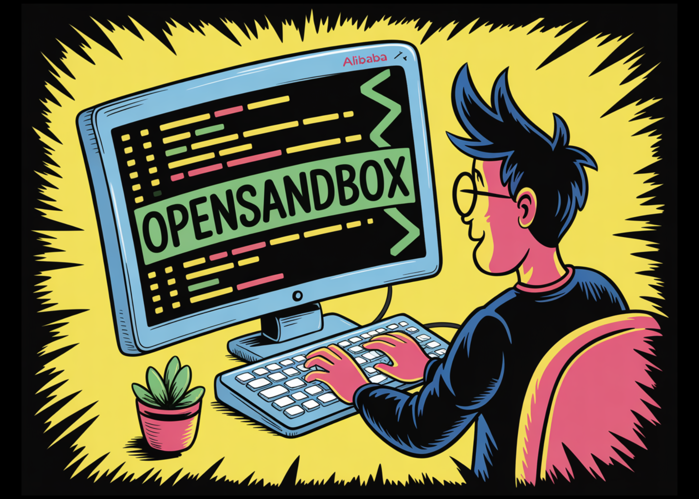

# Alibaba Releases OpenSandbox to Provide Software Developers with a Unified, Secure, and Scalable API for Autonomous AI Agent Execution

> Alibaba has released OpenSandbox, an open-source tool designed to provide AI agents with secure, isolated environments for code execution, web browsing, and model training. Released under the Apache 2.0 license, the proposed system targets to standardize the ‘execution layer’ of the AI agent stack, offering a unified API that functions across various programming languages and […]

Alibaba has released **OpenSandbox**, an open-source tool designed to provide AI agents with secure, isolated environments for code execution, web browsing, and model training. Released under the **Apache 2.0 license**, the proposed system targets to standardize the ‘execution layer’ of the AI agent stack, offering a unified API that functions across various programming languages and infrastructure providers. The tool is built on the same internal infrastructure Alibaba utilizes for large-scale AI workloads.

### The Technical Gap in Agentic Workflows

Building an autonomous agent typically involves two components: the ‘brain’ (usually a Large Language Model) and the ‘tools’ (code execution, web access, or file manipulation). Providing a safe environment for these tools has required developers to manually configure Docker containers, manage complex network isolation, or rely on third-party APIs.

OpenSandbox addresses this by providing a standardized, secure environment where agents can execute arbitrary code or interact with interfaces without risking the host system’s integrity. It abstracts the underlying infrastructure, allowing developers to move from local development to production-scale deployments using a single API.

### Architecture

The architecture of OpenSandbox is **built on a modular four-layer stack**—comprising the **SDKs Layer, Specs Layer, Runtime Layer, and Sandbox Instances Layer**—designed to decouple client logic from execution environments. At its core, the system utilizes a FastAPI-based server to manage the lifecycle of sandboxes via the Docker or Kubernetes runtimes, while communication is standardized through OpenAPI specifications (the Sandbox Lifecycle and Execution Specs). Within each isolated container, OpenSandbox injects a high-performance Go-based execution daemon (execd) that interfaces with internal Jupyter kernels to provide stateful code execution, real-time output streaming via Server-Sent Events (SSE), and comprehensive filesystem management, ensuring a ‘protocol-first’ approach that remains consistent across any base container image.

*https://open-sandbox.ai/overview/architecture*

### Core Technical Capabilities

OpenSandbox is designed to be environment-agnostic. It supports **Docker** for local development and **Kubernetes** for distributed, production-grade runs. **The platform provides four primary types of sandboxes:**

- **Coding Agents:** Environments optimized for software development tasks, where agents can write, test, and debug code.

- **GUI Agents:** Supports full **VNC desktops**, enabling agents to interact with graphical user interfaces.

- **Code Execution:** High-performance runtimes for executing specific scripts or computational tasks.

- **RL Training:** Isolated environments tailored for Reinforcement Learning (RL) workloads, allowing for safe iterative training.

The system utilizes a **Unified API**, which ensures that the interaction patterns remain consistent regardless of the underlying language or runtime. Currently, OpenSandbox provides SDKs for **Python, TypeScript, and Java/Kotlin**, with **C# and Go** listed on the development roadmap.

### Integration and Ecosystem Support

A significant feature of OpenSandbox is its native compatibility with existing AI frameworks and developer tools. By providing a secure execution layer, it allows agents built on various platforms to perform ‘real-world’ actions. **The integrations currently supported include**:

- **Model Interfaces:** Claude Code, Gemini CLI, and OpenAI Codex.

- **Orchestration Frameworks:** LangGraph and Google ADK (Agent Development Kit).

- **Automation Tools:** Chrome and Playwright for browser-based tasks.

- **Visualization:** Full VNC support for visual monitoring and interaction.

This means that an agent can be tasked with ‘scraping a website and training a linear regression model’ within a single, isolated session. The agent uses Playwright to navigate the web, downloads data to the sandbox’s local file system, and executes Python code to process that data—all without leaving the secured OpenSandbox environment.

### Deployment and Configuration

The project prioritizes a streamlined developer experience (DX). Setting up a local execution server requires three primary commands through the command-line interface:

- `pip install opensandbox-server` — Installs the server components.

- `opensandbox-server init-config` — Generates the necessary configuration files for the environment.

- `opensandbox-server` — Launches the server and exposes the API for agent interaction.

Once the server is running, developers can use the provided SDKs to create, manage, and terminate sandboxes programmatically. This reduces the operational overhead of ‘stitching together’ multiple tools for file management, process isolation, and network proxying.

### Key Takeaways

- **Unified, Language-Agnostic Execution:** OpenSandbox provides a consistent API for AI agents to execute code, browse the web, and interact with GUIs. While it currently supports **Python, TypeScript, and Java/Kotlin**, SDKs for **C# and Go** are on the roadmap.

- **Infrastructure Flexibility (Docker & Kubernetes):** The tool is designed to scale seamlessly from a developer’s local machine to enterprise-grade production. It utilizes **Docker** for local isolation and **Kubernetes** for distributed, large-scale deployments, eliminating the ‘environment drift’ often found when moving agents from dev to cloud.

- **Broad Ecosystem Integration:** It is engineered to plug directly into leading AI frameworks and tools, including **LangGraph, Claude Code, Gemini CLI, OpenAI Codex, and Google ADK**, as well as automation libraries like **Playwright and Chrome**.

- **Elimination of ‘Sandbox Dependency’:** By providing a free, open-source alternative under the **Apache 2.0 license**, Alibaba removes the dependency on expensive, managed sandbox services that charge per-minute fees or impose vendor lock-in.

- **High-Fidelity Interaction (VNC & Web):** Beyond simple script execution, OpenSandbox supports **full VNC desktops** and browser automation. This allows agents to perform complex, multi-modal tasks—such as navigating web interfaces or using desktop applications—within a secure, ‘blast-resistant’ environment.

---

Check out the **[Repo](https://github.com/alibaba/OpenSandbox?tab=readme-ov-file), [Docs](https://open-sandbox.ai/) **and** [Examples.](https://open-sandbox.ai/examples/readme) **Also, feel free to follow us on **[Twitter](https://x.com/intent/follow?screen_name=marktechpost)** and don’t forget to join our **[120k+ ML SubReddit](https://www.reddit.com/r/machinelearningnews/)** and Subscribe to **[our Newsletter](https://www.aidevsignals.com/)**. Wait! are you on telegram? **[now you can join us on telegram as well.](https://t.me/machinelearningresearchnews)**
