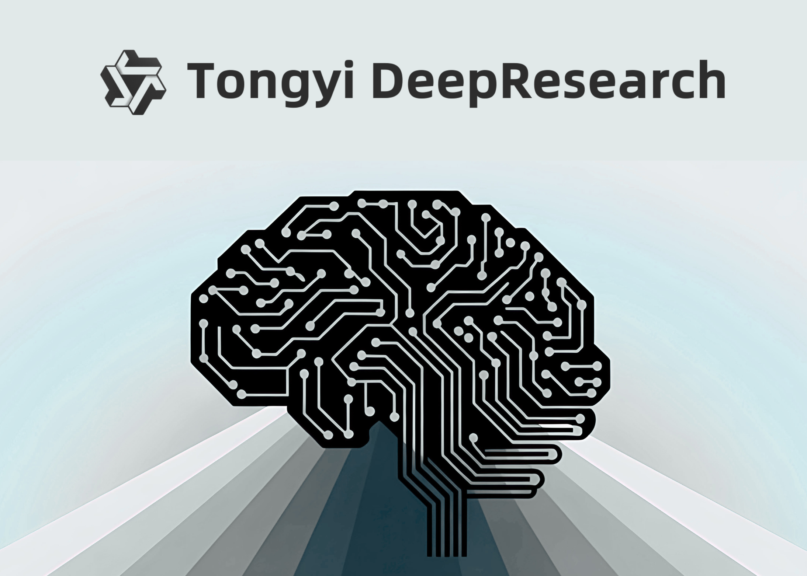

# Alibaba Releases Tongyi DeepResearch: A 30B-Parameter Open-Source Agentic LLM Optimized for Long-Horizon Research

> Alibaba’s Tongyi Lab has open-sourced Tongyi-DeepResearch-30B-A3B, an agent-specialized large language model built for long-horizon, deep information-seeking with web tools. The model uses a mixture-of-experts (MoE) design with ~30.5B total parameters and ~3–3.3B active per token, enabling high throughput while preserving strong reasoning performance. It targets multi-turn research workflows—searching, browsing, extracting, cross-checking, and synthesizing evidence—under ReAct-style […]

### Table of contents

- [What the benchmarks show ?](#h-what-the-benchmarks-show)
- [Architecture and inference profile](#h-architecture-and-inference-profile)
- [Training pipeline: synthetic data + on-policy RL](#h-training-pipeline-synthetic-data-on-policy-rl)
- [Role in document and web research workflows](#h-role-in-document-and-web-research-workflows)
- [Key features of Tongyi DeepResearch-30B-A3B](#h-key-features-of-tongyi-deepresearch-30b-a3b)
- [Summary](#h-summary)

Alibaba’s Tongyi Lab has open-sourced **Tongyi-DeepResearch-30B-A3B**, an agent-specialized large language model built for long-horizon, deep information-seeking with web tools. The model uses a mixture-of-experts (MoE) design with **~30.5B total parameters and ~3–3.3B active per token**, enabling high throughput while preserving strong reasoning performance. It targets multi-turn research workflows—searching, browsing, extracting, cross-checking, and synthesizing evidence—under ReAct-style tool use and a heavier test-time scaling mode. The release includes weights (Apache-2.0), inference scripts, and evaluation utilities.

### What the benchmarks show?

Tongyi DeepResearch reports **state-of-the-art results on agentic search suites** frequently used to test “deep research” agents:

- **Humanity’s Last Exam (HLE): 32.9**,

- **BrowseComp: 43.4** (EN) and **46.7** (ZH),

- **xbench-DeepSearch: 75**,with additional strong results across WebWalkerQA, GAIA, FRAMES, and SimpleQA. The team finds the system as **on par with OpenAI-style deep research agents** and “systematically outperforming existing proprietary and open-source” agents across these tasks.

*https://github.com/Alibaba-NLP/DeepResearch?tab=readme-ov-file*

### Architecture and inference profile

- **MoE routing (Qwen3-MoE lineage)** with **≈30.5B total / ≈3.3B active parameters**, giving the cost envelope of a small dense model while retaining specialist capacity.

- **Context length: 128K tokens**, suitable for long, tool-augmented browsing sessions and iterative synthesis.

- **Dual inference modes**:

**ReAct** (native) for direct evaluation of intrinsic reasoning and tool use,

- **IterResearch “Heavy” mode** for test-time scaling with structured multi-round synthesis/reconstruction of context to reduce noise accumulation.

### Training pipeline: synthetic data + on-policy RL

Tongyi DeepResearch is trained end-to-end as an **agent**, not just a chat LLM, using a fully automated, scalable data engine:

- **Agentic continual pre-training (CPT)**: large-scale synthetic trajectories built from curated corpora, historical tool traces, and graph-structured knowledge to teach retrieval, browsing, and multi-source fusion.

- **Agentic SFT cold-start**: trajectories in **ReAct** and **IterResearch** formats for schema-consistent planning and tool use.

- **On-policy RL** with **Group Relative Policy Optimization (GRPO)**, **token-level policy gradients**, **leave-one-out advantage estimation**, and **negative-sample filtering** to stabilize learning in non-stationary web environments.

### Role in document and web research workflows

Deep-research tasks stress four capabilities: (1) long-horizon planning, (2) iterative retrieval and verification across sources, (3) evidence tracking with low hallucination rates, and (4) synthesis under large contexts. The **IterResearch** rollout restructures context each “round,” retaining only essential artifacts to mitigate context bloat and error propagation, while the **ReAct** baseline demonstrates that the behaviors are learned rather than prompt-engineered. The reported scores on HLE and BrowseComp suggest improved robustness on multi-hop, tool-mediated queries where prior agents often over-fit to prompt patterns or saturate at low depths.

### Key features of Tongyi DeepResearch-30B-A3B

- **MoE efficiency at scale:** ~30.5B total parameters with ~3.0–3.3B activated per token (Qwen3-MoE lineage), enabling small-model inference cost with large-model capacity.

- **128K context window:** long-horizon rollouts with evidence accumulation for multi-step web research.

- **Dual inference paradigms:** native **ReAct** for intrinsic tool-use evaluation and **IterResearch “Heavy”** (test-time scaling) for deeper multi-round synthesis.

- **Automated agentic data engine:** fully automated synthesis pipeline powering agentic continual pre-training (CPT), supervised fine-tuning (SFT), and RL.

- **On-policy RL with GRPO:** Group Relative Policy Optimization with token-level policy gradients, leave-one-out advantage estimation, and selective negative-sample filtering for stability.

- **Reported SOTA on deep-research suites:** HLE 32.9, BrowseComp 43.4 (EN) / 46.7 (ZH), xbench-DeepSearch 75; strong results on WebWalkerQA/GAIA/FRAMES/SimpleQA.

### Summary

Tongyi DeepResearch-30B-A3B packages a MoE (~30B total, ~3B active) architecture, 128K context, dual ReAct/IterResearch rollouts, and an automated agentic data + GRPO RL pipeline into a reproducible open-source stack. For teams building long-horizon research agents, it offers a practical balance of inference cost and capability with reported strong performance on deep-research benchmarks

---

Check out the **[Models on Hugging Face](https://huggingface.co/Alibaba-NLP/Tongyi-DeepResearch-30B-A3B), [GitHub Page](https://github.com/Alibaba-NLP/DeepResearch?tab=readme-ov-file)_ _**and** [Technical details](https://tongyi-agent.github.io/blog/introducing-tongyi-deep-research/)_._** Feel free to check out our **[GitHub Page for Tutorials, Codes and Notebooks](https://github.com/Marktechpost/AI-Tutorial-Codes-Included)**. Also, feel free to follow us on **[Twitter](https://x.com/intent/follow?screen_name=marktechpost)** and don’t forget to join our **[100k+ ML SubReddit](https://www.reddit.com/r/machinelearningnews/)** and Subscribe to **[our Newsletter](https://www.aidevsignals.com/)**.
